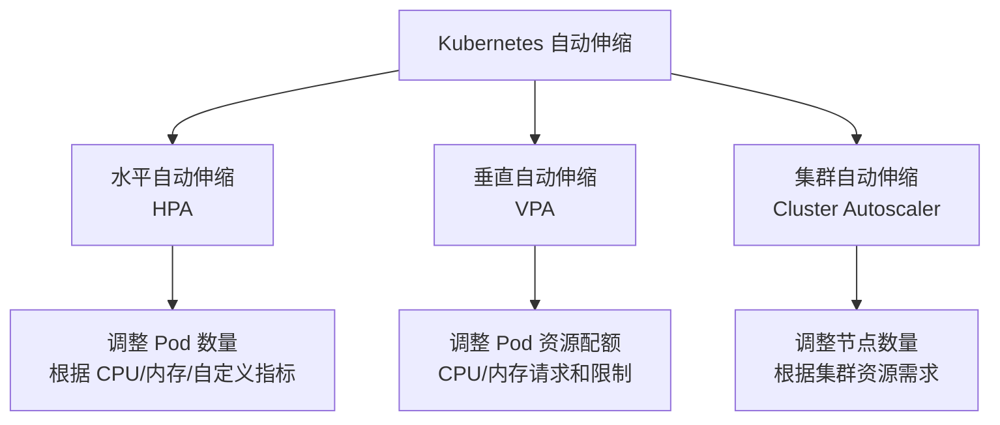

# 09、Spring Boot 4 实战：Kubernetes 自动伸缩策略与服务网格适配
- 来源：https://ddkk.com/springboot/4/9.html
- 分类：Spring Boot 4.0 实战教程
- 分组：教程目录
- 日期：2025-11-25
兄弟们，今儿咱聊聊 Spring Boot 4 在 Kubernetes 里咋搞自动伸缩和服务网格适配。鹏磊我最近在搞生产环境的微服务集群，流量忽高忽低的，手动调副本数累死个人；后来整了 HPA（水平自动伸缩）和 VPA（垂直自动伸缩），总算能自动应对流量变化了。再后来上了服务网格，发现这俩玩意配合起来效果贼好，今儿给你们好好唠唠。

## 自动伸缩是个啥

先说说这自动伸缩（Autoscaling）是咋回事。在 Kubernetes 里，自动伸缩就是根据负载情况自动调整 Pod 数量或者资源配额，不用你手动去改配置。就像你开饭店，客人多了自动加桌子，客人少了自动撤桌子，省心省力。

Kubernetes 提供了几种自动伸缩机制：



### 1. 水平自动伸缩（HPA）

HPA（Horizontal Pod Autoscaler）是最常用的，它根据指标（比如 CPU 使用率、内存使用率、自定义指标）自动增加或减少 Pod 的数量。

**工作原理**：

- HPA 控制器定期查询指标（默认每 15 秒一次）
- 计算当前指标值与目标值的比例
- 根据比例调整副本数，让指标值接近目标值

**适用场景**：

- 流量波动大的 Web 应用
- 批处理任务，需要根据队列长度调整 Worker 数量
- 微服务，根据请求量自动扩缩容

### 2. 垂直自动伸缩（VPA）

VPA（Vertical Pod Autoscaler）是调整单个 Pod 的资源配额（CPU 和内存的 requests 和 limits），而不是调整 Pod 数量。

**工作原理**：

- VPA 分析 Pod 的历史资源使用情况
- 推荐合适的资源配额
- 可以自动更新 Pod 的资源配置（需要重启 Pod）

**适用场景**：

- 应用启动时资源需求大，运行后需求小
- 不同时间段资源使用模式不同
- 优化资源利用率，避免资源浪费

**注意**：VPA 和 HPA 不能同时用 CPU/内存指标，会冲突；但 VPA 可以用自定义指标，HPA 用 CPU/内存，这样就能配合了。

### 3. 集群自动伸缩（Cluster Autoscaler）

Cluster Autoscaler 是调整整个集群的节点数量，当 Pod 因为资源不足无法调度时，自动添加节点；当节点资源利用率低时，自动移除节点。

**适用场景**：

- 云环境，节点可以动态创建和销毁
- 成本优化，空闲时减少节点节省成本
- 突发流量，自动扩容节点应对

## Spring Boot 4 的指标暴露

要让 HPA 工作，Spring Boot 应用得暴露指标给 Kubernetes。Spring Boot 4 通过 Micrometer 和 Actuator 提供了完整的指标暴露能力。

### Micrometer 集成

Micrometer 是 Spring Boot 的指标门面，支持多种监控系统（Prometheus、InfluxDB、CloudWatch 等）。在 Kubernetes 里，最常用的是 Prometheus。

先看看依赖配置，Maven 的 `pom.xml`：

```xml
<?xml version="1.0" encoding="UTF-8"?>
<project xmlns="http://maven.apache.org/POM/4.0.0"
         xmlns:xsi="http://www.w3.org/2001/XMLSchema-instance"
         xsi:schemaLocation="http://maven.apache.org/POM/4.0.0 
         http://maven.apache.org/xsd/maven-4.0.0.xsd">
    <modelVersion>4.0.0</modelVersion>
    <!-- 父项目，Spring Boot 4 的依赖管理 -->
    <parent>
        <groupId>org.springframework.boot</groupId>
        <artifactId>spring-boot-starter-parent</artifactId>
        <version>4.0.0-RC1</version>  <!-- Spring Boot 4 版本 -->
    </parent>
    <groupId>com.example</groupId>
    <artifactId>autoscaling-demo</artifactId>
    <version>1.0.0</version>
    <properties>
        <java.version>21</java.version>  <!-- Java 21，Spring Boot 4 推荐 -->
    </properties>
    <dependencies>
        <!-- Web 启动器，提供 HTTP 服务 -->
        <dependency>
            <groupId>org.springframework.boot</groupId>
            <artifactId>spring-boot-starter-web</artifactId>
        </dependency>
        <!-- Actuator 启动器，提供健康检查和指标端点 -->
        <dependency>
            <groupId>org.springframework.boot</groupId>
            <artifactId>spring-boot-starter-actuator</artifactId>
        </dependency>
        <!-- Micrometer Prometheus 集成，暴露 Prometheus 格式的指标 -->
        <dependency>
            <groupId>io.micrometer</groupId>
            <artifactId>micrometer-registry-prometheus</artifactId>
        </dependency>
        <!-- 如果需要自定义指标，可以用这个 -->
        <dependency>
            <groupId>io.micrometer</groupId>
            <artifactId>micrometer-core</artifactId>
        </dependency>
    </dependencies>
</project>
```

### 应用配置

在 `application.yml` 里配置 Actuator 和 Prometheus：

```yaml
# Actuator 配置
management:
  endpoints:
    web:
      exposure:
        # 暴露所有端点，生产环境建议只暴露需要的
        include: health,info,prometheus,metrics
      base-path: /actuator  # 端点基础路径
  endpoint:
    health:
      # 启用健康检查分组，支持 liveness 和 readiness
      probes:
        enabled: true
      show-details: always  # 显示详细信息
  metrics:
    # 启用 Prometheus 指标导出
    export:
      prometheus:
        enabled: true
    # 配置指标标签，方便在 Prometheus 里查询
    tags:
      application: ${spring.application.name}  # 应用名称标签
      environment: ${spring.profiles.active:default}  # 环境标签
  # 服务器配置
  server:
    port: 8081  # Actuator 端口，可以和主应用端口分开
# 应用配置
spring:
  application:
    name: autoscaling-demo  # 应用名称
  # 激活的生产环境配置
  profiles:
    active: prod
# 服务器配置
server:
  port: 8080  # 主应用端口
```

### 自定义指标

有时候默认的 CPU、内存指标不够用，需要自定义指标。比如根据请求队列长度、处理时间、错误率等来伸缩。

创建一个指标服务类：

```java
package com.example.autoscaling.service;
import io.micrometer.core.instrument.Counter;  // 计数器，记录累计值
import io.micrometer.core.instrument.Gauge;    // 仪表，记录瞬时值
import io.micrometer.core.instrument.MeterRegistry;  // 指标注册表
import io.micrometer.core.instrument.Timer;    // 计时器，记录时间分布
import org.springframework.stereotype.Service;
import java.util.concurrent.atomic.AtomicInteger;  // 原子整数，线程安全
/**
 * 自定义指标服务
 * 用来暴露应用的自定义指标，给 HPA 用
 */
@Service
public class CustomMetricsService {
    // 指标注册表，用来创建和管理指标
    private final MeterRegistry meterRegistry;
    // 请求队列长度，用原子整数保证线程安全
    private final AtomicInteger queueLength = new AtomicInteger(0);
    // 当前活跃请求数
    private final AtomicInteger activeRequests = new AtomicInteger(0);
    // 构造函数，注入 MeterRegistry
    public CustomMetricsService(MeterRegistry meterRegistry) {
        this.meterRegistry = meterRegistry;
        // 注册队列长度指标，Gauge 类型，值会实时变化
        Gauge.builder("app.queue.length", queueLength, AtomicInteger::get)
                .description("当前请求队列长度")  // 指标描述
                .tag("application", "autoscaling-demo")  // 标签，方便过滤
                .register(meterRegistry);
        // 注册活跃请求数指标
        Gauge.builder("app.requests.active", activeRequests, AtomicInteger::get)
                .description("当前活跃请求数")
                .tag("application", "autoscaling-demo")
                .register(meterRegistry);
    }
    /**
     * 增加队列长度
     * 当有新请求进入队列时调用
     */
    public void incrementQueueLength() {
        queueLength.incrementAndGet();  // 原子操作，线程安全
    }
    /**
     * 减少队列长度
     * 当请求被处理完时调用
     */
    public void decrementQueueLength() {
        queueLength.decrementAndGet();
    }
    /**
     * 开始处理请求
     * 增加活跃请求数
     */
    public void startRequest() {
        activeRequests.incrementAndGet();
    }
    /**
     * 结束处理请求
     * 减少活跃请求数
     */
    public void endRequest() {
        activeRequests.decrementAndGet();
    }
    /**
     * 记录请求处理时间
     * @param durationMillis 处理时间，单位毫秒
     */
    public void recordRequestDuration(long durationMillis) {
        // Timer 会自动记录平均值、最大值、分位数等统计信息
        Timer.Sample sample = Timer.start(meterRegistry);  // 开始计时
        sample.stop(Timer.builder("app.requests.duration")
                .description("请求处理时间")
                .tag("application", "autoscaling-demo")
                .register(meterRegistry)
                .record(java.time.Duration.ofMillis(durationMillis)));  // 记录时间
    }
    /**
     * 记录错误
     * Counter 类型，只增不减
     */
    public void recordError() {
        Counter.builder("app.errors.total")
                .description("总错误数")
                .tag("application", "autoscaling-demo")
                .register(meterRegistry)
                .increment();  // 错误数加 1
    }
}
```

### 在控制器里使用指标

创建一个控制器，演示怎么用这些指标：

```java
package com.example.autoscaling.controller;
import com.example.autoscaling.service.CustomMetricsService;
import org.springframework.http.ResponseEntity;
import org.springframework.web.bind.annotation.*;
import java.util.HashMap;
import java.util.Map;
import java.util.concurrent.CompletableFuture;  // 异步任务
import java.util.concurrent.TimeUnit;  // 时间单位
/**
 * 示例控制器
 * 演示怎么在业务代码里使用自定义指标
 */
@RestController
@RequestMapping("/api")
public class DemoController {
    // 注入指标服务
    private final CustomMetricsService metricsService;
    // 构造函数注入
    public DemoController(CustomMetricsService metricsService) {
        this.metricsService = metricsService;
    }
    /**
     * 处理请求的接口
     * 演示怎么记录指标
     */
    @PostMapping("/process")
    public ResponseEntity<Map<String, Object>> processRequest(@RequestBody Map<String, Object> request) {
        long startTime = System.currentTimeMillis();  // 记录开始时间
        try {
            // 增加队列长度
            metricsService.incrementQueueLength();
            // 开始处理请求
            metricsService.startRequest();
            // 模拟业务处理，这里可以是你真正的业务逻辑
            // 比如调用数据库、调用其他服务等
            Thread.sleep(100);  // 模拟处理时间
            // 处理完成，减少队列长度
            metricsService.decrementQueueLength();
            // 计算处理时间
            long duration = System.currentTimeMillis() - startTime;
            metricsService.recordRequestDuration(duration);
            // 结束请求
            metricsService.endRequest();
            // 返回结果
            Map<String, Object> response = new HashMap<>();
            response.put("status", "success");
            response.put("message", "请求处理成功");
            return ResponseEntity.ok(response);
        } catch (Exception e) {
            // 记录错误
            metricsService.recordError();
            metricsService.decrementQueueLength();
            metricsService.endRequest();
            Map<String, Object> response = new HashMap<>();
            response.put("status", "error");
            response.put("message", e.getMessage());
            return ResponseEntity.status(500).body(response);
        }
    }
    /**
     * 异步处理请求
     * 演示异步场景下的指标记录
     */
    @PostMapping("/process-async")
    public CompletableFuture<ResponseEntity<Map<String, Object>>> processRequestAsync(@RequestBody Map<String, Object> request) {
        // 增加队列长度
        metricsService.incrementQueueLength();
        // 异步处理
        return CompletableFuture.supplyAsync(() -> {
            long startTime = System.currentTimeMillis();
            try {
                metricsService.startRequest();
                // 模拟异步处理
                Thread.sleep(200);
                long duration = System.currentTimeMillis() - startTime;
                metricsService.recordRequestDuration(duration);
                Map<String, Object> response = new HashMap<>();
                response.put("status", "success");
                response.put("message", "异步处理成功");
                return ResponseEntity.ok(response);
            } catch (Exception e) {
                metricsService.recordError();
                Map<String, Object> response = new HashMap<>();
                response.put("status", "error");
                response.put("message", e.getMessage());
                return ResponseEntity.status(500).body(response);
            } finally {
                // 确保指标被正确更新
                metricsService.decrementQueueLength();
                metricsService.endRequest();
            }
        });
    }
}
```

## HPA 配置实战

好了，Spring Boot 这边指标暴露好了，现在看看 K8s 那边咋配 HPA。

### 基础 HPA 配置

创建一个 `hpa.yaml`，基于 CPU 使用率伸缩：

```yaml
apiVersion: autoscaling/v2  # HPA API 版本，v2 支持多种指标
kind: HorizontalPodAutoscaler
metadata:
  name: spring-boot-hpa  # HPA 名称
  namespace: default  # 命名空间
spec:
  # 目标资源，要伸缩的 Deployment
  scaleTargetRef:
    apiVersion: apps/v1
    kind: Deployment
    name: spring-boot-app  # Deployment 名称，要和你的 Deployment 名字一致
  # 最小副本数，至少保持这么多 Pod
  minReplicas: 2
  # 最大副本数，最多不能超过这个数
  maxReplicas: 10
  # 指标配置，可以配置多个指标
  metrics:
  - type: Resource  # 资源类型指标
    resource:
      name: cpu  # CPU 指标
      target:
        type: Utilization  # 使用率类型
        averageUtilization: 70  # 目标 CPU 使用率 70%，超过就扩容，低于就缩容
  # 行为配置，控制伸缩的速度和策略
  behavior:
    # 扩容行为
    scaleUp:
      stabilizationWindowSeconds: 0  # 稳定窗口 0 秒，立即扩容
      policies:
      - type: Percent  # 百分比策略
        value: 100  # 每次扩容 100%，也就是翻倍
        periodSeconds: 15  # 每 15 秒检查一次
      - type: Pods  # Pod 数量策略
        value: 2  # 每次至少增加 2 个 Pod
        periodSeconds: 15
      selectPolicy: Max  # 选择最大值，哪个策略扩容多就用哪个
    # 缩容行为
    scaleDown:
      stabilizationWindowSeconds: 300  # 稳定窗口 300 秒（5 分钟），避免频繁缩容
      policies:
      - type: Percent  # 百分比策略
        value: 50  # 每次缩容 50%
        periodSeconds: 60  # 每 60 秒检查一次
      selectPolicy: Min  # 选择最小值，哪个策略缩容少就用哪个
```

### 多指标 HPA

有时候光看 CPU 不够，还得看内存、请求数、队列长度等。HPA 支持多个指标，满足任何一个指标就会扩容。

```yaml
apiVersion: autoscaling/v2
kind: HorizontalPodAutoscaler
metadata:
  name: spring-boot-hpa-multi  # 多指标 HPA
spec:
  scaleTargetRef:
    apiVersion: apps/v1
    kind: Deployment
    name: spring-boot-app
  minReplicas: 2
  maxReplicas: 20
  # 多个指标配置
  metrics:
  # CPU 指标
  - type: Resource
    resource:
      name: cpu
      target:
        type: Utilization
        averageUtilization: 70
  # 内存指标
  - type: Resource
    resource:
      name: memory
      target:
        type: Utilization
        averageUtilization: 80
  # 自定义指标：队列长度
  # 需要先安装 Prometheus Adapter，把 Prometheus 指标转换成 K8s 指标
  - type: Pods  # Pods 类型，表示每个 Pod 的指标值
    pods:
      metric:
        name: app_queue_length  # Prometheus 指标名称
      target:
        type: AverageValue  # 平均值类型
        averageValue: "10"  # 目标值，每个 Pod 平均队列长度 10
  # 自定义指标：请求处理时间
  - type: Pods
    pods:
      metric:
        name: app_requests_duration_seconds  # Prometheus 指标名称
      target:
        type: AverageValue
        averageValue: "0.5"  # 目标值，平均处理时间 0.5 秒
  behavior:
    scaleUp:
      stabilizationWindowSeconds: 0
      policies:
      - type: Percent
        value: 50  # 每次扩容 50%
        periodSeconds: 30
      selectPolicy: Max
    scaleDown:
      stabilizationWindowSeconds: 300
      policies:
      - type: Percent
        value: 25  # 每次缩容 25%，更保守
        periodSeconds: 60
      selectPolicy: Min
```

### 基于外部指标的 HPA

有时候指标不在 Pod 里，比如消息队列的长度、数据库连接数等。这时候可以用外部指标（External Metrics）。

```yaml
apiVersion: autoscaling/v2
kind: HorizontalPodAutoscaler
metadata:
  name: spring-boot-hpa-external
spec:
  scaleTargetRef:
    apiVersion: apps/v1
    kind: Deployment
    name: spring-boot-app
  minReplicas: 2
  maxReplicas: 15
  metrics:
  # 外部指标：消息队列长度
  - type: External  # 外部指标类型
    external:
      metric:
        name: kafka_topic_messages  # 外部指标名称
        selector:
          matchLabels:
            topic: orders  # 主题标签
      target:
        type: Value  # 值类型
        value: "1000"  # 目标值，队列长度超过 1000 就扩容
  behavior:
    scaleUp:
      stabilizationWindowSeconds: 0
      policies:
      - type: Pods
        value: 3  # 每次增加 3 个 Pod
        periodSeconds: 30
      selectPolicy: Max
    scaleDown:
      stabilizationWindowSeconds: 600  # 10 分钟稳定窗口，更保守
      policies:
      - type: Percent
        value: 33  # 每次缩容 33%
        periodSeconds: 120
      selectPolicy: Min
```

## VPA 配置实战

VPA 用来优化 Pod 的资源配额，让应用用多少资源就分配多少，避免浪费。

### 安装 VPA

VPA 不是 K8s 核心组件，需要单独安装。可以用官方提供的安装脚本：

```bash
# 克隆 VPA 仓库
git clone https://github.com/kubernetes/autoscaler.git
cd autoscaler/vertical-pod-autoscaler
# 安装 VPA
./hack/vpa-up.sh
# 检查安装状态
kubectl get pods -n kube-system | grep vpa
```

### VPA 配置

创建一个 `vpa.yaml`：

```yaml
apiVersion: autoscaling.k8s.io/v1  # VPA API 版本
kind: VerticalPodAutoscaler
metadata:
  name: spring-boot-vpa  # VPA 名称
spec:
  # 目标资源
  targetRef:
    apiVersion: apps/v1
    kind: Deployment
    name: spring-boot-app
  # 更新策略
  updatePolicy:
    updateMode: "Auto"  # 自动模式，会自动更新 Pod 资源
    # 可选值：
    # - Auto: 自动更新，会重启 Pod
    # - Initial: 只在创建 Pod 时更新
    # - Off: 不自动更新，只提供建议
  # 资源策略
  resourcePolicy:
    containerPolicies:
    - containerName: app  # 容器名称
      # 最小资源限制
      minAllowed:
        cpu: 100m  # 最小 0.1 核
        memory: 128Mi  # 最小 128MB
      # 最大资源限制
      maxAllowed:
        cpu: 2000m  # 最大 2 核
        memory: 4Gi  # 最大 4GB
      # 控制模式
      controlledResources: ["cpu", "memory"]  # 控制 CPU 和内存
      controlledValues: RequestsAndLimits  # 同时控制 requests 和 limits
```

### VPA 推荐模式

如果不想自动更新，可以用推荐模式，只提供建议：

```yaml
apiVersion: autoscaling.k8s.io/v1
kind: VerticalPodAutoscaler
metadata:
  name: spring-boot-vpa-recommend
spec:
  targetRef:
    apiVersion: apps/v1
    kind: Deployment
    name: spring-boot-app
  updatePolicy:
    updateMode: "Off"  # 关闭自动更新，只提供建议
  resourcePolicy:
    containerPolicies:
    - containerName: app
      minAllowed:
        cpu: 100m
        memory: 128Mi
      maxAllowed:
        cpu: 2000m
        memory: 4Gi
```

查看推荐值：

```bash
# 查看 VPA 状态和推荐值
kubectl describe vpa spring-boot-vpa
# 输出示例：
# Recommendation:
#   Container Recommendations:
#     Container Name: app
#     Target:
#       Cpu:     500m
#       Memory:  512Mi
#     Lower Bound:
#       Cpu:     300m
#       Memory:  256Mi
#     Upper Bound:
#       Cpu:     1000m
#       Memory:  1Gi
```

## 服务网格集成

服务网格（Service Mesh）是管理微服务之间通信的基础设施层，提供流量管理、安全、可观测性等功能。常见的服务网格有 Istio、Linkerd、Consul Connect 等。

### Istio 集成

Istio 是最流行的服务网格，提供了丰富的流量管理、安全、可观测性功能。

#### 安装 Istio

```bash
# 下载 Istio
curl -L https://istio.io/downloadIstio | sh -
cd istio-*
# 安装 Istio
./bin/istioctl install --set profile=default
# 启用自动注入 Sidecar
kubectl label namespace default istio-injection=enabled
```

#### 部署 Spring Boot 应用

创建一个带 Istio 注解的 Deployment：

```yaml
apiVersion: apps/v1
kind: Deployment
metadata:
  name: spring-boot-app
  labels:
    app: spring-boot-app
    version: v1
spec:
  replicas: 3
  selector:
    matchLabels:
      app: spring-boot-app
  template:
    metadata:
      labels:
        app: spring-boot-app
        version: v1
      annotations:
        # Istio Sidecar 配置
        sidecar.istio.io/inject: "true"  # 启用 Sidecar 注入
        # 资源限制
        sidecar.istio.io/proxyCPU: "100m"  # Sidecar CPU 限制
        sidecar.istio.io/proxyMemory: "128Mi"  # Sidecar 内存限制
    spec:
      containers:
      - name: app
        image: your-registry/spring-boot-app:1.0.0
        ports:
        - containerPort: 8080
          name: http
        env:
        - name: SPRING_PROFILES_ACTIVE
          value: "prod"
        resources:
          requests:
            memory: "512Mi"
            cpu: "500m"
          limits:
            memory: "1Gi"
            cpu: "1000m"
        livenessProbe:
          httpGet:
            path: /actuator/health/liveness
            port: 8080
          initialDelaySeconds: 60
          periodSeconds: 10
        readinessProbe:
          httpGet:
            path: /actuator/health/readiness
            port: 8080
          initialDelaySeconds: 30
          periodSeconds: 5
---
# Service 配置
apiVersion: v1
kind: Service
metadata:
  name: spring-boot-app
  labels:
    app: spring-boot-app
spec:
  ports:
  - port: 80  # Service 端口
    targetPort: 8080  # Pod 端口
    protocol: TCP
    name: http
  selector:
    app: spring-boot-app
```

#### 流量管理

Istio 提供了 VirtualService 和 DestinationRule 来管理流量：

```yaml
# VirtualService：定义路由规则
apiVersion: networking.istio.io/v1beta1
kind: VirtualService
metadata:
  name: spring-boot-app
spec:
  hosts:
  - spring-boot-app  # 服务名称
  http:
  # 路由规则：根据路径分流
  - match:
    - uri:
        prefix: "/api/v1"  # v1 版本的路径
    route:
    - destination:
        host: spring-boot-app
        subset: v1  # v1 版本子集
      weight: 100  # 100% 流量
  - match:
    - uri:
        prefix: "/api/v2"  # v2 版本的路径
    route:
    - destination:
        host: spring-boot-app
        subset: v2  # v2 版本子集
      weight: 100
---
# DestinationRule：定义目标策略
apiVersion: networking.istio.io/v1beta1
kind: DestinationRule
metadata:
  name: spring-boot-app
spec:
  host: spring-boot-app
  subsets:
  - name: v1  # v1 版本子集
    labels:
      version: v1
    trafficPolicy:
      loadBalancer:
        simple: ROUND_ROBIN  # 负载均衡策略：轮询
      connectionPool:
        tcp:
          maxConnections: 100  # 最大连接数
        http:
          http1MaxPendingRequests: 50  # HTTP/1.1 最大等待请求数
          http2MaxRequests: 100  # HTTP/2 最大请求数
          maxRequestsPerConnection: 10  # 每个连接最大请求数
      circuitBreaker:
        consecutiveErrors: 3  # 连续错误数阈值
        interval: 30s  # 检查间隔
        baseEjectionTime: 30s  # 基础驱逐时间
        maxEjectionPercent: 50  # 最大驱逐百分比
  - name: v2
    labels:
      version: v2
    trafficPolicy:
      loadBalancer:
        simple: LEAST_CONN  # 最少连接策略
```

#### 与 HPA 配合

Istio 的指标可以给 HPA 用，实现更智能的自动伸缩。需要先安装 Prometheus Adapter：

```yaml
# 基于 Istio 指标的 HPA
apiVersion: autoscaling/v2
kind: HorizontalPodAutoscaler
metadata:
  name: spring-boot-hpa-istio
spec:
  scaleTargetRef:
    apiVersion: apps/v1
    kind: Deployment
    name: spring-boot-app
  minReplicas: 2
  maxReplicas: 20
  metrics:
  # CPU 指标
  - type: Resource
    resource:
      name: cpu
      target:
        type: Utilization
        averageUtilization: 70
  # Istio 指标：请求速率
  - type: Pods
    pods:
      metric:
        name: istio_requests_per_second  # Istio 请求速率指标
      target:
        type: AverageValue
        averageValue: "100"  # 目标值，每个 Pod 每秒 100 个请求
  # Istio 指标：错误率
  - type: Pods
    pods:
      metric:
        name: istio_request_errors_per_second  # 错误速率指标
      target:
        type: AverageValue
        averageValue: "5"  # 目标值，每个 Pod 每秒最多 5 个错误
  behavior:
    scaleUp:
      stabilizationWindowSeconds: 0
      policies:
      - type: Percent
        value: 50
        periodSeconds: 30
      selectPolicy: Max
    scaleDown:
      stabilizationWindowSeconds: 300
      policies:
      - type: Percent
        value: 25
        periodSeconds: 60
      selectPolicy: Min
```

### Linkerd 集成

Linkerd 是另一个流行的服务网格，比 Istio 更轻量，资源占用更少。

#### 安装 Linkerd

```bash
# 安装 Linkerd CLI
curl -sL https://run.linkerd.io/install | sh
# 检查环境
linkerd check --pre
# 安装 Linkerd
linkerd install | kubectl apply -f -
# 验证安装
linkerd check
```

#### 注入 Linkerd Sidecar

```bash
# 手动注入 Sidecar
linkerd inject deployment.yaml | kubectl apply -f -
# 或者自动注入
kubectl annotate namespace default linkerd.io/inject=enabled
```

#### 与 HPA 配合

Linkerd 也提供了丰富的指标，可以给 HPA 用：

```yaml
apiVersion: autoscaling/v2
kind: HorizontalPodAutoscaler
metadata:
  name: spring-boot-hpa-linkerd
spec:
  scaleTargetRef:
    apiVersion: apps/v1
    kind: Deployment
    name: spring-boot-app
  minReplicas: 2
  maxReplicas: 15
  metrics:
  # CPU 指标
  - type: Resource
    resource:
      name: cpu
      target:
        type: Utilization
        averageUtilization: 70
  # Linkerd 指标：请求速率
  - type: Pods
    pods:
      metric:
        name: linkerd_request_rate  # Linkerd 请求速率指标
      target:
        type: AverageValue
        averageValue: "80"  # 目标值，每个 Pod 每秒 80 个请求
  # Linkerd 指标：P95 延迟
  - type: Pods
    pods:
      metric:
        name: linkerd_request_latency_p95  # P95 延迟指标
      target:
        type: AverageValue
        averageValue: "200"  # 目标值，P95 延迟 200 毫秒
```

## Spring Boot 4 的服务网格适配

Spring Boot 4 对服务网格做了不少优化，让应用能更好地配合服务网格工作。

### 健康检查适配

服务网格需要知道应用的健康状态，Spring Boot 4 的 Actuator 健康端点可以直接用：

```yaml
# Istio 健康检查配置
apiVersion: apps/v1
kind: Deployment
metadata:
  name: spring-boot-app
spec:
  template:
    spec:
      containers:
      - name: app
        # ... 其他配置 ...
        livenessProbe:
          httpGet:
            path: /actuator/health/liveness  # Spring Boot 4 的存活端点
            port: 8080
          initialDelaySeconds: 60
          periodSeconds: 10
        readinessProbe:
          httpGet:
            path: /actuator/health/readiness  # Spring Boot 4 的就绪端点
            port: 8080
          initialDelaySeconds: 30
          periodSeconds: 5
        startupProbe:  # 启动探针，给启动慢的应用用
          httpGet:
            path: /actuator/health/liveness
            port: 8080
          initialDelaySeconds: 0
          periodSeconds: 10
          failureThreshold: 30  # 最多失败 30 次，也就是最多等 5 分钟
```

### 优雅关闭

服务网格在流量切换时需要应用优雅关闭，Spring Boot 4 提供了更好的支持：

```yaml
# Kubernetes preStop Hook 配置
apiVersion: apps/v1
kind: Deployment
metadata:
  name: spring-boot-app
spec:
  template:
    spec:
      containers:
      - name: app
        lifecycle:
          # 停止前钩子，在容器停止前执行
          preStop:
            # Kubernetes 1.32+ 支持 sleep 指令
            sleep:
              seconds: 10  # 等待 10 秒，让流量切换完成
            # 或者用 exec 命令（Kubernetes 1.32 之前）
            # exec:
            #   command: ["sh", "-c", "sleep 10"]
```

应用配置里也要启用优雅关闭：

```yaml
# application.yml
server:
  shutdown: graceful  # 启用优雅关闭
spring:
  lifecycle:
    timeout-per-shutdown-phase: 30s  # 关闭超时时间，30 秒
```

### 指标集成

Spring Boot 4 的 Micrometer 指标可以直接被服务网格的 Prometheus 采集：

```yaml
# ServiceMonitor（Prometheus Operator）
apiVersion: monitoring.coreos.com/v1
kind: ServiceMonitor
metadata:
  name: spring-boot-app
spec:
  selector:
    matchLabels:
      app: spring-boot-app
  endpoints:
  - port: http  # Service 端口名称
    path: /actuator/prometheus  # Prometheus 指标端点
    interval: 30s  # 采集间隔
```

## 最佳实践

最后总结几个最佳实践，都是鹏磊我踩过的坑：

### 1. HPA 配置建议

- **最小副本数**：至少 2 个，保证高可用
- **最大副本数**：根据集群资源设置，别设太大导致资源耗尽
- **目标使用率**：CPU 建议 70-80%，内存建议 80-90%
- **稳定窗口**：扩容可以快（0-30 秒），缩容要慢（300-600 秒），避免抖动
- **多指标**：结合 CPU、内存、自定义指标，更准确

### 2. VPA 使用建议

- **生产环境**：建议用 `Initial` 或 `Off` 模式，避免自动重启
- **开发环境**：可以用 `Auto` 模式，快速优化资源
- **资源限制**：设置合理的 min/max，避免资源不足或浪费
- **与 HPA 配合**：VPA 用自定义指标，HPA 用 CPU/内存，不冲突

### 3. 服务网格集成建议

- **Sidecar 资源**：给 Sidecar 分配足够资源，避免影响应用
- **健康检查**：配置合理的探针，避免误杀
- **优雅关闭**：配置 preStop Hook，保证流量平滑切换
- **指标采集**：集成 Prometheus，实现完整的可观测性

### 4. 监控和告警

- **HPA 状态**：监控 HPA 的伸缩行为，及时发现异常
- **资源使用**：监控 Pod 资源使用情况，优化配置
- **服务网格指标**：监控请求速率、错误率、延迟等指标
- **告警规则**：设置合理的告警，及时发现问题

## 总结

好了，今儿就聊到这。Kubernetes 自动伸缩和服务网格配合起来，能让你的微服务集群更智能、更稳定。Spring Boot 4 在这块做了不少优化，用起来更顺手了。

关键点总结：

- **HPA**：根据指标自动调整 Pod 数量，应对流量变化
- **VPA**：优化 Pod 资源配额，提高资源利用率
- **服务网格**：提供流量管理、安全、可观测性能力
- **Spring Boot 4**：更好的健康检查、优雅关闭、指标集成支持

兄弟们，赶紧去试试吧，有问题随时找我唠！
