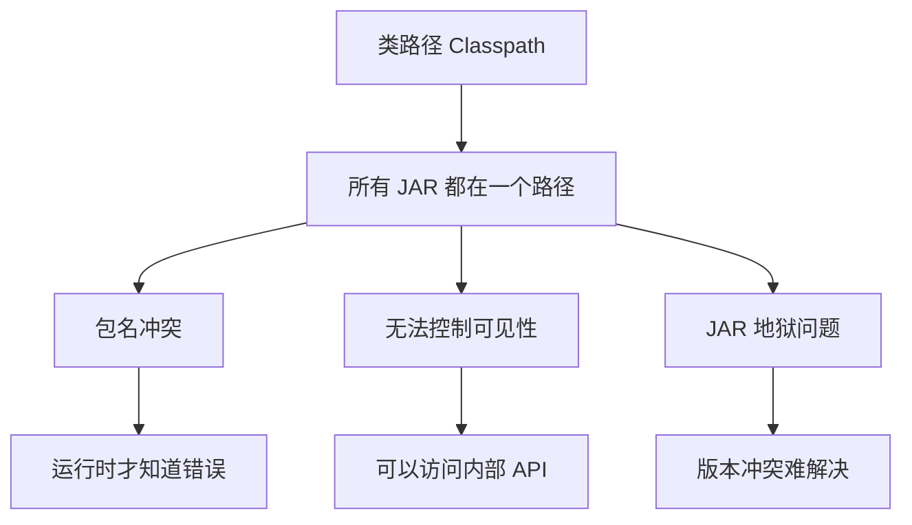
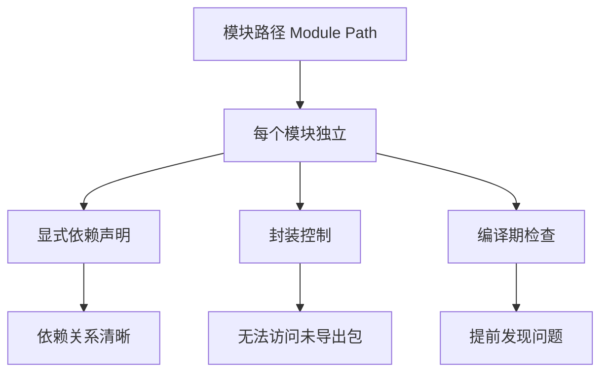
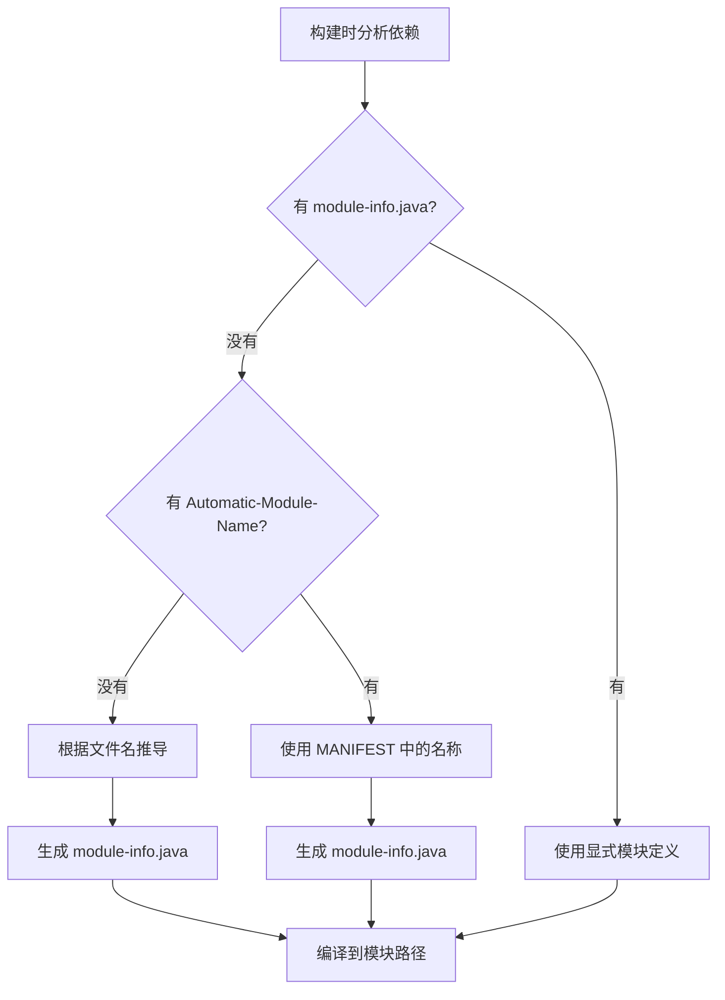

# 10、Spring Boot 4 实战：自动模块推导：解决 JPMS 模块化兼容问题
- 来源：https://ddkk.com/springboot/4/10.html
- 分类：Spring Boot 4.0 实战教程
- 分组：教程目录
- 日期：2025-11-25
兄弟们，今儿咱聊聊 Spring Boot 4 里边的 JPMS（Java Platform Module System）自动模块推导。这玩意儿听起来挺高大上的，其实就是解决模块化兼容问题的；鹏磊我最近在搞模块化改造，一堆老库没 `module-info.java`，手动配累死个人，后来发现 Spring Boot 4 直接给你自动推导了，省了不少事，今儿给你们好好唠唠。

## JPMS 模块化是个啥

先说说这 JPMS 是咋回事。Java 9 引入了模块系统，把 Java 平台分成了一个个模块，每个模块有自己的边界，能控制哪些包对外暴露，哪些包只能内部用。这就像给代码建了围墙，防止你乱用内部 API，也避免了"JAR 地狱"问题。

传统类路径的问题：



模块系统的优势：



### 模块的基本概念

一个模块就是一个包含 `module-info.java` 文件的 JAR 包。这个文件定义了模块的信息：

```java
/**
 * 模块定义文件
 * 必须放在源代码根目录下
 */
module com.example.mymodule {  // 模块名称，必须唯一
    // 导出包，其他模块可以访问
    exports com.example.mymodule.api;  // 导出 API 包
    // 开放包，允许反射访问（主要用于框架）
    opens com.example.mymodule.internal;  // 开放内部包给反射
    // 依赖其他模块
    requires java.base;  // 依赖 Java 基础模块
    requires java.sql;   // 依赖 SQL 模块
    requires org.slf4j;  // 依赖第三方模块
    // 可选依赖，模块不存在也能运行
    requires static com.example.optional;  // 静态依赖
    // 传递依赖，使用这个模块的模块也能访问
    requires transitive org.springframework.core;  // 传递依赖
}
```

### 自动模块的问题

但是问题来了，Java 9 之前的老库都没有 `module-info.java`，这些库在模块路径上咋用？JPMS 提供了"自动模块"（Automatic Module）机制，让没有模块定义的 JAR 包也能在模块路径上使用。

自动模块的规则：

- JAR 文件名会被转换成模块名（去掉版本号和扩展名）
- 默认导出所有包
- 可以读取所有其他模块

但是这里有个问题：**模块名不稳定**。比如 `spring-core-5.3.0.jar` 会被命名为 `spring.core`，但文件名可能变化，导致模块名不一致。

## Spring Boot 4 的自动模块推导

Spring Boot 4 引入了自动模块推导功能，能自动为没有模块定义的依赖生成合适的模块名，解决兼容性问题。

### 工作原理

Spring Boot 4 在构建时会分析项目的依赖，为每个没有 `module-info.java` 的 JAR 包推导出稳定的模块名。推导规则基于：

1. **MANIFEST.MF 中的 Automatic-Module-Name**：如果 JAR 包里有这个属性，就用它
2. **JAR 文件名**：根据文件名推导（去掉版本号、扩展名等）
3. **包名**：如果文件名不合适，根据主包名推导



### Maven 配置

在 Spring Boot 4 项目里，Maven 插件会自动处理模块推导。先看看 `pom.xml` 配置：

```xml
<?xml version="1.0" encoding="UTF-8"?>
<project xmlns="http://maven.apache.org/POM/4.0.0"
         xmlns:xsi="http://www.w3.org/2001/XMLSchema-instance"
         xsi:schemaLocation="http://maven.apache.org/POM/4.0.0 
         http://maven.apache.org/xsd/maven-4.0.0.xsd">
    <modelVersion>4.0.0</modelVersion>
    <!-- Spring Boot 4 父项目 -->
    <parent>
        <groupId>org.springframework.boot</groupId>
        <artifactId>spring-boot-starter-parent</artifactId>
        <version>4.0.0-RC1</version>  <!-- Spring Boot 4 版本 -->
    </parent>
    <groupId>com.example</groupId>
    <artifactId>jpms-demo</artifactId>
    <version>1.0.0</version>
    <properties>
        <java.version>21</java.version>  <!-- Java 21，支持完整模块系统 -->
        <maven.compiler.source>21</maven.compiler.source>
        <maven.compiler.target>21</maven.compiler.target>
        <project.build.sourceEncoding>UTF-8</project.build.sourceEncoding>
    </properties>
    <dependencies>
        <!-- Spring Boot Web 启动器 -->
        <dependency>
            <groupId>org.springframework.boot</groupId>
            <artifactId>spring-boot-starter-web</artifactId>
        </dependency>
        <!-- Spring Boot Actuator -->
        <dependency>
            <groupId>org.springframework.boot</groupId>
            <artifactId>spring-boot-starter-actuator</artifactId>
        </dependency>
        <!-- 一些可能没有模块定义的老库 -->
        <dependency>
            <groupId>com.google.guava</groupId>
            <artifactId>guava</artifactId>
            <version>32.1.3-jre</version>
        </dependency>
        <dependency>
            <groupId>org.apache.commons</groupId>
            <artifactId>commons-lang3</artifactId>
            <version>3.14.0</version>
        </dependency>
    </dependencies>
    <build>
        <plugins>
            <!-- Spring Boot Maven 插件 -->
            <plugin>
                <groupId>org.springframework.boot</groupId>
                <artifactId>spring-boot-maven-plugin</artifactId>
                <configuration>
                    <!-- 启用模块推导 -->
                    <moduleInference>true</moduleInference>  <!-- 默认就是 true -->
                </configuration>
            </plugin>
            <!-- Maven 编译器插件 -->
            <plugin>
                <groupId>org.apache.maven.plugins</groupId>
                <artifactId>maven-compiler-plugin</artifactId>
                <configuration>
                    <source>21</source>  <!-- Java 21 源码版本 -->
                    <target>21</target>  <!-- Java 21 目标版本 -->
                    <release>21</release>  <!-- 使用 release 参数，自动配置模块路径 -->
                </configuration>
            </plugin>
        </plugins>
    </build>
</project>
```

### 创建模块定义文件

如果你的应用要模块化，需要创建 `module-info.java` 文件。在 `src/main/java` 目录下创建：

```java
/**
 * 应用模块定义
 * 这个文件定义了模块的边界和依赖关系
 */
module com.example.jpmsdemo {  // 模块名，通常用包名前缀
    // 导出应用包，让其他模块可以访问
    exports com.example.jpmsdemo.api;  // 导出 API 包
    exports com.example.jpmsdemo.service;  // 导出服务包
    // 开放包给 Spring 框架反射使用
    // Spring 需要反射访问私有成员，所以得开放
    opens com.example.jpmsdemo.controller;  // 开放控制器包
    opens com.example.jpmsdemo.config;  // 开放配置包
    opens com.example.jpmsdemo.model;  // 开放模型包
    // 依赖 Spring Boot 模块
    requires org.springframework.boot;  // Spring Boot 核心
    requires org.springframework.boot.autoconfigure;  // 自动配置
    requires org.springframework.web;  // Web 支持
    requires org.springframework.context;  // 上下文
    // 依赖 Spring Boot Starter（这些会自动推导模块名）
    requires spring.boot.starter.web;  // Web Starter
    requires spring.boot.starter.actuator;  // Actuator Starter
    // 依赖第三方库（自动模块）
    requires com.google.common;  // Guava，自动推导的模块名
    requires org.apache.commons.lang3;  // Commons Lang3，自动推导的模块名
    // 依赖 Java 标准库
    requires java.base;  // 基础模块，默认就有，可以不写
    requires java.logging;  // 日志模块
    // 传递依赖，使用这个模块的模块也能访问
    requires transitive org.slf4j;  // SLF4J，传递依赖
}
```

### 查看推导的模块名

构建时，Spring Boot 会为每个依赖推导模块名。你可以通过 Maven 命令查看：

```bash
# 编译项目，查看模块信息
mvn clean compile
# 查看生成的模块信息
mvn dependency:tree -Dverbose
# 或者用 jdeps 工具分析模块依赖
jdeps --module-path target/classes --module com.example.jpmsdemo
```

### 手动指定模块名

如果自动推导的模块名不对，可以在 `pom.xml` 里手动指定：

```xml
<build>
    <plugins>
        <plugin>
            <groupId>org.springframework.boot</groupId>
            <artifactId>spring-boot-maven-plugin</artifactId>
            <configuration>
                <!-- 手动指定模块名映射 -->
                <moduleNameMappings>
                    <!-- 格式：groupId:artifactId=模块名 -->
                    <mapping>
                        <groupId>com.example</groupId>
                        <artifactId>legacy-lib</artifactId>
                        <moduleName>com.example.legacy</moduleName>
                    </mapping>
                    <mapping>
                        <groupId>org.apache.commons</groupId>
                        <artifactId>commons-lang3</artifactId>
                        <moduleName>org.apache.commons.lang3</moduleName>
                    </mapping>
                </moduleNameMappings>
            </configuration>
        </plugin>
    </plugins>
</build>
```

## 实际案例

看几个实际场景，帮你们理解咋用。

### 案例 1：迁移老项目到模块化

假设你有个老项目，想迁移到模块化，但依赖的库都没模块定义。

**步骤 1**：创建 `module-info.java`

```java
module com.example.legacyapp {
    // 导出主包
    exports com.example.legacyapp;
    // 开放所有包给 Spring 反射（简单粗暴的方式）
    opens com.example.legacyapp;
    // 依赖 Spring Boot
    requires org.springframework.boot;
    requires org.springframework.boot.autoconfigure;
    requires org.springframework.web;
    // 依赖老库（自动模块）
    requires com.google.guava;  // Guava
    requires org.apache.commons.lang3;  // Commons Lang3
    requires org.apache.httpcomponents.httpclient;  // HttpClient
    // 传递依赖
    requires transitive org.slf4j;
}
```

**步骤 2**：配置 Maven

```xml
<build>
    <plugins>
        <plugin>
            <groupId>org.springframework.boot</groupId>
            <artifactId>spring-boot-maven-plugin</artifactId>
        </plugin>
        <plugin>
            <groupId>org.apache.maven.plugins</groupId>
            <artifactId>maven-compiler-plugin</artifactId>
            <configuration>
                <release>21</release>  <!-- 使用 release，自动处理模块路径 -->
            </configuration>
        </plugin>
    </plugins>
</build>
```

**步骤 3**：处理反射问题

如果用了反射访问私有成员，需要开放包：

```java
module com.example.legacyapp {
    // 开放包给反射
    opens com.example.legacyapp.model;  // 模型包
    opens com.example.legacyapp.util;  // 工具包
    // 或者开放给特定模块
    opens com.example.legacyapp.internal to org.springframework.core;
}
```

### 案例 2：多模块项目

如果你的项目是多个模块，每个模块都有自己的 `module-info.java`。

**父模块 pom.xml**：

```xml
<?xml version="1.0" encoding="UTF-8"?>
<project>
    <modelVersion>4.0.0</modelVersion>
    <groupId>com.example</groupId>
    <artifactId>multimodule-app</artifactId>
    <version>1.0.0</version>
    <packaging>pom</packaging>  <!-- 父模块用 pom 打包 -->
    <modules>
        <module>api</module>  <!-- API 模块 -->
        <module>service</module>  <!-- 服务模块 -->
        <module>web</module>  <!-- Web 模块 -->
    </modules>
    <properties>
        <java.version>21</java.version>
        <spring-boot.version>4.0.0-RC1</spring-boot.version>
    </properties>
</project>
```

**API 模块 api/module-info.java**：

```java
/**
 * API 模块定义
 * 这个模块定义了对外接口
 */
module com.example.multimodule.api {
    // 导出 API 接口
    exports com.example.multimodule.api;  // 导出主包
    exports com.example.multimodule.api.dto;  // 导出 DTO 包
    exports com.example.multimodule.api.exception;  // 导出异常包
    // 依赖基础模块
    requires java.base;
}
```

**服务模块 service/module-info.java**：

```java
/**
 * 服务模块定义
 * 这个模块实现业务逻辑
 */
module com.example.multimodule.service {
    // 导出服务接口
    exports com.example.multimodule.service;  // 导出服务包
    // 依赖 API 模块
    requires com.example.multimodule.api;  // 依赖 API 模块
    // 依赖 Spring
    requires org.springframework.context;  // Spring 上下文
    requires org.springframework.beans;  // Spring Bean
    // 依赖第三方库
    requires com.google.guava;  // Guava，自动模块
}
```

**Web 模块 web/module-info.java**：

```java
/**
 * Web 模块定义
 * 这个模块提供 Web 接口
 */
module com.example.multimodule.web {
    // 导出控制器（可选，通常不导出）
    // exports com.example.multimodule.web.controller;
    // 开放包给 Spring 反射
    opens com.example.multimodule.web.controller;  // 开放控制器
    opens com.example.multimodule.web.config;  // 开放配置
    // 依赖其他模块
    requires com.example.multimodule.api;  // 依赖 API 模块
    requires com.example.multimodule.service;  // 依赖服务模块
    // 依赖 Spring Boot
    requires org.springframework.boot;
    requires org.springframework.boot.autoconfigure;
    requires org.springframework.web;
    // 传递依赖
    requires transitive org.slf4j;
}
```

**Web 模块的控制器示例**：

```java
package com.example.multimodule.web.controller;
import com.example.multimodule.api.dto.UserDTO;  // 使用 API 模块的 DTO
import com.example.multimodule.service.UserService;  // 使用服务模块的服务
import org.springframework.web.bind.annotation.*;
/**
 * 用户控制器
 * 提供用户相关的 Web 接口
 */
@RestController
@RequestMapping("/api/users")
public class UserController {
    // 注入服务（服务模块提供的）
    private final UserService userService;
    // 构造函数注入
    public UserController(UserService userService) {
        this.userService = userService;
    }
    /**
     * 获取用户信息
     * @param id 用户 ID
     * @return 用户 DTO
     */
    @GetMapping("/{id}")
    public UserDTO getUser(@PathVariable Long id) {
        return userService.getUserById(id);  // 调用服务方法
    }
    /**
     * 创建用户
     * @param userDTO 用户 DTO
     * @return 创建的用户 DTO
     */
    @PostMapping
    public UserDTO createUser(@RequestBody UserDTO userDTO) {
        return userService.createUser(userDTO);
    }
}
```

### 案例 3：处理没有模块定义的第三方库

有些老库可能文件名不规范，导致模块名推导失败。这时候可以手动指定。

**问题库**：假设有个库叫 `my-legacy-lib-1.2.3-SNAPSHOT.jar`，文件名太复杂。

**解决方案**：在 `pom.xml` 里手动指定模块名：

```xml
<build>
    <plugins>
        <plugin>
            <groupId>org.springframework.boot</groupId>
            <artifactId>spring-boot-maven-plugin</artifactId>
            <configuration>
                <moduleNameMappings>
                    <mapping>
                        <groupId>com.example</groupId>
                        <artifactId>my-legacy-lib</artifactId>
                        <moduleName>com.example.legacy</moduleName>  <!-- 手动指定模块名 -->
                    </mapping>
                </moduleNameMappings>
            </configuration>
        </plugin>
    </plugins>
</build>
```

然后在 `module-info.java` 里使用：

```java
module com.example.myapp {
    // 使用手动指定的模块名
    requires com.example.legacy;  // 使用指定的模块名，不是推导的
    // 其他依赖...
}
```

## 常见问题和解决方案

### 问题 1：模块找不到

**错误信息**：

```plaintext
Error: module not found: com.example.somemodule
```

**原因**：模块名推导失败，或者依赖没正确配置。

**解决方案**：

1. 检查依赖是否在 `pom.xml` 里
2. 检查模块名是否正确
3. 用 `jdeps` 工具分析依赖关系

```bash
# 分析模块依赖
jdeps --module-path target/classes --module com.example.myapp
# 查看所有模块
jdeps --list-modules --module-path target/classes
```

### 问题 2：包不可访问

**错误信息**：

```plaintext
package com.example.somemodule.internal is not visible
```

**原因**：包没有被导出，或者没有开放。

**解决方案**：

1. 如果是要访问的包，在目标模块的 `module-info.java` 里导出
2. 如果是反射访问，需要开放包

```java
module com.example.somemodule {
    // 导出包
    exports com.example.somemodule.api;
    // 或者开放包给反射
    opens com.example.somemodule.internal;
}
```

### 问题 3：循环依赖

**错误信息**：

```plaintext
cyclic dependency involving module com.example.moduleA
```

**原因**：模块之间形成了循环依赖。

**解决方案**：

1. 重构代码，打破循环依赖
2. 提取公共模块
3. 使用接口隔离

```java
// 方案 1：提取公共接口模块
module com.example.common {
    exports com.example.common.api;  // 导出公共接口
}
module com.example.moduleA {
    requires com.example.common;  // 依赖公共模块
}
module com.example.moduleB {
    requires com.example.common;  // 依赖公共模块
}
```

### 问题 4：反射访问失败

**错误信息**：

```plaintext
java.lang.reflect.InaccessibleObjectException: Unable to make field accessible
```

**原因**：包没有被开放给反射。

**解决方案**：

1. 在 `module-info.java` 里开放包
2. 或者使用 `--add-opens` JVM 参数（不推荐，临时方案）

```java
module com.example.myapp {
    // 开放包给反射
    opens com.example.myapp.model;  // 开放模型包
    // 或者开放给特定模块
    opens com.example.myapp.internal to org.springframework.core;
}
```

运行时参数（临时方案）：

```bash
java --add-opens com.example.myapp/com.example.myapp.model=ALL-UNNAMED \
     -jar myapp.jar
```

## 最佳实践

### 1. 逐步迁移

不要一次性把所有代码都模块化，逐步迁移：

1. **第一阶段**：先创建主模块的 `module-info.java`，依赖都用自动模块
2. **第二阶段**：逐步为依赖库添加模块定义（如果有源码）
3. **第三阶段**：优化模块边界，明确导出和开放

### 2. 明确模块边界

每个模块应该有清晰的职责：

```java
module com.example.user.service {
    // 只导出服务接口，不导出实现
    exports com.example.user.service;  // 服务接口
    // 不导出内部实现
    // exports com.example.user.service.impl;  // 不导出实现类
    // 依赖其他模块
    requires com.example.user.model;  // 依赖模型模块
    requires com.example.user.repository;  // 依赖仓储模块
}
```

### 3. 合理使用 opens

只开放必要的包给反射：

```java
module com.example.myapp {
    // 只开放需要反射的包
    opens com.example.myapp.model;  // 模型包，给 Jackson/JSON 用
    opens com.example.myapp.config;  // 配置包，给 Spring 用
    // 不开放不需要的包
    // opens com.example.myapp.util;  // 工具包不需要反射
}
```

### 4. 使用传递依赖

如果模块 A 依赖模块 B，使用模块 B 的代码也需要模块 B，可以用传递依赖：

```java
module com.example.api {
    // 传递依赖，使用这个模块的模块也能访问
    requires transitive com.example.model;  // 传递依赖模型模块
    requires transitive com.example.exception;  // 传递依赖异常模块
}
```

### 5. 文档化模块依赖

在 `module-info.java` 里写清楚注释：

```java
/**
 * 用户服务模块
 * 
 * 职责：
 * - 提供用户相关的业务逻辑
 * - 管理用户生命周期
 * 
 * 依赖：
 * - user.model: 用户模型
 * - user.repository: 用户数据访问
 * 
 * 导出：
 * - user.service: 服务接口
 */
module com.example.user.service {
    exports com.example.user.service;
    requires com.example.user.model;
    requires com.example.user.repository;
}
```

## Spring Boot 4 的模块推导增强

Spring Boot 4 在模块推导方面做了不少优化，让模块化迁移更顺畅。

### 智能模块名推导

Spring Boot 4 的推导算法更智能了，能处理各种特殊情况：

1. **版本号处理**：自动识别并去掉版本号

- `spring-core-5.3.0.jar` → `spring.core`
- `guava-32.1.3-jre.jar` → `com.google.common`
2. **特殊字符处理**：自动转换特殊字符

- `my-lib-1.0.jar` → `my.lib`
- `my_lib-1.0.jar` → `my.lib`
3. **包名推导**：如果文件名不合适，根据主包名推导

- 分析 JAR 里的包结构
- 选择最常用的包名作为模块名

### 模块依赖分析

Spring Boot 4 在构建时会分析模块依赖关系，自动处理传递依赖：

```java
module com.example.myapp {
    // Spring Boot 4 会自动分析传递依赖
    requires org.springframework.boot;  // 自动包含所有传递依赖
    // 不需要手动声明所有 Spring 模块
    // requires org.springframework.core;  // 自动包含
    // requires org.springframework.beans;  // 自动包含
}
```

### 运行时模块信息

Spring Boot 4 还提供了运行时模块信息查询，方便调试：

```java
package com.example.jpmsdemo;
import org.springframework.boot.CommandLineRunner;
import org.springframework.stereotype.Component;
/**
 * 模块信息查询器
 * 用来查看运行时模块信息
 */
@Component
public class ModuleInfoRunner implements CommandLineRunner {
    @Override
    public void run(String... args) {
        // 获取当前模块
        Module currentModule = this.getClass().getModule();
        System.out.println("当前模块: " + currentModule.getName());
        // 列出所有已解析的模块
        ModuleLayer.boot().modules().forEach(module -> {
            System.out.println("模块: " + module.getName());
            // 列出模块导出的包
            module.getPackages().forEach(pkg -> {
                if (module.isExported(pkg)) {
                    System.out.println("  导出包: " + pkg);
                }
            });
        });
    }
}
```

## 与 Gradle 集成

如果你用 Gradle 而不是 Maven，Spring Boot 4 也支持。

### Gradle 配置

在 `build.gradle` 里配置：

```txt
// Gradle 配置
plugins {
    id 'org.springframework.boot' version '4.0.0-RC1'
    id 'io.spring.dependency-management' version '1.1.4'
    id 'java'
}
// Java 版本配置
java {
    sourceCompatibility = JavaVersion.VERSION_21  // Java 21
    targetCompatibility = JavaVersion.VERSION_21
}
// 模块化配置
tasks.named('compileJava') {
    options.release = 21  // 使用 release 参数
    options.compilerArgs += ['--module-path', classpath.asPath]
}
// Spring Boot 插件配置
springBoot {
    // 启用模块推导
    moduleInference = true
}
dependencies {
    // Spring Boot 依赖
    implementation 'org.springframework.boot:spring-boot-starter-web'
    implementation 'org.springframework.boot:spring-boot-starter-actuator'
    // 第三方库
    implementation 'com.google.guava:guava:32.1.3-jre'
    implementation 'org.apache.commons:commons-lang3:3.14.0'
}
```

### Gradle 模块名映射

如果自动推导失败，可以手动指定：

```txt
// Gradle 配置
springBoot {
    moduleNameMappings {
        // 格式：groupId:artifactId = 模块名
        'com.example:legacy-lib' = 'com.example.legacy'
        'org.apache.commons:commons-lang3' = 'org.apache.commons.lang3'
    }
}
```

## 调试和故障排查

模块化项目出问题时，调试起来可能比较麻烦。这里给几个实用的调试技巧。

### 查看模块信息

用 `jdeps` 工具分析模块依赖：

```bash
# 分析单个模块的依赖
jdeps --module-path target/classes --module com.example.myapp
# 列出所有模块
jdeps --list-modules --module-path target/classes
# 详细分析，包括传递依赖
jdeps --module-path target/classes --module com.example.myapp --verbose
# 生成依赖图（需要 Graphviz）
jdeps --module-path target/classes --module com.example.myapp --dot-output deps.dot
dot -Tpng deps.dot -o deps.png
```

### 运行时模块信息

运行时查看模块信息：

```bash
# 列出所有已加载的模块
java --list-modules
# 查看特定模块的信息
java --describe-module java.base
# 运行应用时打印模块信息
java --show-module-resolution -jar myapp.jar
```

### 常见错误诊断

**错误 1**：`module not found`

```bash
# 检查模块路径
echo $MODULE_PATH
# 检查 JAR 是否在模块路径上
ls -la $MODULE_PATH | grep mylib
```

**错误 2**：`package is not visible`

检查 `module-info.java` 是否导出了包：

```java
module com.example.mymodule {
    // 确保包被导出
    exports com.example.mymodule.api;
}
```

**错误 3**：反射访问失败

检查包是否被开放：

```java
module com.example.mymodule {
    // 确保包被开放给反射
    opens com.example.mymodule.model;
}
```

## 性能优化

模块化不仅能提高代码质量，还能优化性能。

### 启动时间优化

模块系统在启动时会进行模块解析，合理配置能减少启动时间：

```java
module com.example.myapp {
    // 只依赖必要的模块
    requires java.base;  // 基础模块，必须的
    requires org.springframework.boot;  // Spring Boot 核心
    // 避免不必要的依赖
    // requires java.desktop;  // 不需要就别依赖
}
```

### 内存占用优化

模块系统能减少内存占用，因为只加载需要的模块：

```bash
# 查看模块占用的内存
jmap -histo <pid> | grep Module
# 或者用 jcmd
jcmd <pid> VM.classloader_stats
```

### 编译时间优化

合理配置模块依赖，减少编译时间：

```xml
<!-- Maven 配置，并行编译 -->
<plugin>
    <groupId>org.apache.maven.plugins</groupId>
    <artifactId>maven-compiler-plugin</artifactId>
    <configuration>
        <release>21</release>
        <compilerArgs>
            <arg>-J-Xmx2g</arg>  <!-- 增加编译内存 -->
        </compilerArgs>
    </configuration>
</plugin>
```

## 迁移策略详解

从非模块化项目迁移到模块化，需要分步骤进行。

### 阶段 1：准备阶段

1. **升级 Java 版本**：至少 Java 9+，推荐 Java 21
2. **升级 Spring Boot**：升级到 Spring Boot 4
3. **清理依赖**：移除不需要的依赖
4. **测试现有功能**：确保升级后功能正常

### 阶段 2：创建基础模块

1. **创建 module-info.java**：先创建最简单的版本
2. **使用自动模块**：依赖都用自动模块
3. **测试编译**：确保能编译通过
4. **测试运行**：确保能正常运行

```java
// 第一阶段：最简单的模块定义
module com.example.myapp {
    // 开放所有包给 Spring（临时方案）
    opens com.example.myapp;
    // 依赖 Spring Boot
    requires org.springframework.boot;
    requires org.springframework.boot.autoconfigure;
}
```

### 阶段 3：细化模块边界

1. **明确导出包**：只导出必要的包
2. **明确开放包**：只开放需要反射的包
3. **优化依赖**：移除不必要的依赖
4. **测试功能**：确保功能不受影响

```java
// 第三阶段：细化模块边界
module com.example.myapp {
    // 只导出必要的包
    exports com.example.myapp.api;
    exports com.example.myapp.service;
    // 只开放需要反射的包
    opens com.example.myapp.controller;
    opens com.example.myapp.model;
    // 明确依赖
    requires org.springframework.boot;
    requires org.springframework.boot.autoconfigure;
    requires org.springframework.web;
}
```

### 阶段 4：多模块拆分

如果项目比较大，可以拆分成多个模块：

1. **识别模块边界**：根据业务功能划分
2. **创建子模块**：每个模块有自己的 `module-info.java`
3. **配置模块依赖**：明确模块之间的依赖关系
4. **测试集成**：确保模块之间能正常协作

## 实际项目案例

看一个完整的项目案例，帮你们理解整个流程。

### 项目结构

```plaintext
multimodule-project/
├── pom.xml  # 父 POM
├── api/
│   ├── pom.xml
│   ├── src/main/java/
│   │   └── com/example/api/
│   │       ├── module-info.java
│   │       ├── dto/
│   │       └── exception/
├── service/
│   ├── pom.xml
│   ├── src/main/java/
│   │   └── com/example/service/
│   │       ├── module-info.java
│   │       └── impl/
└── web/
    ├── pom.xml
    ├── src/main/java/
    │   └── com/example/web/
    │       ├── module-info.java
    │       ├── controller/
    │       └── config/
    └── src/main/resources/
        └── application.yml
```

### API 模块实现

**api/module-info.java**：

```java
/**
 * API 模块
 * 定义对外接口和 DTO
 */
module com.example.api {
    // 导出 DTO 和异常
    exports com.example.api.dto;
    exports com.example.api.exception;
    // 依赖基础模块
    requires java.base;
}
```

**api/src/main/java/com/example/api/dto/UserDTO.java**：

```java
package com.example.api.dto;
/**
 * 用户 DTO
 * 用来传输用户数据
 */
public class UserDTO {
    private Long id;  // 用户 ID
    private String name;  // 用户名称
    private String email;  // 邮箱
    // 构造函数
    public UserDTO() {
    }
    public UserDTO(Long id, String name, String email) {
        this.id = id;
        this.name = name;
        this.email = email;
    }
    // Getter 和 Setter
    public Long getId() {
        return id;
    }
    public void setId(Long id) {
        this.id = id;
    }
    public String getName() {
        return name;
    }
    public void setName(String name) {
        this.name = name;
    }
    public String getEmail() {
        return email;
    }
    public void setEmail(String email) {
        this.email = email;
    }
}
```

### 服务模块实现

**service/module-info.java**：

```java
/**
 * 服务模块
 * 实现业务逻辑
 */
module com.example.service {
    // 导出服务接口
    exports com.example.service;
    // 依赖 API 模块
    requires com.example.api;
    // 依赖 Spring
    requires org.springframework.context;
    requires org.springframework.beans;
    // 依赖第三方库（自动模块）
    requires com.google.common;
}
```

**service/src/main/java/com/example/service/UserService.java**：

```java
package com.example.service;
import com.example.api.dto.UserDTO;  // 使用 API 模块的 DTO
import org.springframework.stereotype.Service;
import java.util.ArrayList;
import java.util.List;
import java.util.Optional;
/**
 * 用户服务接口
 * 定义用户相关的业务方法
 */
public interface UserService {
    /**
     * 根据 ID 获取用户
     * @param id 用户 ID
     * @return 用户 DTO
     */
    UserDTO getUserById(Long id);
    /**
     * 创建用户
     * @param userDTO 用户 DTO
     * @return 创建的用户 DTO
     */
    UserDTO createUser(UserDTO userDTO);
    /**
     * 获取所有用户
     * @return 用户列表
     */
    List<UserDTO> getAllUsers();
}
```

**service/src/main/java/com/example/service/impl/UserServiceImpl.java**：

```java
package com.example.service.impl;
import com.example.api.dto.UserDTO;
import com.example.service.UserService;
import org.springframework.stereotype.Service;
import java.util.ArrayList;
import java.util.List;
import java.util.concurrent.ConcurrentHashMap;
import java.util.concurrent.atomic.AtomicLong;
/**
 * 用户服务实现
 * 实现用户相关的业务逻辑
 */
@Service
public class UserServiceImpl implements UserService {
    // 内存存储（示例用，实际应该用数据库）
    private final ConcurrentHashMap<Long, UserDTO> users = new ConcurrentHashMap<>();
    // ID 生成器
    private final AtomicLong idGenerator = new AtomicLong(1);
    @Override
    public UserDTO getUserById(Long id) {
        return users.get(id);  // 从内存获取用户
    }
    @Override
    public UserDTO createUser(UserDTO userDTO) {
        Long id = idGenerator.getAndIncrement();  // 生成新 ID
        userDTO.setId(id);
        users.put(id, userDTO);  // 保存到内存
        return userDTO;
    }
    @Override
    public List<UserDTO> getAllUsers() {
        return new ArrayList<>(users.values());  // 返回所有用户
    }
}
```

### Web 模块实现

**web/module-info.java**：

```java
/**
 * Web 模块
 * 提供 Web 接口
 */
module com.example.web {
    // 开放包给 Spring 反射
    opens com.example.web.controller;
    opens com.example.web.config;
    // 依赖其他模块
    requires com.example.api;  // API 模块
    requires com.example.service;  // 服务模块
    // 依赖 Spring Boot
    requires org.springframework.boot;
    requires org.springframework.boot.autoconfigure;
    requires org.springframework.web;
    // 传递依赖
    requires transitive org.slf4j;
}
```

**web/src/main/java/com/example/web/controller/UserController.java**：

```java
package com.example.web.controller;
import com.example.api.dto.UserDTO;  // 使用 API 模块的 DTO
import com.example.service.UserService;  // 使用服务模块的服务
import org.springframework.web.bind.annotation.*;
import java.util.List;
/**
 * 用户控制器
 * 提供用户相关的 REST API
 */
@RestController
@RequestMapping("/api/users")
public class UserController {
    // 注入服务
    private final UserService userService;
    // 构造函数注入
    public UserController(UserService userService) {
        this.userService = userService;
    }
    /**
     * 获取用户信息
     * GET /api/users/{id}
     */
    @GetMapping("/{id}")
    public UserDTO getUser(@PathVariable Long id) {
        return userService.getUserById(id);
    }
    /**
     * 创建用户
     * POST /api/users
     */
    @PostMapping
    public UserDTO createUser(@RequestBody UserDTO userDTO) {
        return userService.createUser(userDTO);
    }
    /**
     * 获取所有用户
     * GET /api/users
     */
    @GetMapping
    public List<UserDTO> getAllUsers() {
        return userService.getAllUsers();
    }
}
```

## 总结

好了，今儿就聊到这。Spring Boot 4 的自动模块推导功能，让模块化迁移变得简单多了。不用手动为每个依赖写模块定义，Spring Boot 自动帮你搞定。

关键点总结：

- **JPMS**：Java 9+ 的模块系统，提供更好的封装和依赖管理
- **自动模块**：没有模块定义的 JAR 包，JPMS 会自动处理
- **模块推导**：Spring Boot 4 自动为依赖推导模块名，解决兼容性问题
- **逐步迁移**：不要一次性全模块化，逐步迁移更稳妥
- **明确边界**：每个模块应该有清晰的职责和边界
- **调试技巧**：用 `jdeps` 工具分析模块依赖，方便排查问题
- **性能优化**：合理配置模块依赖，能优化启动时间和内存占用

兄弟们，赶紧去试试吧，有问题随时找我唠！
