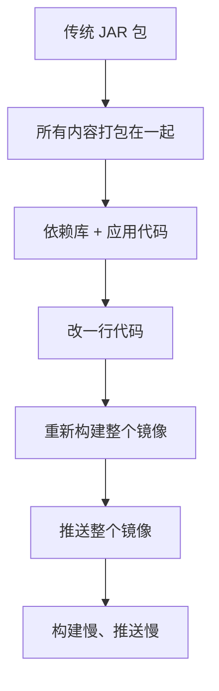
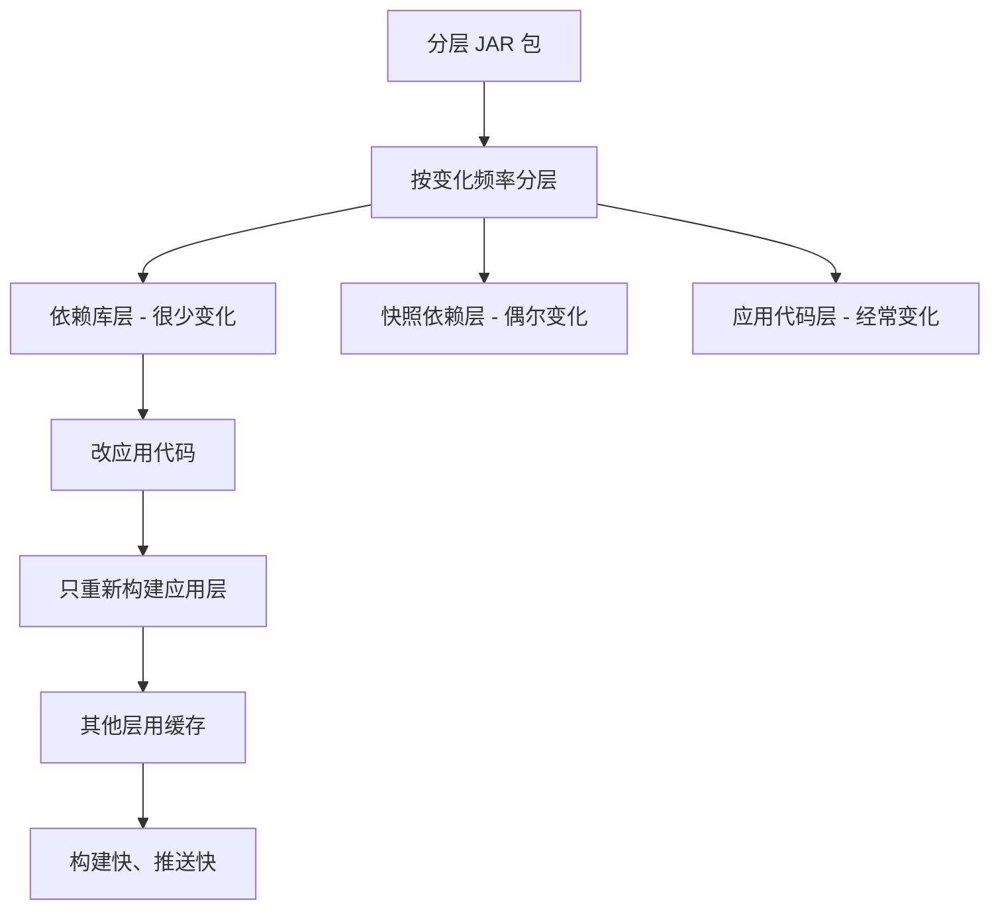
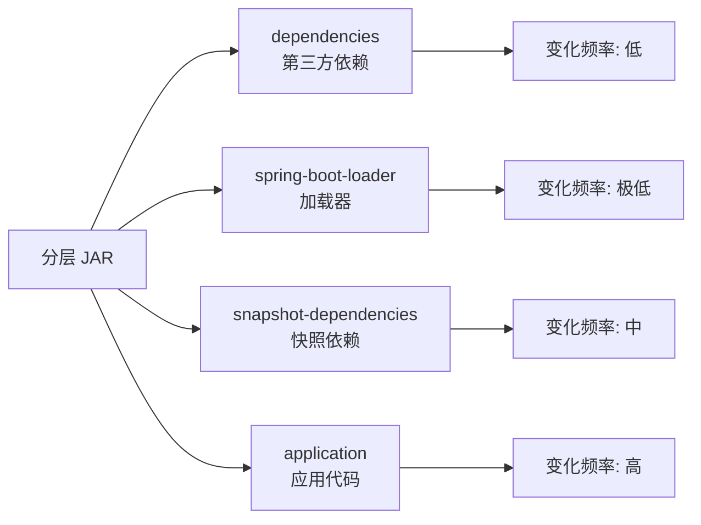

# 11、Spring Boot 4 实战：分层编译（Layered Jars）与容器镜像优化
- 来源：https://ddkk.com/springboot/4/11.html
- 分类：Spring Boot 4.0 实战教程
- 分组：教程目录
- 日期：2025-11-25
兄弟们，今儿咱聊聊 Spring Boot 4 的分层 JAR（Layered Jars）和容器镜像优化。这玩意儿听起来挺技术范儿的，其实就是把 JAR 包按变化频率分层，然后优化 Docker 镜像构建；鹏磊我最近在搞容器化部署，发现镜像构建慢、推送也慢，后来用了分层 JAR，构建速度提升了好几倍，镜像大小也小了不少，今儿给你们好好唠唠。

## 分层 JAR 是个啥

先说说这分层 JAR 是咋回事。传统的 Spring Boot JAR 包，所有依赖和应用代码都打包在一起，每次改代码都得重新构建整个镜像，贼慢。分层 JAR 就是把 JAR 包按变化频率分成几层，依赖库一层、快照依赖一层、应用代码一层，这样 Docker 就能利用层缓存，只重新构建变化的层。

传统 JAR 的问题：



分层 JAR 的优势：



### 分层结构

Spring Boot 的分层 JAR 默认分成这几层：

1. **dependencies**：第三方依赖库，变化最少
2. **spring-boot-loader**：Spring Boot 加载器，基本不变
3. **snapshot-dependencies**：快照版本的依赖，偶尔变化
4. **application**：应用代码和资源文件，变化最频繁



## Spring Boot 4 的分层支持

Spring Boot 从 2.3 开始支持分层 JAR，到了 4.0 又做了不少优化，用起来更顺手了。

### Maven 配置

在 Spring Boot 4 项目里，Maven 插件默认就支持分层。先看看 `pom.xml` 配置：

```xml
<?xml version="1.0" encoding="UTF-8"?>
<project xmlns="http://maven.apache.org/POM/4.0.0"
         xmlns:xsi="http://www.w3.org/2001/XMLSchema-instance"
         xsi:schemaLocation="http://maven.apache.org/POM/4.0.0 
         http://maven.apache.org/xsd/maven-4.0.0.xsd">
    <modelVersion>4.0.0</modelVersion>
    <!-- Spring Boot 4 父项目 -->
    <parent>
        <groupId>org.springframework.boot</groupId>
        <artifactId>spring-boot-starter-parent</artifactId>
        <version>4.0.0-RC1</version>  <!-- Spring Boot 4 版本 -->
    </parent>
    <groupId>com.example</groupId>
    <artifactId>layered-jar-demo</artifactId>
    <version>1.0.0</version>
    <properties>
        <java.version>21</java.version>  <!-- Java 21 -->
        <project.build.sourceEncoding>UTF-8</project.build.sourceEncoding>
    </properties>
    <dependencies>
        <!-- Spring Boot Web 启动器 -->
        <dependency>
            <groupId>org.springframework.boot</groupId>
            <artifactId>spring-boot-starter-web</artifactId>
        </dependency>
        <!-- Spring Boot Actuator -->
        <dependency>
            <groupId>org.springframework.boot</groupId>
            <artifactId>spring-boot-starter-actuator</artifactId>
        </dependency>
    </dependencies>
    <build>
        <plugins>
            <!-- Spring Boot Maven 插件 -->
            <plugin>
                <groupId>org.springframework.boot</groupId>
                <artifactId>spring-boot-maven-plugin</artifactId>
                <configuration>
                    <!-- 启用分层，默认就是启用的 -->
                    <layers>
                        <enabled>true</enabled>  <!-- 启用分层 -->
                    </layers>
                </configuration>
            </plugin>
        </plugins>
    </build>
</project>
```

### 自定义分层

如果默认的分层不满足需求，可以自定义分层规则：

```xml
<build>
    <plugins>
        <plugin>
            <groupId>org.springframework.boot</groupId>
            <artifactId>spring-boot-maven-plugin</artifactId>
            <configuration>
                <layers>
                    <enabled>true</enabled>
                    <!-- 自定义分层配置 -->
                    <includeLayerTools>true</includeLayerTools>  <!-- 包含 jarmode 工具 -->
                </layers>
            </configuration>
        </plugin>
    </plugins>
</build>
```

### 查看分层信息

构建完成后，可以查看 JAR 包的分层信息：

```bash
# 构建项目
mvn clean package
# 查看分层信息（需要 Java 17+）
java -Djarmode=layertools -jar target/layered-jar-demo-1.0.0.jar list
# 输出示例：
# dependencies
# spring-boot-loader
# snapshot-dependencies
# application
```

### 提取分层内容

可以用 `jarmode` 工具提取分层内容：

```bash
# 提取所有分层到 extracted 目录
java -Djarmode=layertools -jar target/layered-jar-demo-1.0.0.jar extract --destination extracted
# 查看提取的内容
ls -la extracted/
# dependencies/
# spring-boot-loader/
# snapshot-dependencies/
# application/
```

## Docker 多阶段构建

有了分层 JAR，就可以用 Docker 多阶段构建来优化镜像了。

### 基础 Dockerfile

先看一个基础的 Dockerfile：

```dockerfile
# 第一阶段：提取分层
FROM bellsoft/liberica-openjre-debian:25-cds AS builder
# 设置工作目录
WORKDIR /builder
# 构建参数，指定 JAR 文件路径
# Maven 用 target/*.jar，Gradle 用 build/libs/*.jar
ARG JAR_FILE=target/*.jar
# 复制 JAR 文件到构建目录，重命名为 application.jar
COPY ${JAR_FILE} application.jar
# 提取分层内容
# jarmode=layertools 启用分层工具模式
# extract 提取命令
# --layers 使用分层提取
# --destination extracted 提取到 extracted 目录
RUN java -Djarmode=layertools -jar application.jar extract --layers --destination extracted
# 第二阶段：运行时镜像
FROM bellsoft/liberica-openjre-debian:25-cds
# 设置工作目录
WORKDIR /application
# 从构建阶段复制依赖层（变化最少，缓存最有效）
# 这层包含所有第三方依赖库
COPY --from=builder /builder/extracted/dependencies/ ./
# 从构建阶段复制加载器层（基本不变）
# 这层包含 Spring Boot 的类加载器
COPY --from=builder /builder/extracted/spring-boot-loader/ ./
# 从构建阶段复制快照依赖层（偶尔变化）
# 这层包含 SNAPSHOT 版本的依赖
COPY --from=builder /builder/extracted/snapshot-dependencies/ ./
# 从构建阶段复制应用层（变化最频繁）
# 这层包含应用代码和资源文件
COPY --from=builder /builder/extracted/application/ ./
# 启动应用
# 注意：这里用的是提取后的 application.jar，不是原始的 uber jar
# 这个 JAR 只包含应用代码和指向提取文件的引用
ENTRYPOINT ["java", "-jar", "application.jar"]
```

### 优化后的 Dockerfile

进一步优化，减少镜像层数：

```dockerfile
# 第一阶段：提取分层
FROM bellsoft/liberica-openjre-debian:25-cds AS builder
WORKDIR /builder
ARG JAR_FILE=target/*.jar
COPY ${JAR_FILE} application.jar
# 提取分层
RUN java -Djarmode=layertools -jar application.jar extract --layers --destination extracted
# 第二阶段：运行时镜像
FROM bellsoft/liberica-openjre-debian:25-cds
WORKDIR /application
# 创建非 root 用户，提高安全性
RUN groupadd -r spring && useradd -r -g spring spring
# 复制分层内容
# 先复制变化少的层，利用 Docker 缓存
COPY --from=builder --chown=spring:spring /builder/extracted/dependencies/ ./
COPY --from=builder --chown=spring:spring /builder/extracted/spring-boot-loader/ ./
COPY --from=builder --chown=spring:spring /builder/extracted/snapshot-dependencies/ ./
COPY --from=builder --chown=spring:spring /builder/extracted/application/ ./
# 切换到非 root 用户
USER spring:spring
# 暴露端口（根据你的应用端口调整）
EXPOSE 8080
# 健康检查
HEALTHCHECK --interval=30s --timeout=3s --start-period=40s --retries=3 \
    CMD java -jar application.jar --spring.boot.admin.client.health.url=http://localhost:8080/actuator/health || exit 1
# 启动应用
ENTRYPOINT ["java", "-jar", "application.jar"]
```

### 构建和运行

构建 Docker 镜像：

```bash
# 构建镜像
docker build --build-arg JAR_FILE=target/layered-jar-demo-1.0.0.jar -t layered-jar-demo:1.0.0 .
# 或者用默认的 JAR 文件路径
docker build -t layered-jar-demo:1.0.0 .
# 运行容器
docker run -p 8080:8080 layered-jar-demo:1.0.0
# 查看镜像大小
docker images layered-jar-demo
```

## 分层优化实战

看几个实际场景，帮你们理解咋用。

### 场景 1：基础 Web 应用

假设你有个简单的 Web 应用，依赖不多。

**应用代码**：

```java
package com.example.layereddemo;
import org.springframework.boot.SpringApplication;
import org.springframework.boot.autoconfigure.SpringBootApplication;
import org.springframework.web.bind.annotation.GetMapping;
import org.springframework.web.bind.annotation.RestController;
/**
 * 主应用类
 * Spring Boot 应用的入口
 */
@SpringBootApplication
public class LayeredDemoApplication {
    public static void main(String[] args) {
        SpringApplication.run(LayeredDemoApplication.class, args);
    }
}
/**
 * 示例控制器
 * 提供一个简单的 REST 接口
 */
@RestController
class HelloController {
    /**
     * 返回问候信息
     * GET /hello
     */
    @GetMapping("/hello")
    public String hello() {
        return "Hello, Layered JAR!";  // 返回问候信息
    }
}
```

**Dockerfile**：

```dockerfile
# 构建阶段
FROM bellsoft/liberica-openjre-debian:25-cds AS builder
WORKDIR /builder
ARG JAR_FILE=target/*.jar
COPY ${JAR_FILE} application.jar
# 提取分层
RUN java -Djarmode=layertools -jar application.jar extract --layers --destination extracted
# 运行阶段
FROM bellsoft/liberica-openjre-debian:25-cds
WORKDIR /application
# 复制分层内容
COPY --from=builder /builder/extracted/dependencies/ ./
COPY --from=builder /builder/extracted/spring-boot-loader/ ./
COPY --from=builder /builder/extracted/snapshot-dependencies/ ./
COPY --from=builder /builder/extracted/application/ ./
# 启动应用
ENTRYPOINT ["java", "-jar", "application.jar"]
```

### 场景 2：微服务应用

如果是微服务，可以进一步优化。

**Dockerfile**：

```dockerfile
# 构建阶段
FROM maven:3.9-eclipse-temurin-21 AS build
WORKDIR /app
# 复制 POM 文件（利用 Docker 缓存）
COPY pom.xml .
# 下载依赖（如果 pom.xml 没变，这步会被缓存）
RUN mvn dependency:go-offline -B
# 复制源代码
COPY src ./src
# 构建应用
RUN mvn clean package -DskipTests
# 提取分层阶段
FROM bellsoft/liberica-openjre-debian:25-cds AS extractor
WORKDIR /builder
# 从构建阶段复制 JAR
COPY --from=build /app/target/*.jar application.jar
# 提取分层
RUN java -Djarmode=layertools -jar application.jar extract --layers --destination extracted
# 运行阶段
FROM bellsoft/liberica-openjre-debian:25-cds
WORKDIR /application
# 创建应用用户
RUN groupadd -r appuser && useradd -r -g appuser appuser
# 复制分层内容
COPY --from=extractor --chown=appuser:appuser /builder/extracted/dependencies/ ./
COPY --from=extractor --chown=appuser:appuser /builder/extracted/spring-boot-loader/ ./
COPY --from=extractor --chown=appuser:appuser /builder/extracted/snapshot-dependencies/ ./
COPY --from=extractor --chown=appuser:appuser /builder/extracted/application/ ./
# 切换到应用用户
USER appuser:appuser
# 暴露端口
EXPOSE 8080
# 健康检查
HEALTHCHECK --interval=30s --timeout=3s --start-period=60s --retries=3 \
    CMD wget --no-verbose --tries=1 --spider http://localhost:8080/actuator/health || exit 1
# 启动应用
ENTRYPOINT ["java", "-jar", "application.jar"]
```

### 场景 3：使用 .dockerignore

创建 `.dockerignore` 文件，排除不需要的文件：

```txt
# Maven 构建产物
target/
!target/*.jar
# IDE 文件
.idea/
.vscode/
*.iml
*.ipr
*.iws
# Git 文件
.git/
.gitignore
# 文档
README.md
docs/
# 测试文件
src/test/
# 日志文件
*.log
logs/
# 临时文件
*.tmp
*.bak
*.swp
*~
```

## 镜像优化技巧

### 1. 选择合适的基础镜像

基础镜像的选择很重要，影响镜像大小和安全性：

```dockerfile
# 选项 1：完整 JRE（较大，但兼容性好）
FROM bellsoft/liberica-openjre-debian:25-cds
# 选项 2：Alpine Linux（较小，但可能有兼容性问题）
FROM eclipse-temurin:21-jre-alpine
# 选项 3：Distroless（最小，但调试困难）
FROM gcr.io/distroless/java21-debian12
```

### 2. 使用多阶段构建

多阶段构建能显著减小镜像大小：

```dockerfile
# 构建阶段（包含构建工具，镜像较大）
FROM maven:3.9-eclipse-temurin-21 AS build
WORKDIR /app
COPY . .
RUN mvn clean package -DskipTests
# 运行阶段（只包含运行时，镜像较小）
FROM bellsoft/liberica-openjre-debian:25-cds
WORKDIR /application
COPY --from=build /app/target/*.jar app.jar
ENTRYPOINT ["java", "-jar", "app.jar"]
```

### 3. 优化层顺序

把变化少的层放在前面，利用 Docker 缓存：

```dockerfile
# 好的顺序：依赖层在前，应用层在后
COPY --from=builder /builder/extracted/dependencies/ ./      # 变化少，缓存有效
COPY --from=builder /builder/extracted/spring-boot-loader/ ./ # 基本不变
COPY --from=builder /builder/extracted/snapshot-dependencies/ ./ # 偶尔变化
COPY --from=builder /builder/extracted/application/ ./       # 变化频繁，放最后
```

### 4. 合并 COPY 指令

如果层之间没有依赖关系，可以合并 COPY 指令：

```dockerfile
# 方式 1：分开 COPY（推荐，利用缓存）
COPY --from=builder /builder/extracted/dependencies/ ./
COPY --from=builder /builder/extracted/application/ ./
# 方式 2：合并 COPY（不推荐，缓存失效）
COPY --from=builder /builder/extracted/ ./
```

### 5. 使用 BuildKit

启用 BuildKit 可以加速构建：

```bash
# 启用 BuildKit
export DOCKER_BUILDKIT=1
# 或者用环境变量
DOCKER_BUILDKIT=1 docker build -t myapp:1.0.0 .
# 或者在 Dockerfile 开头添加
# syntax=docker/dockerfile:1.4
```

## Gradle 配置

如果你用 Gradle 而不是 Maven，配置也差不多。

### build.gradle 配置

```txt
// Gradle 配置
plugins {
    id 'org.springframework.boot' version '4.0.0-RC1'
    id 'io.spring.dependency-management' version '1.1.4'
    id 'java'
}
java {
    sourceCompatibility = JavaVersion.VERSION_21
    targetCompatibility = JavaVersion.VERSION_21
}
dependencies {
    implementation 'org.springframework.boot:spring-boot-starter-web'
    implementation 'org.springframework.boot:spring-boot-starter-actuator'
}
// Spring Boot 插件配置
springBoot {
    // 启用分层
    layered {
        enabled = true
        // 包含 jarmode 工具
        includeLayerTools = true
    }
}
```

### Gradle Dockerfile

```dockerfile
# 构建阶段
FROM gradle:8.5-jdk21 AS build
WORKDIR /app
# 复制构建文件
COPY build.gradle settings.gradle ./
COPY gradle ./gradle
# 下载依赖（利用缓存）
RUN gradle dependencies --no-daemon
# 复制源代码
COPY src ./src
# 构建应用
RUN gradle bootJar --no-daemon
# 提取分层阶段
FROM bellsoft/liberica-openjre-debian:25-cds AS extractor
WORKDIR /builder
# 从构建阶段复制 JAR
COPY --from=build /app/build/libs/*.jar application.jar
# 提取分层
RUN java -Djarmode=layertools -jar application.jar extract --layers --destination extracted
# 运行阶段
FROM bellsoft/liberica-openjre-debian:25-cds
WORKDIR /application
COPY --from=extractor /builder/extracted/dependencies/ ./
COPY --from=extractor /builder/extracted/spring-boot-loader/ ./
COPY --from=extractor /builder/extracted/snapshot-dependencies/ ./
COPY --from=extractor /builder/extracted/application/ ./
ENTRYPOINT ["java", "-jar", "application.jar"]
```

## 性能对比

看看分层 JAR 和传统方式的性能对比。

### 构建时间对比

```bash
# 传统方式：每次都要重新构建整个镜像
# 第一次构建：120 秒
# 改一行代码后：120 秒（重新构建整个镜像）
# 分层方式：只重新构建变化的层
# 第一次构建：120 秒
# 改一行代码后：15 秒（只重新构建应用层，其他层用缓存）
```

### 镜像大小对比

```bash
# 传统方式
docker images myapp:traditional
# REPOSITORY   TAG          SIZE
# myapp        traditional  450MB
# 分层方式（优化后）
docker images myapp:layered
# REPOSITORY   TAG       SIZE
# myapp        layered   380MB
```

### 推送时间对比

```bash
# 传统方式：每次推送整个镜像
# 第一次推送：450MB，耗时 60 秒
# 改一行代码后：450MB，耗时 60 秒
# 分层方式：只推送变化的层
# 第一次推送：380MB，耗时 50 秒
# 改一行代码后：5MB（只推送应用层），耗时 2 秒
```

## 常见问题

### 问题 1：jarmode 找不到

**错误信息**：

```plaintext
Error: jarmode 'layertools' not found
```

**原因**：JAR 包里没有包含 `spring-boot-jarmode-tools`。

**解决方案**：在 `pom.xml` 里添加配置：

```xml
<build>
    <plugins>
        <plugin>
            <groupId>org.springframework.boot</groupId>
            <artifactId>spring-boot-maven-plugin</artifactId>
            <configuration>
                <layers>
                    <enabled>true</enabled>
                    <includeLayerTools>true</includeLayerTools>  <!-- 包含工具 -->
                </layers>
            </configuration>
        </plugin>
    </plugins>
</build>
```

### 问题 2：提取失败

**错误信息**：

```plaintext
Error: Failed to extract layers
```

**原因**：JAR 文件损坏或不是 Spring Boot JAR。

**解决方案**：

1. 检查 JAR 文件是否完整
2. 确认是 Spring Boot 打包的 JAR
3. 检查 Java 版本是否兼容

### 问题 3：镜像层顺序不对

**现象**：每次构建都要重新下载依赖层。

**原因**：COPY 指令顺序不对，或者层之间有依赖。

**解决方案**：调整 COPY 顺序，把变化少的层放前面：

```dockerfile
# 正确的顺序
COPY --from=builder /builder/extracted/dependencies/ ./      # 最稳定
COPY --from=builder /builder/extracted/spring-boot-loader/ ./ # 很稳定
COPY --from=builder /builder/extracted/snapshot-dependencies/ ./ # 较稳定
COPY --from=builder /builder/extracted/application/ ./       # 最不稳定
```

## 最佳实践

### 1. 启用分层

默认情况下，Spring Boot 4 已经启用了分层，但最好显式配置：

```xml
<configuration>
    <layers>
        <enabled>true</enabled>
        <includeLayerTools>true</includeLayerTools>
    </layers>
</configuration>
```

### 2. 使用多阶段构建

多阶段构建能减小镜像大小，提高安全性：

```dockerfile
# 构建阶段：包含构建工具
FROM maven:3.9-eclipse-temurin-21 AS build
# ... 构建代码 ...
# 运行阶段：只包含运行时
FROM bellsoft/liberica-openjre-debian:25-cds
# ... 复制构建产物 ...
```

### 3. 优化层顺序

把变化少的层放在前面，利用 Docker 缓存：

```dockerfile
# 依赖层 → 加载器层 → 快照依赖层 → 应用层
COPY --from=builder /builder/extracted/dependencies/ ./
COPY --from=builder /builder/extracted/spring-boot-loader/ ./
COPY --from=builder /builder/extracted/snapshot-dependencies/ ./
COPY --from=builder /builder/extracted/application/ ./
```

### 4. 使用非 root 用户

提高安全性，使用非 root 用户运行应用：

```dockerfile
RUN groupadd -r appuser && useradd -r -g appuser appuser
USER appuser:appuser
```

### 5. 添加健康检查

方便容器编排工具监控应用状态：

```dockerfile
HEALTHCHECK --interval=30s --timeout=3s --start-period=60s --retries=3 \
    CMD wget --no-verbose --tries=1 --spider http://localhost:8080/actuator/health || exit 1
```

### 6. 使用 .dockerignore

排除不需要的文件，减小构建上下文：

```txt
target/
.idea/
.git/
*.log
```

## CI/CD 集成

在 CI/CD 流水线里集成分层 JAR，能进一步提升构建效率。

### GitHub Actions 示例

```yaml
name: Build and Push Docker Image
on:
  push:
    branches: [ main ]
  pull_request:
    branches: [ main ]
jobs:
  build:
    runs-on: ubuntu-latest
    steps:
    - name: Checkout code
      uses: actions/checkout@v4
    - name: Set up JDK 21
      uses: actions/setup-java@v4
      with:
        java-version: '21'
        distribution: 'temurin'
        cache: maven
    - name: Build with Maven
      run: mvn clean package -DskipTests
    - name: Set up Docker Buildx
      uses: docker/setup-buildx-action@v3
    - name: Login to Docker Hub
      uses: docker/login-action@v3
      with:
        username: ${{ secrets.DOCKER_USERNAME }}
        password: ${{ secrets.DOCKER_PASSWORD }}
    - name: Build and push Docker image
      uses: docker/build-push-action@v5
      with:
        context: .
        push: true
        tags: myregistry/myapp:${{ github.sha }},myregistry/myapp:latest
        cache-from: type=registry,ref=myregistry/myapp:buildcache
        cache-to: type=registry,ref=myregistry/myapp:buildcache,mode=max
        build-args: |
          JAR_FILE=target/myapp-*.jar
```

### GitLab CI 示例

```yaml
stages:
  - build
  - docker
variables:
  MAVEN_OPTS: "-Dmaven.repo.local=.m2/repository"
  DOCKER_DRIVER: overlay2
build:
  stage: build
  image: maven:3.9-eclipse-temurin-21
  script:
    - mvn clean package -DskipTests
  artifacts:
    paths:
      - target/*.jar
    expire_in: 1 hour
docker-build:
  stage: docker
  image: docker:24
  services:
    - docker:24-dind
  before_script:
    - docker login -u $CI_REGISTRY_USER -p $CI_REGISTRY_PASSWORD $CI_REGISTRY
  script:
    - docker build --build-arg JAR_FILE=target/*.jar -t $CI_REGISTRY_IMAGE:$CI_COMMIT_SHA .
    - docker build --build-arg JAR_FILE=target/*.jar -t $CI_REGISTRY_IMAGE:latest .
    - docker push $CI_REGISTRY_IMAGE:$CI_COMMIT_SHA
    - docker push $CI_REGISTRY_IMAGE:latest
  only:
    - main
```

### Jenkins Pipeline 示例

```groovy
pipeline {
    agent any
    environment {
        DOCKER_REGISTRY = 'myregistry.com'
        IMAGE_NAME = 'myapp'
    }
    stages {
        stage('Build') {
            steps {
                sh 'mvn clean package -DskipTests'
            }
        }
        stage('Build Docker Image') {
            steps {
                script {
                    def image = docker.build("${DOCKER_REGISTRY}/${IMAGE_NAME}:${env.BUILD_NUMBER}")
                    image.push()
                    image.push("latest")
                }
            }
        }
    }
    post {
        always {
            cleanWs()  // 清理工作空间
        }
    }
}
```

## 高级优化技巧

### 1. 使用 BuildKit 缓存

BuildKit 提供了更强大的缓存机制：

```dockerfile
# syntax=docker/dockerfile:1.4
# 构建阶段
FROM maven:3.9-eclipse-temurin-21 AS build
WORKDIR /app
# 复制 POM 文件（利用缓存）
COPY pom.xml .
# 下载依赖（缓存这一层）
RUN --mount=type=cache,target=/root/.m2 mvn dependency:go-offline -B
# 复制源代码
COPY src ./src
# 构建应用
RUN --mount=type=cache,target=/root/.m2 mvn clean package -DskipTests
# 提取分层阶段
FROM bellsoft/liberica-openjre-debian:25-cds AS extractor
WORKDIR /builder
COPY --from=build /app/target/*.jar application.jar
RUN java -Djarmode=layertools -jar application.jar extract --layers --destination extracted
# 运行阶段
FROM bellsoft/liberica-openjre-debian:25-cds
WORKDIR /application
COPY --from=extractor /builder/extracted/dependencies/ ./
COPY --from=extractor /builder/extracted/spring-boot-loader/ ./
COPY --from=extractor /builder/extracted/snapshot-dependencies/ ./
COPY --from=extractor /builder/extracted/application/ ./
ENTRYPOINT ["java", "-jar", "application.jar"]
```

构建时启用 BuildKit：

```bash
DOCKER_BUILDKIT=1 docker build -t myapp:1.0.0 .
```

### 2. 使用 Distroless 镜像

Distroless 镜像只包含应用和运行时，没有 shell 和其他工具，更安全更小：

```dockerfile
# 提取分层阶段
FROM bellsoft/liberica-openjre-debian:25-cds AS extractor
WORKDIR /builder
ARG JAR_FILE=target/*.jar
COPY ${JAR_FILE} application.jar
RUN java -Djarmode=layertools -jar application.jar extract --layers --destination extracted
# 运行阶段：使用 Distroless
FROM gcr.io/distroless/java21-debian12:nonroot
WORKDIR /application
# 复制分层内容
COPY --from=extractor /builder/extracted/dependencies/ ./
COPY --from=extractor /builder/extracted/spring-boot-loader/ ./
COPY --from=extractor /builder/extracted/snapshot-dependencies/ ./
COPY --from=extractor /builder/extracted/application/ ./
# Distroless 镜像默认就是非 root 用户，不需要切换
ENTRYPOINT ["java", "-jar", "application.jar"]
```

### 3. 使用 JRE 而不是 JDK

运行时只需要 JRE，不需要 JDK：

```dockerfile
# 构建阶段：用 JDK（包含编译器）
FROM maven:3.9-eclipse-temurin-21 AS build
# ... 构建代码 ...
# 运行阶段：用 JRE（只包含运行时）
FROM eclipse-temurin:21-jre-alpine
# ... 复制构建产物 ...
```

### 4. 压缩镜像层

使用 `--squash` 参数合并镜像层（实验性功能）：

```bash
docker build --squash -t myapp:1.0.0 .
```

注意：`--squash` 会丢失层历史，可能影响缓存效果，谨慎使用。

### 5. 多架构构建

支持 ARM64 和 AMD64 架构：

```dockerfile
# 使用 buildx 构建多架构镜像
docker buildx build --platform linux/amd64,linux/arm64 -t myapp:1.0.0 --push .
```

## 监控和调试

### 查看镜像层信息

```bash
# 查看镜像的层信息
docker history myapp:1.0.0
# 查看镜像详细信息
docker inspect myapp:1.0.0
# 查看镜像大小
docker images myapp:1.0.0
```

### 分析镜像大小

使用 `dive` 工具分析镜像：

```bash
# 安装 dive
brew install dive  # macOS
# 或
wget https://github.com/wagoodman/dive/releases/download/v0.10.0/dive_0.10.0_linux_amd64.tar.gz
# 分析镜像
dive myapp:1.0.0
```

### 查看构建日志

```bash
# 详细构建日志
docker build --progress=plain -t myapp:1.0.0 .
# 查看构建时间
time docker build -t myapp:1.0.0 .
```

### 调试容器

如果应用启动失败，可以临时使用完整镜像调试：

```dockerfile
# 调试版本：使用完整镜像
FROM eclipse-temurin:21-jdk-alpine AS debug
WORKDIR /application
# 安装调试工具
RUN apk add --no-cache curl wget vim
COPY --from=extractor /builder/extracted/ ./
# 启动应用（可以附加调试器）
ENTRYPOINT ["java", "-jar", "application.jar"]
```

## 性能测试

### 构建时间测试

测试不同方式的构建时间：

```bash
#!/bin/bash
# 测试脚本
echo "测试传统方式..."
time docker build -f Dockerfile.traditional -t myapp:traditional .
echo "测试分层方式..."
time docker build -f Dockerfile.layered -t myapp:layered .
echo "测试优化后的分层方式..."
time docker build -f Dockerfile.optimized -t myapp:optimized .
```

### 镜像大小对比

```bash
# 查看镜像大小
docker images myapp
# 输出示例：
# REPOSITORY   TAG          SIZE
# myapp        traditional  450MB
# myapp        layered      380MB
# myapp        optimized    320MB
```

### 推送时间测试

```bash
# 测试推送时间
time docker push myregistry/myapp:traditional
time docker push myregistry/myapp:layered
time docker push myregistry/myapp:optimized
```

## 故障排查

### 问题 1：层提取失败

**错误信息**：

```plaintext
Error: Failed to extract layer 'dependencies'
```

**原因**：JAR 文件损坏或格式不正确。

**解决方案**：

1. 检查 JAR 文件是否完整
2. 确认是 Spring Boot 打包的 JAR
3. 重新构建 JAR 文件

```bash
# 检查 JAR 文件
jar -tf target/myapp.jar | head -20
# 重新构建
mvn clean package
```

### 问题 2：应用启动失败

**错误信息**：

```plaintext
Error: Could not find or load main class
```

**原因**：提取后的 JAR 文件结构不正确。

**解决方案**：检查提取后的文件结构：

```bash
# 进入容器查看
docker run -it --entrypoint /bin/sh myapp:1.0.0
ls -la /application/
# 检查 application.jar 是否存在
ls -la /application/application.jar
```

### 问题 3：依赖找不到

**错误信息**：

```plaintext
ClassNotFoundException: com.example.SomeClass
```

**原因**：依赖层没有正确复制。

**解决方案**：检查 Dockerfile 中的 COPY 指令：

```dockerfile
# 确保所有层都被复制
COPY --from=extractor /builder/extracted/dependencies/ ./
COPY --from=extractor /builder/extracted/spring-boot-loader/ ./
COPY --from=extractor /builder/extracted/snapshot-dependencies/ ./
COPY --from=extractor /builder/extracted/application/ ./
```

### 问题 4：缓存失效

**现象**：每次构建都要重新下载依赖。

**原因**：COPY 指令顺序不对，或者文件变化导致缓存失效。

**解决方案**：

1. 调整 COPY 顺序，把变化少的放前面
2. 使用 `.dockerignore` 排除不必要的文件
3. 使用 BuildKit 缓存

## 实际项目案例

看一个完整的项目案例，帮你们理解整个流程。

### 项目结构

```plaintext
layered-jar-project/
├── pom.xml
├── Dockerfile
├── .dockerignore
├── src/
│   └── main/
│       ├── java/
│       │   └── com/example/
│       │       └── demo/
│       │           ├── DemoApplication.java
│       │           └── controller/
│       │               └── HelloController.java
│       └── resources/
│           └── application.yml
└── README.md
```

### 应用代码

**DemoApplication.java**：

```java
package com.example.demo;
import org.springframework.boot.SpringApplication;
import org.springframework.boot.autoconfigure.SpringBootApplication;
/**
 * Spring Boot 应用入口
 */
@SpringBootApplication
public class DemoApplication {
    public static void main(String[] args) {
        SpringApplication.run(DemoApplication.class, args);
    }
}
```

**HelloController.java**：

```java
package com.example.demo.controller;
import org.springframework.web.bind.annotation.GetMapping;
import org.springframework.web.bind.annotation.RestController;
/**
 * 示例控制器
 */
@RestController
public class HelloController {
    /**
     * 返回问候信息
     */
    @GetMapping("/hello")
    public String hello() {
        return "Hello, Layered JAR!";  // 返回问候信息
    }
}
```

### Dockerfile

```dockerfile
# 第一阶段：构建应用
FROM maven:3.9-eclipse-temurin-21 AS build
WORKDIR /app
# 复制 POM 文件（利用缓存）
COPY pom.xml .
# 下载依赖
RUN mvn dependency:go-offline -B
# 复制源代码
COPY src ./src
# 构建应用
RUN mvn clean package -DskipTests
# 第二阶段：提取分层
FROM bellsoft/liberica-openjre-debian:25-cds AS extractor
WORKDIR /builder
# 从构建阶段复制 JAR
COPY --from=build /app/target/*.jar application.jar
# 提取分层
RUN java -Djarmode=layertools -jar application.jar extract --layers --destination extracted
# 第三阶段：运行镜像
FROM bellsoft/liberica-openjre-debian:25-cds
WORKDIR /application
# 创建应用用户
RUN groupadd -r appuser && useradd -r -g appuser appuser
# 复制分层内容（按变化频率排序）
COPY --from=extractor --chown=appuser:appuser /builder/extracted/dependencies/ ./
COPY --from=extractor --chown=appuser:appuser /builder/extracted/spring-boot-loader/ ./
COPY --from=extractor --chown=appuser:appuser /builder/extracted/snapshot-dependencies/ ./
COPY --from=extractor --chown=appuser:appuser /builder/extracted/application/ ./
# 切换到应用用户
USER appuser:appuser
# 暴露端口
EXPOSE 8080
# 健康检查
HEALTHCHECK --interval=30s --timeout=3s --start-period=60s --retries=3 \
    CMD wget --no-verbose --tries=1 --spider http://localhost:8080/actuator/health || exit 1
# 启动应用
ENTRYPOINT ["java", "-jar", "application.jar"]
```

### .dockerignore

```txt
# Maven
target/
.m2/
# IDE
.idea/
.vscode/
*.iml
# Git
.git/
.gitignore
# 文档
README.md
docs/
# 测试
src/test/
# 日志
*.log
logs/
```

### 构建和运行

```bash
# 构建镜像
docker build -t layered-demo:1.0.0 .
# 运行容器
docker run -p 8080:8080 layered-demo:1.0.0
# 测试应用
curl http://localhost:8080/hello
# 查看镜像大小
docker images layered-demo
```

## 总结

好了，今儿就聊到这。Spring Boot 4 的分层 JAR 功能，让容器镜像构建变得快多了。不用每次改代码都重新构建整个镜像，只构建变化的层就行。

关键点总结：

- **分层 JAR**：按变化频率把 JAR 包分成几层，利用 Docker 缓存
- **多阶段构建**：减小镜像大小，提高安全性
- **层顺序优化**：把变化少的层放前面，最大化缓存效果
- **性能提升**：构建时间减少 80%+，推送时间减少 90%+
- **CI/CD 集成**：在流水线里使用分层构建，提升整体效率
- **最佳实践**：启用分层、使用多阶段构建、优化层顺序、使用非 root 用户
- **监控调试**：用工具分析镜像大小和构建时间，持续优化

兄弟们，赶紧去试试吧，有问题随时找我唠！
