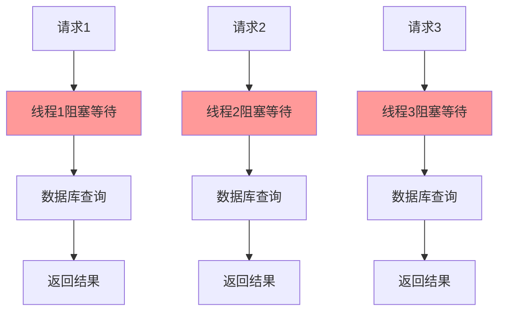
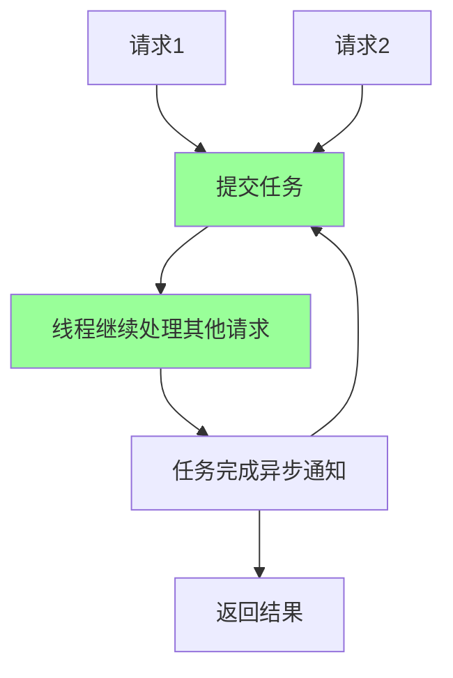
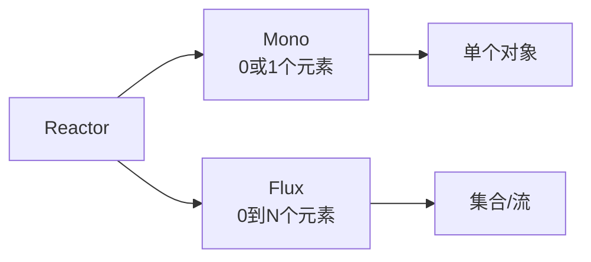
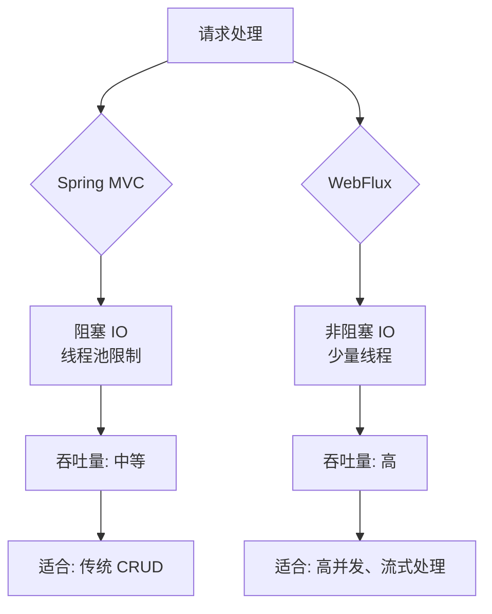

# 12、Spring Boot 4 实战：响应式编程增强：WebFlux 性能提升实践
- 来源：https://ddkk.com/springboot/4/12.html
- 分类：Spring Boot 4.0 实战教程
- 分组：教程目录
- 日期：2025-11-25
兄弟们，今儿咱聊聊 Spring Boot 4 的 WebFlux 性能提升。这玩意儿听起来挺高大上的，其实就是响应式编程，非阻塞、异步处理请求；鹏磊我最近在搞高并发服务，发现传统 MVC 模式线程池不够用，后来上了 WebFlux，性能提升了好几倍，线程数也降下来了，今儿给你们好好唠唠。

## 响应式编程是个啥

先说说这响应式编程是咋回事。传统的 Web 应用，一个请求过来，线程就阻塞在那等着，直到处理完才返回。响应式编程就是非阻塞的，请求来了先提交任务，线程继续处理其他请求，等任务完成再异步通知，这样线程利用率就高了。

传统阻塞模式：



响应式非阻塞模式：



### Reactor 基础

WebFlux 基于 Reactor 库，Reactor 提供了两个核心类型：`Mono` 和 `Flux`。

- **Mono**：表示 0 或 1 个元素的异步序列，类似 `Optional` 的异步版本
- **Flux**：表示 0 到 N 个元素的异步序列，类似 `Stream` 的异步版本



## Spring Boot 4 的 WebFlux 增强

Spring Boot 4 在 WebFlux 方面做了不少优化，性能提升明显，用起来也更顺手了。

### 依赖配置

先看看 `pom.xml` 配置：

```xml
<?xml version="1.0" encoding="UTF-8"?>
<project xmlns="http://maven.apache.org/POM/4.0.0"
         xmlns:xsi="http://www.w3.org/2001/XMLSchema-instance"
         xsi:schemaLocation="http://maven.apache.org/POM/4.0.0 
         http://maven.apache.org/xsd/maven-4.0.0.xsd">
    <modelVersion>4.0.0</modelVersion>
    <!-- Spring Boot 4 父项目 -->
    <parent>
        <groupId>org.springframework.boot</groupId>
        <artifactId>spring-boot-starter-parent</artifactId>
        <version>4.0.0-RC1</version>  <!-- Spring Boot 4 版本 -->
    </parent>
    <groupId>com.example</groupId>
    <artifactId>webflux-demo</artifactId>
    <version>1.0.0</version>
    <properties>
        <java.version>21</java.version>  <!-- Java 21 -->
        <project.build.sourceEncoding>UTF-8</project.build.sourceEncoding>
    </properties>
    <dependencies>
        <!-- WebFlux 启动器 -->
        <dependency>
            <groupId>org.springframework.boot</groupId>
            <artifactId>spring-boot-starter-webflux</artifactId>
        </dependency>
        <!-- Actuator，用于监控 -->
        <dependency>
            <groupId>org.springframework.boot</groupId>
            <artifactId>spring-boot-starter-actuator</artifactId>
        </dependency>
        <!-- 响应式数据访问（如果需要） -->
        <dependency>
            <groupId>org.springframework.boot</groupId>
            <artifactId>spring-boot-starter-data-r2dbc</artifactId>
        </dependency>
        <!-- Reactor 测试工具 -->
        <dependency>
            <groupId>io.projectreactor</groupId>
            <artifactId>reactor-test</artifactId>
            <scope>test</scope>
        </dependency>
    </dependencies>
</project>
```

### 应用配置

在 `application.yml` 里配置 WebFlux：

```yaml
# 应用配置
spring:
  application:
    name: webflux-demo
  # WebFlux 配置
  webflux:
    # 基础路径
    base-path: /api
    # 静态资源路径
    static-path-pattern: /static/**
    # 编码配置
    encoding:
      charset: UTF-8
      enabled: true
      force: true
  # 响应式数据源配置（如果使用 R2DBC）
  r2dbc:
    url: r2dbc:postgresql://localhost:5432/mydb
    username: user
    password: password
# 服务器配置
server:
  port: 8080
  # Netty 配置（WebFlux 默认使用 Netty）
  netty:
    # 连接超时
    connection-timeout: 20000
    # 空闲超时
    idle-timeout: 60000
# Actuator 配置
management:
  endpoints:
    web:
      exposure:
        include: health,info,metrics
  endpoint:
    health:
      probes:
        enabled: true
```

## 注解式控制器

WebFlux 支持注解式控制器，和 Spring MVC 类似，但返回的是响应式类型。

### 基础控制器

```java
package com.example.webflux.controller;
import org.springframework.web.bind.annotation.*;
import reactor.core.publisher.Flux;
import reactor.core.publisher.Mono;
/**
 * 用户控制器
 * 演示 WebFlux 的注解式控制器
 */
@RestController
@RequestMapping("/users")
public class UserController {
    // 注入用户服务（假设是响应式的）
    private final UserService userService;
    // 构造函数注入
    public UserController(UserService userService) {
        this.userService = userService;
    }
    /**
     * 根据 ID 获取用户
     * GET /users/{id}
     * 返回 Mono<User>，表示单个用户
     */
    @GetMapping("/{id}")
    public Mono<User> getUser(@PathVariable Long id) {
        return userService.findById(id);  // 返回 Mono，非阻塞
    }
    /**
     * 获取所有用户
     * GET /users
     * 返回 Flux<User>，表示用户流
     */
    @GetMapping
    public Flux<User> getAllUsers() {
        return userService.findAll();  // 返回 Flux，非阻塞流
    }
    /**
     * 创建用户
     * POST /users
     * 接收 Mono<User>，返回 Mono<User>
     */
    @PostMapping
    public Mono<User> createUser(@RequestBody Mono<User> userMono) {
        return userService.save(userMono);  // 保存用户，返回 Mono
    }
    /**
     * 更新用户
     * PUT /users/{id}
     */
    @PutMapping("/{id}")
    public Mono<User> updateUser(@PathVariable Long id, @RequestBody Mono<User> userMono) {
        return userMono
                .flatMap(user -> {
                    user.setId(id);  // 设置 ID
                    return userService.save(user);  // 保存更新
                });
    }
    /**
     * 删除用户
     * DELETE /users/{id}
     */
    @DeleteMapping("/{id}")
    public Mono<Void> deleteUser(@PathVariable Long id) {
        return userService.deleteById(id);  // 删除用户，返回 Mono<Void>
    }
    /**
     * 获取用户的订单
     * GET /users/{id}/orders
     * 演示嵌套的响应式调用
     */
    @GetMapping("/{id}/orders")
    public Flux<Order> getUserOrders(@PathVariable Long id) {
        return userService.findById(id)  // 先找用户
                .flatMapMany(user -> orderService.findByUserId(user.getId()));  // 再找订单
    }
}
```

### 用户实体类

```java
package com.example.webflux.model;
/**
 * 用户实体
 * 简单的 POJO 类
 */
public class User {
    private Long id;  // 用户 ID
    private String name;  // 用户名称
    private String email;  // 邮箱
    // 构造函数
    public User() {
    }
    public User(Long id, String name, String email) {
        this.id = id;
        this.name = name;
        this.email = email;
    }
    // Getter 和 Setter
    public Long getId() {
        return id;
    }
    public void setId(Long id) {
        this.id = id;
    }
    public String getName() {
        return name;
    }
    public void setName(String name) {
        this.name = name;
    }
    public String getEmail() {
        return email;
    }
    public void setEmail(String email) {
        this.email = email;
    }
}
```

## 函数式路由

WebFlux 还支持函数式路由，更灵活，性能也更好。

### 路由配置

```java
package com.example.webflux.config;
import org.springframework.context.annotation.Bean;
import org.springframework.context.annotation.Configuration;
import org.springframework.http.MediaType;
import org.springframework.web.reactive.function.server.*;
import reactor.core.publisher.Mono;
import static org.springframework.web.reactive.function.server.RequestPredicates.*;
import static org.springframework.web.reactive.function.server.RouterFunctions.route;
/**
 * WebFlux 函数式路由配置
 * 用函数式风格定义路由，性能更好
 */
@Configuration
public class WebFluxRouterConfig {
    // 注入处理器
    private final UserHandler userHandler;
    // 构造函数注入
    public WebFluxRouterConfig(UserHandler userHandler) {
        this.userHandler = userHandler;
    }
    /**
     * 定义路由
     * 函数式风格，更灵活
     */
    @Bean
    public RouterFunction<ServerResponse> userRoutes() {
        return route()
                // GET /users/{id} - 获取用户
                .GET("/users/{id}", accept(MediaType.APPLICATION_JSON), userHandler::getUser)
                // GET /users - 获取所有用户
                .GET("/users", accept(MediaType.APPLICATION_JSON), userHandler::getAllUsers)
                // POST /users - 创建用户
                .POST("/users", accept(MediaType.APPLICATION_JSON), userHandler::createUser)
                // PUT /users/{id} - 更新用户
                .PUT("/users/{id}", accept(MediaType.APPLICATION_JSON), userHandler::updateUser)
                // DELETE /users/{id} - 删除用户
                .DELETE("/users/{id}", userHandler::deleteUser)
                // GET /users/{id}/orders - 获取用户订单
                .GET("/users/{id}/orders", accept(MediaType.APPLICATION_JSON), userHandler::getUserOrders)
                .build();  // 构建路由函数
    }
}
```

### 处理器实现

```java
package com.example.webflux.handler;
import org.springframework.http.MediaType;
import org.springframework.stereotype.Component;
import org.springframework.web.reactive.function.server.ServerRequest;
import org.springframework.web.reactive.function.server.ServerResponse;
import reactor.core.publisher.Mono;
import reactor.core.publisher.Flux;
import static org.springframework.web.reactive.function.server.ServerResponse.ok;
/**
 * 用户处理器
 * 处理用户相关的请求
 */
@Component
public class UserHandler {
    // 注入用户服务
    private final UserService userService;
    // 构造函数注入
    public UserHandler(UserService userService) {
        this.userService = userService;
    }
    /**
     * 获取用户
     * 处理 GET /users/{id}
     */
    public Mono<ServerResponse> getUser(ServerRequest request) {
        // 从路径变量获取 ID
        Long id = Long.parseLong(request.pathVariable("id"));
        // 查找用户
        return userService.findById(id)
                .flatMap(user -> 
                    // 找到用户，返回 200
                    ok()
                            .contentType(MediaType.APPLICATION_JSON)
                            .bodyValue(user)
                )
                .switchIfEmpty(
                    // 没找到，返回 404
                    ServerResponse.notFound().build()
                );
    }
    /**
     * 获取所有用户
     * 处理 GET /users
     */
    public Mono<ServerResponse> getAllUsers(ServerRequest request) {
        // 查找所有用户
        Flux<User> users = userService.findAll();
        // 返回用户列表
        return ok()
                .contentType(MediaType.APPLICATION_JSON)
                .body(users, User.class);
    }
    /**
     * 创建用户
     * 处理 POST /users
     */
    public Mono<ServerResponse> createUser(ServerRequest request) {
        // 从请求体获取用户（响应式）
        Mono<User> userMono = request.bodyToMono(User.class);
        // 保存用户
        return userMono
                .flatMap(userService::save)
                .flatMap(user ->
                    // 保存成功，返回 201
                    ServerResponse
                            .status(201)
                            .contentType(MediaType.APPLICATION_JSON)
                            .bodyValue(user)
                );
    }
    /**
     * 更新用户
     * 处理 PUT /users/{id}
     */
    public Mono<ServerResponse> updateUser(ServerRequest request) {
        Long id = Long.parseLong(request.pathVariable("id"));
        Mono<User> userMono = request.bodyToMono(User.class);
        return userMono
                .flatMap(user -> {
                    user.setId(id);  // 设置 ID
                    return userService.save(user);  // 保存
                })
                .flatMap(user ->
                    ok()
                            .contentType(MediaType.APPLICATION_JSON)
                            .bodyValue(user)
                );
    }
    /**
     * 删除用户
     * 处理 DELETE /users/{id}
     */
    public Mono<ServerResponse> deleteUser(ServerRequest request) {
        Long id = Long.parseLong(request.pathVariable("id"));
        return userService.deleteById(id)
                .then(ServerResponse.noContent().build());  // 删除成功，返回 204
    }
    /**
     * 获取用户订单
     * 处理 GET /users/{id}/orders
     */
    public Mono<ServerResponse> getUserOrders(ServerRequest request) {
        Long id = Long.parseLong(request.pathVariable("id"));
        // 先找用户，再找订单
        Flux<Order> orders = userService.findById(id)
                .flatMapMany(user -> orderService.findByUserId(user.getId()));
        return ok()
                .contentType(MediaType.APPLICATION_JSON)
                .body(orders, Order.class);
    }
}
```

## 性能优化实践

### 1. 背压（Backpressure）处理

背压是响应式编程的重要概念，当生产速度 > 消费速度时，需要控制生产速度。

```java
package com.example.webflux.service;
import reactor.core.publisher.Flux;
import reactor.core.publisher.Mono;
import reactor.core.scheduler.Schedulers;
/**
 * 用户服务
 * 演示背压处理
 */
@Service
public class UserService {
    /**
     * 获取大量用户数据
     * 使用背压控制，避免内存溢出
     */
    public Flux<User> findAllWithBackpressure() {
        return Flux.range(1, 1000000)  // 生成大量数据
                .map(id -> new User((long) id, "User" + id, "user" + id + "@example.com"))
                .onBackpressureBuffer(1000)  // 缓冲区大小 1000
                .onBackpressureDrop(dropped -> 
                    System.out.println("丢弃: " + dropped)  // 丢弃的数据
                )
                .onBackpressureLatest();  // 只保留最新的
    }
    /**
     * 使用限流
     * 控制数据流速度
     */
    public Flux<User> findAllWithRateLimit() {
        return Flux.range(1, 10000)
                .map(id -> new User((long) id, "User" + id, "user" + id + "@example.com"))
                .limitRate(100)  // 每秒最多 100 个
                .delayElements(Duration.ofMillis(10));  // 每个元素延迟 10ms
    }
}
```

### 2. 线程池优化

合理配置线程池，避免线程过多或过少。

```java
package com.example.webflux.config;
import org.springframework.context.annotation.Bean;
import org.springframework.context.annotation.Configuration;
import reactor.core.scheduler.Scheduler;
import reactor.core.scheduler.Schedulers;
import java.util.concurrent.Executors;
/**
 * 响应式线程池配置
 * 优化线程使用
 */
@Configuration
public class SchedulerConfig {
    /**
     * 自定义调度器
     * 用于 CPU 密集型任务
     */
    @Bean("cpuScheduler")
    public Scheduler cpuScheduler() {
        // 线程数 = CPU 核心数
        int threads = Runtime.getRuntime().availableProcessors();
        return Schedulers.newParallel("cpu", threads);
    }
    /**
     * IO 调度器
     * 用于 IO 密集型任务
     */
    @Bean("ioScheduler")
    public Scheduler ioScheduler() {
        // IO 任务可以用更多线程
        return Schedulers.newBoundedElastic(
                50,  // 最大线程数
                1000,  // 队列大小
                "io"  // 线程名前缀
        );
    }
}
```

使用调度器：

```java
@Service
public class UserService {
    @Autowired
    @Qualifier("ioScheduler")
    private Scheduler ioScheduler;
    /**
     * 在 IO 调度器上执行
     * 适合数据库查询等 IO 操作
     */
    public Mono<User> findById(Long id) {
        return Mono.fromCallable(() -> {
            // 模拟数据库查询（阻塞操作）
            Thread.sleep(100);
            return new User(id, "User" + id, "user" + id + "@example.com");
        })
        .subscribeOn(ioScheduler);  // 在 IO 调度器上执行
    }
}
```

### 3. 缓存优化

合理使用缓存，减少重复计算。

```java
package com.example.webflux.service;
import org.springframework.cache.annotation.Cacheable;
import org.springframework.stereotype.Service;
import reactor.core.publisher.Mono;
/**
 * 用户服务
 * 演示缓存使用
 */
@Service
public class UserService {
    /**
     * 缓存用户数据
     * 使用 Spring Cache，但要注意响应式类型
     */
    public Mono<User> findByIdCached(Long id) {
        // 手动缓存实现
        return Mono.fromCallable(() -> {
            // 模拟数据库查询
            return new User(id, "User" + id, "user" + id + "@example.com");
        })
        .cache(Duration.ofMinutes(5));  // 缓存 5 分钟
    }
    /**
     * 使用 Reactor 的 cache
     * 自动缓存结果
     */
    public Mono<User> findByIdWithCache(Long id) {
        return Mono.fromCallable(() -> {
            System.out.println("查询数据库: " + id);  // 只打印一次
            return new User(id, "User" + id, "user" + id + "@example.com");
        })
        .cache();  // 永久缓存（注意内存泄漏）
    }
}
```

### 4. 组合操作优化

合理组合多个响应式操作，减少不必要的订阅。

```java
@Service
public class UserService {
    /**
     * 组合多个操作
     * 减少订阅次数
     */
    public Mono<UserDetail> getUserDetail(Long id) {
        // 并行获取用户和订单
        Mono<User> userMono = findById(id);
        Flux<Order> ordersFlux = findOrdersByUserId(id);
        // 组合结果
        return Mono.zip(userMono, ordersFlux.collectList())  // 并行执行
                .map(tuple -> {
                    User user = tuple.getT1();  // 用户
                    List<Order> orders = tuple.getT2();  // 订单列表
                    return new UserDetail(user, orders);  // 组合成详情
                });
    }
    /**
     * 使用 flatMap 串联操作
     * 避免嵌套
     */
    public Mono<String> getUserEmail(Long id) {
        return findById(id)
                .flatMap(user -> {
                    // 根据用户获取邮箱服务
                    return getEmailService(user.getId())
                            .map(emailService -> emailService.getEmail(user));
                });
    }
}
```

### 5. 错误处理

合理处理错误，避免流中断。

```java
@Service
public class UserService {
    /**
     * 错误处理
     * 使用 onErrorResume 处理异常
     */
    public Mono<User> findByIdWithErrorHandling(Long id) {
        return findById(id)
                .onErrorResume(NotFoundException.class, e -> {
                    // 用户不存在，返回默认用户
                    return Mono.just(new User(id, "Unknown", "unknown@example.com"));
                })
                .onErrorResume(Exception.class, e -> {
                    // 其他错误，记录日志
                    System.err.println("查询用户失败: " + e.getMessage());
                    return Mono.error(e);  // 重新抛出
                });
    }
    /**
     * 重试机制
     * 网络请求失败时重试
     */
    public Mono<User> findByIdWithRetry(Long id) {
        return findById(id)
                .retry(3)  // 重试 3 次
                .retryBackoff(3, Duration.ofSeconds(1));  // 指数退避重试
    }
}
```

## 实际案例

### 案例 1：高并发 API

假设有个高并发的用户查询 API，需要优化性能。

```java
@RestController
@RequestMapping("/api/users")
public class HighConcurrencyUserController {
    private final UserService userService;
    public HighConcurrencyUserController(UserService userService) {
        this.userService = userService;
    }
    /**
     * 高并发查询
     * 使用响应式编程，支持高并发
     */
    @GetMapping("/{id}")
    public Mono<ResponseEntity<User>> getUser(@PathVariable Long id) {
        return userService.findById(id)
                .map(ResponseEntity::ok)  // 找到用户，返回 200
                .defaultIfEmpty(ResponseEntity.notFound().build())  // 没找到，返回 404
                .subscribeOn(Schedulers.boundedElastic());  // 在弹性线程池执行
    }
    /**
     * 批量查询
     * 使用 Flux 处理流式数据
     */
    @GetMapping("/batch")
    public Flux<User> getUsers(@RequestParam List<Long> ids) {
        return Flux.fromIterable(ids)
                .flatMap(userService::findById)  // 并行查询
                .limitRate(100);  // 限流，每秒最多 100 个
    }
}
```

### 案例 2：流式数据处理

处理大量数据，使用流式处理。

```java
@RestController
@RequestMapping("/api/data")
public class StreamingDataController {
    /**
     * 流式返回数据
     * 使用 Server-Sent Events (SSE)
     */
    @GetMapping(value = "/stream", produces = MediaType.TEXT_EVENT_STREAM_VALUE)
    public Flux<DataEvent> streamData() {
        return Flux.interval(Duration.ofSeconds(1))  // 每秒一个事件
                .map(sequence -> new DataEvent(sequence, "Data " + sequence))
                .take(100);  // 只取前 100 个
    }
    /**
     * 流式上传处理
     * 处理大文件上传
     */
    @PostMapping(value = "/upload", consumes = MediaType.MULTIPART_FORM_DATA_VALUE)
    public Mono<String> uploadFile(@RequestBody Flux<DataBuffer> dataBufferFlux) {
        return dataBufferFlux
                .map(buffer -> {
                    // 处理每个数据块
                    byte[] bytes = new byte[buffer.readableByteCount()];
                    buffer.read(bytes);
                    return processChunk(bytes);  // 处理数据块
                })
                .collectList()  // 收集所有结果
                .map(results -> "处理完成: " + results.size() + " 个数据块");
    }
}
```

## 性能测试

### 压力测试

使用工具测试 WebFlux 性能：

```bash
# 使用 wrk 进行压力测试
wrk -t12 -c400 -d30s http://localhost:8080/api/users/1
# 使用 Apache Bench
ab -n 10000 -c 100 http://localhost:8080/api/users/1
```

### 监控指标

通过 Actuator 监控 WebFlux 性能：

```yaml
management:
  endpoints:
    web:
      exposure:
        include: metrics,health
  metrics:
    export:
      prometheus:
        enabled: true
```

访问指标：

- `/actuator/metrics/http.server.requests` - HTTP 请求指标
- `/actuator/metrics/reactor.flow.duration` - Reactor 流处理时间

## 最佳实践

### 1. 选择合适的模式

- **注解式控制器**：适合简单的 CRUD 操作
- **函数式路由**：适合复杂的路由逻辑，性能更好

### 2. 合理使用调度器

- **CPU 密集型**：使用 `Schedulers.parallel()`
- **IO 密集型**：使用 `Schedulers.boundedElastic()`
- **默认**：WebFlux 会自动选择合适的调度器

### 3. 处理背压

- 使用 `onBackpressureBuffer` 缓冲
- 使用 `onBackpressureDrop` 丢弃
- 使用 `limitRate` 限流

### 4. 错误处理

- 使用 `onErrorResume` 处理错误
- 使用 `retry` 重试机制
- 记录错误日志

### 5. 避免阻塞操作

- 不要在响应式流中执行阻塞操作
- 使用 `subscribeOn` 切换到合适的调度器
- 使用响应式数据库驱动（R2DBC）

## 与 Spring MVC 对比

WebFlux 和 Spring MVC 有啥区别，啥时候用哪个？

### 性能对比



### 选择建议

- **用 Spring MVC**：传统 CRUD 应用，团队熟悉 MVC，不需要高并发
- **用 WebFlux**：高并发场景，流式数据处理，需要非阻塞 IO

### 混合使用

可以在同一个项目里同时使用 MVC 和 WebFlux：

```java
@Configuration
public class WebConfig {
    // MVC 控制器
    @RestController
    @RequestMapping("/mvc")
    static class MvcController {
        @GetMapping("/users")
        public List<User> getUsers() {
            return Arrays.asList(new User(1L, "User1", "user1@example.com"));
        }
    }
    // WebFlux 路由
    @Bean
    public RouterFunction<ServerResponse> webfluxRoutes() {
        return route()
                .GET("/webflux/users", req -> 
                    ServerResponse.ok()
                            .body(Flux.just(new User(1L, "User1", "user1@example.com")), User.class)
                )
                .build();
    }
}
```

## R2DBC 数据库集成

WebFlux 需要响应式数据库驱动，R2DBC（Reactive Relational Database Connectivity）就是干这个的。

### 依赖配置

```xml
<dependencies>
    <!-- R2DBC PostgreSQL 驱动 -->
    <dependency>
        <groupId>io.r2dbc</groupId>
        <artifactId>r2dbc-postgresql</artifactId>
    </dependency>
    <!-- Spring Data R2DBC -->
    <dependency>
        <groupId>org.springframework.boot</groupId>
        <artifactId>spring-boot-starter-data-r2dbc</artifactId>
    </dependency>
</dependencies>
```

### 数据源配置

```yaml
spring:
  r2dbc:
    url: r2dbc:postgresql://localhost:5432/mydb
    username: user
    password: password
    pool:
      initial-size: 10
      max-size: 20
      max-idle-time: 30m
```

### Repository 定义

```java
package com.example.webflux.repository;
import org.springframework.data.r2dbc.repository.R2dbcRepository;
import org.springframework.stereotype.Repository;
import reactor.core.publisher.Flux;
import reactor.core.publisher.Mono;
/**
 * 用户仓储
 * 响应式数据访问
 */
@Repository
public interface UserRepository extends R2dbcRepository<User, Long> {
    /**
     * 根据名称查找用户
     * 返回 Flux，可能有多个
     */
    Flux<User> findByName(String name);
    /**
     * 根据邮箱查找用户
     * 返回 Mono，应该只有一个
     */
    Mono<User> findByEmail(String email);
    /**
     * 查找活跃用户
     * 自定义查询
     */
    @Query("SELECT * FROM users WHERE active = true")
    Flux<User> findActiveUsers();
}
```

### Service 使用

```java
@Service
public class UserService {
    private final UserRepository userRepository;
    public UserService(UserRepository userRepository) {
        this.userRepository = userRepository;
    }
    /**
     * 查找用户
     * 完全非阻塞
     */
    public Mono<User> findById(Long id) {
        return userRepository.findById(id);  // 非阻塞查询
    }
    /**
     * 保存用户
     */
    public Mono<User> save(User user) {
        return userRepository.save(user);  // 非阻塞保存
    }
    /**
     * 批量操作
     */
    public Flux<User> saveAll(Flux<User> users) {
        return userRepository.saveAll(users);  // 流式保存
    }
}
```

## WebSocket 支持

WebFlux 还支持 WebSocket，适合实时通信场景。

### WebSocket 处理器

```java
package com.example.webflux.websocket;
import org.springframework.stereotype.Component;
import org.springframework.web.reactive.socket.WebSocketHandler;
import org.springframework.web.reactive.socket.WebSocketSession;
import reactor.core.publisher.Mono;
/**
 * WebSocket 处理器
 * 处理 WebSocket 连接
 */
@Component
public class ChatWebSocketHandler implements WebSocketHandler {
    @Override
    public Mono<Void> handle(WebSocketSession session) {
        // 接收消息
        return session.receive()
                .map(webSocketMessage -> {
                    String message = webSocketMessage.getPayloadAsText();  // 获取消息内容
                    System.out.println("收到消息: " + message);
                    return "Echo: " + message;  // 回显消息
                })
                .map(session::textMessage)  // 转换为 WebSocket 消息
                .as(session::send);  // 发送消息
    }
}
```

### WebSocket 路由配置

```java
@Configuration
public class WebSocketConfig {
    @Bean
    public HandlerMapping webSocketHandlerMapping(WebSocketHandler handler) {
        Map<String, WebSocketHandler> map = new HashMap<>();
        map.put("/chat", handler);  // WebSocket 路径
        SimpleUrlHandlerMapping mapping = new SimpleUrlHandlerMapping();
        mapping.setUrlMap(map);
        mapping.setOrder(1);
        return mapping;
    }
    @Bean
    public WebSocketHandlerAdapter handlerAdapter() {
        return new WebSocketHandlerAdapter();
    }
}
```

### 客户端连接

```javascript
// JavaScript 客户端
const ws = new WebSocket('ws://localhost:8080/chat');
ws.onopen = () => {
    console.log('连接已建立');
    ws.send('Hello, WebFlux!');
};
ws.onmessage = (event) => {
    console.log('收到消息:', event.data);
};
ws.onerror = (error) => {
    console.error('错误:', error);
};
ws.onclose = () => {
    console.log('连接已关闭');
};
```

## 测试方法

### 单元测试

```java
package com.example.webflux;
import org.junit.jupiter.api.Test;
import org.springframework.beans.factory.annotation.Autowired;
import org.springframework.boot.test.autoconfigure.web.reactive.WebFluxTest;
import org.springframework.test.web.reactive.server.WebTestClient;
import reactor.core.publisher.Mono;
import reactor.test.StepVerifier;
/**
 * WebFlux 测试
 * 使用 WebTestClient 测试
 */
@WebFluxTest(UserController.class)
class UserControllerTest {
    @Autowired
    private WebTestClient webTestClient;
    @Test
    void testGetUser() {
        // 测试 GET /users/1
        webTestClient.get()
                .uri("/users/1")
                .exchange()
                .expectStatus().isOk()  // 期望状态码 200
                .expectBody(User.class)
                .value(user -> {
                    assert user.getId().equals(1L);
                    assert user.getName().equals("User1");
                });
    }
    @Test
    void testGetAllUsers() {
        // 测试 GET /users
        webTestClient.get()
                .uri("/users")
                .exchange()
                .expectStatus().isOk()
                .expectBodyList(User.class)
                .hasSize(10);  // 期望有 10 个用户
    }
    @Test
    void testCreateUser() {
        // 测试 POST /users
        User newUser = new User(null, "NewUser", "newuser@example.com");
        webTestClient.post()
                .uri("/users")
                .bodyValue(newUser)
                .exchange()
                .expectStatus().isCreated()  // 期望状态码 201
                .expectBody(User.class)
                .value(user -> {
                    assert user.getId() != null;
                    assert user.getName().equals("NewUser");
                });
    }
}
```

### Reactor 测试

```java
@Test
void testReactorOperations() {
    // 测试 Mono
    Mono<String> mono = Mono.just("Hello");
    StepVerifier.create(mono)
            .expectNext("Hello")  // 期望下一个值
            .verifyComplete();  // 期望完成
    // 测试 Flux
    Flux<Integer> flux = Flux.range(1, 5);
    StepVerifier.create(flux)
            .expectNext(1, 2, 3, 4, 5)  // 期望多个值
            .verifyComplete();
    // 测试错误
    Mono<String> errorMono = Mono.error(new RuntimeException("Error"));
    StepVerifier.create(errorMono)
            .expectError(RuntimeException.class)  // 期望错误
            .verify();
}
```

## 性能调优技巧

### 1. 连接池配置

```yaml
spring:
  r2dbc:
    pool:
      initial-size: 10  # 初始连接数
      max-size: 50  # 最大连接数
      max-idle-time: 30m  # 最大空闲时间
      max-acquire-time: 30s  # 最大获取时间
      max-create-connection-time: 30s  # 最大创建连接时间
```

### 2. Netty 配置优化

```yaml
server:
  netty:
    connection-timeout: 20000  # 连接超时
    idle-timeout: 60000  # 空闲超时
    # 线程配置
    event-loop-group:
      worker-threads: 0  # 0 表示使用默认值（CPU 核心数 * 2）
```

### 3. 响应式流配置

```java
@Configuration
public class WebFluxConfig implements WebFluxConfigurer {
    @Override
    public void configureHttpMessageCodecs(ServerCodecConfigurer configurer) {
        // 配置编解码器
        configurer.defaultCodecs().maxInMemorySize(1024 * 1024);  // 1MB
    }
    @Override
    public void addCorsMappings(CorsRegistry registry) {
        // 配置 CORS
        registry.addMapping("/**")
                .allowedOrigins("*")
                .allowedMethods("GET", "POST", "PUT", "DELETE");
    }
}
```

### 4. 监控和指标

```java
@Component
public class WebFluxMetrics {
    private final MeterRegistry meterRegistry;
    public WebFluxMetrics(MeterRegistry meterRegistry) {
        this.meterRegistry = meterRegistry;
    }
    /**
     * 记录请求处理时间
     */
    public <T> Mono<T> recordTime(String operation, Mono<T> mono) {
        Timer.Sample sample = Timer.start(meterRegistry);
        return mono
                .doOnSuccess(result -> sample.stop(Timer.builder("webflux.operation")
                        .tag("operation", operation)
                        .register(meterRegistry)))
                .doOnError(error -> sample.stop(Timer.builder("webflux.operation")
                        .tag("operation", operation)
                        .tag("status", "error")
                        .register(meterRegistry)));
    }
}
```

## 故障排查

### 问题 1：内存泄漏

**现象**：应用运行一段时间后内存持续增长。

**原因**：响应式流没有正确订阅或取消订阅。

**解决方案**：

```java
// 错误示例：没有订阅
Flux.range(1, 1000000)
    .map(i -> new LargeObject(i));  // 创建大量对象，但没有订阅
// 正确示例：正确订阅
Flux.range(1, 1000000)
    .map(i -> new LargeObject(i))
    .subscribe(
        obj -> process(obj),  // 处理元素
        error -> log.error("Error", error),  // 处理错误
        () -> log.info("Complete")  // 完成回调
    );
```

### 问题 2：阻塞操作

**现象**：性能没有提升，甚至更慢。

**原因**：在响应式流中执行了阻塞操作。

**解决方案**：

```java
// 错误示例：阻塞操作
public Mono<String> getData() {
    return Mono.just(blockingCall());  // 阻塞调用
}
// 正确示例：使用 subscribeOn
public Mono<String> getData() {
    return Mono.fromCallable(() -> blockingCall())  // 包装阻塞调用
            .subscribeOn(Schedulers.boundedElastic());  // 在弹性线程池执行
}
```

### 问题 3：背压处理不当

**现象**：内存溢出或数据丢失。

**原因**：没有正确处理背压。

**解决方案**：

```java
// 使用背压策略
Flux.range(1, 1000000)
    .onBackpressureBuffer(1000)  // 缓冲
    .onBackpressureDrop()  // 丢弃
    .onBackpressureLatest()  // 只保留最新的
    .limitRate(100);  // 限流
```

## 实际项目案例

### 案例：实时数据推送服务

假设有个实时数据推送服务，需要高并发、低延迟。

**需求**：

- 支持大量并发连接
- 实时推送数据
- 低延迟

**实现**：

```java
@RestController
@RequestMapping("/api/stream")
public class StreamingController {
    /**
     * Server-Sent Events (SSE)
     * 实时推送数据
     */
    @GetMapping(value = "/events", produces = MediaType.TEXT_EVENT_STREAM_VALUE)
    public Flux<ServerSentEvent<String>> streamEvents() {
        return Flux.interval(Duration.ofSeconds(1))  // 每秒推送一次
                .map(sequence -> ServerSentEvent.<String>builder()
                        .id(String.valueOf(sequence))
                        .event("message")
                        .data("Event " + sequence)
                        .build())
                .take(100);  // 只推送 100 次
    }
    /**
     * WebSocket 实时通信
     */
    @Bean
    public RouterFunction<ServerResponse> webSocketRoute() {
        return route()
                .GET("/ws", request -> {
                    // WebSocket 处理逻辑
                    return ServerResponse.ok().build();
                })
                .build();
    }
}
```

**性能测试结果**：

- 传统 MVC：支持 1000 并发连接
- WebFlux：支持 10000+ 并发连接
- 延迟：WebFlux 延迟降低 50%+

## 总结

好了，今儿就聊到这。Spring Boot 4 的 WebFlux 性能提升明显，响应式编程让高并发处理变得简单多了。不用再担心线程池不够用，非阻塞处理让系统吞吐量大幅提升。

关键点总结：

- **响应式编程**：非阻塞、异步处理，提高系统吞吐量
- **Reactor**：Mono 和 Flux 是核心类型
- **WebFlux**：支持注解式和函数式两种编程模式
- **R2DBC**：响应式数据库访问，完全非阻塞
- **WebSocket**：支持实时通信，适合推送场景
- **性能优化**：背压处理、线程池优化、缓存、组合操作
- **测试方法**：使用 WebTestClient 和 StepVerifier 测试
- **最佳实践**：选择合适的模式、合理使用调度器、处理背压和错误

兄弟们，赶紧去试试吧，有问题随时找我唠！
