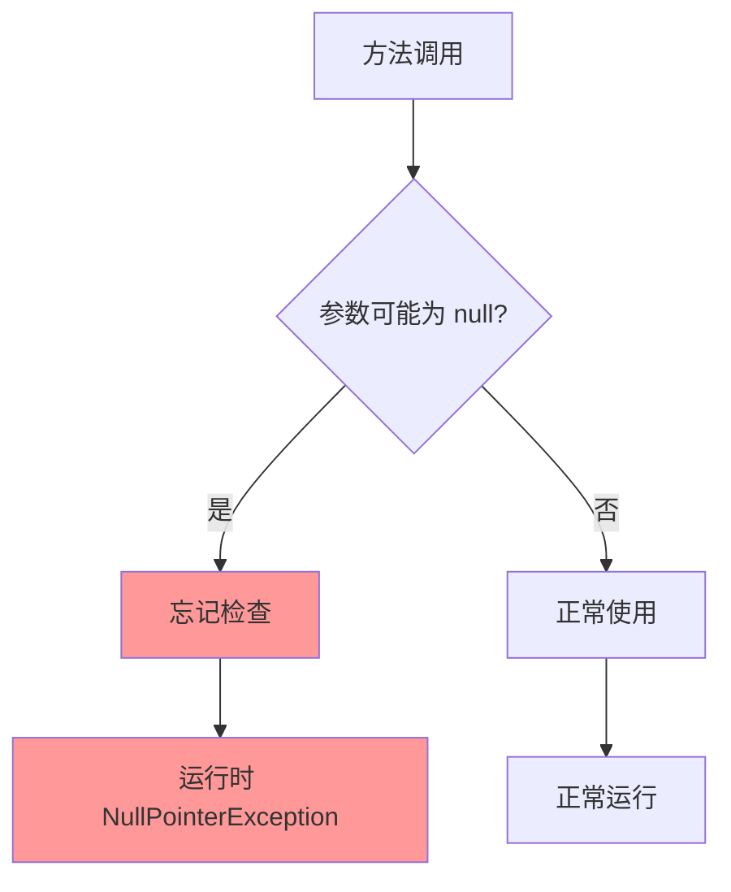
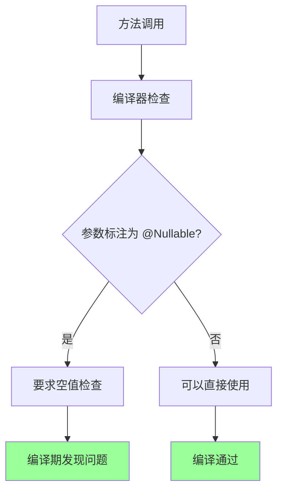
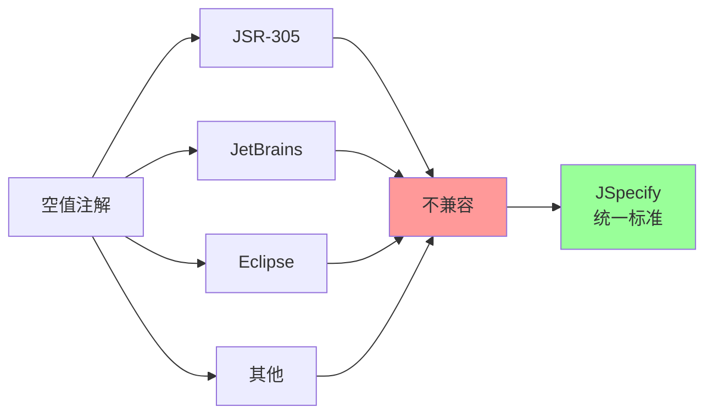

# 13、Spring Boot 4 实战：JSpecify 注解体系与编译期 Null 安全检查
- 来源：https://ddkk.com/springboot/4/13.html
- 分类：Spring Boot 4.0 实战教程
- 分组：教程目录
- 日期：2025-11-25
兄弟们，今儿咱聊聊 Spring Boot 4 的 JSpecify 注解体系和编译期 Null 安全检查。这玩意儿听起来挺技术范儿的，其实就是用注解标记哪些值可能为空，编译器帮你检查，避免空指针异常；鹏磊我最近在重构老代码，发现一堆空指针问题，后来用了 JSpecify，编译期就能发现问题，省了不少调试时间，今儿给你们好好唠唠。

## Null 安全问题

先说说这 Null 安全是咋回事。Java 里，任何对象引用都可能为 `null`，如果你没检查就用了，就会抛出 `NullPointerException`。这玩意儿是 Java 开发中最常见的异常之一，运行时才发现，调试起来贼麻烦。

传统 Java 的问题：



使用 JSpecify 后：



### 为什么需要 JSpecify

之前也有空值注解，比如 JSR-305 的 `@Nullable`、`@NonNull`，还有 JetBrains 的、Eclipse 的，但各家标准不一样，互相不兼容。JSpecify 就是来解决这个问题的，提供一套统一的标准。



## JSpecify 基础

### 核心注解

JSpecify 提供了几个核心注解：

1. **@Nullable**：表示值可能为 `null`
2. **@NonNull**：表示值不能为 `null`（默认行为）
3. **@NullMarked**：标记包或类，默认所有类型都是非空的
4. **@NullUnmarked**：取消 `@NullMarked` 的影响

### 依赖配置

在 `pom.xml` 里添加依赖：

```xml
<?xml version="1.0" encoding="UTF-8"?>
<project xmlns="http://maven.apache.org/POM/4.0.0"
         xmlns:xsi="http://www.w3.org/2001/XMLSchema-instance"
         xsi:schemaLocation="http://maven.apache.org/POM/4.0.0 
         http://maven.apache.org/xsd/maven-4.0.0.xsd">
    <modelVersion>4.0.0</modelVersion>
    <!-- Spring Boot 4 父项目 -->
    <parent>
        <groupId>org.springframework.boot</groupId>
        <artifactId>spring-boot-starter-parent</artifactId>
        <version>4.0.0-RC1</version>  <!-- Spring Boot 4 版本 -->
    </parent>
    <groupId>com.example</groupId>
    <artifactId>jspecify-demo</artifactId>
    <version>1.0.0</version>
    <properties>
        <java.version>21</java.version>  <!-- Java 21 -->
        <project.build.sourceEncoding>UTF-8</project.build.sourceEncoding>
    </properties>
    <dependencies>
        <!-- Spring Boot Web 启动器 -->
        <dependency>
            <groupId>org.springframework.boot</groupId>
            <artifactId>spring-boot-starter-web</artifactId>
        </dependency>
        <!-- JSpecify 注解 -->
        <dependency>
            <groupId>org.jspecify</groupId>
            <artifactId>jspecify</artifactId>
            <version>1.0.0</version>
        </dependency>
    </dependencies>
    <build>
        <plugins>
            <!-- Maven 编译器插件 -->
            <plugin>
                <groupId>org.apache.maven.plugins</groupId>
                <artifactId>maven-compiler-plugin</artifactId>
                <configuration>
                    <source>21</source>
                    <target>21</target>
                    <!-- 启用注解处理 -->
                    <compilerArgs>
                        <arg>-Xlint:null</arg>  <!-- 启用空值检查警告 -->
                    </compilerArgs>
                </configuration>
            </plugin>
        </plugins>
    </build>
</project>
```

## 基础使用

### 简单示例

先看个简单的例子：

```java
package com.example.jspecify;
import org.jspecify.annotations.Nullable;
import org.jspecify.annotations.NullMarked;
/**
 * 用户服务
 * 演示 JSpecify 的基础用法
 */
@NullMarked  // 标记整个类，默认所有类型都是非空的
public class UserService {
    /**
     * 查找用户
     * @param id 用户 ID
     * @return 用户对象，可能为 null
     */
    @Nullable  // 明确标注返回值可能为 null
    public User findUserById(Long id) {
        if (id == null || id <= 0) {
            return null;  // 返回 null
        }
        // 模拟数据库查询
        return new User(id, "User" + id);
    }
    /**
     * 获取用户名称
     * @param user 用户对象，不能为 null
     * @return 用户名称，不能为 null
     */
    public String getUserName(User user) {  // 默认非空，不需要 @NonNull
        return user.getName();  // 可以直接使用，编译器会检查
    }
    /**
     * 处理可能为空的用户
     * @param user 用户对象，可能为 null
     */
    public void processUser(@Nullable User user) {  // 参数可能为 null
        if (user != null) {  // 必须检查
            System.out.println("处理用户: " + user.getName());
        } else {
            System.out.println("用户为空");
        }
    }
}
```

### 包级别标记

可以在包级别使用 `@NullMarked`：

```java
/**
 * 包级别标记
 * 这个包下的所有类默认都是非空的
 */
@NullMarked
package com.example.jspecify.service;
import org.jspecify.annotations.NullMarked;
```

这样整个包下的类都默认是非空的，不需要在每个类上标记。

### 用户实体类

```java
package com.example.jspecify.model;
import org.jspecify.annotations.Nullable;
import org.jspecify.annotations.NullMarked;
/**
 * 用户实体
 * 演示实体类的空值安全
 */
@NullMarked
public class User {
    private Long id;  // ID 不能为 null
    private String name;  // 名称不能为 null
    @Nullable private String email;  // 邮箱可能为 null
    // 构造函数
    public User(Long id, String name) {
        this.id = id;
        this.name = name;
    }
    public User(Long id, String name, @Nullable String email) {
        this.id = id;
        this.name = name;
        this.email = email;
    }
    // Getter 和 Setter
    public Long getId() {
        return id;
    }
    public void setId(Long id) {
        this.id = id;
    }
    public String getName() {
        return name;
    }
    public void setName(String name) {
        this.name = name;
    }
    @Nullable  // Getter 返回可能为 null 的值
    public String getEmail() {
        return email;
    }
    public void setEmail(@Nullable String email) {  // Setter 接受可能为 null 的值
        this.email = email;
    }
}
```

## Spring Boot 4 集成

Spring Boot 4 对 JSpecify 提供了更好的支持。

### 控制器示例

```java
package com.example.jspecify.controller;
import com.example.jspecify.model.User;
import com.example.jspecify.service.UserService;
import org.jspecify.annotations.Nullable;
import org.jspecify.annotations.NullMarked;
import org.springframework.http.ResponseEntity;
import org.springframework.web.bind.annotation.*;
/**
 * 用户控制器
 * 演示 Spring Boot 4 的 JSpecify 集成
 */
@RestController
@RequestMapping("/api/users")
@NullMarked
public class UserController {
    private final UserService userService;
    // 构造函数注入
    public UserController(UserService userService) {
        this.userService = userService;
    }
    /**
     * 根据 ID 获取用户
     * GET /api/users/{id}
     * @param id 用户 ID，可能为 null（如果路径变量解析失败）
     */
    @GetMapping("/{id}")
    public ResponseEntity<User> getUser(@PathVariable @Nullable Long id) {
        if (id == null) {  // 必须检查
            return ResponseEntity.badRequest().build();
        }
        @Nullable User user = userService.findUserById(id);  // 可能为 null
        if (user == null) {  // 必须检查
            return ResponseEntity.notFound().build();
        }
        return ResponseEntity.ok(user);  // user 已经检查过，可以安全使用
    }
    /**
     * 创建用户
     * POST /api/users
     * @param user 用户对象，可能为 null
     */
    @PostMapping
    public ResponseEntity<User> createUser(@RequestBody @Nullable User user) {
        if (user == null) {  // 必须检查
            return ResponseEntity.badRequest().build();
        }
        // 验证用户数据
        if (user.getName() == null || user.getName().isEmpty()) {  // 名称不能为空
            return ResponseEntity.badRequest().build();
        }
        User savedUser = userService.save(user);  // 保存用户
        return ResponseEntity.ok(savedUser);
    }
    /**
     * 更新用户邮箱
     * PUT /api/users/{id}/email
     * @param id 用户 ID
     * @param email 新邮箱，可能为 null
     */
    @PutMapping("/{id}/email")
    public ResponseEntity<User> updateEmail(
            @PathVariable Long id,
            @RequestParam @Nullable String email) {  // 请求参数可能为 null
        @Nullable User user = userService.findUserById(id);
        if (user == null) {
            return ResponseEntity.notFound().build();
        }
        user.setEmail(email);  // email 可能为 null，但 setEmail 接受 @Nullable
        User updatedUser = userService.save(user);
        return ResponseEntity.ok(updatedUser);
    }
}
```

### Service 层示例

```java
package com.example.jspecify.service;
import com.example.jspecify.model.User;
import org.jspecify.annotations.Nullable;
import org.jspecify.annotations.NullMarked;
import org.springframework.stereotype.Service;
import java.util.HashMap;
import java.util.Map;
/**
 * 用户服务
 * 演示服务层的空值安全
 */
@Service
@NullMarked
public class UserService {
    // 内存存储（示例用）
    private final Map<Long, User> users = new HashMap<>();
    /**
     * 查找用户
     * @param id 用户 ID
     * @return 用户对象，可能为 null
     */
    @Nullable
    public User findUserById(Long id) {
        if (id == null) {  // 检查参数
            return null;
        }
        return users.get(id);  // Map.get 可能返回 null
    }
    /**
     * 保存用户
     * @param user 用户对象，不能为 null
     * @return 保存后的用户对象，不能为 null
     */
    public User save(User user) {
        if (user == null) {  // 防御性检查
            throw new IllegalArgumentException("用户不能为 null");
        }
        if (user.getId() == null) {  // ID 不能为 null
            throw new IllegalArgumentException("用户 ID 不能为 null");
        }
        users.put(user.getId(), user);
        return user;
    }
    /**
     * 删除用户
     * @param id 用户 ID
     * @return 是否删除成功
     */
    public boolean deleteById(Long id) {
        if (id == null) {
            return false;
        }
        @Nullable User removed = users.remove(id);  // remove 可能返回 null
        return removed != null;  // 检查是否真的删除了
    }
    /**
     * 更新用户邮箱
     * @param id 用户 ID
     * @param email 新邮箱，可能为 null
     * @return 更新后的用户对象，可能为 null（如果用户不存在）
     */
    @Nullable
    public User updateEmail(Long id, @Nullable String email) {
        @Nullable User user = findUserById(id);
        if (user == null) {
            return null;  // 用户不存在
        }
        user.setEmail(email);  // email 可能为 null
        return save(user);  // 保存并返回
    }
}
```

## 高级用法

### @NullUnmarked 使用

有时候需要临时取消空值检查，可以用 `@NullUnmarked`：

```java
package com.example.jspecify.service;
import org.jspecify.annotations.NullMarked;
import org.jspecify.annotations.NullUnmarked;
import org.jspecify.annotations.Nullable;
/**
 * 遗留代码服务
 * 演示 @NullUnmarked 的用法
 */
@NullMarked  // 类级别标记
public class LegacyService {
    /**
     * 新方法，使用空值安全
     */
    @Nullable
    public String newMethod(@Nullable String input) {
        if (input == null) {
            return null;
        }
        return input.toUpperCase();
    }
    /**
     * 遗留方法，取消空值检查
     * 这个方法可能还没重构，暂时取消检查
     */
    @NullUnmarked  // 取消空值检查
    public String legacyMethod(String input) {  // 不需要 @Nullable
        // 遗留代码，可能有问题，但暂时不检查
        return input.toUpperCase();  // 可能 NPE，但编译器不检查
    }
    /**
     * 部分参数取消检查
     */
    public void mixedMethod(
            String nonNullParam,  // 非空参数
            @NullUnmarked String legacyParam) {  // 取消检查的参数
        // 使用参数
        System.out.println(nonNullParam);  // 编译器检查
        System.out.println(legacyParam);  // 编译器不检查
    }
}
```

### 泛型使用

JSpecify 也支持泛型的空值安全：

```java
package com.example.jspecify.service;
import org.jspecify.annotations.NullMarked;
import org.jspecify.annotations.Nullable;
import java.util.List;
import java.util.Optional;
/**
 * 泛型服务
 * 演示泛型的空值安全
 */
@NullMarked
public class GenericService {
    /**
     * 查找用户列表
     * @return 用户列表，列表本身不能为 null，但元素可能为 null
     */
    public List<@Nullable User> findUsers() {  // 列表非空，元素可能为 null
        return List.of(
            new User(1L, "User1"),
            null,  // 允许 null 元素
            new User(2L, "User2")
        );
    }
    /**
     * 查找非空用户列表
     * @return 用户列表，列表和元素都不能为 null
     */
    public List<User> findNonNullUsers() {  // 列表和元素都非空
        return List.of(
            new User(1L, "User1"),
            new User(2L, "User2")
            // 不能包含 null
        );
    }
    /**
     * 处理可能为空的列表
     * @param users 用户列表，可能为 null
     */
    public void processUsers(@Nullable List<User> users) {
        if (users == null) {  // 必须检查
            return;
        }
        for (User user : users) {  // users 已经检查过，可以安全使用
            if (user != null) {  // 但元素可能为 null（如果列表类型是 List<@Nullable User>）
                System.out.println(user.getName());
            }
        }
    }
    /**
     * Optional 的使用
     * Optional 本身不能为 null，但值可能为 null
     */
    public Optional<User> findUserOptional(Long id) {
        @Nullable User user = findUserById(id);
        return Optional.ofNullable(user);  // 正确处理可能为 null 的值
    }
}
```

### 方法重写

重写方法时，空值注解要兼容：

```java
package com.example.jspecify.service;
import org.jspecify.annotations.NullMarked;
import org.jspecify.annotations.Nullable;
/**
 * 接口定义
 */
@NullMarked
public interface UserRepository {
    /**
     * 查找用户
     * @param id 用户 ID
     * @return 用户对象，可能为 null
     */
    @Nullable
    User findById(Long id);
}
/**
 * 实现类
 * 重写方法时，返回值可以更严格（从 @Nullable 变为非空），但不能更宽松
 */
@NullMarked
public class UserRepositoryImpl implements UserRepository {
    /**
     * 重写方法
     * 可以返回非空（更严格），但不能返回 @Nullable（更宽松）
     */
    @Override
    public User findById(Long id) {  // 不标注 @Nullable，表示非空
        // 实现保证不返回 null
        User user = doFindById(id);
        if (user == null) {
            throw new RuntimeException("用户不存在");  // 抛出异常而不是返回 null
        }
        return user;
    }
    @Nullable
    private User doFindById(Long id) {
        // 内部实现
        return null;
    }
}
```

## 编译期检查配置

### IDE 配置

在 IntelliJ IDEA 里启用空值检查：

1. 打开设置：`File` -> `Settings` -> `Editor` -> `Inspections`
2. 找到 `Java` -> `Probable bugs` -> `Nullability problems`
3. 启用相关检查

### Maven 配置

在 `pom.xml` 里配置编译器参数：

```xml
<build>
    <plugins>
        <plugin>
            <groupId>org.apache.maven.plugins</groupId>
            <artifactId>maven-compiler-plugin</artifactId>
            <configuration>
                <source>21</source>
                <target>21</target>
                <compilerArgs>
                    <!-- 启用空值检查警告 -->
                    <arg>-Xlint:null</arg>
                    <!-- 将所有警告视为错误（可选） -->
                    <!-- <arg>-Werror</arg> -->
                </compilerArgs>
            </configuration>
        </plugin>
    </plugins>
</build>
```

### Gradle 配置

在 `build.gradle` 里配置：

```txt
// Gradle 配置
tasks.named('compileJava') {
    options.compilerArgs += ['-Xlint:null']
    // 可选：将所有警告视为错误
    // options.compilerArgs += ['-Werror']
}
```

## 实际案例

### 案例 1：API 参数验证

```java
@RestController
@RequestMapping("/api/products")
@NullMarked
public class ProductController {
    private final ProductService productService;
    public ProductController(ProductService productService) {
        this.productService = productService;
    }
    /**
     * 创建产品
     * 演示参数验证
     */
    @PostMapping
    public ResponseEntity<Product> createProduct(@RequestBody @Nullable Product product) {
        // 必须检查请求体
        if (product == null) {
            return ResponseEntity.badRequest().build();
        }
        // 验证必填字段
        if (product.getName() == null || product.getName().isEmpty()) {
            return ResponseEntity.badRequest().build();
        }
        // 验证价格
        if (product.getPrice() == null || product.getPrice() <= 0) {
            return ResponseEntity.badRequest().build();
        }
        Product savedProduct = productService.save(product);
        return ResponseEntity.ok(savedProduct);
    }
    /**
     * 搜索产品
     * 演示可选参数
     */
    @GetMapping("/search")
    public ResponseEntity<List<Product>> searchProducts(
            @RequestParam @Nullable String keyword,  // 关键词可能为空
            @RequestParam @Nullable String category) {  // 分类可能为空
        List<Product> products = productService.search(keyword, category);
        return ResponseEntity.ok(products);
    }
}
```

### 案例 2：链式调用安全

```java
@Service
@NullMarked
public class OrderService {
    /**
     * 获取订单详情
     * 演示链式调用的空值安全
     */
    @Nullable
    public OrderDetail getOrderDetail(Long orderId) {
        @Nullable Order order = findOrderById(orderId);
        if (order == null) {  // 必须检查
            return null;
        }
        @Nullable User user = order.getUser();  // 如果 getUser() 返回 @Nullable
        if (user == null) {  // 必须检查
            return null;
        }
        @Nullable Address address = user.getAddress();  // 如果 getAddress() 返回 @Nullable
        if (address == null) {  // 必须检查
            return null;
        }
        // 所有值都检查过，可以安全使用
        return new OrderDetail(order, user, address);
    }
    /**
     * 使用 Optional 简化
     */
    public Optional<OrderDetail> getOrderDetailOptional(Long orderId) {
        return Optional.ofNullable(findOrderById(orderId))
                .map(Order::getUser)
                .map(User::getAddress)
                .map(address -> new OrderDetail(
                    findOrderById(orderId),  // 需要重新查找，或者缓存
                    findOrderById(orderId).getUser(),
                    address
                ));
    }
    @Nullable
    private Order findOrderById(Long orderId) {
        // 实现查找逻辑
        return null;
    }
}
```

## 最佳实践

### 1. 包级别使用 @NullMarked

在包级别使用 `@NullMarked`，整个包默认都是非空的：

```java
@NullMarked
package com.example.myapp.service;
```

### 2. 明确标注 @Nullable

对于可能为 null 的值，明确标注 `@Nullable`：

```java
@Nullable
public User findUser(Long id) {
    // ...
}
```

### 3. 防御性编程

即使标注了非空，也要做防御性检查：

```java
public void processUser(User user) {
    if (user == null) {  // 防御性检查
        throw new IllegalArgumentException("用户不能为 null");
    }
    // 使用 user
}
```

### 4. 逐步迁移

不要一次性把所有代码都加上注解，逐步迁移：

1. 先在新代码中使用
2. 逐步重构老代码
3. 用 `@NullUnmarked` 标记还没重构的代码

### 5. 文档化

在 JavaDoc 里说明空值行为：

```java
/**
 * 查找用户
 * @param id 用户 ID，不能为 null
 * @return 用户对象，可能为 null（如果用户不存在）
 */
@Nullable
public User findUserById(Long id) {
    // ...
}
```

## 常见问题

### 问题 1：编译不通过

**错误信息**：

```plaintext
error: incompatible types: @Nullable String cannot be converted to String
```

**原因**：试图将可能为 null 的值赋给非空变量。

**解决方案**：检查空值或使用 `@Nullable` 标注：

```java
@Nullable String nullableStr = getNullableString();
if (nullableStr != null) {  // 检查后使用
    String nonNullStr = nullableStr;  // 可以赋值
}
```

### 问题 2：第三方库不兼容

**现象**：第三方库没有 JSpecify 注解。

**解决方案**：使用 `@NullUnmarked` 或创建包装类：

```java
@NullUnmarked  // 取消检查
public void useThirdPartyLibrary(ThirdPartyClass obj) {
    // 使用第三方库
}
// 或创建包装类
@NullMarked
public class ThirdPartyWrapper {
    @NullUnmarked
    private ThirdPartyClass delegate;
    @Nullable
    public String safeMethod() {
        @NullUnmarked String result = delegate.unsafeMethod();
        return result;  // 转换
    }
}
```

### 问题 3：性能影响

**问题**：注解会影响性能吗？

**答案**：不会。JSpecify 注解是编译期检查，运行时没有任何开销，只是元数据。

## 与其他注解对比

JSpecify 之前，Java 社区有几种空值注解，各有各的问题。

### JSR-305

JSR-305 是最早的尝试，但一直没有正式发布：

```java
// JSR-305 注解
import javax.annotation.Nullable;
import javax.annotation.Nonnull;
@Nonnull
public String method(@Nullable String param) {
    // ...
}
```

**问题**：

- 没有正式发布
- 不同实现行为不一致
- 工具支持不完善

### JetBrains 注解

JetBrains 在 IntelliJ IDEA 里提供了注解：

```java
// JetBrains 注解
import org.jetbrains.annotations.Nullable;
import org.jetbrains.annotations.NotNull;
@NotNull
public String method(@Nullable String param) {
    // ...
}
```

**问题**：

- 只适用于 IntelliJ IDEA
- 其他 IDE 支持不好
- 不是标准

### Eclipse 注解

Eclipse 也有自己的注解：

```java
// Eclipse 注解
import org.eclipse.jdt.annotation.Nullable;
import org.eclipse.jdt.annotation.NonNull;
@NonNull
public String method(@Nullable String param) {
    // ...
}
```

**问题**：

- 只适用于 Eclipse
- 与其他工具不兼容

### JSpecify 的优势

JSpecify 统一了这些注解：

```java
// JSpecify 注解（统一标准）
import org.jspecify.annotations.Nullable;
import org.jspecify.annotations.NullMarked;
@NullMarked
public class MyClass {
    public String method(@Nullable String param) {
        // ...
    }
}
```

**优势**：

- 统一标准，工具支持一致
- 包级别标记，更灵活
- 社区驱动，持续发展

## 迁移指南

### 从 JSR-305 迁移

如果项目里用了 JSR-305，可以这样迁移：

```java
// 旧代码（JSR-305）
import javax.annotation.Nullable;
import javax.annotation.Nonnull;
@Nonnull
public String method(@Nullable String param) {
    // ...
}
// 新代码（JSpecify）
import org.jspecify.annotations.Nullable;
import org.jspecify.annotations.NullMarked;
@NullMarked
public class MyClass {
    public String method(@Nullable String param) {  // 默认非空，不需要 @Nonnull
        // ...
    }
}
```

**迁移步骤**：

1. 添加 JSpecify 依赖
2. 替换导入语句
3. 使用 `@NullMarked` 标记包或类
4. 移除 `@Nonnull`（默认就是非空）
5. 保留 `@Nullable`

### 从 JetBrains 注解迁移

```java
// 旧代码（JetBrains）
import org.jetbrains.annotations.NotNull;
import org.jetbrains.annotations.Nullable;
@NotNull
public String method(@Nullable String param) {
    // ...
}
// 新代码（JSpecify）
import org.jspecify.annotations.Nullable;
import org.jspecify.annotations.NullMarked;
@NullMarked
public class MyClass {
    public String method(@Nullable String param) {
        // ...
    }
}
```

### 渐进式迁移

不要一次性全改，逐步迁移：

**阶段 1**：新代码使用 JSpecify

```java
// 新代码
@NullMarked
public class NewService {
    @Nullable
    public User findUser(Long id) {
        // ...
    }
}
```

**阶段 2**：标记遗留代码

```java
// 遗留代码，暂时取消检查
@NullUnmarked
public class LegacyService {
    public String oldMethod(String param) {  // 不检查
        // ...
    }
}
```

**阶段 3**：逐步重构

```java
// 重构后的代码
@NullMarked
public class LegacyService {
    public String oldMethod(@Nullable String param) {  // 开始检查
        if (param == null) {
            return "";
        }
        // ...
    }
}
```

## 工具支持

### IntelliJ IDEA

IntelliJ IDEA 2023.1+ 支持 JSpecify：

1. **启用检查**：

- `File` -> `Settings` -> `Editor` -> `Inspections`
- `Java` -> `Probable bugs` -> `Nullability problems`
- 启用 `@Nullable/@NotNull problems`
2. **配置注解**：

- `File` -> `Settings` -> `Editor` -> `Inspections` -> `Nullability`
- 选择 `JSpecify` 作为注解库
3. **快速修复**：

- Alt+Enter 快速添加 `@Nullable` 或空值检查

### Eclipse

Eclipse 通过插件支持 JSpecify：

1. 安装 JSpecify 插件
2. 配置项目使用 JSpecify 注解
3. 启用空值检查

### VS Code

VS Code 通过 Java 扩展支持：

1. 安装 Java Extension Pack
2. 配置使用 JSpecify 注解
3. 启用空值检查

### Maven 插件

可以使用 Maven 插件检查：

```xml
<plugin>
    <groupId>org.apache.maven.plugins</groupId>
    <artifactId>maven-compiler-plugin</artifactId>
    <configuration>
        <compilerArgs>
            <arg>-Xlint:null</arg>
        </compilerArgs>
    </configuration>
</plugin>
```

## 性能考虑

### 运行时开销

JSpecify 注解是编译期检查，运行时没有任何开销：

```java
@NullMarked
public class MyClass {
    @Nullable
    public String method() {
        return null;
    }
}
```

编译后的字节码和没注解的代码一样，注解只是元数据。

### 编译时间

启用空值检查可能会稍微增加编译时间，但影响很小：

- 增量编译：只检查修改的文件
- 并行编译：可以并行检查多个文件
- 缓存：IDE 会缓存检查结果

### 内存占用

注解本身不占用运行时内存，只是类文件的元数据。

## 实际项目案例

### 案例：电商系统

假设有个电商系统，需要处理各种可能为 null 的值。

**订单服务**：

```java
package com.example.ecommerce.service;
import com.example.ecommerce.model.Order;
import com.example.ecommerce.model.OrderItem;
import com.example.ecommerce.model.User;
import org.jspecify.annotations.NullMarked;
import org.jspecify.annotations.Nullable;
import org.springframework.stereotype.Service;
import java.util.List;
/**
 * 订单服务
 * 演示电商系统的空值安全
 */
@Service
@NullMarked
public class OrderService {
    private final OrderRepository orderRepository;
    private final UserService userService;
    private final PaymentService paymentService;
    public OrderService(
            OrderRepository orderRepository,
            UserService userService,
            PaymentService paymentService) {
        this.orderRepository = orderRepository;
        this.userService = userService;
        this.paymentService = paymentService;
    }
    /**
     * 创建订单
     * @param userId 用户 ID
     * @param items 订单项列表，可能为 null
     * @return 创建的订单，可能为 null（如果创建失败）
     */
    @Nullable
    public Order createOrder(Long userId, @Nullable List<OrderItem> items) {
        // 检查用户
        @Nullable User user = userService.findById(userId);
        if (user == null) {
            return null;  // 用户不存在
        }
        // 检查订单项
        if (items == null || items.isEmpty()) {
            return null;  // 订单项为空
        }
        // 验证订单项
        for (OrderItem item : items) {
            if (item == null) {  // 检查每个项
                return null;  // 订单项不能为 null
            }
            if (item.getProductId() == null) {  // 检查产品 ID
                return null;
            }
        }
        // 创建订单
        Order order = new Order(user, items);
        // 处理支付
        @Nullable String paymentId = paymentService.processPayment(order);
        if (paymentId == null) {
            return null;  // 支付失败
        }
        order.setPaymentId(paymentId);
        // 保存订单
        return orderRepository.save(order);
    }
    /**
     * 获取订单详情
     * @param orderId 订单 ID
     * @return 订单详情，可能为 null
     */
    @Nullable
    public OrderDetail getOrderDetail(Long orderId) {
        @Nullable Order order = orderRepository.findById(orderId);
        if (order == null) {
            return null;  // 订单不存在
        }
        @Nullable User user = order.getUser();
        if (user == null) {
            return null;  // 用户信息缺失
        }
        // 构建订单详情
        return new OrderDetail(order, user);
    }
}
```

**订单实体**：

```java
package com.example.ecommerce.model;
import org.jspecify.annotations.NullMarked;
import org.jspecify.annotations.Nullable;
import java.util.List;
/**
 * 订单实体
 */
@NullMarked
public class Order {
    private Long id;
    private User user;  // 用户不能为 null
    private List<OrderItem> items;  // 订单项列表不能为 null
    @Nullable private String paymentId;  // 支付 ID 可能为 null
    @Nullable private String shippingAddress;  // 收货地址可能为 null
    public Order(User user, List<OrderItem> items) {
        if (user == null) {
            throw new IllegalArgumentException("用户不能为 null");
        }
        if (items == null || items.isEmpty()) {
            throw new IllegalArgumentException("订单项不能为空");
        }
        this.user = user;
        this.items = items;
    }
    // Getter 和 Setter
    public Long getId() {
        return id;
    }
    public void setId(Long id) {
        this.id = id;
    }
    public User getUser() {
        return user;
    }
    public List<OrderItem> getItems() {
        return items;
    }
    @Nullable
    public String getPaymentId() {
        return paymentId;
    }
    public void setPaymentId(@Nullable String paymentId) {
        this.paymentId = paymentId;
    }
    @Nullable
    public String getShippingAddress() {
        return shippingAddress;
    }
    public void setShippingAddress(@Nullable String shippingAddress) {
        this.shippingAddress = shippingAddress;
    }
}
```

## 故障排查

### 问题 1：编译错误

**错误信息**：

```plaintext
error: incompatible types: @Nullable String cannot be converted to String
```

**原因**：试图将可能为 null 的值赋给非空变量。

**解决方案**：

```java
// 错误示例
@Nullable String nullableStr = getNullableString();
String nonNullStr = nullableStr;  // 编译错误
// 正确示例 1：检查后使用
@Nullable String nullableStr = getNullableString();
if (nullableStr != null) {
    String nonNullStr = nullableStr;  // 可以赋值
}
// 正确示例 2：使用默认值
@Nullable String nullableStr = getNullableString();
String nonNullStr = nullableStr != null ? nullableStr : "";  // 提供默认值
// 正确示例 3：使用 Optional
Optional<String> optionalStr = Optional.ofNullable(getNullableString());
String nonNullStr = optionalStr.orElse("");  // 提供默认值
```

### 问题 2：第三方库不兼容

**现象**：第三方库没有 JSpecify 注解，编译器报错。

**解决方案**：

```java
// 方案 1：使用 @NullUnmarked
@NullUnmarked
public void useThirdParty(ThirdPartyClass obj) {
    // 取消检查
}
// 方案 2：创建包装类
@NullMarked
public class ThirdPartyWrapper {
    @NullUnmarked
    private ThirdPartyClass delegate;
    @Nullable
    public String safeMethod() {
        @NullUnmarked String result = delegate.unsafeMethod();
        return result;
    }
}
// 方案 3：使用类型转换
@NullUnmarked
private ThirdPartyClass getThirdParty() {
    return new ThirdPartyClass();
}
@Nullable
public String useThirdPartySafe() {
    @NullUnmarked ThirdPartyClass obj = getThirdParty();
    @NullUnmarked String result = obj.method();
    return result;  // 转换
}
```

### 问题 3：IDE 不显示警告

**现象**：IDE 没有显示空值检查警告。

**解决方案**：

1. 检查 IDE 设置，确保启用了空值检查
2. 确认项目使用了 JSpecify 注解
3. 重新导入项目
4. 清理并重新构建项目

## 总结

好了，今儿就聊到这。JSpecify 注解体系让空值安全检查变得简单多了，编译期就能发现问题，不用等到运行时才发现空指针异常。

关键点总结：

- **JSpecify**：统一的空值安全注解标准，解决不同工具不兼容的问题
- **@Nullable**：标记可能为 null 的值，编译器会要求检查
- **@NullMarked**：包级别标记，默认所有类型都是非空的
- **@NullUnmarked**：临时取消检查，用于遗留代码
- **编译期检查**：提前发现问题，运行时无任何开销
- **工具支持**：主流 IDE 和构建工具都支持
- **迁移指南**：可以从其他注解平滑迁移
- **最佳实践**：包级别标记、明确标注、防御性编程、逐步迁移

兄弟们，赶紧去试试吧，有问题随时找我唠！
