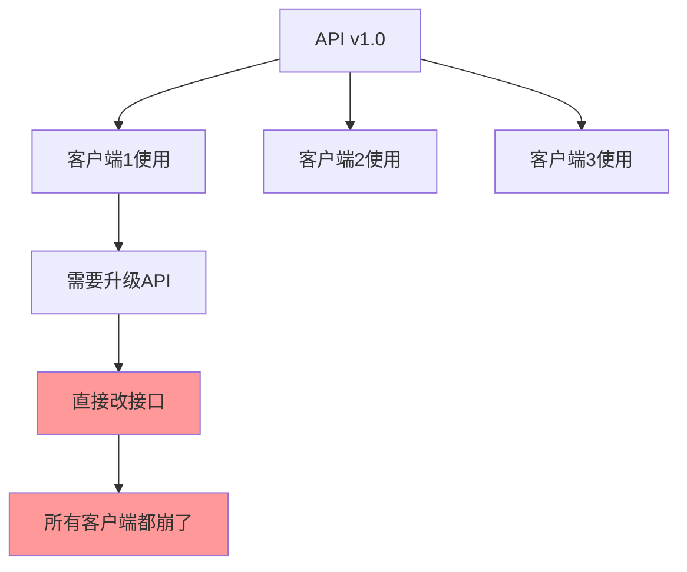
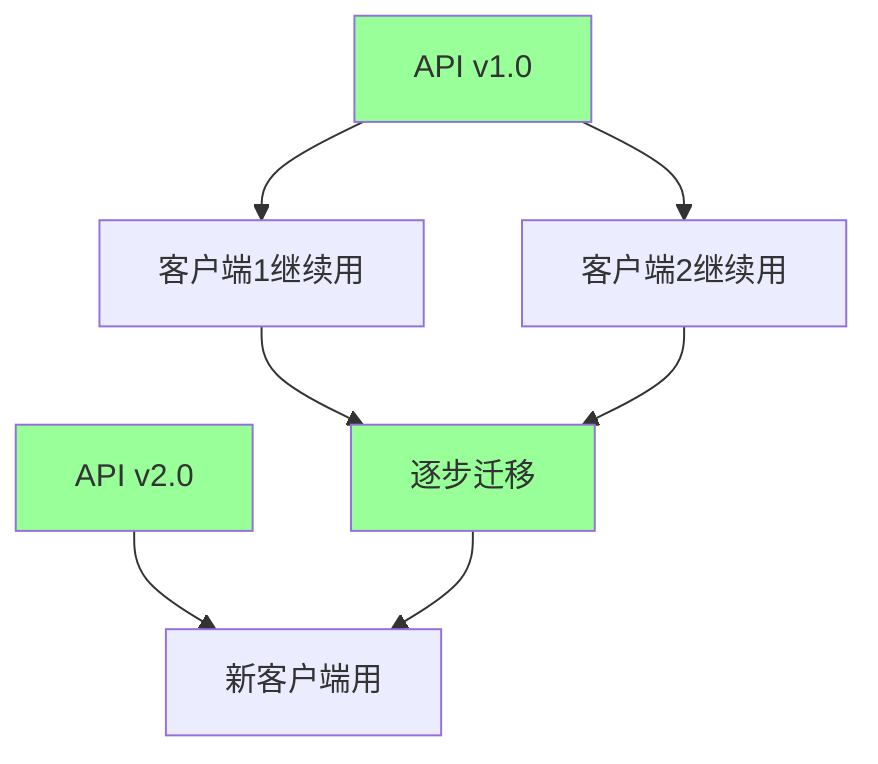
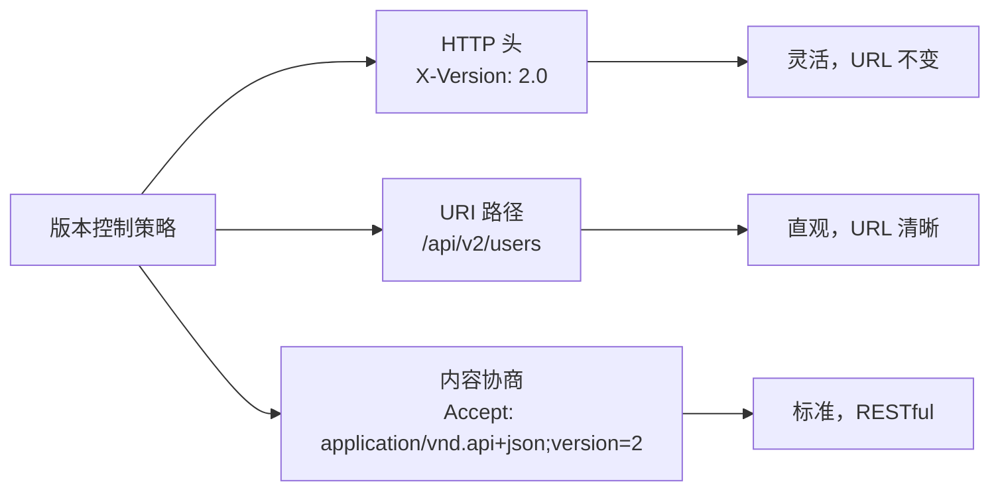

# 14、Spring Boot 4 实战：API 版本控制：多版本路由与优雅降级
- 来源：https://ddkk.com/springboot/4/14.html
- 分类：Spring Boot 4.0 实战教程
- 分组：教程目录
- 日期：2025-11-25
兄弟们，今儿咱聊聊 Spring Boot 4 的 API 版本控制。这玩意儿听起来挺技术范儿的，其实就是管理 API 的多个版本，让新旧版本共存，还能优雅降级；鹏磊我最近在搞 API 升级，发现直接改接口会搞崩老客户端，后来用了版本控制，新旧版本都能用，升级也平滑多了，今儿给你们好好唠唠。

## API 版本控制是个啥

先说说这 API 版本控制是咋回事。API 发布后，客户端都在用，你不能随便改，改了客户端就崩了。但业务在发展，接口总得升级，这时候就需要版本控制，让新旧版本共存，客户端可以慢慢迁移。

没有版本控制的问题：



有版本控制后：



### 版本控制策略

Spring Boot 4 支持几种版本控制策略：

1. **HTTP 头版本控制**：通过请求头指定版本
2. **URI 路径版本控制**：在 URL 路径中包含版本号
3. **内容协商**：通过 Accept 头协商版本



## Spring Boot 4 的版本控制支持

Spring Boot 4 提供了内置的 API 版本控制功能，配置简单，用起来也方便。

### 依赖配置

先看看 `pom.xml` 配置：

```xml
<?xml version="1.0" encoding="UTF-8"?>
<project xmlns="http://maven.apache.org/POM/4.0.0"
         xmlns:xsi="http://www.w3.org/2001/XMLSchema-instance"
         xsi:schemaLocation="http://maven.apache.org/POM/4.0.0 
         http://maven.apache.org/xsd/maven-4.0.0.xsd">
    <modelVersion>4.0.0</modelVersion>
    <!-- Spring Boot 4 父项目 -->
    <parent>
        <groupId>org.springframework.boot</groupId>
        <artifactId>spring-boot-starter-parent</artifactId>
        <version>4.0.0-RC1</version>  <!-- Spring Boot 4 版本 -->
    </parent>
    <groupId>com.example</groupId>
    <artifactId>api-versioning-demo</artifactId>
    <version>1.0.0</version>
    <properties>
        <java.version>21</java.version>  <!-- Java 21 -->
        <project.build.sourceEncoding>UTF-8</project.build.sourceEncoding>
    </properties>
    <dependencies>
        <!-- Spring Boot Web 启动器 -->
        <dependency>
            <groupId>org.springframework.boot</groupId>
            <artifactId>spring-boot-starter-web</artifactId>
        </dependency>
        <!-- Actuator，用于监控 -->
        <dependency>
            <groupId>org.springframework.boot</groupId>
            <artifactId>spring-boot-starter-actuator</artifactId>
        </dependency>
    </dependencies>
</project>
```

### HTTP 头版本控制

通过 HTTP 请求头指定版本，这是最灵活的方式。

**配置**：

```yaml
# application.yml
spring:
  mvc:
    apiversion:
      # 默认版本，如果请求头没指定就用这个
      default: 1.0.0
      # 使用请求头指定版本
      use:
        header: X-Version  # 请求头名称
```

或者用 properties：

```properties
# application.properties
spring.mvc.apiversion.default=1.0.0
spring.mvc.apiversion.use.header=X-Version
```

**控制器示例**：

```java
package com.example.apiversioning.controller;
import org.springframework.http.ResponseEntity;
import org.springframework.web.bind.annotation.*;
import org.springframework.web.bind.annotation.RequestMapping;
/**
 * 用户控制器
 * 演示 HTTP 头版本控制
 */
@RestController
@RequestMapping("/api/users")
public class UserController {
    /**
     * v1.0 版本的接口
     * 通过 @RequestMapping 的 headers 属性指定版本
     */
    @GetMapping(headers = "X-Version=1.0")
    public ResponseEntity<UserV1> getUserV1(@PathVariable Long id) {
        // v1.0 版本的实现，返回简单用户信息
        UserV1 user = new UserV1(id, "User" + id, "user" + id + "@example.com");
        return ResponseEntity.ok(user);
    }
    /**
     * v2.0 版本的接口
     * 返回更详细的用户信息
     */
    @GetMapping(headers = "X-Version=2.0")
    public ResponseEntity<UserV2> getUserV2(@PathVariable Long id) {
        // v2.0 版本的实现，返回详细用户信息
        UserV2 user = new UserV2(
            id,
            "User" + id,
            "user" + id + "@example.com",
            "北京市朝阳区",  // 新增地址字段
            "13800138000"  // 新增电话字段
        );
        return ResponseEntity.ok(user);
    }
    /**
     * 默认版本（v1.0）
     * 如果请求头没指定版本，就用这个
     */
    @GetMapping
    public ResponseEntity<UserV1> getUserDefault(@PathVariable Long id) {
        return getUserV1(id);  // 调用 v1.0 版本
    }
}
```

**请求示例**：

```bash
# v1.0 版本请求
curl -H "X-Version: 1.0" http://localhost:8080/api/users/1
# v2.0 版本请求
curl -H "X-Version: 2.0" http://localhost:8080/api/users/1
# 默认版本请求（不指定请求头）
curl http://localhost:8080/api/users/1
```

### URI 路径版本控制

在 URL 路径中包含版本号，这是最直观的方式。

**控制器示例**：

```java
package com.example.apiversioning.controller;
import org.springframework.http.ResponseEntity;
import org.springframework.web.bind.annotation.*;
/**
 * 用户控制器
 * 演示 URI 路径版本控制
 */
@RestController
public class UserController {
    /**
     * v1.0 版本的接口
     * URL: /api/v1/users/{id}
     */
    @GetMapping("/api/v1/users/{id}")
    public ResponseEntity<UserV1> getUserV1(@PathVariable Long id) {
        UserV1 user = new UserV1(id, "User" + id, "user" + id + "@example.com");
        return ResponseEntity.ok(user);
    }
    /**
     * v2.0 版本的接口
     * URL: /api/v2/users/{id}
     */
    @GetMapping("/api/v2/users/{id}")
    public ResponseEntity<UserV2> getUserV2(@PathVariable Long id) {
        UserV2 user = new UserV2(
            id,
            "User" + id,
            "user" + id + "@example.com",
            "北京市朝阳区",
            "13800138000"
        );
        return ResponseEntity.ok(user);
    }
    /**
     * v3.0 版本的接口
     * URL: /api/v3/users/{id}
     * 使用新的数据结构
     */
    @GetMapping("/api/v3/users/{id}")
    public ResponseEntity<UserV3> getUserV3(@PathVariable Long id) {
        UserV3 user = new UserV3(
            id,
            "User" + id,
            "user" + id + "@example.com",
            new Address("北京市", "朝阳区", "某街道"),
            new Phone("13800138000", "中国")
        );
        return ResponseEntity.ok(user);
    }
}
```

**请求示例**：

```bash
# v1.0 版本
curl http://localhost:8080/api/v1/users/1
# v2.0 版本
curl http://localhost:8080/api/v2/users/1
# v3.0 版本
curl http://localhost:8080/api/v3/users/1
```

### 使用 @RequestMapping 的 produces

通过内容协商指定版本：

```java
@RestController
@RequestMapping("/api/users")
public class UserController {
    /**
     * v1.0 版本
     * 通过 Accept 头指定版本
     */
    @GetMapping(value = "/{id}", produces = "application/vnd.api.v1+json")
    public ResponseEntity<UserV1> getUserV1(@PathVariable Long id) {
        UserV1 user = new UserV1(id, "User" + id, "user" + id + "@example.com");
        return ResponseEntity.ok(user);
    }
    /**
     * v2.0 版本
     */
    @GetMapping(value = "/{id}", produces = "application/vnd.api.v2+json")
    public ResponseEntity<UserV2> getUserV2(@PathVariable Long id) {
        UserV2 user = new UserV2(
            id,
            "User" + id,
            "user" + id + "@example.com",
            "北京市朝阳区",
            "13800138000"
        );
        return ResponseEntity.ok(user);
    }
}
```

**请求示例**：

```bash
# v1.0 版本
curl -H "Accept: application/vnd.api.v1+json" http://localhost:8080/api/users/1
# v2.0 版本
curl -H "Accept: application/vnd.api.v2+json" http://localhost:8080/api/users/1
```

## 多版本路由实现

### 使用 HandlerInterceptor

通过拦截器统一处理版本路由：

```java
package com.example.apiversioning.interceptor;
import jakarta.servlet.http.HttpServletRequest;
import jakarta.servlet.http.HttpServletResponse;
import org.springframework.stereotype.Component;
import org.springframework.web.servlet.HandlerInterceptor;
/**
 * API 版本拦截器
 * 统一处理版本路由
 */
@Component
public class ApiVersionInterceptor implements HandlerInterceptor {
    // 版本请求头名称
    private static final String VERSION_HEADER = "X-Version";
    // 版本属性名称（存到请求属性里）
    private static final String VERSION_ATTRIBUTE = "api.version";
    @Override
    public boolean preHandle(HttpServletRequest request, HttpServletResponse response, Object handler) {
        // 从请求头获取版本
        String version = request.getHeader(VERSION_HEADER);
        // 如果没指定版本，使用默认版本
        if (version == null || version.isEmpty()) {
            version = "1.0";  // 默认版本
        }
        // 把版本存到请求属性里，后续可以用
        request.setAttribute(VERSION_ATTRIBUTE, version);
        return true;  // 继续处理请求
    }
    /**
     * 获取请求的 API 版本
     * 工具方法，其他地方可以用
     */
    public static String getApiVersion(HttpServletRequest request) {
        Object version = request.getAttribute(VERSION_ATTRIBUTE);
        return version != null ? version.toString() : "1.0";
    }
}
```

**注册拦截器**：

```java
package com.example.apiversioning.config;
import com.example.apiversioning.interceptor.ApiVersionInterceptor;
import org.springframework.beans.factory.annotation.Autowired;
import org.springframework.context.annotation.Configuration;
import org.springframework.web.servlet.config.annotation.InterceptorRegistry;
import org.springframework.web.servlet.config.annotation.WebMvcConfigurer;
/**
 * Web 配置
 * 注册拦截器
 */
@Configuration
public class WebConfig implements WebMvcConfigurer {
    @Autowired
    private ApiVersionInterceptor apiVersionInterceptor;
    @Override
    public void addInterceptors(InterceptorRegistry registry) {
        registry.addInterceptor(apiVersionInterceptor)
                .addPathPatterns("/api/**");  // 只拦截 /api/** 路径
    }
}
```

### 使用自定义注解

创建自定义注解，更方便地指定版本：

```java
package com.example.apiversioning.annotation;
import java.lang.annotation.ElementType;
import java.lang.annotation.Retention;
import java.lang.annotation.RetentionPolicy;
import java.lang.annotation.Target;
/**
 * API 版本注解
 * 用来标记接口的版本
 */
@Target({ElementType.METHOD, ElementType.TYPE})  // 可以用在方法或类上
@Retention(RetentionPolicy.RUNTIME)  // 运行时保留
public @interface ApiVersion {
    /**
     * API 版本号
     * 比如 "1.0", "2.0" 等
     */
    String value();
    /**
     * 是否废弃
     * 废弃的版本会返回警告信息
     */
    boolean deprecated() default false;
}
```

**使用注解**：

```java
@RestController
@RequestMapping("/api/users")
public class UserController {
    /**
     * v1.0 版本
     * 使用 @ApiVersion 注解标记
     */
    @ApiVersion("1.0")
    @GetMapping("/{id}")
    public ResponseEntity<UserV1> getUserV1(@PathVariable Long id) {
        UserV1 user = new UserV1(id, "User" + id, "user" + id + "@example.com");
        return ResponseEntity.ok(user);
    }
    /**
     * v2.0 版本
     */
    @ApiVersion("2.0")
    @GetMapping("/{id}")
    public ResponseEntity<UserV2> getUserV2(@PathVariable Long id) {
        UserV2 user = new UserV2(
            id,
            "User" + id,
            "user" + id + "@example.com",
            "北京市朝阳区",
            "13800138000"
        );
        return ResponseEntity.ok(user);
    }
    /**
     * v1.0 版本（已废弃）
     * deprecated = true 表示这个版本已经废弃
     */
    @ApiVersion(value = "1.0", deprecated = true)
    @GetMapping("/old/{id}")
    public ResponseEntity<UserV1> getUserV1Deprecated(@PathVariable Long id) {
        // 返回响应时添加废弃警告
        UserV1 user = new UserV1(id, "User" + id, "user" + id + "@example.com");
        return ResponseEntity.ok()
                .header("X-API-Deprecated", "true")  // 废弃标记
                .header("X-API-Sunset", "2024-12-31")  // 废弃日期
                .body(user);
    }
}
```

## 优雅降级

优雅降级就是当新版本不可用时，自动回退到旧版本。

### 版本解析器

创建版本解析器，处理版本匹配和降级：

```java
package com.example.apiversioning.resolver;
import org.springframework.core.annotation.AnnotationUtils;
import org.springframework.web.servlet.mvc.condition.RequestCondition;
import org.springframework.web.servlet.mvc.method.annotation.RequestMappingHandlerMapping;
import java.lang.reflect.Method;
/**
 * API 版本处理器映射
 * 处理版本路由和降级
 */
public class ApiVersionHandlerMapping extends RequestMappingHandlerMapping {
    @Override
    protected RequestCondition<?> getCustomTypeCondition(Class<?> handlerType) {
        // 检查类上有没有 @ApiVersion 注解
        ApiVersion apiVersion = AnnotationUtils.findAnnotation(handlerType, ApiVersion.class);
        return createCondition(apiVersion);
    }
    @Override
    protected RequestCondition<?> getCustomMethodCondition(Method method) {
        // 检查方法上有没有 @ApiVersion 注解
        ApiVersion apiVersion = AnnotationUtils.findAnnotation(method, ApiVersion.class);
        return createCondition(apiVersion);
    }
    /**
     * 创建版本条件
     */
    private RequestCondition<?> createCondition(ApiVersion apiVersion) {
        if (apiVersion == null) {
            return null;  // 没有版本注解，不限制
        }
        return new ApiVersionRequestCondition(apiVersion.value());
    }
}
```

**版本条件**：

```java
package com.example.apiversioning.resolver;
import jakarta.servlet.http.HttpServletRequest;
import org.springframework.web.servlet.mvc.condition.RequestCondition;
/**
 * API 版本请求条件
 * 判断请求的版本是否匹配
 */
public class ApiVersionRequestCondition implements RequestCondition<ApiVersionRequestCondition> {
    // 支持的版本列表
    private final String[] supportedVersions;
    public ApiVersionRequestCondition(String... versions) {
        this.supportedVersions = versions;
    }
    @Override
    public ApiVersionRequestCondition combine(ApiVersionRequestCondition other) {
        // 合并版本条件
        String[] combined = new String[supportedVersions.length + other.supportedVersions.length];
        System.arraycopy(supportedVersions, 0, combined, 0, supportedVersions.length);
        System.arraycopy(other.supportedVersions, 0, combined, supportedVersions.length, other.supportedVersions.length);
        return new ApiVersionRequestCondition(combined);
    }
    @Override
    public ApiVersionRequestCondition getMatchingCondition(HttpServletRequest request) {
        // 从请求头获取版本
        String requestedVersion = request.getHeader("X-Version");
        if (requestedVersion == null) {
            // 没指定版本，返回第一个支持的版本（默认版本）
            return supportedVersions.length > 0 ? this : null;
        }
        // 检查请求的版本是否支持
        for (String version : supportedVersions) {
            if (versionMatches(requestedVersion, version)) {
                return this;  // 匹配，返回这个条件
            }
        }
        // 不支持，尝试降级
        return findFallbackVersion(requestedVersion);
    }
    /**
     * 检查版本是否匹配
     * 支持主版本号匹配，比如 2.1 匹配 2.0
     */
    private boolean versionMatches(String requested, String supported) {
        if (requested.equals(supported)) {
            return true;  // 完全匹配
        }
        // 主版本号匹配（比如 2.1 可以匹配 2.0）
        String[] requestedParts = requested.split("\\.");
        String[] supportedParts = supported.split("\\.");
        if (requestedParts.length >= 1 && supportedParts.length >= 1) {
            return requestedParts[0].equals(supportedParts[0]);  // 主版本号相同
        }
        return false;
    }
    /**
     * 查找降级版本
     * 如果请求的版本不支持，尝试找兼容的旧版本
     */
    private ApiVersionRequestCondition findFallbackVersion(String requestedVersion) {
        // 解析请求的版本
        String[] parts = requestedVersion.split("\\.");
        if (parts.length < 1) {
            return null;
        }
        int requestedMajor = Integer.parseInt(parts[0]);
        // 找主版本号相同或更小的版本
        for (String version : supportedVersions) {
            String[] versionParts = version.split("\\.");
            if (versionParts.length >= 1) {
                int versionMajor = Integer.parseInt(versionParts[0]);
                if (versionMajor <= requestedMajor) {
                    // 找到兼容版本，返回
                    return new ApiVersionRequestCondition(version);
                }
            }
        }
        return null;  // 没找到兼容版本
    }
    @Override
    public int compareTo(ApiVersionRequestCondition other, HttpServletRequest request) {
        // 比较版本优先级，版本号大的优先
        if (supportedVersions.length == 0 || other.supportedVersions.length == 0) {
            return 0;
        }
        String thisVersion = supportedVersions[0];
        String otherVersion = other.supportedVersions[0];
        return compareVersions(thisVersion, otherVersion);
    }
    /**
     * 比较版本号
     */
    private int compareVersions(String v1, String v2) {
        String[] parts1 = v1.split("\\.");
        String[] parts2 = v2.split("\\.");
        int maxLength = Math.max(parts1.length, parts2.length);
        for (int i = 0; i < maxLength; i++) {
            int part1 = i < parts1.length ? Integer.parseInt(parts1[i]) : 0;
            int part2 = i < parts2.length ? Integer.parseInt(parts2[i]) : 0;
            if (part1 != part2) {
                return Integer.compare(part1, part2);  // 返回比较结果
            }
        }
        return 0;  // 版本相同
    }
}
```

### 降级策略配置

配置降级策略：

```java
package com.example.apiversioning.config;
import org.springframework.context.annotation.Bean;
import org.springframework.context.annotation.Configuration;
import org.springframework.web.servlet.mvc.method.annotation.RequestMappingHandlerMapping;
/**
 * API 版本配置
 * 配置版本处理器映射
 */
@Configuration
public class ApiVersionConfig {
    @Bean
    public RequestMappingHandlerMapping requestMappingHandlerMapping() {
        // 使用自定义的版本处理器映射
        return new ApiVersionHandlerMapping();
    }
}
```

## 实际案例

### 案例 1：用户服务多版本

假设用户服务需要支持多个版本：

**v1.0 用户模型**：

```java
package com.example.apiversioning.model.v1;
/**
 * v1.0 用户模型
 * 简单版本，只有基本信息
 */
public class UserV1 {
    private Long id;
    private String name;
    private String email;
    public UserV1(Long id, String name, String email) {
        this.id = id;
        this.name = name;
        this.email = email;
    }
    // Getter 和 Setter
    public Long getId() {
        return id;
    }
    public void setId(Long id) {
        this.id = id;
    }
    public String getName() {
        return name;
    }
    public void setName(String name) {
        this.name = name;
    }
    public String getEmail() {
        return email;
    }
    public void setEmail(String email) {
        this.email = email;
    }
}
```

**v2.0 用户模型**：

```java
package com.example.apiversioning.model.v2;
/**
 * v2.0 用户模型
 * 增加了地址和电话字段
 */
public class UserV2 {
    private Long id;
    private String name;
    private String email;
    private String address;  // 新增字段
    private String phone;  // 新增字段
    public UserV2(Long id, String name, String email, String address, String phone) {
        this.id = id;
        this.name = name;
        this.email = email;
        this.address = address;
        this.phone = phone;
    }
    // Getter 和 Setter（省略，类似 v1.0）
    // ...
}
```

**控制器**：

```java
@RestController
@RequestMapping("/api/users")
public class UserController {
    private final UserService userService;
    public UserController(UserService userService) {
        this.userService = userService;
    }
    /**
     * v1.0 版本
     * 返回简单用户信息
     */
    @ApiVersion("1.0")
    @GetMapping("/{id}")
    public ResponseEntity<UserV1> getUserV1(@PathVariable Long id) {
        User user = userService.findById(id);  // 从数据库获取
        UserV1 userV1 = new UserV1(
            user.getId(),
            user.getName(),
            user.getEmail()
        );
        return ResponseEntity.ok(userV1);
    }
    /**
     * v2.0 版本
     * 返回详细用户信息
     */
    @ApiVersion("2.0")
    @GetMapping("/{id}")
    public ResponseEntity<UserV2> getUserV2(@PathVariable Long id) {
        User user = userService.findById(id);
        UserV2 userV2 = new UserV2(
            user.getId(),
            user.getName(),
            user.getEmail(),
            user.getAddress(),  // v2.0 新增
            user.getPhone()  // v2.0 新增
        );
        return ResponseEntity.ok(userV2);
    }
}
```

### 案例 2：订单服务版本管理

订单服务需要支持多个版本，并且要优雅降级：

```java
@RestController
@RequestMapping("/api/orders")
public class OrderController {
    /**
     * v1.0 版本
     * 简单订单信息
     */
    @ApiVersion("1.0")
    @GetMapping("/{id}")
    public ResponseEntity<OrderV1> getOrderV1(@PathVariable Long id) {
        Order order = orderService.findById(id);
        OrderV1 orderV1 = convertToV1(order);  // 转换为 v1.0 格式
        return ResponseEntity.ok(orderV1);
    }
    /**
     * v2.0 版本
     * 详细订单信息，包含订单项
     */
    @ApiVersion("2.0")
    @GetMapping("/{id}")
    public ResponseEntity<OrderV2> getOrderV2(@PathVariable Long id) {
        Order order = orderService.findById(id);
        OrderV2 orderV2 = convertToV2(order);  // 转换为 v2.0 格式
        return ResponseEntity.ok(orderV2);
    }
    /**
     * 版本转换工具方法
     */
    private OrderV1 convertToV1(Order order) {
        return new OrderV1(
            order.getId(),
            order.getUserId(),
            order.getTotalAmount()
        );
    }
    private OrderV2 convertToV2(Order order) {
        return new OrderV2(
            order.getId(),
            order.getUserId(),
            order.getTotalAmount(),
            order.getItems(),  // v2.0 新增订单项
            order.getShippingAddress()  // v2.0 新增收货地址
        );
    }
}
```

## 版本废弃策略

### 废弃通知

当某个版本要废弃时，需要提前通知客户端：

```java
@RestController
@RequestMapping("/api/users")
public class UserController {
    /**
     * v1.0 版本（已废弃）
     * 返回废弃警告
     */
    @ApiVersion(value = "1.0", deprecated = true)
    @GetMapping("/{id}")
    public ResponseEntity<UserV1> getUserV1Deprecated(@PathVariable Long id) {
        UserV1 user = getUserV1(id);
        // 返回响应时添加废弃警告头
        return ResponseEntity.ok()
                .header("X-API-Deprecated", "true")  // 废弃标记
                .header("X-API-Sunset", "2024-12-31")  // 废弃日期
                .header("X-API-Migration", "请迁移到 v2.0 版本")  // 迁移提示
                .body(user);
    }
}
```

### 版本生命周期管理

定义版本的生命周期：

```java
package com.example.apiversioning.model;
/**
 * API 版本状态
 */
public enum ApiVersionStatus {
    CURRENT,  // 当前版本，推荐使用
    DEPRECATED,  // 已废弃，但仍可用
    SUNSET  // 已下线，不可用
}
/**
 * API 版本信息
 */
public class ApiVersionInfo {
    private String version;  // 版本号
    private ApiVersionStatus status;  // 状态
    private String sunsetDate;  // 下线日期
    private String migrationGuide;  // 迁移指南
    // 构造函数和 Getter/Setter
    // ...
}
```

## 最佳实践

### 1. 版本号规范

使用语义化版本号（Semantic Versioning）：

- **主版本号**：不兼容的 API 修改
- **次版本号**：向下兼容的功能性新增
- **修订号**：向下兼容的问题修正

例如：`1.0.0`, `1.1.0`, `2.0.0`

### 2. 版本兼容性

- **主版本号不同**：不兼容，需要客户端迁移
- **次版本号不同**：兼容，客户端可以继续使用
- **修订号不同**：兼容，只是 bug 修复

### 3. 版本生命周期

1. **当前版本**：推荐使用，持续维护
2. **废弃版本**：提前通知，给迁移时间
3. **下线版本**：停止服务，不再支持

### 4. 文档化

为每个版本维护文档：

- API 变更说明
- 迁移指南
- 示例代码
- 废弃时间表

### 5. 监控和告警

监控各版本的使用情况：

- 各版本的请求量
- 错误率
- 响应时间
- 废弃版本的告警

## 版本兼容性处理

### 向后兼容

新版本应该尽量向后兼容，减少客户端迁移成本：

```java
@RestController
@RequestMapping("/api/products")
public class ProductController {
    /**
     * v1.0 版本
     * 返回简单产品信息
     */
    @ApiVersion("1.0")
    @GetMapping("/{id}")
    public ResponseEntity<ProductV1> getProductV1(@PathVariable Long id) {
        Product product = productService.findById(id);
        ProductV1 productV1 = new ProductV1(
            product.getId(),
            product.getName(),
            product.getPrice()
        );
        return ResponseEntity.ok(productV1);
    }
    /**
     * v2.0 版本
     * 增加了描述字段，但保持向后兼容
     */
    @ApiVersion("2.0")
    @GetMapping("/{id}")
    public ResponseEntity<ProductV2> getProductV2(@PathVariable Long id) {
        Product product = productService.findById(id);
        ProductV2 productV2 = new ProductV2(
            product.getId(),
            product.getName(),
            product.getPrice(),
            product.getDescription()  // v2.0 新增字段
        );
        return ResponseEntity.ok(productV2);
    }
}
```

### 字段映射

如果字段名变了，需要做映射：

```java
/**
 * 版本转换器
 * 处理不同版本之间的字段映射
 */
@Component
public class ProductVersionConverter {
    /**
     * v1.0 转 v2.0
     */
    public ProductV2 convertV1ToV2(ProductV1 v1) {
        return new ProductV2(
            v1.getId(),
            v1.getName(),
            v1.getPrice(),
            ""  // v2.0 新增字段，v1.0 没有，给默认值
        );
    }
    /**
     * v2.0 转 v1.0
     */
    public ProductV1 convertV2ToV1(ProductV2 v2) {
        return new ProductV1(
            v2.getId(),
            v2.getName(),
            v2.getPrice()
            // 忽略 v2.0 的 description 字段
        );
    }
}
```

## 测试方法

### 单元测试

测试不同版本的接口：

```java
package com.example.apiversioning;
import org.junit.jupiter.api.Test;
import org.springframework.beans.factory.annotation.Autowired;
import org.springframework.boot.test.autoconfigure.web.servlet.WebMvcTest;
import org.springframework.test.web.servlet.MockMvc;
import static org.springframework.test.web.servlet.request.MockMvcRequestBuilders.get;
import static org.springframework.test.web.servlet.result.MockMvcResultMatchers.*;
/**
 * API 版本测试
 */
@WebMvcTest(UserController.class)
class UserControllerTest {
    @Autowired
    private MockMvc mockMvc;
    /**
     * 测试 v1.0 版本
     */
    @Test
    void testGetUserV1() throws Exception {
        mockMvc.perform(get("/api/users/1")
                .header("X-Version", "1.0"))
                .andExpect(status().isOk())
                .andExpect(jsonPath("$.id").value(1))
                .andExpect(jsonPath("$.name").exists())
                .andExpect(jsonPath("$.email").exists())
                .andExpect(jsonPath("$.address").doesNotExist());  // v1.0 没有地址字段
    }
    /**
     * 测试 v2.0 版本
     */
    @Test
    void testGetUserV2() throws Exception {
        mockMvc.perform(get("/api/users/1")
                .header("X-Version", "2.0"))
                .andExpect(status().isOk())
                .andExpect(jsonPath("$.id").value(1))
                .andExpect(jsonPath("$.name").exists())
                .andExpect(jsonPath("$.email").exists())
                .andExpect(jsonPath("$.address").exists())  // v2.0 有地址字段
                .andExpect(jsonPath("$.phone").exists());  // v2.0 有电话字段
    }
    /**
     * 测试默认版本
     */
    @Test
    void testGetUserDefault() throws Exception {
        mockMvc.perform(get("/api/users/1"))  // 不指定版本
                .andExpect(status().isOk())
                .andExpect(jsonPath("$.id").value(1));
    }
    /**
     * 测试版本降级
     */
    @Test
    void testVersionFallback() throws Exception {
        // 请求 v2.1，但只支持 v2.0，应该降级到 v2.0
        mockMvc.perform(get("/api/users/1")
                .header("X-Version", "2.1"))
                .andExpect(status().isOk())
                .andExpect(header().string("X-API-Version", "2.0"));  // 返回实际使用的版本
    }
}
```

### 集成测试

测试完整的版本控制流程：

```java
@SpringBootTest
@AutoConfigureMockMvc
class ApiVersioningIntegrationTest {
    @Autowired
    private MockMvc mockMvc;
    /**
     * 测试多版本共存
     */
    @Test
    void testMultipleVersions() throws Exception {
        // v1.0 请求
        mockMvc.perform(get("/api/users/1")
                .header("X-Version", "1.0"))
                .andExpect(status().isOk());
        // v2.0 请求
        mockMvc.perform(get("/api/users/1")
                .header("X-Version", "2.0"))
                .andExpect(status().isOk());
        // 两个版本都能正常工作
    }
    /**
     * 测试版本废弃警告
     */
    @Test
    void testDeprecatedVersion() throws Exception {
        mockMvc.perform(get("/api/users/old/1")
                .header("X-Version", "1.0"))
                .andExpect(status().isOk())
                .andExpect(header().string("X-API-Deprecated", "true"))
                .andExpect(header().exists("X-API-Sunset"));
    }
}
```

## 监控和日志

### 版本使用统计

记录各版本的使用情况：

```java
package com.example.apiversioning.monitor;
import jakarta.servlet.http.HttpServletRequest;
import jakarta.servlet.http.HttpServletResponse;
import org.springframework.stereotype.Component;
import org.springframework.web.servlet.HandlerInterceptor;
/**
 * API 版本监控拦截器
 * 记录版本使用情况
 */
@Component
public class ApiVersionMonitoringInterceptor implements HandlerInterceptor {
    // 注入指标收集器（假设有 Metrics 服务）
    // private final MetricsService metricsService;
    @Override
    public void afterCompletion(
            HttpServletRequest request,
            HttpServletResponse response,
            Object handler,
            Exception ex) {
        // 获取请求的版本
        String version = request.getHeader("X-Version");
        if (version == null) {
            version = "default";  // 默认版本
        }
        // 记录版本使用情况
        // metricsService.incrementCounter("api.version.usage", "version", version);
        // 记录响应时间
        long startTime = (Long) request.getAttribute("startTime");
        long duration = System.currentTimeMillis() - startTime;
        // metricsService.recordDuration("api.version.duration", duration, "version", version);
        // 记录错误（如果有）
        if (ex != null) {
            // metricsService.incrementCounter("api.version.errors", "version", version);
        }
    }
    @Override
    public boolean preHandle(
            HttpServletRequest request,
            HttpServletResponse response,
            Object handler) {
        // 记录开始时间
        request.setAttribute("startTime", System.currentTimeMillis());
        return true;
    }
}
```

### 日志记录

记录版本相关的日志：

```java
package com.example.apiversioning.logging;
import org.slf4j.Logger;
import org.slf4j.LoggerFactory;
import org.springframework.stereotype.Component;
import org.springframework.web.servlet.HandlerInterceptor;
/**
 * API 版本日志拦截器
 */
@Component
public class ApiVersionLoggingInterceptor implements HandlerInterceptor {
    private static final Logger logger = LoggerFactory.getLogger(ApiVersionLoggingInterceptor.class);
    @Override
    public boolean preHandle(
            HttpServletRequest request,
            HttpServletResponse response,
            Object handler) {
        String version = request.getHeader("X-Version");
        String path = request.getRequestURI();
        // 记录版本使用日志
        logger.info("API version request: version={}, path={}, client={}",
                version != null ? version : "default",
                path,
                request.getRemoteAddr());
        return true;
    }
    @Override
    public void afterCompletion(
            HttpServletRequest request,
            HttpServletResponse response,
            Object handler,
            Exception ex) {
        String version = request.getHeader("X-Version");
        if (ex != null) {
            // 记录错误日志
            logger.error("API version error: version={}, path={}, error={}",
                    version != null ? version : "default",
                    request.getRequestURI(),
                    ex.getMessage(),
                    ex);
        }
    }
}
```

## 与其他方案对比

### Spring Cloud Gateway

如果使用 Spring Cloud Gateway，可以在网关层做版本路由：

```yaml
spring:
  cloud:
    gateway:
      routes:
        - id: api-v1
          uri: http://localhost:8080
          predicates:
            - Header=X-Version, 1.0
          filters:
            - StripPrefix=1
        - id: api-v2
          uri: http://localhost:8080
          predicates:
            - Header=X-Version, 2.0
          filters:
            - StripPrefix=1
```

### Nginx 版本路由

在 Nginx 层做版本路由：

```nginx
# Nginx 配置
location /api/ {
    # 根据请求头路由到不同版本
    if ($http_x_version = "1.0") {
        proxy_pass http://api-v1;
    }
    if ($http_x_version = "2.0") {
        proxy_pass http://api-v2;
    }
    # 默认版本
    proxy_pass http://api-v1;
}
```

### Spring Boot 4 的优势

Spring Boot 4 内置版本控制的优势：

1. **简单配置**：只需要配置，不需要额外组件
2. **统一管理**：版本逻辑在应用内，容易维护
3. **灵活路由**：支持多种版本控制策略
4. **优雅降级**：自动处理版本兼容性

## 故障排查

### 问题 1：版本不匹配

**现象**：请求指定了版本，但返回 404。

**原因**：版本号不匹配或没有对应的处理器。

**解决方案**：

```java
// 检查版本配置
@GetMapping(headers = "X-Version=1.0")  // 确保版本号一致
public ResponseEntity<User> getUser(@PathVariable Long id) {
    // ...
}
// 添加默认处理器
@GetMapping  // 不指定版本，作为默认
public ResponseEntity<User> getUserDefault(@PathVariable Long id) {
    return getUserV1(id);  // 调用默认版本
}
```

### 问题 2：版本降级失败

**现象**：请求的版本不支持，但没有降级到兼容版本。

**原因**：降级逻辑有问题。

**解决方案**：

```java
// 检查降级逻辑
private ApiVersionRequestCondition findFallbackVersion(String requestedVersion) {
    // 确保正确解析版本号
    String[] parts = requestedVersion.split("\\.");
    if (parts.length < 1) {
        return null;
    }
    // 确保正确比较版本
    int requestedMajor = Integer.parseInt(parts[0]);
    // 查找兼容版本
    for (String version : supportedVersions) {
        String[] versionParts = version.split("\\.");
        if (versionParts.length >= 1) {
            int versionMajor = Integer.parseInt(versionParts[0]);
            if (versionMajor <= requestedMajor) {
                return new ApiVersionRequestCondition(version);
            }
        }
    }
    return null;
}
```

### 问题 3：性能问题

**现象**：版本路由导致性能下降。

**原因**：版本匹配逻辑复杂或拦截器处理慢。

**解决方案**：

1. 优化版本匹配算法
2. 缓存版本映射关系
3. 减少拦截器处理逻辑

```java
// 使用缓存优化
private final Map<String, String> versionCache = new ConcurrentHashMap<>();
private String getCachedVersion(String requestedVersion) {
    return versionCache.computeIfAbsent(requestedVersion, this::resolveVersion);
}
```

## 实际项目案例

### 案例：电商 API 版本管理

假设有个电商系统，需要管理多个 API 版本：

**版本规划**：

- **v1.0**：基础功能，商品、订单、用户
- **v2.0**：增加购物车、优惠券
- **v3.0**：重构订单流程，增加支付

**实现**：

```java
@RestController
public class EcommerceController {
    /**
     * 商品接口 - v1.0
     */
    @ApiVersion("1.0")
    @GetMapping("/api/v1/products/{id}")
    public ResponseEntity<ProductV1> getProductV1(@PathVariable Long id) {
        // v1.0 实现
        return ResponseEntity.ok(productService.getProductV1(id));
    }
    /**
     * 商品接口 - v2.0
     * 增加了库存和评价信息
     */
    @ApiVersion("2.0")
    @GetMapping("/api/v2/products/{id}")
    public ResponseEntity<ProductV2> getProductV2(@PathVariable Long id) {
        // v2.0 实现
        return ResponseEntity.ok(productService.getProductV2(id));
    }
    /**
     * 订单接口 - v1.0
     */
    @ApiVersion("1.0")
    @PostMapping("/api/v1/orders")
    public ResponseEntity<OrderV1> createOrderV1(@RequestBody OrderRequestV1 request) {
        // v1.0 实现
        return ResponseEntity.ok(orderService.createOrderV1(request));
    }
    /**
     * 订单接口 - v3.0
     * 重构了订单流程
     */
    @ApiVersion("3.0")
    @PostMapping("/api/v3/orders")
    public ResponseEntity<OrderV3> createOrderV3(@RequestBody OrderRequestV3 request) {
        // v3.0 实现
        return ResponseEntity.ok(orderService.createOrderV3(request));
    }
}
```

**版本迁移计划**：

1. **阶段 1**：发布 v2.0，v1.0 和 v2.0 共存
2. **阶段 2**：通知客户端迁移到 v2.0
3. **阶段 3**：v1.0 标记为废弃，给 3 个月迁移时间
4. **阶段 4**：v1.0 下线，只保留 v2.0 和 v3.0

## 总结

好了，今儿就聊到这。Spring Boot 4 的 API 版本控制功能，让多版本管理变得简单多了。不用再担心升级会搞崩老客户端，新旧版本可以共存，还能优雅降级。

关键点总结：

- **版本控制策略**：HTTP 头、URI 路径、内容协商，灵活选择
- **多版本路由**：通过拦截器或注解实现，代码清晰
- **优雅降级**：自动回退到兼容的旧版本，提高可用性
- **版本废弃**：提前通知，给迁移时间，平滑过渡
- **测试方法**：单元测试和集成测试，确保版本正常工作
- **监控日志**：记录版本使用情况，便于分析和优化
- **最佳实践**：语义化版本号、版本兼容性、生命周期管理

兄弟们，赶紧去试试吧，有问题随时找我唠！
