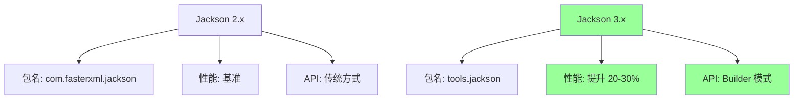
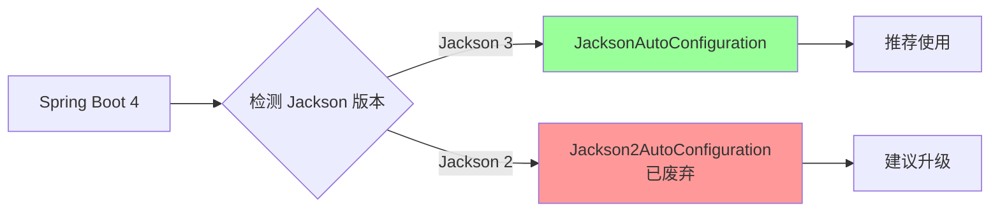
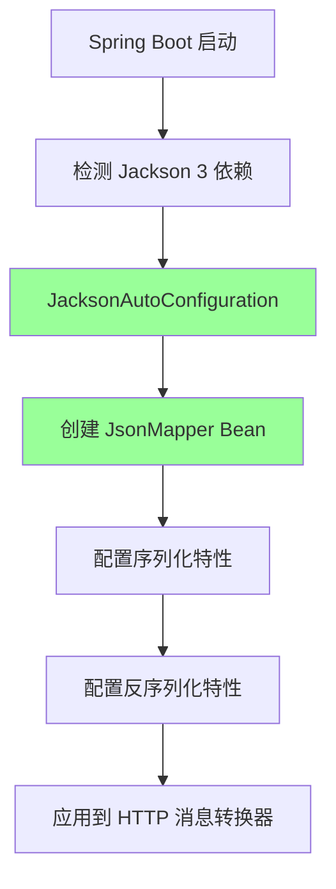

# 15、Spring Boot 4 实战：Jackson 3 全面支持与序列化性能优化
- 来源：https://ddkk.com/springboot/4/15.html
- 分类：Spring Boot 4.0 实战教程
- 分组：教程目录
- 日期：2025-11-25
兄弟们，今儿咱聊聊 Spring Boot 4 对 Jackson 3 的全面支持，还有序列化性能优化那些事儿。Jackson 3 是 Jackson 的大版本升级，性能提升了不少，API 也有变化；鹏磊我最近在升级项目，发现 Jackson 3 的序列化速度比 2.x 快了不少，内存占用也降了，今儿给你们好好唠唠怎么用、怎么优化。

## Jackson 3 是啥

先说说 Jackson 3 是咋回事。Jackson 是 Java 里最常用的 JSON 处理库，Spring Boot 默认就用它来处理 JSON；Jackson 3 是 2024 年发布的大版本，包名从 `com.fasterxml.jackson` 改成了 `tools.jackson`，性能提升明显，API 也更现代化了。

### Jackson 3 的主要变化



主要变化：

1. **包名变更**：`com.fasterxml.jackson` → `tools.jackson`
2. **性能提升**：序列化速度提升 20-30%，内存占用降低
3. **API 现代化**：推荐使用 Builder 模式配置
4. **向后兼容**：Spring Boot 4 同时支持 Jackson 2 和 3

### Spring Boot 4 的 Jackson 支持

Spring Boot 4 默认支持 Jackson 3，但为了兼容性，也保留了 Jackson 2 的支持；如果你用的是 Jackson 2，会自动配置 `Jackson2AutoConfiguration`，但会被标记为废弃，建议升级到 Jackson 3。



## Jackson 3 依赖配置

先看看怎么配置 Jackson 3 的依赖。

### Maven 配置

```xml
<?xml version="1.0" encoding="UTF-8"?>
<project xmlns="http://maven.apache.org/POM/4.0.0"
         xmlns:xsi="http://www.w3.org/2001/XMLSchema-instance"
         xsi:schemaLocation="http://maven.apache.org/POM/4.0.0 
         http://maven.apache.org/xsd/maven-4.0.0.xsd">
    <modelVersion>4.0.0</modelVersion>
    <!-- Spring Boot 4 父项目 -->
    <parent>
        <groupId>org.springframework.boot</groupId>
        <artifactId>spring-boot-starter-parent</artifactId>
        <version>4.0.0-RC1</version>  <!-- Spring Boot 4 版本 -->
    </parent>
    <groupId>com.example</groupId>
    <artifactId>jackson3-demo</artifactId>
    <version>1.0.0</version>
    <properties>
        <java.version>21</java.version>  <!-- Java 21 -->
        <project.build.sourceEncoding>UTF-8</project.build.sourceEncoding>
    </properties>
    <dependencies>
        <!-- Spring Boot Web 启动器，默认包含 Jackson 3 -->
        <dependency>
            <groupId>org.springframework.boot</groupId>
            <artifactId>spring-boot-starter-web</artifactId>
        </dependency>
        <!-- 如果需要显式指定 Jackson 3 -->
        <dependency>
            <groupId>tools.jackson.core</groupId>
            <artifactId>jackson-core</artifactId>
        </dependency>
        <dependency>
            <groupId>tools.jackson.databind</groupId>
            <artifactId>jackson-databind</artifactId>
        </dependency>
        <!-- Jackson 3 的 JSON 模块 -->
        <dependency>
            <groupId>tools.jackson.databind</groupId>
            <artifactId>jackson-databind-json</artifactId>
        </dependency>
        <!-- 如果需要 XML 支持 -->
        <dependency>
            <groupId>tools.jackson.dataformat</groupId>
            <artifactId>jackson-dataformat-xml</artifactId>
        </dependency>
        <!-- 如果需要 YAML 支持 -->
        <dependency>
            <groupId>tools.jackson.dataformat</groupId>
            <artifactId>jackson-dataformat-yaml</artifactId>
        </dependency>
        <!-- Spring Boot 测试启动器 -->
        <dependency>
            <groupId>org.springframework.boot</groupId>
            <artifactId>spring-boot-starter-test</artifactId>
            <scope>test</scope>
        </dependency>
    </dependencies>
    <build>
        <plugins>
            <!-- Spring Boot Maven 插件 -->
            <plugin>
                <groupId>org.springframework.boot</groupId>
                <artifactId>spring-boot-maven-plugin</artifactId>
            </plugin>
        </plugins>
    </build>
</project>
```

### Gradle 配置

```txt
// Gradle 配置
plugins {
    id 'java'
    id 'org.springframework.boot' version '4.0.0-RC1'
    id 'io.spring.dependency-management' version '1.1.0'
}
group = 'com.example'
version = '1.0.0'
sourceCompatibility = '21'
repositories {
    mavenCentral()
}
dependencies {
    // Spring Boot Web 启动器，默认包含 Jackson 3
    implementation 'org.springframework.boot:spring-boot-starter-web'
    // 显式指定 Jackson 3（可选）
    implementation 'tools.jackson.core:jackson-core'
    implementation 'tools.jackson.databind:jackson-databind'
    implementation 'tools.jackson.databind:jackson-databind-json'
    // XML 和 YAML 支持（可选）
    implementation 'tools.jackson.dataformat:jackson-dataformat-xml'
    implementation 'tools.jackson.dataformat:jackson-dataformat-yaml'
    // 测试依赖
    testImplementation 'org.springframework.boot:spring-boot-starter-test'
}
tasks.named('test') {
    useJUnitPlatform()
}
```

## Jackson 3 基础使用

看看 Jackson 3 的基础用法，和 2.x 有啥区别。

### 创建 JsonMapper

Jackson 3 推荐使用 `JsonMapper` 而不是 `ObjectMapper`，虽然 `ObjectMapper` 还能用，但 `JsonMapper` 更明确表示是处理 JSON 的。

```java
package com.example.jackson3;
import tools.jackson.databind.json.JsonMapper;  // Jackson 3 的新包名
import tools.jackson.databind.json.JsonMapper.Builder;
import tools.jackson.databind.SerializationFeature;
import tools.jackson.databind.DeserializationFeature;
import tools.jackson.annotation.JsonInclude;
import org.springframework.context.annotation.Bean;
import org.springframework.context.annotation.Configuration;
/**
 * Jackson 3 配置类
 * 演示如何创建和配置 JsonMapper
 */
@Configuration
public class Jackson3Config {
    /**
     * 创建 JsonMapper Bean
     * 使用 Builder 模式配置，这是 Jackson 3 推荐的方式
     */
    @Bean
    public JsonMapper jsonMapper() {
        // 使用 Builder 模式创建 JsonMapper
        // 这种方式比直接 new 更灵活，配置也更清晰
        return JsonMapper.builder()
                // 序列化配置：美化输出（开发环境用，生产环境建议关闭）
                .enable(SerializationFeature.INDENT_OUTPUT)
                // 序列化配置：日期不使用时间戳，而是 ISO-8601 格式
                .disable(SerializationFeature.WRITE_DATES_AS_TIMESTAMPS)
                // 序列化配置：枚举使用 toString() 的值
                .enable(SerializationFeature.WRITE_ENUMS_USING_TO_STRING)
                // 序列化配置：允许空对象（不抛异常）
                .disable(SerializationFeature.FAIL_ON_EMPTY_BEANS)
                // 反序列化配置：忽略未知属性（不抛异常）
                .disable(DeserializationFeature.FAIL_ON_UNKNOWN_PROPERTIES)
                // 反序列化配置：允许单个值作为数组
                .enable(DeserializationFeature.ACCEPT_SINGLE_VALUE_AS_ARRAY)
                // 反序列化配置：允许 null 值赋给基本类型（不抛异常）
                .disable(DeserializationFeature.FAIL_ON_NULL_FOR_PRIMITIVES)
                // 包含策略：只序列化非 null 的值
                .changeDefaultPropertyInclusion(incl -> 
                    incl.withValueInclusion(JsonInclude.Include.NON_NULL))
                .build();  // 构建 JsonMapper 实例
    }
}
```

### 序列化和反序列化

看看怎么用 JsonMapper 序列化和反序列化对象。

```java
package com.example.jackson3;
import tools.jackson.databind.json.JsonMapper;  // Jackson 3 的包名
import tools.jackson.core.type.TypeReference;  // 用于泛型类型
import tools.jackson.databind.SerializationFeature;
import org.springframework.beans.factory.annotation.Autowired;
import org.springframework.stereotype.Service;
import java.util.List;
import java.util.Map;
/**
 * 用户服务类
 * 演示 Jackson 3 的序列化和反序列化
 */
@Service
public class UserService {
    // 注入 JsonMapper
    @Autowired
    private JsonMapper jsonMapper;
    /**
     * 序列化对象为 JSON 字符串
     * 
     * @param user 要序列化的用户对象
     * @return JSON 字符串
     */
    public String serializeUser(User user) {
        try {
            // 使用 writeValueAsString 方法序列化
            // 这个方法会把对象转换成 JSON 字符串
            return jsonMapper.writeValueAsString(user);
        } catch (Exception e) {
            // 序列化失败时抛出运行时异常
            throw new RuntimeException("序列化用户失败", e);
        }
    }
    /**
     * 反序列化 JSON 字符串为对象
     * 
     * @param json JSON 字符串
     * @return 用户对象
     */
    public User deserializeUser(String json) {
        try {
            // 使用 readValue 方法反序列化
            // 第一个参数是 JSON 字符串，第二个参数是目标类型
            return jsonMapper.readValue(json, User.class);
        } catch (Exception e) {
            // 反序列化失败时抛出运行时异常
            throw new RuntimeException("反序列化用户失败", e);
        }
    }
    /**
     * 序列化列表为 JSON 字符串
     * 
     * @param users 用户列表
     * @return JSON 字符串
     */
    public String serializeUserList(List<User> users) {
        try {
            // 直接序列化列表，Jackson 会自动处理
            return jsonMapper.writeValueAsString(users);
        } catch (Exception e) {
            throw new RuntimeException("序列化用户列表失败", e);
        }
    }
    /**
     * 反序列化 JSON 字符串为列表
     * 需要使用 TypeReference 来处理泛型类型
     * 
     * @param json JSON 字符串
     * @return 用户列表
     */
    public List<User> deserializeUserList(String json) {
        try {
            // 使用 TypeReference 来指定泛型类型
            // 这样可以正确反序列化 List<User>
            return jsonMapper.readValue(json, new TypeReference<List<User>>() {});
        } catch (Exception e) {
            throw new RuntimeException("反序列化用户列表失败", e);
        }
    }
    /**
     * 序列化为 Map
     * 有时候需要把对象转成 Map 来处理
     * 
     * @param user 用户对象
     * @return Map 对象
     */
    public Map<String, Object> serializeToMap(User user) {
        try {
            // 先序列化成 JSON 字符串
            String json = jsonMapper.writeValueAsString(user);
            // 再反序列化成 Map
            // 这样可以动态访问对象的属性
            return jsonMapper.readValue(json, new TypeReference<Map<String, Object>>() {});
        } catch (Exception e) {
            throw new RuntimeException("序列化为 Map 失败", e);
        }
    }
    /**
     * 美化输出 JSON
     * 开发调试时很有用
     * 
     * @param user 用户对象
     * @return 美化后的 JSON 字符串
     */
    public String prettyPrint(User user) {
        try {
            // 使用 writerWithDefaultPrettyPrinter 来美化输出
            // 这个方法会自动格式化 JSON，添加缩进和换行
            return jsonMapper.writerWithDefaultPrettyPrinter()
                    .writeValueAsString(user);
        } catch (Exception e) {
            throw new RuntimeException("美化输出失败", e);
        }
    }
}
/**
 * 用户实体类
 * 演示基本的 POJO 类
 */
class User {
    private Long id;           // 用户 ID
    private String username;   // 用户名
    private String email;      // 邮箱
    private Integer age;       // 年龄
    // 无参构造函数，Jackson 反序列化需要
    public User() {
    }
    // 全参构造函数
    public User(Long id, String username, String email, Integer age) {
        this.id = id;
        this.username = username;
        this.email = email;
        this.age = age;
    }
    // Getter 和 Setter 方法
    // Jackson 序列化和反序列化主要依赖这些方法
    public Long getId() {
        return id;
    }
    public void setId(Long id) {
        this.id = id;
    }
    public String getUsername() {
        return username;
    }
    public void setUsername(String username) {
        this.username = username;
    }
    public String getEmail() {
        return email;
    }
    public void setEmail(String email) {
        this.email = email;
    }
    public Integer getAge() {
        return age;
    }
    public void setAge(Integer age) {
        this.age = age;
    }
}
```

## Spring Boot 4 自动配置

Spring Boot 4 会自动配置 Jackson 3，你只需要添加依赖就行，不需要手动配置。

### 自动配置原理



### 配置文件方式

可以通过 `application.yml` 或 `application.properties` 来配置 Jackson。

```yaml
# application.yml
spring:
  jackson:
    # 日期格式配置
    date-format: yyyy-MM-dd HH:mm:ss  # 自定义日期格式
    time-zone: Asia/Shanghai          # 时区设置
    # 序列化配置
    serialization:
      indent-output: false            # 是否美化输出（生产环境建议 false）
      write-dates-as-timestamps: false # 日期是否使用时间戳
      write-enums-using-to-string: true # 枚举使用 toString
      fail-on-empty-beans: false      # 空对象是否抛异常
    # 反序列化配置
    deserialization:
      fail-on-unknown-properties: false # 未知属性是否抛异常
      accept-single-value-as-array: true # 单个值是否作为数组
      fail-on-null-for-primitives: false # null 赋给基本类型是否抛异常
    # 属性包含策略
    default-property-inclusion: non_null  # 只包含非 null 值
    # 属性命名策略
    property-naming-strategy: SNAKE_CASE  # 使用下划线命名（可选）
```

### 自定义配置类

如果需要更复杂的配置，可以自定义配置类。

```java
package com.example.jackson3;
import tools.jackson.databind.json.JsonMapper;
import tools.jackson.databind.json.JsonMapper.Builder;
import tools.jackson.databind.SerializationFeature;
import tools.jackson.databind.DeserializationFeature;
import tools.jackson.annotation.JsonInclude;
import tools.jackson.databind.PropertyNamingStrategies;
import tools.jackson.datatype.jsr310.JavaTimeModule;  // Java 8 时间模块
import org.springframework.context.annotation.Bean;
import org.springframework.context.annotation.Configuration;
import org.springframework.context.annotation.Primary;
import org.springframework.http.converter.json.Jackson2ObjectMapperBuilder;
import java.time.ZoneId;
/**
 * Jackson 3 自定义配置
 * 演示如何自定义 JsonMapper 的配置
 */
@Configuration
public class CustomJacksonConfig {
    /**
     * 自定义 JsonMapper
     * 使用 @Primary 确保这个 Bean 优先被使用
     */
    @Bean
    @Primary
    public JsonMapper customJsonMapper() {
        return JsonMapper.builder()
                // 序列化配置
                .enable(SerializationFeature.INDENT_OUTPUT)  // 美化输出
                .disable(SerializationFeature.WRITE_DATES_AS_TIMESTAMPS)  // 日期不用时间戳
                .enable(SerializationFeature.WRITE_ENUMS_USING_TO_STRING)  // 枚举用 toString
                .disable(SerializationFeature.FAIL_ON_EMPTY_BEANS)  // 允许空对象
                // 反序列化配置
                .disable(DeserializationFeature.FAIL_ON_UNKNOWN_PROPERTIES)  // 忽略未知属性
                .enable(DeserializationFeature.ACCEPT_SINGLE_VALUE_AS_ARRAY)  // 单个值作为数组
                .disable(DeserializationFeature.FAIL_ON_NULL_FOR_PRIMITIVES)  // null 不抛异常
                // 包含策略：只包含非 null 和非空的值
                .changeDefaultPropertyInclusion(incl -> 
                    incl.withValueInclusion(JsonInclude.Include.NON_EMPTY))
                // 属性命名策略：使用下划线命名（可选）
                // .propertyNamingStrategy(PropertyNamingStrategies.SNAKE_CASE)
                // 注册 Java 8 时间模块
                // 这样 LocalDateTime、LocalDate 等类型才能正确序列化
                .addModule(new JavaTimeModule())
                .build();
    }
    /**
     * 或者使用 Jackson2ObjectMapperBuilder（兼容方式）
     * Spring Boot 会自动检测这个 Builder
     */
    @Bean
    public Jackson2ObjectMapperBuilder jackson2ObjectMapperBuilder() {
        Jackson2ObjectMapperBuilder builder = new Jackson2ObjectMapperBuilder();
        // 配置序列化特性
        builder.featuresToEnable(SerializationFeature.INDENT_OUTPUT);
        builder.featuresToDisable(SerializationFeature.WRITE_DATES_AS_TIMESTAMPS);
        // 配置反序列化特性
        builder.featuresToDisable(DeserializationFeature.FAIL_ON_UNKNOWN_PROPERTIES);
        // 配置包含策略
        builder.serializationInclusion(JsonInclude.Include.NON_NULL);
        // 配置时区
        builder.timeZone(ZoneId.of("Asia/Shanghai"));
        return builder;
    }
}
```

## 性能优化实践

Jackson 3 的性能已经比 2.x 好了不少，但还可以进一步优化。

### 1. 重用 JsonMapper 实例

JsonMapper 是线程安全的，应该重用同一个实例，不要每次都创建新的。

```java
package com.example.jackson3;
import tools.jackson.databind.json.JsonMapper;
import org.springframework.stereotype.Component;
/**
 * JsonMapper 单例管理
 * 确保整个应用只创建一个 JsonMapper 实例
 */
@Component
public class JsonMapperManager {
    // 使用 volatile 确保多线程可见性
    private static volatile JsonMapper instance;
    /**
     * 获取 JsonMapper 单例
     * 使用双重检查锁定模式
     */
    public static JsonMapper getInstance() {
        if (instance == null) {
            synchronized (JsonMapperManager.class) {
                if (instance == null) {
                    // 创建 JsonMapper 实例
                    // 只创建一次，后续都重用这个实例
                    instance = JsonMapper.builder()
                            .disable(SerializationFeature.WRITE_DATES_AS_TIMESTAMPS)
                            .disable(DeserializationFeature.FAIL_ON_UNKNOWN_PROPERTIES)
                            .build();
                }
            }
        }
        return instance;
    }
}
```

### 2. 使用流式 API 处理大文件

处理大 JSON 文件时，使用流式 API 可以降低内存占用。

```java
package com.example.jackson3;
import tools.jackson.core.JsonFactory;
import tools.jackson.core.JsonParser;
import tools.jackson.core.JsonToken;
import tools.jackson.databind.json.JsonMapper;
import org.springframework.stereotype.Service;
import java.io.File;
import java.io.FileInputStream;
import java.io.IOException;
import java.util.ArrayList;
import java.util.List;
/**
 * 流式 JSON 处理服务
 * 演示如何使用流式 API 处理大文件
 */
@Service
public class StreamingJsonService {
    private final JsonMapper jsonMapper;
    private final JsonFactory jsonFactory;
    public StreamingJsonService(JsonMapper jsonMapper) {
        this.jsonMapper = jsonMapper;
        // JsonFactory 用于创建 JsonParser
        this.jsonFactory = jsonMapper.getFactory();
    }
    /**
     * 流式读取大 JSON 文件
     * 这种方式内存占用小，适合处理大文件
     * 
     * @param file JSON 文件
     * @return 用户列表
     */
    public List<User> readLargeJsonFile(File file) throws IOException {
        List<User> users = new ArrayList<>();
        // 使用 JsonParser 流式读取
        // 这种方式不会一次性把整个文件加载到内存
        try (JsonParser parser = jsonFactory.createParser(new FileInputStream(file))) {
            // 检查第一个 token 是否是数组开始
            if (parser.nextToken() != JsonToken.START_ARRAY) {
                throw new IllegalStateException("期望数组开始");
            }
            // 遍历数组中的每个元素
            while (parser.nextToken() == JsonToken.START_OBJECT) {
                // 读取单个对象
                // 这种方式每次只解析一个对象，内存占用小
                User user = jsonMapper.readValue(parser, User.class);
                users.add(user);
            }
        }
        return users;
    }
    /**
     * 流式写入大 JSON 文件
     * 使用 JsonGenerator 流式写入，内存占用小
     * 
     * @param users 用户列表
     * @param file 输出文件
     */
    public void writeLargeJsonFile(List<User> users, File file) throws IOException {
        // 使用 JsonGenerator 流式写入
        try (var generator = jsonFactory.createGenerator(file, 
                tools.jackson.core.JsonEncoding.UTF8)) {
            // 开始数组
            generator.writeStartArray();
            // 逐个写入对象
            for (User user : users) {
                // 使用 writeObject 方法写入对象
                // 这种方式比先序列化成字符串再写入更高效
                jsonMapper.writeValue(generator, user);
            }
            // 结束数组
            generator.writeEndArray();
        }
    }
}
```

### 3. 缓存序列化器

对于频繁序列化的类型，可以缓存序列化器来提高性能。

```java
package com.example.jackson3;
import tools.jackson.databind.json.JsonMapper;
import tools.jackson.databind.JsonSerializer;
import tools.jackson.databind.SerializerProvider;
import tools.jackson.core.JsonGenerator;
import org.springframework.stereotype.Service;
import java.io.IOException;
import java.util.concurrent.ConcurrentHashMap;
import java.util.Map;
/**
 * 序列化器缓存服务
 * 演示如何缓存序列化器来提高性能
 */
@Service
public class SerializerCacheService {
    private final JsonMapper jsonMapper;
    // 缓存序列化器，避免重复创建
    private final Map<Class<?>, JsonSerializer<?>> serializerCache = new ConcurrentHashMap<>();
    public SerializerCacheService(JsonMapper jsonMapper) {
        this.jsonMapper = jsonMapper;
    }
    /**
     * 获取缓存的序列化器
     * 如果缓存中没有，就创建一个并缓存起来
     * 
     * @param clazz 类型
     * @return 序列化器
     */
    @SuppressWarnings("unchecked")
    public <T> JsonSerializer<T> getSerializer(Class<T> clazz) {
        // 先从缓存中获取
        JsonSerializer<?> serializer = serializerCache.get(clazz);
        if (serializer == null) {
            // 缓存中没有，创建一个新的
            // 使用 JsonMapper 获取序列化器
            serializer = jsonMapper.getSerializerProvider()
                    .findValueSerializer(clazz, null);
            // 放入缓存
            serializerCache.put(clazz, serializer);
        }
        return (JsonSerializer<T>) serializer;
    }
}
```

### 4. 禁用不必要的特性

有些特性会影响性能，如果不需要可以禁用。

```java
package com.example.jackson3;
import tools.jackson.databind.json.JsonMapper;
import tools.jackson.databind.SerializationFeature;
import tools.jackson.databind.DeserializationFeature;
import org.springframework.context.annotation.Bean;
import org.springframework.context.annotation.Configuration;
/**
 * 性能优化配置
 * 禁用不必要的特性来提高性能
 */
@Configuration
public class PerformanceOptimizedConfig {
    @Bean
    public JsonMapper performanceOptimizedJsonMapper() {
        return JsonMapper.builder()
                // 禁用美化输出（生产环境）
                // 美化输出会增加序列化时间
                .disable(SerializationFeature.INDENT_OUTPUT)
                // 禁用排序属性（如果不需要）
                // 排序会增加序列化时间
                .disable(SerializationFeature.ORDER_MAP_ENTRIES_BY_KEYS)
                // 禁用写入类型信息（如果不需要多态）
                // 写入类型信息会增加 JSON 大小和序列化时间
                .disable(SerializationFeature.WRITE_TYPE_ID)
                // 启用写入日期为时间戳（性能更好）
                // 时间戳比 ISO-8601 字符串更小，解析更快
                .enable(SerializationFeature.WRITE_DATES_AS_TIMESTAMPS)
                // 禁用失败时抛出异常（提高容错性）
                .disable(DeserializationFeature.FAIL_ON_UNKNOWN_PROPERTIES)
                .disable(DeserializationFeature.FAIL_ON_INVALID_SUBTYPE)
                .build();
    }
}
```

### 5. 使用对象池

对于高并发场景，可以使用对象池来重用对象。

```java
package com.example.jackson3;
import tools.jackson.databind.json.JsonMapper;
import org.springframework.stereotype.Component;
import java.util.concurrent.ConcurrentLinkedQueue;
/**
 * JsonMapper 对象池
 * 演示如何使用对象池来重用 JsonMapper
 * 注意：JsonMapper 本身是线程安全的，通常不需要对象池
 * 这里只是演示对象池的概念
 */
@Component
public class JsonMapperPool {
    private final ConcurrentLinkedQueue<JsonMapper> pool = new ConcurrentLinkedQueue<>();
    private final int maxSize;
    public JsonMapperPool(int maxSize) {
        this.maxSize = maxSize;
        // 初始化对象池
        for (int i = 0; i < maxSize; i++) {
            pool.offer(createJsonMapper());
        }
    }
    /**
     * 从池中获取 JsonMapper
     * 
     * @return JsonMapper 实例
     */
    public JsonMapper borrow() {
        JsonMapper mapper = pool.poll();
        if (mapper == null) {
            // 池中没有，创建一个新的
            mapper = createJsonMapper();
        }
        return mapper;
    }
    /**
     * 归还 JsonMapper 到池中
     * 
     * @param mapper JsonMapper 实例
     */
    public void returnToPool(JsonMapper mapper) {
        if (pool.size() < maxSize) {
            // 池未满，归还
            pool.offer(mapper);
        }
        // 池已满，丢弃（JsonMapper 会被 GC 回收）
    }
    /**
     * 创建 JsonMapper 实例
     * 
     * @return JsonMapper 实例
     */
    private JsonMapper createJsonMapper() {
        return JsonMapper.builder()
                .disable(SerializationFeature.WRITE_DATES_AS_TIMESTAMPS)
                .disable(DeserializationFeature.FAIL_ON_UNKNOWN_PROPERTIES)
                .build();
    }
}
```

## 实际应用场景

看看在实际项目中怎么用 Jackson 3。

### REST Controller 中的使用

Spring Boot 会自动使用 Jackson 3 来序列化和反序列化 JSON。

```java
package com.example.jackson3;
import org.springframework.web.bind.annotation.*;
import org.springframework.http.ResponseEntity;
import java.util.List;
/**
 * 用户控制器
 * 演示在 REST API 中使用 Jackson 3
 */
@RestController
@RequestMapping("/api/users")
public class UserController {
    private final UserService userService;
    public UserController(UserService userService) {
        this.userService = userService;
    }
    /**
     * 获取用户列表
     * Spring Boot 会自动使用 Jackson 3 序列化返回的 List<User>
     * 
     * @return 用户列表
     */
    @GetMapping
    public ResponseEntity<List<User>> getUsers() {
        // 返回 List<User>，Spring Boot 会自动序列化成 JSON
        List<User> users = userService.findAll();
        return ResponseEntity.ok(users);
    }
    /**
     * 创建用户
     * Spring Boot 会自动使用 Jackson 3 反序列化请求体中的 JSON
     * 
     * @param user 用户对象（从请求体反序列化）
     * @return 创建的用户
     */
    @PostMapping
    public ResponseEntity<User> createUser(@RequestBody User user) {
        // @RequestBody 注解会让 Spring Boot 使用 Jackson 3 反序列化请求体
        User created = userService.save(user);
        return ResponseEntity.ok(created);
    }
    /**
     * 更新用户
     * 
     * @param id 用户 ID
     * @param user 用户对象（从请求体反序列化）
     * @return 更新后的用户
     */
    @PutMapping("/{id}")
    public ResponseEntity<User> updateUser(@PathVariable Long id, 
                                          @RequestBody User user) {
        User updated = userService.update(id, user);
        return ResponseEntity.ok(updated);
    }
    /**
     * 获取单个用户
     * 
     * @param id 用户 ID
     * @return 用户对象
     */
    @GetMapping("/{id}")
    public ResponseEntity<User> getUser(@PathVariable Long id) {
        User user = userService.findById(id);
        if (user == null) {
            return ResponseEntity.notFound().build();
        }
        return ResponseEntity.ok(user);
    }
}
```

### 自定义序列化器

有时候需要自定义序列化逻辑。

```java
package com.example.jackson3;
import tools.jackson.core.JsonGenerator;
import tools.jackson.databind.JsonSerializer;
import tools.jackson.databind.SerializerProvider;
import tools.jackson.databind.module.SimpleModule;
import org.springframework.context.annotation.Bean;
import org.springframework.context.annotation.Configuration;
import java.io.IOException;
import java.time.LocalDateTime;
import java.time.format.DateTimeFormatter;
/**
 * 自定义序列化器配置
 * 演示如何自定义序列化逻辑
 */
@Configuration
public class CustomSerializerConfig {
    /**
     * 自定义 LocalDateTime 序列化器
     * 将 LocalDateTime 序列化为自定义格式的字符串
     */
    public static class LocalDateTimeSerializer extends JsonSerializer<LocalDateTime> {
        // 日期时间格式化器
        private static final DateTimeFormatter FORMATTER = 
            DateTimeFormatter.ofPattern("yyyy-MM-dd HH:mm:ss");
        @Override
        public void serialize(LocalDateTime value, JsonGenerator gen, 
                            SerializerProvider serializers) throws IOException {
            // 将 LocalDateTime 格式化为字符串
            String formatted = value.format(FORMATTER);
            // 写入 JSON
            gen.writeString(formatted);
        }
    }
    /**
     * 注册自定义序列化器
     * 
     * @param jsonMapper JsonMapper 实例
     * @return 配置好的 JsonMapper
     */
    @Bean
    public JsonMapper jsonMapperWithCustomSerializer(JsonMapper jsonMapper) {
        // 创建简单模块
        SimpleModule module = new SimpleModule();
        // 注册自定义序列化器
        // 当序列化 LocalDateTime 类型时，使用我们的自定义序列化器
        module.addSerializer(LocalDateTime.class, new LocalDateTimeSerializer());
        // 将模块注册到 JsonMapper
        jsonMapper.registerModule(module);
        return jsonMapper;
    }
}
```

## 性能对比测试

看看 Jackson 3 和 2.x 的性能对比。

```java
package com.example.jackson3;
import tools.jackson.databind.json.JsonMapper;
import org.junit.jupiter.api.Test;
import org.springframework.boot.test.context.SpringBootTest;
import java.util.ArrayList;
import java.util.List;
/**
 * 性能测试类
 * 演示如何测试 Jackson 3 的性能
 */
@SpringBootTest
public class PerformanceTest {
    private final JsonMapper jsonMapper = JsonMapper.builder().build();
    /**
     * 序列化性能测试
     * 测试序列化大量对象的性能
     */
    @Test
    public void testSerializationPerformance() throws Exception {
        // 创建测试数据：10000 个用户对象
        List<User> users = createTestUsers(10000);
        // 预热 JVM（让 JIT 编译器优化代码）
        for (int i = 0; i < 100; i++) {
            jsonMapper.writeValueAsString(users);
        }
        // 正式测试
        long startTime = System.currentTimeMillis();
        for (int i = 0; i < 1000; i++) {
            jsonMapper.writeValueAsString(users);
        }
        long endTime = System.currentTimeMillis();
        // 计算平均时间
        long avgTime = (endTime - startTime) / 1000;
        System.out.println("序列化 10000 个用户对象，平均耗时: " + avgTime + " ms");
    }
    /**
     * 反序列化性能测试
     * 测试反序列化大量 JSON 字符串的性能
     */
    @Test
    public void testDeserializationPerformance() throws Exception {
        // 创建测试数据
        List<User> users = createTestUsers(10000);
        String json = jsonMapper.writeValueAsString(users);
        // 预热
        for (int i = 0; i < 100; i++) {
            jsonMapper.readValue(json, 
                new tools.jackson.core.type.TypeReference<List<User>>() {});
        }
        // 正式测试
        long startTime = System.currentTimeMillis();
        for (int i = 0; i < 1000; i++) {
            jsonMapper.readValue(json, 
                new tools.jackson.core.type.TypeReference<List<User>>() {});
        }
        long endTime = System.currentTimeMillis();
        long avgTime = (endTime - startTime) / 1000;
        System.out.println("反序列化 10000 个用户对象，平均耗时: " + avgTime + " ms");
    }
    /**
     * 创建测试用户列表
     * 
     * @param count 用户数量
     * @return 用户列表
     */
    private List<User> createTestUsers(int count) {
        List<User> users = new ArrayList<>();
        for (int i = 0; i < count; i++) {
            users.add(new User((long) i, "user" + i, "user" + i + "@example.com", 20 + i % 50));
        }
        return users;
    }
}
```

## 总结

兄弟们，今儿咱聊了 Spring Boot 4 对 Jackson 3 的全面支持，还有序列化性能优化那些事儿。Jackson 3 性能提升明显，API 也更现代化了，Spring Boot 4 默认支持，用起来很方便。

主要要点：

1. **Jackson 3 变化**：包名从 `com.fasterxml.jackson` 改成 `tools.jackson`，性能提升 20-30%
2. **Spring Boot 4 支持**：默认支持 Jackson 3，也兼容 Jackson 2（已废弃）
3. **配置方式**：可以用配置文件，也可以用 Java 配置类，推荐 Builder 模式
4. **性能优化**：重用 JsonMapper 实例、使用流式 API、缓存序列化器、禁用不必要的特性
5. **实际应用**：REST Controller 自动使用，也可以自定义序列化器

Jackson 3 用起来比 2.x 爽多了，性能好、API 清晰，建议新项目直接用 Jackson 3，老项目可以逐步迁移。性能优化这块，主要是重用实例、用流式 API 处理大文件、禁用不必要的特性，这些都能提升性能。

好了，今儿就聊到这，有啥问题评论区见！
