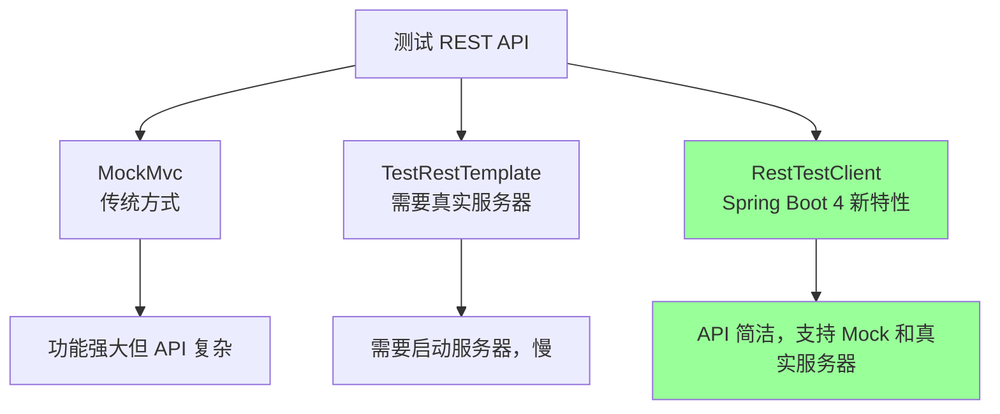
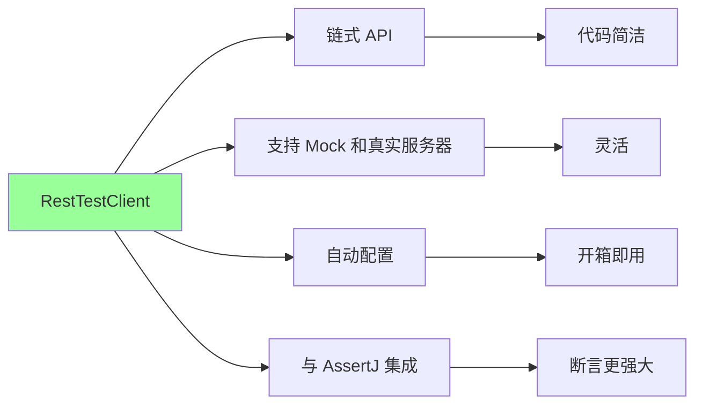

# 16、Spring Boot 4 实战：测试增强：RestTestClient 与 JUnit Jupiter 6.0 集成
- 来源：https://ddkk.com/springboot/4/16.html
- 分类：Spring Boot 4.0 实战教程
- 分组：教程目录
- 日期：2025-11-25
兄弟们，今儿咱聊聊 Spring Boot 4 的测试增强，主要是 RestTestClient 和 JUnit Jupiter 6.0 的集成。测试这玩意儿太重要了，写代码不写测试就是耍流氓；鹏磊我最近在搞项目，发现 RestTestClient 比 MockMvc 用起来更顺手，JUnit Jupiter 6.0 也加了不少新特性，今儿给你们好好唠唠怎么用、怎么写完整的测试案例。

## RestTestClient 是啥

先说说 RestTestClient 是咋回事。RestTestClient 是 Spring Boot 4 新增的测试客户端，专门用来测试 REST API；它比 MockMvc 更简洁，API 也更现代化，支持链式调用，写测试代码更爽。

### RestTestClient vs MockMvc vs TestRestTemplate



主要区别：

1. **MockMvc**：功能强大，但 API 复杂，需要手动配置
2. **TestRestTemplate**：需要启动真实服务器，测试慢，但更接近真实环境
3. **RestTestClient**：API 简洁，支持 Mock 和真实服务器，Spring Boot 4 推荐使用

### RestTestClient 的优势



## JUnit Jupiter 6.0 新特性

JUnit Jupiter 6.0 是 JUnit 5 的大版本升级，加了不少新特性，用起来更爽了。

### 主要新特性

1. **API 改进**：`ExtensionContext.Store` 的 API 更简洁
2. **类型推断增强**：更好的泛型支持
3. **空值安全**：更好的 `@Nullable` 支持
4. **性能优化**：测试执行更快

## 项目依赖配置

先看看怎么配置依赖。

### Maven 配置

```xml
<?xml version="1.0" encoding="UTF-8"?>
<project xmlns="http://maven.apache.org/POM/4.0.0"
         xmlns:xsi="http://www.w3.org/2001/XMLSchema-instance"
         xsi:schemaLocation="http://maven.apache.org/POM/4.0.0 
         http://maven.apache.org/xsd/maven-4.0.0.xsd">
    <modelVersion>4.0.0</modelVersion>
    <!-- Spring Boot 4 父项目 -->
    <parent>
        <groupId>org.springframework.boot</groupId>
        <artifactId>spring-boot-starter-parent</artifactId>
        <version>4.0.0-RC1</version>  <!-- Spring Boot 4 版本 -->
    </parent>
    <groupId>com.example</groupId>
    <artifactId>resttestclient-demo</artifactId>
    <version>1.0.0</version>
    <properties>
        <java.version>21</java.version>  <!-- Java 21 -->
        <project.build.sourceEncoding>UTF-8</project.build.sourceEncoding>
    </properties>
    <dependencies>
        <!-- Spring Boot Web 启动器 -->
        <dependency>
            <groupId>org.springframework.boot</groupId>
            <artifactId>spring-boot-starter-web</artifactId>
        </dependency>
        <!-- Spring Boot 数据 JPA -->
        <dependency>
            <groupId>org.springframework.boot</groupId>
            <artifactId>spring-boot-starter-data-jpa</artifactId>
        </dependency>
        <!-- H2 数据库（测试用） -->
        <dependency>
            <groupId>com.h2database</groupId>
            <artifactId>h2</artifactId>
            <scope>runtime</scope>
        </dependency>
        <!-- Spring Boot 测试启动器（包含 RestTestClient） -->
        <dependency>
            <groupId>org.springframework.boot</groupId>
            <artifactId>spring-boot-starter-test</artifactId>
            <scope>test</scope>
        </dependency>
        <!-- RestTestClient 自动配置 -->
        <dependency>
            <groupId>org.springframework.boot</groupId>
            <artifactId>spring-boot-resttestclient</artifactId>
            <scope>test</scope>
        </dependency>
        <!-- JUnit Jupiter 6.0 -->
        <dependency>
            <groupId>org.junit.jupiter</groupId>
            <artifactId>junit-jupiter</artifactId>
            <version>6.0.0</version>
            <scope>test</scope>
        </dependency>
        <!-- AssertJ（断言库） -->
        <dependency>
            <groupId>org.assertj</groupId>
            <artifactId>assertj-core</artifactId>
            <scope>test</scope>
        </dependency>
        <!-- Mockito（Mock 框架） -->
        <dependency>
            <groupId>org.mockito</groupId>
            <artifactId>mockito-core</artifactId>
            <scope>test</scope>
        </dependency>
        <!-- Mockito JUnit Jupiter 扩展 -->
        <dependency>
            <groupId>org.mockito</groupId>
            <artifactId>mockito-junit-jupiter</artifactId>
            <scope>test</scope>
        </dependency>
    </dependencies>
    <build>
        <plugins>
            <!-- Spring Boot Maven 插件 -->
            <plugin>
                <groupId>org.springframework.boot</groupId>
                <artifactId>spring-boot-maven-plugin</artifactId>
            </plugin>
            <!-- Maven Surefire 插件（运行单元测试） -->
            <plugin>
                <groupId>org.apache.maven.plugins</groupId>
                <artifactId>maven-surefire-plugin</artifactId>
                <version>3.0.0</version>
            </plugin>
        </plugins>
    </build>
</project>
```

### Gradle 配置

```txt
// Gradle 配置
plugins {
    id 'java'
    id 'org.springframework.boot' version '4.0.0-RC1'
    id 'io.spring.dependency-management' version '1.1.0'
}
group = 'com.example'
version = '1.0.0'
sourceCompatibility = '21'
repositories {
    mavenCentral()
}
dependencies {
    // Spring Boot Web
    implementation 'org.springframework.boot:spring-boot-starter-web'
    implementation 'org.springframework.boot:spring-boot-starter-data-jpa'
    // H2 数据库
    runtimeOnly 'com.h2database:h2'
    // 测试依赖
    testImplementation 'org.springframework.boot:spring-boot-starter-test'
    testImplementation 'org.springframework.boot:spring-boot-resttestclient'
    testImplementation 'org.junit.jupiter:junit-jupiter:6.0.0'
    testImplementation 'org.assertj:assertj-core'
    testImplementation 'org.mockito:mockito-core'
    testImplementation 'org.mockito:mockito-junit-jupiter'
}
tasks.named('test') {
    useJUnitPlatform()
}
```

## 完整的项目结构

先看看完整的项目结构，这样测试案例才能完整。

### 实体类

```java
package com.example.resttestclient.entity;
import jakarta.persistence.*;
import java.time.LocalDateTime;
/**
 * 用户实体类
 * 演示基本的 JPA 实体
 */
@Entity
@Table(name = "users")
public class User {
    @Id
    @GeneratedValue(strategy = GenerationType.IDENTITY)
    private Long id;  // 用户 ID，主键，自增
    @Column(nullable = false, unique = true)
    private String username;  // 用户名，不能为空，唯一
    @Column(nullable = false)
    private String email;  // 邮箱，不能为空
    private String nickname;  // 昵称，可以为空
    private Integer age;  // 年龄，可以为空
    @Column(name = "created_at", nullable = false)
    private LocalDateTime createdAt;  // 创建时间
    @Column(name = "updated_at")
    private LocalDateTime updatedAt;  // 更新时间
    // 无参构造函数，JPA 需要
    public User() {
    }
    // 全参构造函数
    public User(String username, String email, String nickname, Integer age) {
        this.username = username;
        this.email = email;
        this.nickname = nickname;
        this.age = age;
        this.createdAt = LocalDateTime.now();
    }
    // Getter 和 Setter 方法
    public Long getId() {
        return id;
    }
    public void setId(Long id) {
        this.id = id;
    }
    public String getUsername() {
        return username;
    }
    public void setUsername(String username) {
        this.username = username;
    }
    public String getEmail() {
        return email;
    }
    public void setEmail(String email) {
        this.email = email;
    }
    public String getNickname() {
        return nickname;
    }
    public void setNickname(String nickname) {
        this.nickname = nickname;
    }
    public Integer getAge() {
        return age;
    }
    public void setAge(Integer age) {
        this.age = age;
    }
    public LocalDateTime getCreatedAt() {
        return createdAt;
    }
    public void setCreatedAt(LocalDateTime createdAt) {
        this.createdAt = createdAt;
    }
    public LocalDateTime getUpdatedAt() {
        return updatedAt;
    }
    public void setUpdatedAt(LocalDateTime updatedAt) {
        this.updatedAt = updatedAt;
    }
    // toString 方法，方便调试
    @Override
    public String toString() {
        return "User{" +
                "id=" + id +
                ", username='" + username + '\'' +
                ", email='" + email + '\'' +
                ", nickname='" + nickname + '\'' +
                ", age=" + age +
                ", createdAt=" + createdAt +
                ", updatedAt=" + updatedAt +
                '}';
    }
}
```

### Repository 接口

```java
package com.example.resttestclient.repository;
import com.example.resttestclient.entity.User;
import org.springframework.data.jpa.repository.JpaRepository;
import org.springframework.stereotype.Repository;
import java.util.Optional;
/**
 * 用户 Repository 接口
 * 继承 JpaRepository，提供基本的 CRUD 操作
 */
@Repository
public interface UserRepository extends JpaRepository<User, Long> {
    /**
     * 根据用户名查找用户
     * Spring Data JPA 会自动实现这个方法
     * 
     * @param username 用户名
     * @return 用户对象（如果存在）
     */
    Optional<User> findByUsername(String username);
    /**
     * 根据邮箱查找用户
     * 
     * @param email 邮箱
     * @return 用户对象（如果存在）
     */
    Optional<User> findByEmail(String email);
    /**
     * 检查用户名是否存在
     * 
     * @param username 用户名
     * @return 是否存在
     */
    boolean existsByUsername(String username);
    /**
     * 检查邮箱是否存在
     * 
     * @param email 邮箱
     * @return 是否存在
     */
    boolean existsByEmail(String email);
}
```

### Service 层

```java
package com.example.resttestclient.service;
import com.example.resttestclient.entity.User;
import com.example.resttestclient.repository.UserRepository;
import org.springframework.stereotype.Service;
import org.springframework.transaction.annotation.Transactional;
import java.time.LocalDateTime;
import java.util.List;
import java.util.Optional;
/**
 * 用户服务类
 * 处理用户相关的业务逻辑
 */
@Service
@Transactional
public class UserService {
    private final UserRepository userRepository;
    // 构造函数注入
    public UserService(UserRepository userRepository) {
        this.userRepository = userRepository;
    }
    /**
     * 获取所有用户
     * 
     * @return 用户列表
     */
    @Transactional(readOnly = true)
    public List<User> findAll() {
        return userRepository.findAll();
    }
    /**
     * 根据 ID 查找用户
     * 
     * @param id 用户 ID
     * @return 用户对象（如果存在）
     */
    @Transactional(readOnly = true)
    public Optional<User> findById(Long id) {
        return userRepository.findById(id);
    }
    /**
     * 创建用户
     * 
     * @param user 用户对象
     * @return 创建的用户
     * @throws IllegalArgumentException 如果用户名或邮箱已存在
     */
    public User create(User user) {
        // 检查用户名是否已存在
        if (userRepository.existsByUsername(user.getUsername())) {
            throw new IllegalArgumentException("用户名已存在: " + user.getUsername());
        }
        // 检查邮箱是否已存在
        if (userRepository.existsByEmail(user.getEmail())) {
            throw new IllegalArgumentException("邮箱已存在: " + user.getEmail());
        }
        // 设置创建时间
        user.setCreatedAt(LocalDateTime.now());
        // 保存用户
        return userRepository.save(user);
    }
    /**
     * 更新用户
     * 
     * @param id 用户 ID
     * @param user 更新的用户信息
     * @return 更新后的用户
     * @throws IllegalArgumentException 如果用户不存在
     */
    public User update(Long id, User user) {
        // 查找用户
        User existingUser = userRepository.findById(id)
                .orElseThrow(() -> new IllegalArgumentException("用户不存在: " + id));
        // 更新用户信息
        existingUser.setUsername(user.getUsername());
        existingUser.setEmail(user.getEmail());
        existingUser.setNickname(user.getNickname());
        existingUser.setAge(user.getAge());
        existingUser.setUpdatedAt(LocalDateTime.now());
        // 保存更新
        return userRepository.save(existingUser);
    }
    /**
     * 删除用户
     * 
     * @param id 用户 ID
     * @throws IllegalArgumentException 如果用户不存在
     */
    public void delete(Long id) {
        // 检查用户是否存在
        if (!userRepository.existsById(id)) {
            throw new IllegalArgumentException("用户不存在: " + id);
        }
        // 删除用户
        userRepository.deleteById(id);
    }
}
```

### Controller 层

```java
package com.example.resttestclient.controller;
import com.example.resttestclient.entity.User;
import com.example.resttestclient.service.UserService;
import org.springframework.http.HttpStatus;
import org.springframework.http.ResponseEntity;
import org.springframework.web.bind.annotation.*;
import java.util.List;
/**
 * 用户控制器
 * 处理用户相关的 HTTP 请求
 */
@RestController
@RequestMapping("/api/users")
public class UserController {
    private final UserService userService;
    // 构造函数注入
    public UserController(UserService userService) {
        this.userService = userService;
    }
    /**
     * 获取所有用户
     * GET /api/users
     * 
     * @return 用户列表
     */
    @GetMapping
    public ResponseEntity<List<User>> getAllUsers() {
        List<User> users = userService.findAll();
        return ResponseEntity.ok(users);
    }
    /**
     * 根据 ID 获取用户
     * GET /api/users/{id}
     * 
     * @param id 用户 ID
     * @return 用户对象
     */
    @GetMapping("/{id}")
    public ResponseEntity<User> getUserById(@PathVariable Long id) {
        return userService.findById(id)
                .map(user -> ResponseEntity.ok(user))
                .orElse(ResponseEntity.notFound().build());
    }
    /**
     * 创建用户
     * POST /api/users
     * 
     * @param user 用户对象（从请求体反序列化）
     * @return 创建的用户
     */
    @PostMapping
    public ResponseEntity<User> createUser(@RequestBody User user) {
        try {
            User created = userService.create(user);
            return ResponseEntity.status(HttpStatus.CREATED).body(created);
        } catch (IllegalArgumentException e) {
            // 如果用户名或邮箱已存在，返回 400 Bad Request
            return ResponseEntity.badRequest().build();
        }
    }
    /**
     * 更新用户
     * PUT /api/users/{id}
     * 
     * @param id 用户 ID
     * @param user 更新的用户信息
     * @return 更新后的用户
     */
    @PutMapping("/{id}")
    public ResponseEntity<User> updateUser(@PathVariable Long id, 
                                          @RequestBody User user) {
        try {
            User updated = userService.update(id, user);
            return ResponseEntity.ok(updated);
        } catch (IllegalArgumentException e) {
            // 如果用户不存在，返回 404 Not Found
            return ResponseEntity.notFound().build();
        }
    }
    /**
     * 删除用户
     * DELETE /api/users/{id}
     * 
     * @param id 用户 ID
     * @return 204 No Content
     */
    @DeleteMapping("/{id}")
    public ResponseEntity<Void> deleteUser(@PathVariable Long id) {
        try {
            userService.delete(id);
            return ResponseEntity.noContent().build();
        } catch (IllegalArgumentException e) {
            // 如果用户不存在，返回 404 Not Found
            return ResponseEntity.notFound().build();
        }
    }
}
```

### 应用主类

```java
package com.example.resttestclient;
import org.springframework.boot.SpringApplication;
import org.springframework.boot.autoconfigure.SpringBootApplication;
/**
 * Spring Boot 应用主类
 */
@SpringBootApplication
public class RestTestClientApplication {
    public static void main(String[] args) {
        SpringApplication.run(RestTestClientApplication.class, args);
    }
}
```

### 配置文件

```yaml
# application.yml
spring:
  application:
    name: resttestclient-demo
  # 数据源配置
  datasource:
    url: jdbc:h2:mem:testdb
    driver-class-name: org.h2.Driver
    username: sa
    password: 
  # JPA 配置
  jpa:
    hibernate:
      ddl-auto: create-drop  # 测试环境用 create-drop，生产环境用 update
    show-sql: true  # 显示 SQL 语句
    properties:
      hibernate:
        format_sql: true  # 格式化 SQL 语句
  # H2 控制台配置（测试用）
  h2:
    console:
      enabled: true
      path: /h2-console
# 日志配置
logging:
  level:
    com.example.resttestclient: DEBUG
    org.springframework.web: DEBUG
```

## RestTestClient 基础测试

看看怎么用 RestTestClient 写基础测试。

### Mock 模式测试（不启动服务器）

```java
package com.example.resttestclient.controller;
import com.example.resttestclient.entity.User;
import com.example.resttestclient.service.UserService;
import com.fasterxml.jackson.databind.ObjectMapper;
import org.junit.jupiter.api.BeforeEach;
import org.junit.jupiter.api.Test;
import org.springframework.beans.factory.annotation.Autowired;
import org.springframework.boot.test.autoconfigure.web.servlet.AutoConfigureMockMvc;
import org.springframework.boot.test.autoconfigure.web.servlet.WebMvcTest;
import org.springframework.boot.test.mock.mockito.MockBean;
import org.springframework.boot.resttestclient.autoconfigure.AutoConfigureRestTestClient;
import org.springframework.http.MediaType;
import org.springframework.test.web.servlet.client.RestTestClient;
import java.time.LocalDateTime;
import java.util.Arrays;
import java.util.List;
import java.util.Optional;
import static org.mockito.ArgumentMatchers.any;
import static org.mockito.ArgumentMatchers.eq;
import static org.mockito.BDDMockito.given;
import static org.mockito.Mockito.verify;
import static org.springframework.test.web.servlet.client.RestTestClient.ResponseSpec;
/**
 * 用户控制器测试类（Mock 模式）
 * 使用 RestTestClient 测试 Controller，不启动真实服务器
 */
@WebMvcTest(UserController.class)  // 只加载 Web 层，不加载完整的应用上下文
@AutoConfigureRestTestClient  // 自动配置 RestTestClient
class UserControllerMockTest {
    @Autowired
    private RestTestClient restTestClient;  // 注入 RestTestClient
    @MockBean
    private UserService userService;  // Mock UserService，不调用真实的服务
    private ObjectMapper objectMapper;  // JSON 序列化/反序列化工具
    private User testUser;  // 测试用的用户对象
    /**
     * 测试前的准备工作
     * 在每个测试方法执行前都会执行
     */
    @BeforeEach
    void setUp() {
        // 创建 ObjectMapper 实例
        objectMapper = new ObjectMapper();
        // 创建测试用户
        testUser = new User();
        testUser.setId(1L);
        testUser.setUsername("testuser");
        testUser.setEmail("test@example.com");
        testUser.setNickname("测试用户");
        testUser.setAge(25);
        testUser.setCreatedAt(LocalDateTime.now());
    }
    /**
     * 测试获取所有用户
     * GET /api/users
     */
    @Test
    void testGetAllUsers() {
        // 准备测试数据
        List<User> users = Arrays.asList(testUser);
        // Mock UserService 的行为：当调用 findAll() 时返回用户列表
        given(userService.findAll()).willReturn(users);
        // 发送 GET 请求
        ResponseSpec response = restTestClient
                .get()
                .uri("/api/users")  // 请求路径
                .exchange();  // 执行请求
        // 断言响应状态码是 200 OK
        response.expectStatus().isOk()
                // 断言响应体是用户列表
                .expectBodyList(User.class)
                // 断言列表大小为 1
                .hasSize(1)
                // 断言第一个用户的用户名是 "testuser"
                .value(usersList -> {
                    assert usersList.get(0).getUsername().equals("testuser");
                });
        // 验证 UserService 的 findAll() 方法被调用了一次
        verify(userService).findAll();
    }
    /**
     * 测试根据 ID 获取用户（用户存在）
     * GET /api/users/{id}
     */
    @Test
    void testGetUserById_UserExists() {
        // Mock UserService 的行为：当调用 findById(1L) 时返回用户
        given(userService.findById(1L)).willReturn(Optional.of(testUser));
        // 发送 GET 请求
        ResponseSpec response = restTestClient
                .get()
                .uri("/api/users/1")  // 请求路径，包含路径变量
                .exchange();
        // 断言响应状态码是 200 OK
        response.expectStatus().isOk()
                // 断言响应体是用户对象
                .expectBody(User.class)
                // 断言用户的用户名是 "testuser"
                .value(user -> {
                    assert user.getUsername().equals("testuser");
                    assert user.getEmail().equals("test@example.com");
                });
        // 验证 UserService 的 findById() 方法被调用了一次
        verify(userService).findById(1L);
    }
    /**
     * 测试根据 ID 获取用户（用户不存在）
     * GET /api/users/{id}
     */
    @Test
    void testGetUserById_UserNotFound() {
        // Mock UserService 的行为：当调用 findById(999L) 时返回空
        given(userService.findById(999L)).willReturn(Optional.empty());
        // 发送 GET 请求
        ResponseSpec response = restTestClient
                .get()
                .uri("/api/users/999")
                .exchange();
        // 断言响应状态码是 404 Not Found
        response.expectStatus().isNotFound();
        // 验证 UserService 的 findById() 方法被调用了一次
        verify(userService).findById(999L);
    }
    /**
     * 测试创建用户（成功）
     * POST /api/users
     */
    @Test
    void testCreateUser_Success() throws Exception {
        // 准备请求体（新用户，没有 ID）
        User newUser = new User();
        newUser.setUsername("newuser");
        newUser.setEmail("new@example.com");
        newUser.setNickname("新用户");
        newUser.setAge(30);
        // 准备响应（创建后的用户，有 ID）
        User createdUser = new User();
        createdUser.setId(2L);
        createdUser.setUsername("newuser");
        createdUser.setEmail("new@example.com");
        createdUser.setNickname("新用户");
        createdUser.setAge(30);
        createdUser.setCreatedAt(LocalDateTime.now());
        // Mock UserService 的行为：当调用 create() 时返回创建的用户
        given(userService.create(any(User.class))).willReturn(createdUser);
        // 发送 POST 请求
        ResponseSpec response = restTestClient
                .post()
                .uri("/api/users")
                .contentType(MediaType.APPLICATION_JSON)  // 设置请求头 Content-Type
                .body(objectMapper.writeValueAsString(newUser))  // 设置请求体（JSON 字符串）
                .exchange();
        // 断言响应状态码是 201 Created
        response.expectStatus().isCreated()
                // 断言响应体是用户对象
                .expectBody(User.class)
                // 断言用户的 ID 是 2L
                .value(user -> {
                    assert user.getId().equals(2L);
                    assert user.getUsername().equals("newuser");
                });
        // 验证 UserService 的 create() 方法被调用了一次
        verify(userService).create(any(User.class));
    }
    /**
     * 测试创建用户（用户名已存在）
     * POST /api/users
     */
    @Test
    void testCreateUser_UsernameExists() throws Exception {
        // 准备请求体
        User newUser = new User();
        newUser.setUsername("testuser");
        newUser.setEmail("new@example.com");
        // Mock UserService 的行为：当调用 create() 时抛出异常
        given(userService.create(any(User.class)))
                .willThrow(new IllegalArgumentException("用户名已存在: testuser"));
        // 发送 POST 请求
        ResponseSpec response = restTestClient
                .post()
                .uri("/api/users")
                .contentType(MediaType.APPLICATION_JSON)
                .body(objectMapper.writeValueAsString(newUser))
                .exchange();
        // 断言响应状态码是 400 Bad Request
        response.expectStatus().isBadRequest();
        // 验证 UserService 的 create() 方法被调用了一次
        verify(userService).create(any(User.class));
    }
    /**
     * 测试更新用户（成功）
     * PUT /api/users/{id}
     */
    @Test
    void testUpdateUser_Success() throws Exception {
        // 准备更新的用户信息
        User updatedUser = new User();
        updatedUser.setUsername("updateduser");
        updatedUser.setEmail("updated@example.com");
        updatedUser.setNickname("更新用户");
        updatedUser.setAge(35);
        // 准备响应（更新后的用户）
        User savedUser = new User();
        savedUser.setId(1L);
        savedUser.setUsername("updateduser");
        savedUser.setEmail("updated@example.com");
        savedUser.setNickname("更新用户");
        savedUser.setAge(35);
        savedUser.setUpdatedAt(LocalDateTime.now());
        // Mock UserService 的行为：当调用 update() 时返回更新的用户
        given(userService.update(eq(1L), any(User.class))).willReturn(savedUser);
        // 发送 PUT 请求
        ResponseSpec response = restTestClient
                .put()
                .uri("/api/users/1")
                .contentType(MediaType.APPLICATION_JSON)
                .body(objectMapper.writeValueAsString(updatedUser))
                .exchange();
        // 断言响应状态码是 200 OK
        response.expectStatus().isOk()
                .expectBody(User.class)
                .value(user -> {
                    assert user.getUsername().equals("updateduser");
                    assert user.getAge().equals(35);
                });
        // 验证 UserService 的 update() 方法被调用了一次
        verify(userService).update(eq(1L), any(User.class));
    }
    /**
     * 测试更新用户（用户不存在）
     * PUT /api/users/{id}
     */
    @Test
    void testUpdateUser_UserNotFound() throws Exception {
        // 准备更新的用户信息
        User updatedUser = new User();
        updatedUser.setUsername("updateduser");
        updatedUser.setEmail("updated@example.com");
        // Mock UserService 的行为：当调用 update() 时抛出异常
        given(userService.update(eq(999L), any(User.class)))
                .willThrow(new IllegalArgumentException("用户不存在: 999"));
        // 发送 PUT 请求
        ResponseSpec response = restTestClient
                .put()
                .uri("/api/users/999")
                .contentType(MediaType.APPLICATION_JSON)
                .body(objectMapper.writeValueAsString(updatedUser))
                .exchange();
        // 断言响应状态码是 404 Not Found
        response.expectStatus().isNotFound();
        // 验证 UserService 的 update() 方法被调用了一次
        verify(userService).update(eq(999L), any(User.class));
    }
    /**
     * 测试删除用户（成功）
     * DELETE /api/users/{id}
     */
    @Test
    void testDeleteUser_Success() {
        // Mock UserService 的行为：delete() 方法不抛异常（表示删除成功）
        // 这里不需要 given()，因为 delete() 是 void 方法
        // 发送 DELETE 请求
        ResponseSpec response = restTestClient
                .delete()
                .uri("/api/users/1")
                .exchange();
        // 断言响应状态码是 204 No Content
        response.expectStatus().isNoContent();
        // 验证 UserService 的 delete() 方法被调用了一次
        verify(userService).delete(1L);
    }
    /**
     * 测试删除用户（用户不存在）
     * DELETE /api/users/{id}
     */
    @Test
    void testDeleteUser_UserNotFound() {
        // Mock UserService 的行为：当调用 delete() 时抛出异常
        given(userService.delete(999L))
                .willThrow(new IllegalArgumentException("用户不存在: 999"));
        // 发送 DELETE 请求
        ResponseSpec response = restTestClient
                .delete()
                .uri("/api/users/999")
                .exchange();
        // 断言响应状态码是 404 Not Found
        response.expectStatus().isNotFound();
        // 验证 UserService 的 delete() 方法被调用了一次
        verify(userService).delete(999L);
    }
}
```

## RestTestClient 集成测试（真实服务器）

看看怎么用 RestTestClient 写集成测试，启动真实服务器。

### 集成测试类

```java
package com.example.resttestclient.integration;
import com.example.resttestclient.entity.User;
import com.example.resttestclient.repository.UserRepository;
import com.fasterxml.jackson.databind.ObjectMapper;
import org.junit.jupiter.api.BeforeEach;
import org.junit.jupiter.api.Test;
import org.springframework.beans.factory.annotation.Autowired;
import org.springframework.boot.test.context.SpringBootTest;
import org.springframework.boot.resttestclient.autoconfigure.AutoConfigureRestTestClient;
import org.springframework.boot.test.context.SpringBootTest.WebEnvironment;
import org.springframework.http.MediaType;
import org.springframework.test.context.ActiveProfiles;
import org.springframework.test.web.servlet.client.RestTestClient;
import org.springframework.transaction.annotation.Transactional;
import java.time.LocalDateTime;
import java.util.List;
import static org.assertj.core.api.Assertions.assertThat;
import static org.springframework.test.web.servlet.client.RestTestClient.ResponseSpec;
/**
 * 用户集成测试类（真实服务器模式）
 * 使用 RestTestClient 测试完整的应用，包括数据库操作
 */
@SpringBootTest(webEnvironment = WebEnvironment.RANDOM_PORT)  // 启动真实服务器，随机端口
@AutoConfigureRestTestClient  // 自动配置 RestTestClient
@ActiveProfiles("test")  // 使用 test profile
@Transactional  // 每个测试方法执行完后回滚事务
class UserIntegrationTest {
    @Autowired
    private RestTestClient restTestClient;  // 注入 RestTestClient
    @Autowired
    private UserRepository userRepository;  // 注入 UserRepository，用于准备测试数据
    @Autowired
    private ObjectMapper objectMapper;  // 注入 ObjectMapper
    /**
     * 测试前的准备工作
     * 在每个测试方法执行前都会执行
     */
    @BeforeEach
    void setUp() {
        // 清空数据库（因为使用了 @Transactional，实际上不需要）
        userRepository.deleteAll();
    }
    /**
     * 测试创建用户并获取
     * 完整的 CRUD 流程测试
     */
    @Test
    void testCreateAndGetUser() throws Exception {
        // 准备请求体
        User newUser = new User();
        newUser.setUsername("integrationuser");
        newUser.setEmail("integration@example.com");
        newUser.setNickname("集成测试用户");
        newUser.setAge(28);
        // 1. 创建用户
        ResponseSpec createResponse = restTestClient
                .post()
                .uri("/api/users")
                .contentType(MediaType.APPLICATION_JSON)
                .body(objectMapper.writeValueAsString(newUser))
                .exchange();
        // 断言创建成功
        User createdUser = createResponse
                .expectStatus().isCreated()
                .expectBody(User.class)
                .returnResult()
                .getResponseBody();
        // 验证创建的用户信息
        assertThat(createdUser).isNotNull();
        assertThat(createdUser.getId()).isNotNull();
        assertThat(createdUser.getUsername()).isEqualTo("integrationuser");
        assertThat(createdUser.getEmail()).isEqualTo("integration@example.com");
        Long userId = createdUser.getId();
        // 2. 获取用户
        ResponseSpec getResponse = restTestClient
                .get()
                .uri("/api/users/" + userId)
                .exchange();
        // 断言获取成功
        User retrievedUser = getResponse
                .expectStatus().isOk()
                .expectBody(User.class)
                .returnResult()
                .getResponseBody();
        // 验证获取的用户信息
        assertThat(retrievedUser).isNotNull();
        assertThat(retrievedUser.getId()).isEqualTo(userId);
        assertThat(retrievedUser.getUsername()).isEqualTo("integrationuser");
    }
    /**
     * 测试获取所有用户
     */
    @Test
    void testGetAllUsers() {
        // 准备测试数据：在数据库中创建几个用户
        User user1 = new User("user1", "user1@example.com", "用户1", 20);
        User user2 = new User("user2", "user2@example.com", "用户2", 25);
        User user3 = new User("user3", "user3@example.com", "用户3", 30);
        userRepository.saveAll(List.of(user1, user2, user3));
        // 发送 GET 请求
        ResponseSpec response = restTestClient
                .get()
                .uri("/api/users")
                .exchange();
        // 断言响应状态码是 200 OK
        List<User> users = response
                .expectStatus().isOk()
                .expectBodyList(User.class)
                .returnResult()
                .getResponseBody();
        // 验证用户列表
        assertThat(users).isNotNull();
        assertThat(users).hasSize(3);
        assertThat(users).extracting(User::getUsername)
                .containsExactlyInAnyOrder("user1", "user2", "user3");
    }
    /**
     * 测试更新用户
     */
    @Test
    void testUpdateUser() throws Exception {
        // 准备测试数据：创建一个用户
        User user = new User("updateuser", "update@example.com", "更新用户", 25);
        user = userRepository.save(user);
        Long userId = user.getId();
        // 准备更新的用户信息
        User updatedUser = new User();
        updatedUser.setUsername("updateduser");
        updatedUser.setEmail("updated@example.com");
        updatedUser.setNickname("已更新用户");
        updatedUser.setAge(30);
        // 发送 PUT 请求
        ResponseSpec response = restTestClient
                .put()
                .uri("/api/users/" + userId)
                .contentType(MediaType.APPLICATION_JSON)
                .body(objectMapper.writeValueAsString(updatedUser))
                .exchange();
        // 断言更新成功
        User result = response
                .expectStatus().isOk()
                .expectBody(User.class)
                .returnResult()
                .getResponseBody();
        // 验证更新的用户信息
        assertThat(result).isNotNull();
        assertThat(result.getId()).isEqualTo(userId);
        assertThat(result.getUsername()).isEqualTo("updateduser");
        assertThat(result.getAge()).isEqualTo(30);
        // 验证数据库中的用户也被更新了
        User dbUser = userRepository.findById(userId).orElseThrow();
        assertThat(dbUser.getUsername()).isEqualTo("updateduser");
        assertThat(dbUser.getAge()).isEqualTo(30);
    }
    /**
     * 测试删除用户
     */
    @Test
    void testDeleteUser() {
        // 准备测试数据：创建一个用户
        User user = new User("deleteuser", "delete@example.com", "删除用户", 25);
        user = userRepository.save(user);
        Long userId = user.getId();
        // 验证用户存在
        assertThat(userRepository.existsById(userId)).isTrue();
        // 发送 DELETE 请求
        ResponseSpec response = restTestClient
                .delete()
                .uri("/api/users/" + userId)
                .exchange();
        // 断言删除成功
        response.expectStatus().isNoContent();
        // 验证用户已被删除
        assertThat(userRepository.existsById(userId)).isFalse();
    }
    /**
     * 测试创建用户时用户名冲突
     */
    @Test
    void testCreateUser_UsernameConflict() throws Exception {
        // 准备测试数据：创建一个用户
        User existingUser = new User("conflictuser", "existing@example.com", "已存在用户", 25);
        userRepository.save(existingUser);
        // 准备请求体：使用相同的用户名
        User newUser = new User();
        newUser.setUsername("conflictuser");  // 用户名冲突
        newUser.setEmail("new@example.com");
        // 发送 POST 请求
        ResponseSpec response = restTestClient
                .post()
                .uri("/api/users")
                .contentType(MediaType.APPLICATION_JSON)
                .body(objectMapper.writeValueAsString(newUser))
                .exchange();
        // 断言返回 400 Bad Request
        response.expectStatus().isBadRequest();
    }
    /**
     * 测试获取不存在的用户
     */
    @Test
    void testGetUser_NotFound() {
        // 发送 GET 请求，使用不存在的用户 ID
        ResponseSpec response = restTestClient
                .get()
                .uri("/api/users/99999")
                .exchange();
        // 断言返回 404 Not Found
        response.expectStatus().isNotFound();
    }
}
```

## RestTestClient 与 AssertJ 集成

RestTestClient 还支持 AssertJ，断言更强大。

### AssertJ 集成测试

```java
package com.example.resttestclient.assertj;
import com.example.resttestclient.entity.User;
import com.fasterxml.jackson.databind.ObjectMapper;
import org.junit.jupiter.api.BeforeEach;
import org.junit.jupiter.api.Test;
import org.springframework.beans.factory.annotation.Autowired;
import org.springframework.boot.test.autoconfigure.web.servlet.WebMvcTest;
import org.springframework.boot.resttestclient.autoconfigure.AutoConfigureRestTestClient;
import org.springframework.boot.test.mock.mockito.MockBean;
import org.springframework.http.MediaType;
import org.springframework.test.web.servlet.client.RestTestClient;
import org.springframework.test.web.servlet.client.RestTestClient.ResponseSpec;
import org.springframework.test.web.servlet.client.assertj.RestTestClientResponse;
import java.time.LocalDateTime;
import java.util.Arrays;
import java.util.List;
import java.util.Optional;
import static org.assertj.core.api.Assertions.assertThat;
import static org.mockito.BDDMockito.given;
import static org.mockito.Mockito.verify;
/**
 * RestTestClient 与 AssertJ 集成测试
 * 演示如何使用 AssertJ 进行更强大的断言
 */
@WebMvcTest(com.example.resttestclient.controller.UserController.class)
@AutoConfigureRestTestClient
class UserControllerAssertJTest {
    @Autowired
    private RestTestClient restTestClient;
    @MockBean
    private com.example.resttestclient.service.UserService userService;
    @Autowired
    private ObjectMapper objectMapper;
    private User testUser;
    @BeforeEach
    void setUp() {
        testUser = new User();
        testUser.setId(1L);
        testUser.setUsername("assertjuser");
        testUser.setEmail("assertj@example.com");
        testUser.setNickname("AssertJ 用户");
        testUser.setAge(25);
        testUser.setCreatedAt(LocalDateTime.now());
    }
    /**
     * 使用 AssertJ 进行断言
     */
    @Test
    void testGetUserWithAssertJ() {
        // Mock UserService
        given(userService.findById(1L)).willReturn(Optional.of(testUser));
        // 发送请求并获取 ResponseSpec
        ResponseSpec spec = restTestClient
                .get()
                .uri("/api/users/1")
                .exchange();
        // 转换为 RestTestClientResponse，使用 AssertJ 断言
        RestTestClientResponse response = RestTestClientResponse.from(spec);
        // 使用 AssertJ 进行断言
        assertThat(response)
                .hasStatusOk()  // 断言状态码是 200
                .hasContentType("application/json")  // 断言 Content-Type
                .bodyJson()  // 获取响应体为 JSON
                .extracting("username", "email")  // 提取字段
                .containsExactly("assertjuser", "assertj@example.com");  // 断言值
        // 或者直接断言响应体对象
        User user = response.body(User.class);
        assertThat(user)
                .isNotNull()
                .extracting(User::getUsername, User::getEmail, User::getAge)
                .containsExactly("assertjuser", "assertj@example.com", 25);
        // 验证 Service 被调用
        verify(userService).findById(1L);
    }
    /**
     * 使用 AssertJ 断言列表响应
     */
    @Test
    void testGetAllUsersWithAssertJ() {
        // 准备测试数据
        List<User> users = Arrays.asList(testUser);
        given(userService.findAll()).willReturn(users);
        // 发送请求
        ResponseSpec spec = restTestClient
                .get()
                .uri("/api/users")
                .exchange();
        // 转换为 RestTestClientResponse
        RestTestClientResponse response = RestTestClientResponse.from(spec);
        // 使用 AssertJ 断言
        assertThat(response)
                .hasStatusOk()
                .bodyJson()
                .isArray()  // 断言是数组
                .hasSize(1)  // 断言数组大小为 1
                .extracting("username")  // 提取 username 字段
                .containsExactly("assertjuser");  // 断言值
        verify(userService).findAll();
    }
    /**
     * 使用 AssertJ 断言错误响应
     */
    @Test
    void testGetUserNotFoundWithAssertJ() {
        // Mock UserService 返回空
        given(userService.findById(999L)).willReturn(Optional.empty());
        // 发送请求
        ResponseSpec spec = restTestClient
                .get()
                .uri("/api/users/999")
                .exchange();
        // 转换为 RestTestClientResponse
        RestTestClientResponse response = RestTestClientResponse.from(spec);
        // 使用 AssertJ 断言 404 状态码
        assertThat(response)
                .hasStatusNotFound();  // 断言状态码是 404
        verify(userService).findById(999L);
    }
}
```

## JUnit Jupiter 6.0 新特性使用

看看 JUnit Jupiter 6.0 的新特性怎么用。

### ExtensionContext.Store API 改进

```java
package com.example.resttestclient.junit6;
import org.junit.jupiter.api.extension.ExtensionContext;
import org.junit.jupiter.api.extension.ParameterContext;
import org.junit.jupiter.api.extension.ParameterResolver;
import org.junit.jupiter.api.extension.BeforeEachCallback;
import org.junit.jupiter.api.extension.AfterEachCallback;
import java.util.HashMap;
import java.util.Map;
/**
 * 自定义 JUnit Jupiter 扩展
 * 演示 JUnit Jupiter 6.0 的 ExtensionContext.Store API 改进
 */
public class CustomExtension implements BeforeEachCallback, AfterEachCallback, ParameterResolver {
    /**
     * 测试前的回调
     * 在每个测试方法执行前调用
     */
    @Override
    public void beforeAll(ExtensionContext context) {
        // JUnit Jupiter 6.0: 使用新的 computeIfAbsent API
        // 旧 API: store.getOrComputeIfAbsent(MyType.class)
        // 新 API: store.computeIfAbsent(MyType.class)
        ExtensionContext.Store store = context.getStore(ExtensionContext.Namespace.create(getClass()));
        // 使用新的 computeIfAbsent 方法
        // 这个方法返回类型更明确，不需要额外的类型参数
        Map<String, Object> testData = store.computeIfAbsent(Map.class, key -> new HashMap<>());
        testData.put("startTime", System.currentTimeMillis());
    }
    /**
     * 测试后的回调
     * 在每个测试方法执行后调用
     */
    @Override
    public void afterEach(ExtensionContext context) {
        ExtensionContext.Store store = context.getStore(ExtensionContext.Namespace.create(getClass()));
        // 获取测试数据
        Map<String, Object> testData = store.get(Map.class, Map.class);
        if (testData != null) {
            Long startTime = (Long) testData.get("startTime");
            if (startTime != null) {
                long duration = System.currentTimeMillis() - startTime;
                System.out.println("测试执行时间: " + duration + " ms");
            }
        }
    }
    /**
     * 判断是否支持参数解析
     */
    @Override
    public boolean supportsParameter(ParameterContext parameterContext, ExtensionContext extensionContext) {
        return parameterContext.getParameter().getType() == TestData.class;
    }
    /**
     * 解析参数
     */
    @Override
    public Object resolveParameter(ParameterContext parameterContext, ExtensionContext extensionContext) {
        ExtensionContext.Store store = extensionContext.getStore(ExtensionContext.Namespace.create(getClass()));
        // JUnit Jupiter 6.0: 使用新的 computeIfAbsent API
        // 类型推断更强大，不需要显式指定类型参数
        return store.computeIfAbsent(TestData.class, key -> new TestData());
    }
}
/**
 * 测试数据类
 */
class TestData {
    private Map<String, Object> data = new HashMap<>();
    public void put(String key, Object value) {
        data.put(key, value);
    }
    public Object get(String key) {
        return data.get(key);
    }
}
```

### 使用自定义扩展

```java
package com.example.resttestclient.junit6;
import org.junit.jupiter.api.Test;
import org.junit.jupiter.api.extension.ExtendWith;
/**
 * 使用自定义扩展的测试类
 * 演示 JUnit Jupiter 6.0 的扩展机制
 */
@ExtendWith(CustomExtension.class)
class CustomExtensionTest {
    /**
     * 测试方法，使用 TestData 参数
     * CustomExtension 会自动注入 TestData 实例
     */
    @Test
    void testWithCustomExtension(TestData testData) {
        // 使用测试数据
        testData.put("testKey", "testValue");
        // 执行测试
        assert testData.get("testKey").equals("testValue");
    }
}
```

## 完整的测试套件示例

看看一个完整的测试套件，包含各种测试场景。

### 测试配置类

```java
package com.example.resttestclient.config;
import org.springframework.boot.test.context.TestConfiguration;
import org.springframework.context.annotation.Bean;
import org.springframework.context.annotation.Primary;
import org.springframework.test.context.ActiveProfiles;
/**
 * 测试配置类
 * 用于测试环境的特殊配置
 */
@TestConfiguration
@ActiveProfiles("test")
public class TestConfig {
    // 可以在这里定义测试专用的 Bean
    // 例如：Mock 的服务、测试数据等
}
```

### 测试工具类

```java
package com.example.resttestclient.util;
import com.example.resttestclient.entity.User;
import java.time.LocalDateTime;
/**
 * 测试工具类
 * 提供创建测试数据的便捷方法
 */
public class TestDataFactory {
    /**
     * 创建测试用户
     * 
     * @param username 用户名
     * @param email 邮箱
     * @return 用户对象
     */
    public static User createUser(String username, String email) {
        User user = new User();
        user.setUsername(username);
        user.setEmail(email);
        user.setNickname("测试用户");
        user.setAge(25);
        user.setCreatedAt(LocalDateTime.now());
        return user;
    }
    /**
     * 创建测试用户（带所有字段）
     * 
     * @param id 用户 ID
     * @param username 用户名
     * @param email 邮箱
     * @param nickname 昵称
     * @param age 年龄
     * @return 用户对象
     */
    public static User createUser(Long id, String username, String email, 
                                  String nickname, Integer age) {
        User user = new User();
        user.setId(id);
        user.setUsername(username);
        user.setEmail(email);
        user.setNickname(nickname);
        user.setAge(age);
        user.setCreatedAt(LocalDateTime.now());
        return user;
    }
}
```

### 完整的测试套件

```java
package com.example.resttestclient.suite;
import com.example.resttestclient.entity.User;
import com.example.resttestclient.repository.UserRepository;
import com.example.resttestclient.util.TestDataFactory;
import com.fasterxml.jackson.databind.ObjectMapper;
import org.junit.jupiter.api.*;
import org.junit.jupiter.params.ParameterizedTest;
import org.junit.jupiter.params.provider.ValueSource;
import org.springframework.beans.factory.annotation.Autowired;
import org.springframework.boot.test.context.SpringBootTest;
import org.springframework.boot.resttestclient.autoconfigure.AutoConfigureRestTestClient;
import org.springframework.boot.test.context.SpringBootTest.WebEnvironment;
import org.springframework.http.MediaType;
import org.springframework.test.context.ActiveProfiles;
import org.springframework.test.web.servlet.client.RestTestClient;
import org.springframework.transaction.annotation.Transactional;
import java.util.List;
import static org.assertj.core.api.Assertions.assertThat;
/**
 * 完整的测试套件
 * 包含各种测试场景，演示 RestTestClient 和 JUnit Jupiter 6.0 的完整用法
 */
@SpringBootTest(webEnvironment = WebEnvironment.RANDOM_PORT)
@AutoConfigureRestTestClient
@ActiveProfiles("test")
@Transactional
@TestMethodOrder(MethodOrderer.OrderAnnotation.class)  // 按 @Order 注解的顺序执行测试
class CompleteTestSuite {
    @Autowired
    private RestTestClient restTestClient;
    @Autowired
    private UserRepository userRepository;
    @Autowired
    private ObjectMapper objectMapper;
    private static Long testUserId;  // 静态变量，用于在测试方法间共享数据
    /**
     * 所有测试执行前的准备工作
     * 只执行一次
     */
    @BeforeAll
    static void setUpAll() {
        System.out.println("=== 开始执行测试套件 ===");
    }
    /**
     * 所有测试执行后的清理工作
     * 只执行一次
     */
    @AfterAll
    static void tearDownAll() {
        System.out.println("=== 测试套件执行完成 ===");
    }
    /**
     * 每个测试方法执行前的准备工作
     */
    @BeforeEach
    void setUp() {
        // 清空数据库
        userRepository.deleteAll();
    }
    /**
     * 每个测试方法执行后的清理工作
     */
    @AfterEach
    void tearDown() {
        // 这里可以做一些清理工作
        // 因为使用了 @Transactional，数据会自动回滚
    }
    /**
     * 测试 1: 创建用户
     * 顺序：1
     */
    @Test
    @Order(1)
    @DisplayName("创建用户测试")
    void test1_CreateUser() throws Exception {
        // 准备请求体
        User newUser = TestDataFactory.createUser("suiteuser1", "suite1@example.com");
        // 发送 POST 请求
        User createdUser = restTestClient
                .post()
                .uri("/api/users")
                .contentType(MediaType.APPLICATION_JSON)
                .body(objectMapper.writeValueAsString(newUser))
                .exchange()
                .expectStatus().isCreated()
                .expectBody(User.class)
                .returnResult()
                .getResponseBody();
        // 验证创建成功
        assertThat(createdUser).isNotNull();
        assertThat(createdUser.getId()).isNotNull();
        assertThat(createdUser.getUsername()).isEqualTo("suiteuser1");
        // 保存用户 ID，供后续测试使用
        testUserId = createdUser.getId();
    }
    /**
     * 测试 2: 获取用户
     * 顺序：2（依赖测试 1）
     */
    @Test
    @Order(2)
    @DisplayName("获取用户测试")
    void test2_GetUser() {
        // 确保测试 1 已执行
        Assertions.assertNotNull(testUserId, "测试 1 应该先执行");
        // 发送 GET 请求
        User user = restTestClient
                .get()
                .uri("/api/users/" + testUserId)
                .exchange()
                .expectStatus().isOk()
                .expectBody(User.class)
                .returnResult()
                .getResponseBody();
        // 验证获取成功
        assertThat(user).isNotNull();
        assertThat(user.getId()).isEqualTo(testUserId);
        assertThat(user.getUsername()).isEqualTo("suiteuser1");
    }
    /**
     * 测试 3: 获取所有用户
     * 顺序：3
     */
    @Test
    @Order(3)
    @DisplayName("获取所有用户测试")
    void test3_GetAllUsers() {
        // 准备测试数据
        User user1 = TestDataFactory.createUser("suiteuser2", "suite2@example.com");
        User user2 = TestDataFactory.createUser("suiteuser3", "suite3@example.com");
        userRepository.saveAll(List.of(user1, user2));
        // 发送 GET 请求
        List<User> users = restTestClient
                .get()
                .uri("/api/users")
                .exchange()
                .expectStatus().isOk()
                .expectBodyList(User.class)
                .returnResult()
                .getResponseBody();
        // 验证获取成功
        assertThat(users).isNotNull();
        assertThat(users).hasSize(2);
        assertThat(users).extracting(User::getUsername)
                .containsExactlyInAnyOrder("suiteuser2", "suiteuser3");
    }
    /**
     * 测试 4: 更新用户
     * 顺序：4（依赖测试 1）
     */
    @Test
    @Order(4)
    @DisplayName("更新用户测试")
    void test4_UpdateUser() throws Exception {
        // 确保测试 1 已执行
        Assertions.assertNotNull(testUserId, "测试 1 应该先执行");
        // 准备更新的用户信息
        User updatedUser = new User();
        updatedUser.setUsername("updatedsuiteuser");
        updatedUser.setEmail("updatedsuite@example.com");
        updatedUser.setNickname("更新后的用户");
        updatedUser.setAge(30);
        // 发送 PUT 请求
        User result = restTestClient
                .put()
                .uri("/api/users/" + testUserId)
                .contentType(MediaType.APPLICATION_JSON)
                .body(objectMapper.writeValueAsString(updatedUser))
                .exchange()
                .expectStatus().isOk()
                .expectBody(User.class)
                .returnResult()
                .getResponseBody();
        // 验证更新成功
        assertThat(result).isNotNull();
        assertThat(result.getUsername()).isEqualTo("updatedsuiteuser");
        assertThat(result.getAge()).isEqualTo(30);
    }
    /**
     * 测试 5: 删除用户
     * 顺序：5（依赖测试 1）
     */
    @Test
    @Order(5)
    @DisplayName("删除用户测试")
    void test5_DeleteUser() {
        // 确保测试 1 已执行
        Assertions.assertNotNull(testUserId, "测试 1 应该先执行");
        // 发送 DELETE 请求
        restTestClient
                .delete()
                .uri("/api/users/" + testUserId)
                .exchange()
                .expectStatus().isNoContent();
        // 验证用户已被删除
        assertThat(userRepository.existsById(testUserId)).isFalse();
    }
    /**
     * 测试 6: 错误场景 - 用户名冲突
     * 顺序：6
     */
    @Test
    @Order(6)
    @DisplayName("创建用户时用户名冲突测试")
    void test6_CreateUser_UsernameConflict() throws Exception {
        // 准备测试数据：创建一个用户
        User existingUser = TestDataFactory.createUser("conflictuser", "existing@example.com");
        userRepository.save(existingUser);
        // 准备请求体：使用相同的用户名
        User newUser = TestDataFactory.createUser("conflictuser", "new@example.com");
        // 发送 POST 请求
        restTestClient
                .post()
                .uri("/api/users")
                .contentType(MediaType.APPLICATION_JSON)
                .body(objectMapper.writeValueAsString(newUser))
                .exchange()
                .expectStatus().isBadRequest();
    }
    /**
     * 测试 7: 错误场景 - 用户不存在
     * 顺序：7
     */
    @Test
    @Order(7)
    @DisplayName("获取不存在的用户测试")
    void test7_GetUser_NotFound() {
        // 发送 GET 请求，使用不存在的用户 ID
        restTestClient
                .get()
                .uri("/api/users/99999")
                .exchange()
                .expectStatus().isNotFound();
    }
    /**
     * 参数化测试
     * 使用 @ParameterizedTest 测试多个场景
     */
    @ParameterizedTest
    @ValueSource(strings = {"paramuser1", "paramuser2", "paramuser3"})
    @DisplayName("参数化测试 - 创建多个用户")
    void test8_ParameterizedCreateUser(String username) throws Exception {
        // 准备请求体
        User newUser = TestDataFactory.createUser(username, username + "@example.com");
        // 发送 POST 请求
        User createdUser = restTestClient
                .post()
                .uri("/api/users")
                .contentType(MediaType.APPLICATION_JSON)
                .body(objectMapper.writeValueAsString(newUser))
                .exchange()
                .expectStatus().isCreated()
                .expectBody(User.class)
                .returnResult()
                .getResponseBody();
        // 验证创建成功
        assertThat(createdUser).isNotNull();
        assertThat(createdUser.getUsername()).isEqualTo(username);
    }
}
```

## 总结

兄弟们，今儿咱聊了 Spring Boot 4 的测试增强，主要是 RestTestClient 和 JUnit Jupiter 6.0 的集成。RestTestClient 比 MockMvc 用起来更顺手，API 也更现代化；JUnit Jupiter 6.0 也加了不少新特性，写测试代码更爽了。

主要要点：

1. **RestTestClient**：Spring Boot 4 新增的测试客户端，API 简洁，支持 Mock 和真实服务器
2. **JUnit Jupiter 6.0**：API 改进，类型推断增强，性能优化
3. **完整测试案例**：包含实体类、Repository、Service、Controller，以及各种测试场景
4. **Mock 模式测试**：不启动服务器，速度快，适合单元测试
5. **集成测试**：启动真实服务器，测试完整流程，适合端到端测试
6. **AssertJ 集成**：更强大的断言，代码更清晰
7. **测试套件**：完整的测试场景，包括正常流程和错误场景

测试这玩意儿太重要了，写代码不写测试就是耍流氓；RestTestClient 和 JUnit Jupiter 6.0 用起来确实爽，建议新项目直接用，老项目可以逐步迁移。

好了，今儿就聊到这，有啥问题评论区见！
