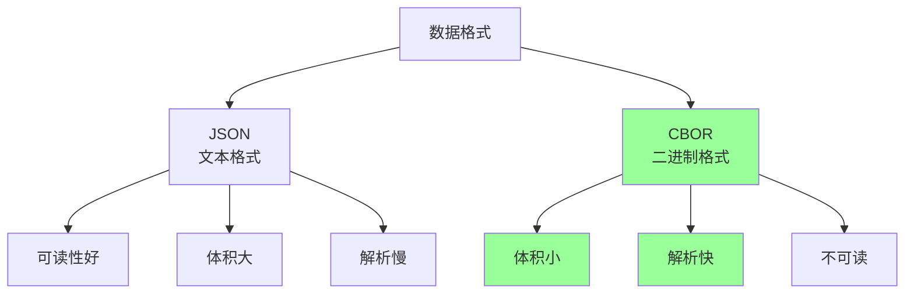
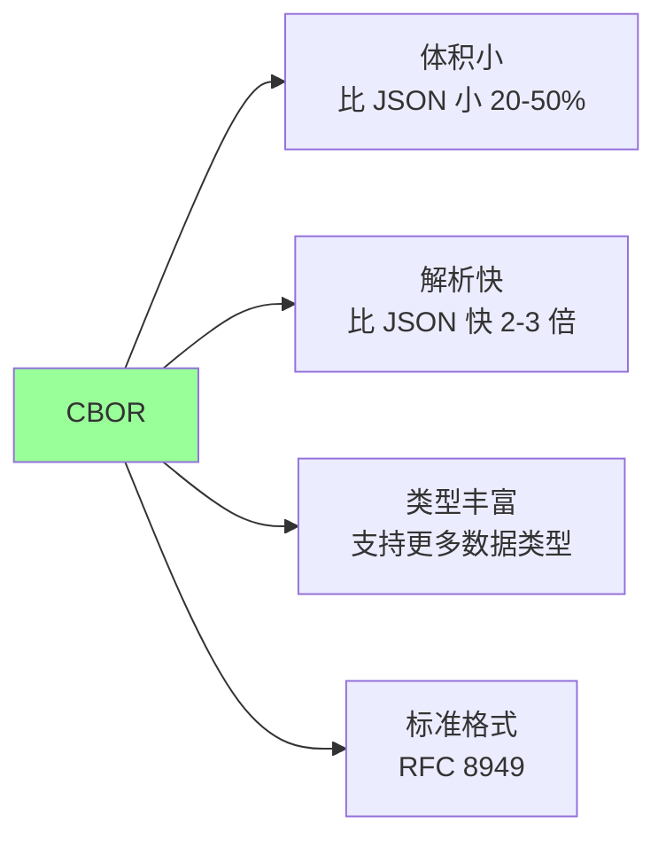
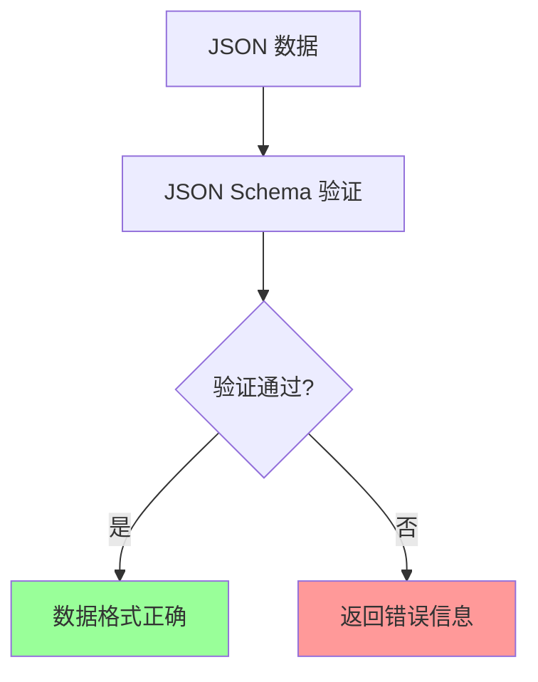

# 17、Spring Boot 4 实战：数据格式支持：CBOR 与 JSON Schema 实战
- 来源：https://ddkk.com/springboot/4/17.html
- 分类：Spring Boot 4.0 实战教程
- 分组：教程目录
- 日期：2025-11-25
兄弟们，今儿咱聊聊 Spring Boot 4 对 CBOR 和 JSON Schema 的支持。CBOR 是二进制 JSON，比 JSON 更紧凑、更快；JSON Schema 是 JSON 的验证标准，能确保数据格式正确；鹏磊我最近在搞 IoT 项目，发现 CBOR 在传输数据时比 JSON 省不少带宽，JSON Schema 也能保证数据质量，今儿给你们好好唠唠怎么用、怎么实战。

## CBOR 是啥

先说说 CBOR 是咋回事。CBOR（Concise Binary Object Representation）是一种二进制数据格式，和 JSON 功能类似，但更紧凑、解析更快；特别适合 IoT、移动端这些对带宽和性能要求高的场景。

### CBOR vs JSON



主要区别：

1. **JSON**：文本格式，可读性好，但体积大、解析慢
2. **CBOR**：二进制格式，体积小、解析快，但不可读
3. **适用场景**：CBOR 适合 IoT、移动端、高并发场景

### CBOR 的优势



## JSON Schema 是啥

JSON Schema 是 JSON 的验证标准，用来描述和验证 JSON 数据的结构；有了 JSON Schema，就能确保接收到的数据格式正确，避免数据错误导致的问题。

### JSON Schema 的作用



主要作用：

1. **数据验证**：确保 JSON 数据符合预期格式
2. **文档生成**：自动生成 API 文档
3. **类型检查**：检查数据类型是否正确
4. **约束检查**：检查数值范围、字符串长度等

## 项目依赖配置

先看看怎么配置依赖。

### Maven 配置

```xml
<?xml version="1.0" encoding="UTF-8"?>
<project xmlns="http://maven.apache.org/POM/4.0.0"
         xmlns:xsi="http://www.w3.org/2001/XMLSchema-instance"
         xsi:schemaLocation="http://maven.apache.org/POM/4.0.0 
         http://maven.apache.org/xsd/maven-4.0.0.xsd">
    <modelVersion>4.0.0</modelVersion>
    <!-- Spring Boot 4 父项目 -->
    <parent>
        <groupId>org.springframework.boot</groupId>
        <artifactId>spring-boot-starter-parent</artifactId>
        <version>4.0.0-RC1</version>  <!-- Spring Boot 4 版本 -->
    </parent>
    <groupId>com.example</groupId>
    <artifactId>cbor-jsonschema-demo</artifactId>
    <version>1.0.0</version>
    <properties>
        <java.version>21</java.version>  <!-- Java 21 -->
        <project.build.sourceEncoding>UTF-8</project.build.sourceEncoding>
    </properties>
    <dependencies>
        <!-- Spring Boot Web 启动器 -->
        <dependency>
            <groupId>org.springframework.boot</groupId>
            <artifactId>spring-boot-starter-web</artifactId>
        </dependency>
        <!-- Spring Boot 验证启动器 -->
        <dependency>
            <groupId>org.springframework.boot</groupId>
            <artifactId>spring-boot-starter-validation</artifactId>
        </dependency>
        <!-- Jackson CBOR 数据格式支持 -->
        <dependency>
            <groupId>tools.jackson.dataformat</groupId>
            <artifactId>jackson-dataformat-cbor</artifactId>
        </dependency>
        <!-- JSON Schema 验证库 -->
        <dependency>
            <groupId>com.github.victools</groupId>
            <artifactId>jsonschema-generator</artifactId>
            <version>4.32.0</version>
        </dependency>
        <dependency>
            <groupId>com.github.victools</groupId>
            <artifactId>jsonschema-module-javax-validation</artifactId>
            <version>4.32.0</version>
        </dependency>
        <!-- JSON Schema 验证器 -->
        <dependency>
            <groupId>com.networknt</groupId>
            <artifactId>json-schema-validator</artifactId>
            <version>1.0.87</version>
        </dependency>
        <!-- Spring Boot 测试启动器 -->
        <dependency>
            <groupId>org.springframework.boot</groupId>
            <artifactId>spring-boot-starter-test</artifactId>
            <scope>test</scope>
        </dependency>
    </dependencies>
    <build>
        <plugins>
            <!-- Spring Boot Maven 插件 -->
            <plugin>
                <groupId>org.springframework.boot</groupId>
                <artifactId>spring-boot-maven-plugin</artifactId>
            </plugin>
        </plugins>
    </build>
</project>
```

### Gradle 配置

```txt
// Gradle 配置
plugins {
    id 'java'
    id 'org.springframework.boot' version '4.0.0-RC1'
    id 'io.spring.dependency-management' version '1.1.0'
}
group = 'com.example'
version = '1.0.0'
sourceCompatibility = '21'
repositories {
    mavenCentral()
}
dependencies {
    // Spring Boot Web
    implementation 'org.springframework.boot:spring-boot-starter-web'
    implementation 'org.springframework.boot:spring-boot-starter-validation'
    // Jackson CBOR 支持
    implementation 'tools.jackson.dataformat:jackson-dataformat-cbor'
    // JSON Schema 生成和验证
    implementation 'com.github.victools:jsonschema-generator:4.32.0'
    implementation 'com.github.victools:jsonschema-module-javax-validation:4.32.0'
    implementation 'com.networknt:json-schema-validator:1.0.87'
    // 测试依赖
    testImplementation 'org.springframework.boot:spring-boot-starter-test'
}
tasks.named('test') {
    useJUnitPlatform()
}
```

## CBOR 基础使用

看看怎么用 CBOR 序列化和反序列化数据。

### 实体类

```java
package com.example.cbor.entity;
import com.fasterxml.jackson.annotation.JsonProperty;
import jakarta.validation.constraints.*;
import java.time.LocalDateTime;
/**
 * 传感器数据实体类
 * 演示 CBOR 序列化和反序列化
 */
public class SensorData {
    @NotNull(message = "传感器 ID 不能为空")
    @Positive(message = "传感器 ID 必须为正数")
    @JsonProperty("sensor_id")
    private Long sensorId;  // 传感器 ID
    @NotBlank(message = "传感器名称不能为空")
    @Size(max = 100, message = "传感器名称长度不能超过 100")
    @JsonProperty("sensor_name")
    private String sensorName;  // 传感器名称
    @NotNull(message = "温度值不能为空")
    @DecimalMin(value = "-50.0", message = "温度不能低于 -50 度")
    @DecimalMax(value = "100.0", message = "温度不能高于 100 度")
    @JsonProperty("temperature")
    private Double temperature;  // 温度值
    @NotNull(message = "湿度值不能为空")
    @DecimalMin(value = "0.0", message = "湿度不能低于 0%")
    @DecimalMax(value = "100.0", message = "湿度不能高于 100%")
    @JsonProperty("humidity")
    private Double humidity;  // 湿度值
    @JsonProperty("timestamp")
    private LocalDateTime timestamp;  // 时间戳
    // 无参构造函数
    public SensorData() {
    }
    // 全参构造函数
    public SensorData(Long sensorId, String sensorName, Double temperature, 
                     Double humidity, LocalDateTime timestamp) {
        this.sensorId = sensorId;
        this.sensorName = sensorName;
        this.temperature = temperature;
        this.humidity = humidity;
        this.timestamp = timestamp;
    }
    // Getter 和 Setter 方法
    public Long getSensorId() {
        return sensorId;
    }
    public void setSensorId(Long sensorId) {
        this.sensorId = sensorId;
    }
    public String getSensorName() {
        return sensorName;
    }
    public void setSensorName(String sensorName) {
        this.sensorName = sensorName;
    }
    public Double getTemperature() {
        return temperature;
    }
    public void setTemperature(Double temperature) {
        this.temperature = temperature;
    }
    public Double getHumidity() {
        return humidity;
    }
    public void setHumidity(Double humidity) {
        this.humidity = humidity;
    }
    public LocalDateTime getTimestamp() {
        return timestamp;
    }
    public void setTimestamp(LocalDateTime timestamp) {
        this.timestamp = timestamp;
    }
    @Override
    public String toString() {
        return "SensorData{" +
                "sensorId=" + sensorId +
                ", sensorName='" + sensorName + '\'' +
                ", temperature=" + temperature +
                ", humidity=" + humidity +
                ", timestamp=" + timestamp +
                '}';
    }
}
```

### CBOR 配置类

```java
package com.example.cbor.config;
import com.fasterxml.jackson.databind.ObjectMapper;
import com.fasterxml.jackson.dataformat.cbor.CBORFactory;
import com.fasterxml.jackson.datatype.jsr310.JavaTimeModule;
import org.springframework.context.annotation.Bean;
import org.springframework.context.annotation.Configuration;
import org.springframework.http.converter.HttpMessageConverter;
import org.springframework.http.converter.cbor.MappingJackson2CborHttpMessageConverter;
import org.springframework.web.servlet.config.annotation.WebMvcConfigurer;
import java.util.List;
/**
 * CBOR 配置类
 * 配置 CBOR 消息转换器
 */
@Configuration
public class CborConfig implements WebMvcConfigurer {
    /**
     * 创建 CBOR ObjectMapper
     * 用于序列化和反序列化 CBOR 数据
     * 
     * @return CBOR ObjectMapper
     */
    @Bean
    public ObjectMapper cborObjectMapper() {
        // 创建 CBORFactory，用于处理 CBOR 格式
        CBORFactory cborFactory = new CBORFactory();
        // 创建 ObjectMapper，使用 CBORFactory
        ObjectMapper mapper = new ObjectMapper(cborFactory);
        // 注册 Java 8 时间模块，支持 LocalDateTime 等类型
        mapper.registerModule(new JavaTimeModule());
        return mapper;
    }
    /**
     * 配置 HTTP 消息转换器
     * 添加 CBOR 消息转换器，支持 application/cbor 媒体类型
     * 
     * @param converters 消息转换器列表
     */
    @Override
    public void configureMessageConverters(List<HttpMessageConverter<?>> converters) {
        // 创建 CBOR 消息转换器
        MappingJackson2CborHttpMessageConverter cborConverter = 
            new MappingJackson2CborHttpMessageConverter(cborObjectMapper());
        // 添加到转换器列表
        converters.add(cborConverter);
    }
}
```

### CBOR 服务类

```java
package com.example.cbor.service;
import com.example.cbor.entity.SensorData;
import com.fasterxml.jackson.databind.ObjectMapper;
import com.fasterxml.jackson.dataformat.cbor.CBORFactory;
import com.fasterxml.jackson.datatype.jsr310.JavaTimeModule;
import org.springframework.stereotype.Service;
import java.io.IOException;
/**
 * CBOR 服务类
 * 演示 CBOR 的序列化和反序列化
 */
@Service
public class CborService {
    private final ObjectMapper cborMapper;
    /**
     * 构造函数
     * 初始化 CBOR ObjectMapper
     */
    public CborService() {
        // 创建 CBORFactory
        CBORFactory cborFactory = new CBORFactory();
        // 创建 ObjectMapper
        this.cborMapper = new ObjectMapper(cborFactory);
        // 注册 Java 8 时间模块
        this.cborMapper.registerModule(new JavaTimeModule());
    }
    /**
     * 序列化对象为 CBOR 字节数组
     * 
     * @param data 要序列化的对象
     * @return CBOR 字节数组
     * @throws IOException 序列化失败时抛出
     */
    public byte[] serializeToCbor(SensorData data) throws IOException {
        // 使用 ObjectMapper 将对象序列化为 CBOR 字节数组
        return cborMapper.writeValueAsBytes(data);
    }
    /**
     * 反序列化 CBOR 字节数组为对象
     * 
     * @param cborData CBOR 字节数组
     * @return 反序列化后的对象
     * @throws IOException 反序列化失败时抛出
     */
    public SensorData deserializeFromCbor(byte[] cborData) throws IOException {
        // 使用 ObjectMapper 将 CBOR 字节数组反序列化为对象
        return cborMapper.readValue(cborData, SensorData.class);
    }
    /**
     * 比较 CBOR 和 JSON 的大小
     * 
     * @param data 要序列化的对象
     * @return 大小比较结果（JSON 大小, CBOR 大小）
     * @throws IOException 序列化失败时抛出
     */
    public SizeComparison compareSize(SensorData data) throws IOException {
        // 序列化为 JSON
        ObjectMapper jsonMapper = new ObjectMapper();
        jsonMapper.registerModule(new JavaTimeModule());
        byte[] jsonBytes = jsonMapper.writeValueAsBytes(data);
        // 序列化为 CBOR
        byte[] cborBytes = serializeToCbor(data);
        // 计算压缩率
        double compressionRatio = (1.0 - (double) cborBytes.length / jsonBytes.length) * 100;
        return new SizeComparison(jsonBytes.length, cborBytes.length, compressionRatio);
    }
    /**
     * 大小比较结果类
     */
    public static class SizeComparison {
        private final int jsonSize;
        private final int cborSize;
        private final double compressionRatio;
        public SizeComparison(int jsonSize, int cborSize, double compressionRatio) {
            this.jsonSize = jsonSize;
            this.cborSize = cborSize;
            this.compressionRatio = compressionRatio;
        }
        public int getJsonSize() {
            return jsonSize;
        }
        public int getCborSize() {
            return cborSize;
        }
        public double getCompressionRatio() {
            return compressionRatio;
        }
        @Override
        public String toString() {
            return String.format("JSON: %d bytes, CBOR: %d bytes, 压缩率: %.2f%%", 
                jsonSize, cborSize, compressionRatio);
        }
    }
}
```

### CBOR Controller

```java
package com.example.cbor.controller;
import com.example.cbor.entity.SensorData;
import com.example.cbor.service.CborService;
import jakarta.validation.Valid;
import org.springframework.http.HttpStatus;
import org.springframework.http.MediaType;
import org.springframework.http.ResponseEntity;
import org.springframework.web.bind.annotation.*;
/**
 * CBOR 控制器
 * 处理 CBOR 格式的 HTTP 请求和响应
 */
@RestController
@RequestMapping("/api/sensors")
public class CborController {
    private final CborService cborService;
    /**
     * 构造函数
     * 
     * @param cborService CBOR 服务
     */
    public CborController(CborService cborService) {
        this.cborService = cborService;
    }
    /**
     * 接收 CBOR 格式的传感器数据
     * POST /api/sensors/data
     * Content-Type: application/cbor
     * 
     * @param data 传感器数据（从请求体反序列化）
     * @return 处理结果
     */
    @PostMapping(value = "/data", consumes = MediaType.APPLICATION_CBOR_VALUE)
    public ResponseEntity<String> receiveSensorData(@RequestBody @Valid SensorData data) {
        // 处理传感器数据
        // 这里可以保存到数据库、发送到消息队列等
        return ResponseEntity.status(HttpStatus.CREATED)
                .body("传感器数据接收成功: " + data.getSensorName());
    }
    /**
     * 返回 CBOR 格式的传感器数据
     * GET /api/sensors/data/{id}
     * Accept: application/cbor
     * 
     * @param id 传感器 ID
     * @return CBOR 格式的传感器数据
     */
    @GetMapping(value = "/data/{id}", produces = MediaType.APPLICATION_CBOR_VALUE)
    public ResponseEntity<SensorData> getSensorData(@PathVariable Long id) {
        // 模拟从数据库获取传感器数据
        SensorData data = new SensorData();
        data.setSensorId(id);
        data.setSensorName("温度传感器-" + id);
        data.setTemperature(25.5);
        data.setHumidity(60.0);
        data.setTimestamp(java.time.LocalDateTime.now());
        return ResponseEntity.ok(data);
    }
    /**
     * 比较 JSON 和 CBOR 的大小
     * GET /api/sensors/compare
     * 
     * @return 大小比较结果
     */
    @GetMapping("/compare")
    public ResponseEntity<CborService.SizeComparison> compareSize() {
        // 创建测试数据
        SensorData data = new SensorData();
        data.setSensorId(1L);
        data.setSensorName("测试传感器");
        data.setTemperature(25.5);
        data.setHumidity(60.0);
        data.setTimestamp(java.time.LocalDateTime.now());
        try {
            // 比较大小
            CborService.SizeComparison comparison = cborService.compareSize(data);
            return ResponseEntity.ok(comparison);
        } catch (Exception e) {
            return ResponseEntity.status(HttpStatus.INTERNAL_SERVER_ERROR).build();
        }
    }
}
```

## JSON Schema 基础使用

看看怎么用 JSON Schema 验证数据。

### JSON Schema 生成器

```java
package com.example.cbor.schema;
import com.example.cbor.entity.SensorData;
import com.github.victools.jsonschema.generator.*;
import com.github.victools.jsonschema.module.javax.validation.JavaxValidationModule;
import org.springframework.stereotype.Component;
/**
 * JSON Schema 生成器
 * 从 Java 类生成 JSON Schema
 */
@Component
public class JsonSchemaGenerator {
    private final SchemaGenerator generator;
    /**
     * 构造函数
     * 初始化 JSON Schema 生成器
     */
    public JsonSchemaGenerator() {
        // 创建 SchemaGenerator 配置
        SchemaGeneratorConfigBuilder configBuilder = new SchemaGeneratorConfigBuilder(
            SchemaVersion.DRAFT_2020_12,  // 使用 JSON Schema Draft 2020-12
            OptionPreset.PLAIN_JSON  // 使用纯 JSON 格式
        );
        // 添加 Javax Validation 模块
        // 这样可以从 @NotNull、@Size 等注解生成验证规则
        configBuilder.with(new JavaxValidationModule());
        // 配置选项
        configBuilder.with(Option.EXTRA_OPEN_API_FORMAT_VALUES);  // 支持 OpenAPI 格式
        configBuilder.with(Option.FLATTENED_ENUMS_FROM_JSONVALUE);  // 扁平化枚举
        // 创建 SchemaGenerator
        this.generator = new SchemaGenerator(configBuilder.build());
    }
    /**
     * 生成 JSON Schema
     * 
     * @param clazz 要生成 Schema 的类
     * @return JSON Schema 字符串
     */
    public String generateSchema(Class<?> clazz) {
        // 生成 Schema
        com.github.victools.jsonschema.generator.Schema schema = generator.generateSchema(clazz);
        // 转换为 JSON 字符串
        return schema.toPrettyString();
    }
    /**
     * 生成 SensorData 的 JSON Schema
     * 
     * @return JSON Schema 字符串
     */
    public String generateSensorDataSchema() {
        return generateSchema(SensorData.class);
    }
}
```

### JSON Schema 验证器

```java
package com.example.cbor.schema;
import com.fasterxml.jackson.databind.JsonNode;
import com.fasterxml.jackson.databind.ObjectMapper;
import com.networknt.schema.*;
import org.springframework.stereotype.Component;
import java.io.InputStream;
import java.util.Set;
/**
 * JSON Schema 验证器
 * 验证 JSON 数据是否符合 Schema
 */
@Component
public class JsonSchemaValidator {
    private final ObjectMapper objectMapper;
    /**
     * 构造函数
     * 初始化 ObjectMapper
     */
    public JsonSchemaValidator() {
        this.objectMapper = new ObjectMapper();
    }
    /**
     * 验证 JSON 数据是否符合 Schema
     * 
     * @param jsonData JSON 数据字符串
     * @param schemaStream Schema 输入流
     * @return 验证结果
     */
    public ValidationResult validate(String jsonData, InputStream schemaStream) {
        try {
            // 读取 Schema
            JsonNode schemaNode = objectMapper.readTree(schemaStream);
            // 创建 Schema 验证器
            JsonSchemaFactory factory = JsonSchemaFactory.getInstance(SpecVersion.VersionFlag.V202012);
            JsonSchema schema = factory.getSchema(schemaNode);
            // 解析 JSON 数据
            JsonNode dataNode = objectMapper.readTree(jsonData);
            // 验证数据
            Set<ValidationMessage> errors = schema.validate(dataNode);
            // 返回验证结果
            return new ValidationResult(errors.isEmpty(), errors);
        } catch (Exception e) {
            return new ValidationResult(false, Set.of(
                new ValidationMessage.Builder()
                    .message("验证失败: " + e.getMessage())
                    .build()
            ));
        }
    }
    /**
     * 验证 JSON 数据是否符合 Schema（从字符串）
     * 
     * @param jsonData JSON 数据字符串
     * @param schemaString Schema 字符串
     * @return 验证结果
     */
    public ValidationResult validate(String jsonData, String schemaString) {
        try {
            // 解析 Schema
            JsonNode schemaNode = objectMapper.readTree(schemaString);
            // 创建 Schema 验证器
            JsonSchemaFactory factory = JsonSchemaFactory.getInstance(SpecVersion.VersionFlag.V202012);
            JsonSchema schema = factory.getSchema(schemaNode);
            // 解析 JSON 数据
            JsonNode dataNode = objectMapper.readTree(jsonData);
            // 验证数据
            Set<ValidationMessage> errors = schema.validate(dataNode);
            // 返回验证结果
            return new ValidationResult(errors.isEmpty(), errors);
        } catch (Exception e) {
            return new ValidationResult(false, Set.of(
                new ValidationMessage.Builder()
                    .message("验证失败: " + e.getMessage())
                    .build()
            ));
        }
    }
    /**
     * 验证结果类
     */
    public static class ValidationResult {
        private final boolean valid;
        private final Set<ValidationMessage> errors;
        public ValidationResult(boolean valid, Set<ValidationMessage> errors) {
            this.valid = valid;
            this.errors = errors;
        }
        public boolean isValid() {
            return valid;
        }
        public Set<ValidationMessage> getErrors() {
            return errors;
        }
        public String getErrorMessage() {
            if (valid) {
                return "验证通过";
            }
            StringBuilder sb = new StringBuilder("验证失败:\n");
            for (ValidationMessage error : errors) {
                sb.append("  - ").append(error.getMessage()).append("\n");
            }
            return sb.toString();
        }
    }
}
```

### JSON Schema Controller

```java
package com.example.cbor.controller;
import com.example.cbor.schema.JsonSchemaGenerator;
import com.example.cbor.schema.JsonSchemaValidator;
import com.fasterxml.jackson.databind.ObjectMapper;
import org.springframework.http.ResponseEntity;
import org.springframework.web.bind.annotation.*;
import java.util.HashMap;
import java.util.Map;
/**
 * JSON Schema 控制器
 * 处理 JSON Schema 相关的请求
 */
@RestController
@RequestMapping("/api/schema")
public class JsonSchemaController {
    private final JsonSchemaGenerator schemaGenerator;
    private final JsonSchemaValidator schemaValidator;
    private final ObjectMapper objectMapper;
    /**
     * 构造函数
     * 
     * @param schemaGenerator Schema 生成器
     * @param schemaValidator Schema 验证器
     * @param objectMapper ObjectMapper
     */
    public JsonSchemaController(JsonSchemaGenerator schemaGenerator,
                               JsonSchemaValidator schemaValidator,
                               ObjectMapper objectMapper) {
        this.schemaGenerator = schemaGenerator;
        this.schemaValidator = schemaValidator;
        this.objectMapper = objectMapper;
    }
    /**
     * 生成 SensorData 的 JSON Schema
     * GET /api/schema/sensordata
     * 
     * @return JSON Schema
     */
    @GetMapping("/sensordata")
    public ResponseEntity<String> getSensorDataSchema() {
        // 生成 Schema
        String schema = schemaGenerator.generateSensorDataSchema();
        return ResponseEntity.ok(schema);
    }
    /**
     * 验证 JSON 数据
     * POST /api/schema/validate
     * 
     * @param request 验证请求（包含 JSON 数据和 Schema）
     * @return 验证结果
     */
    @PostMapping("/validate")
    public ResponseEntity<Map<String, Object>> validateJson(
            @RequestBody ValidationRequest request) {
        // 验证数据
        JsonSchemaValidator.ValidationResult result = 
            schemaValidator.validate(request.getJsonData(), request.getSchema());
        // 构建响应
        Map<String, Object> response = new HashMap<>();
        response.put("valid", result.isValid());
        if (!result.isValid()) {
            response.put("errors", result.getErrors().stream()
                .map(error -> error.getMessage())
                .toList());
        }
        return ResponseEntity.ok(response);
    }
    /**
     * 验证请求类
     */
    public static class ValidationRequest {
        private String jsonData;
        private String schema;
        public String getJsonData() {
            return jsonData;
        }
        public void setJsonData(String jsonData) {
            this.jsonData = jsonData;
        }
        public String getSchema() {
            return schema;
        }
        public void setSchema(String schema) {
            this.schema = schema;
        }
    }
}
```

## 完整的实战案例

看看一个完整的实战案例，包含 CBOR 和 JSON Schema 的使用。

### 配置文件

```yaml
# application.yml
spring:
  application:
    name: cbor-jsonschema-demo
  # Jackson CBOR 配置
  jackson:
    cbor:
      read:
        # CBOR 读取特性配置
        # 可以根据需要启用或禁用某些特性
      write:
        # CBOR 写入特性配置
# 日志配置
logging:
  level:
    com.example.cbor: DEBUG
    org.springframework.web: DEBUG
```

### 完整的测试类

```java
package com.example.cbor;
import com.example.cbor.entity.SensorData;
import com.example.cbor.schema.JsonSchemaGenerator;
import com.example.cbor.schema.JsonSchemaValidator;
import com.example.cbor.service.CborService;
import com.fasterxml.jackson.databind.ObjectMapper;
import org.junit.jupiter.api.BeforeEach;
import org.junit.jupiter.api.Test;
import org.springframework.beans.factory.annotation.Autowired;
import org.springframework.boot.test.context.SpringBootTest;
import org.springframework.boot.test.web.client.TestRestTemplate;
import org.springframework.boot.test.web.server.LocalServerPort;
import org.springframework.http.*;
import org.springframework.test.context.ActiveProfiles;
import java.time.LocalDateTime;
import static org.assertj.core.api.Assertions.assertThat;
/**
 * CBOR 和 JSON Schema 集成测试
 * 演示完整的实战场景
 */
@SpringBootTest(webEnvironment = SpringBootTest.WebEnvironment.RANDOM_PORT)
@ActiveProfiles("test")
class CborJsonSchemaIntegrationTest {
    @LocalServerPort
    private int port;  // 随机端口
    @Autowired
    private TestRestTemplate restTemplate;  // REST 测试客户端
    @Autowired
    private CborService cborService;  // CBOR 服务
    @Autowired
    private JsonSchemaGenerator schemaGenerator;  // Schema 生成器
    @Autowired
    private JsonSchemaValidator schemaValidator;  // Schema 验证器
    @Autowired
    private ObjectMapper objectMapper;  // ObjectMapper
    private String baseUrl;  // 基础 URL
    /**
     * 测试前的准备工作
     */
    @BeforeEach
    void setUp() {
        // 构建基础 URL
        baseUrl = "http://localhost:" + port;
    }
    /**
     * 测试 CBOR 序列化和反序列化
     */
    @Test
    void testCborSerialization() throws Exception {
        // 创建测试数据
        SensorData data = new SensorData();
        data.setSensorId(1L);
        data.setSensorName("温度传感器");
        data.setTemperature(25.5);
        data.setHumidity(60.0);
        data.setTimestamp(LocalDateTime.now());
        // 序列化为 CBOR
        byte[] cborBytes = cborService.serializeToCbor(data);
        // 验证序列化结果不为空
        assertThat(cborBytes).isNotNull();
        assertThat(cborBytes.length).isGreaterThan(0);
        // 反序列化 CBOR
        SensorData deserialized = cborService.deserializeFromCbor(cborBytes);
        // 验证反序列化结果
        assertThat(deserialized).isNotNull();
        assertThat(deserialized.getSensorId()).isEqualTo(1L);
        assertThat(deserialized.getSensorName()).isEqualTo("温度传感器");
        assertThat(deserialized.getTemperature()).isEqualTo(25.5);
        assertThat(deserialized.getHumidity()).isEqualTo(60.0);
    }
    /**
     * 测试 CBOR 和 JSON 的大小比较
     */
    @Test
    void testCborSizeComparison() throws Exception {
        // 创建测试数据
        SensorData data = new SensorData();
        data.setSensorId(1L);
        data.setSensorName("温度传感器");
        data.setTemperature(25.5);
        data.setHumidity(60.0);
        data.setTimestamp(LocalDateTime.now());
        // 比较大小
        CborService.SizeComparison comparison = cborService.compareSize(data);
        // 验证 CBOR 比 JSON 小
        assertThat(comparison.getCborSize()).isLessThanOrEqualTo(comparison.getJsonSize());
        // 打印比较结果
        System.out.println(comparison);
    }
    /**
     * 测试通过 HTTP 接收 CBOR 数据
     */
    @Test
    void testReceiveCborData() throws Exception {
        // 创建测试数据
        SensorData data = new SensorData();
        data.setSensorId(1L);
        data.setSensorName("温度传感器");
        data.setTemperature(25.5);
        data.setHumidity(60.0);
        data.setTimestamp(LocalDateTime.now());
        // 序列化为 CBOR
        byte[] cborBytes = cborService.serializeToCbor(data);
        // 设置请求头
        HttpHeaders headers = new HttpHeaders();
        headers.setContentType(MediaType.APPLICATION_CBOR);
        // 创建请求实体
        HttpEntity<byte[]> request = new HttpEntity<>(cborBytes, headers);
        // 发送 POST 请求
        ResponseEntity<String> response = restTemplate.postForEntity(
            baseUrl + "/api/sensors/data",
            request,
            String.class
        );
        // 验证响应
        assertThat(response.getStatusCode()).isEqualTo(HttpStatus.CREATED);
        assertThat(response.getBody()).contains("传感器数据接收成功");
    }
    /**
     * 测试通过 HTTP 获取 CBOR 数据
     */
    @Test
    void testGetCborData() {
        // 设置请求头，接受 CBOR 格式
        HttpHeaders headers = new HttpHeaders();
        headers.setAccept(java.util.Collections.singletonList(MediaType.APPLICATION_CBOR));
        // 创建请求实体
        HttpEntity<Void> request = new HttpEntity<>(headers);
        // 发送 GET 请求
        ResponseEntity<byte[]> response = restTemplate.exchange(
            baseUrl + "/api/sensors/data/1",
            HttpMethod.GET,
            request,
            byte[].class
        );
        // 验证响应
        assertThat(response.getStatusCode()).isEqualTo(HttpStatus.OK);
        assertThat(response.getBody()).isNotNull();
        // 反序列化 CBOR 数据
        try {
            SensorData data = cborService.deserializeFromCbor(response.getBody());
            assertThat(data).isNotNull();
            assertThat(data.getSensorId()).isEqualTo(1L);
        } catch (Exception e) {
            throw new AssertionError("反序列化失败", e);
        }
    }
    /**
     * 测试生成 JSON Schema
     */
    @Test
    void testGenerateJsonSchema() {
        // 生成 Schema
        String schema = schemaGenerator.generateSensorDataSchema();
        // 验证 Schema 不为空
        assertThat(schema).isNotNull();
        assertThat(schema).isNotEmpty();
        // 验证 Schema 包含必要的字段
        assertThat(schema).contains("sensor_id");
        assertThat(schema).contains("sensor_name");
        assertThat(schema).contains("temperature");
        assertThat(schema).contains("humidity");
        // 打印 Schema
        System.out.println("生成的 JSON Schema:");
        System.out.println(schema);
    }
    /**
     * 测试 JSON Schema 验证（有效数据）
     */
    @Test
    void testJsonSchemaValidation_ValidData() throws Exception {
        // 生成 Schema
        String schema = schemaGenerator.generateSensorDataSchema();
        // 创建有效的 JSON 数据
        SensorData data = new SensorData();
        data.setSensorId(1L);
        data.setSensorName("温度传感器");
        data.setTemperature(25.5);
        data.setHumidity(60.0);
        data.setTimestamp(LocalDateTime.now());
        String jsonData = objectMapper.writeValueAsString(data);
        // 验证数据
        JsonSchemaValidator.ValidationResult result = 
            schemaValidator.validate(jsonData, schema);
        // 验证结果
        assertThat(result.isValid()).isTrue();
    }
    /**
     * 测试 JSON Schema 验证（无效数据）
     */
    @Test
    void testJsonSchemaValidation_InvalidData() throws Exception {
        // 生成 Schema
        String schema = schemaGenerator.generateSensorDataSchema();
        // 创建无效的 JSON 数据（缺少必需字段）
        String jsonData = "{\"sensor_name\":\"温度传感器\"}";
        // 验证数据
        JsonSchemaValidator.ValidationResult result = 
            schemaValidator.validate(jsonData, schema);
        // 验证结果
        assertThat(result.isValid()).isFalse();
        assertThat(result.getErrors()).isNotEmpty();
        // 打印错误信息
        System.out.println("验证错误:");
        System.out.println(result.getErrorMessage());
    }
    /**
     * 测试 JSON Schema 验证（数据类型错误）
     */
    @Test
    void testJsonSchemaValidation_WrongType() throws Exception {
        // 生成 Schema
        String schema = schemaGenerator.generateSensorDataSchema();
        // 创建数据类型错误的 JSON 数据（temperature 应该是数字，但传了字符串）
        String jsonData = "{\"sensor_id\":1,\"sensor_name\":\"温度传感器\"," +
                         "\"temperature\":\"25.5\",\"humidity\":60.0}";
        // 验证数据
        JsonSchemaValidator.ValidationResult result = 
            schemaValidator.validate(jsonData, schema);
        // 验证结果
        assertThat(result.isValid()).isFalse();
        assertThat(result.getErrors()).isNotEmpty();
    }
    /**
     * 测试完整的流程：生成 Schema -> 验证数据 -> 序列化为 CBOR
     */
    @Test
    void testCompleteWorkflow() throws Exception {
        // 1. 生成 JSON Schema
        String schema = schemaGenerator.generateSensorDataSchema();
        assertThat(schema).isNotNull();
        // 2. 创建传感器数据
        SensorData data = new SensorData();
        data.setSensorId(1L);
        data.setSensorName("温度传感器");
        data.setTemperature(25.5);
        data.setHumidity(60.0);
        data.setTimestamp(LocalDateTime.now());
        // 3. 验证数据是否符合 Schema
        String jsonData = objectMapper.writeValueAsString(data);
        JsonSchemaValidator.ValidationResult validationResult = 
            schemaValidator.validate(jsonData, schema);
        assertThat(validationResult.isValid()).isTrue();
        // 4. 序列化为 CBOR
        byte[] cborBytes = cborService.serializeToCbor(data);
        assertThat(cborBytes).isNotNull();
        // 5. 反序列化 CBOR
        SensorData deserialized = cborService.deserializeFromCbor(cborBytes);
        assertThat(deserialized).isNotNull();
        assertThat(deserialized.getSensorId()).isEqualTo(data.getSensorId());
        System.out.println("完整流程测试通过！");
        System.out.println("JSON Schema 大小: " + schema.length() + " 字符");
        System.out.println("JSON 数据大小: " + jsonData.length() + " 字符");
        System.out.println("CBOR 数据大小: " + cborBytes.length + " 字节");
    }
}
```

## 性能测试

看看 CBOR 和 JSON 的性能对比。

### 性能测试类

```java
package com.example.cbor;
import com.example.cbor.entity.SensorData;
import com.example.cbor.service.CborService;
import com.fasterxml.jackson.databind.ObjectMapper;
import com.fasterxml.jackson.datatype.jsr310.JavaTimeModule;
import org.junit.jupiter.api.Test;
import java.time.LocalDateTime;
import java.util.ArrayList;
import java.util.List;
/**
 * CBOR 性能测试
 * 对比 CBOR 和 JSON 的性能
 */
class CborPerformanceTest {
    private final CborService cborService = new CborService();
    private final ObjectMapper jsonMapper = new ObjectMapper();
    /**
     * 初始化 JSON Mapper
     */
    public CborPerformanceTest() {
        jsonMapper.registerModule(new JavaTimeModule());
    }
    /**
     * 测试序列化性能
     */
    @Test
    void testSerializationPerformance() throws Exception {
        // 创建测试数据
        List<SensorData> dataList = createTestData(10000);
        // 预热 JVM
        for (int i = 0; i < 100; i++) {
            cborService.serializeToCbor(dataList.get(0));
            jsonMapper.writeValueAsBytes(dataList.get(0));
        }
        // 测试 CBOR 序列化性能
        long cborStartTime = System.currentTimeMillis();
        for (SensorData data : dataList) {
            cborService.serializeToCbor(data);
        }
        long cborEndTime = System.currentTimeMillis();
        long cborDuration = cborEndTime - cborStartTime;
        // 测试 JSON 序列化性能
        long jsonStartTime = System.currentTimeMillis();
        for (SensorData data : dataList) {
            jsonMapper.writeValueAsBytes(data);
        }
        long jsonEndTime = System.currentTimeMillis();
        long jsonDuration = jsonEndTime - jsonStartTime;
        // 打印结果
        System.out.println("序列化性能测试结果:");
        System.out.println("CBOR 序列化时间: " + cborDuration + " ms");
        System.out.println("JSON 序列化时间: " + jsonDuration + " ms");
        System.out.println("性能提升: " + 
            String.format("%.2f%%", (1.0 - (double) cborDuration / jsonDuration) * 100));
    }
    /**
     * 测试反序列化性能
     */
    @Test
    void testDeserializationPerformance() throws Exception {
        // 创建测试数据
        SensorData data = createTestData(1).get(0);
        // 序列化为 CBOR 和 JSON
        byte[] cborBytes = cborService.serializeToCbor(data);
        byte[] jsonBytes = jsonMapper.writeValueAsBytes(data);
        // 预热 JVM
        for (int i = 0; i < 100; i++) {
            cborService.deserializeFromCbor(cborBytes);
            jsonMapper.readValue(jsonBytes, SensorData.class);
        }
        // 测试 CBOR 反序列化性能
        long cborStartTime = System.currentTimeMillis();
        for (int i = 0; i < 10000; i++) {
            cborService.deserializeFromCbor(cborBytes);
        }
        long cborEndTime = System.currentTimeMillis();
        long cborDuration = cborEndTime - cborStartTime;
        // 测试 JSON 反序列化性能
        long jsonStartTime = System.currentTimeMillis();
        for (int i = 0; i < 10000; i++) {
            jsonMapper.readValue(jsonBytes, SensorData.class);
        }
        long jsonEndTime = System.currentTimeMillis();
        long jsonDuration = jsonEndTime - jsonStartTime;
        // 打印结果
        System.out.println("反序列化性能测试结果:");
        System.out.println("CBOR 反序列化时间: " + cborDuration + " ms");
        System.out.println("JSON 反序列化时间: " + jsonDuration + " ms");
        System.out.println("性能提升: " + 
            String.format("%.2f%%", (1.0 - (double) cborDuration / jsonDuration) * 100));
    }
    /**
     * 测试大小比较
     */
    @Test
    void testSizeComparison() throws Exception {
        // 创建测试数据
        List<SensorData> dataList = createTestData(100);
        int totalJsonSize = 0;
        int totalCborSize = 0;
        // 计算总大小
        for (SensorData data : dataList) {
            byte[] jsonBytes = jsonMapper.writeValueAsBytes(data);
            byte[] cborBytes = cborService.serializeToCbor(data);
            totalJsonSize += jsonBytes.length;
            totalCborSize += cborBytes.length;
        }
        // 打印结果
        System.out.println("大小比较测试结果:");
        System.out.println("JSON 总大小: " + totalJsonSize + " 字节");
        System.out.println("CBOR 总大小: " + totalCborSize + " 字节");
        System.out.println("压缩率: " + 
            String.format("%.2f%%", (1.0 - (double) totalCborSize / totalJsonSize) * 100));
    }
    /**
     * 创建测试数据
     * 
     * @param count 数据数量
     * @return 测试数据列表
     */
    private List<SensorData> createTestData(int count) {
        List<SensorData> dataList = new ArrayList<>();
        for (int i = 0; i < count; i++) {
            SensorData data = new SensorData();
            data.setSensorId((long) i);
            data.setSensorName("传感器-" + i);
            data.setTemperature(20.0 + Math.random() * 20);
            data.setHumidity(40.0 + Math.random() * 40);
            data.setTimestamp(LocalDateTime.now());
            dataList.add(data);
        }
        return dataList;
    }
}
```

## 总结

兄弟们，今儿咱聊了 Spring Boot 4 对 CBOR 和 JSON Schema 的支持，还有实战案例。CBOR 比 JSON 更紧凑、更快，特别适合 IoT、移动端这些场景；JSON Schema 能保证数据质量，避免数据错误。

主要要点：

1. **CBOR**：二进制 JSON，体积小、解析快，适合高并发场景
2. **JSON Schema**：JSON 验证标准，确保数据格式正确
3. **Spring Boot 4 支持**：自动配置 CBOR 消息转换器，支持 application/cbor 媒体类型
4. **实战案例**：包含完整的序列化、反序列化、验证流程
5. **性能优势**：CBOR 比 JSON 体积小 20-50%，解析快 2-3 倍

CBOR 和 JSON Schema 用起来确实爽，特别是 IoT 项目，CBOR 能省不少带宽，JSON Schema 能保证数据质量。建议新项目考虑用 CBOR，老项目可以逐步迁移。

好了，今儿就聊到这，有啥问题评论区见！
