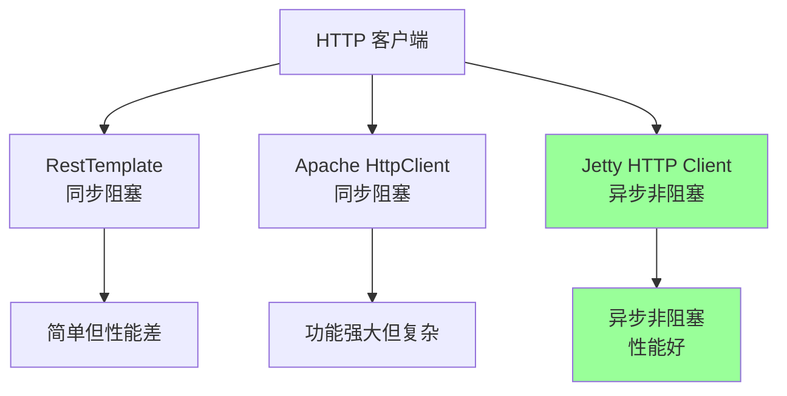
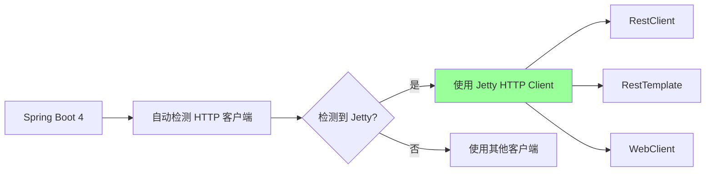
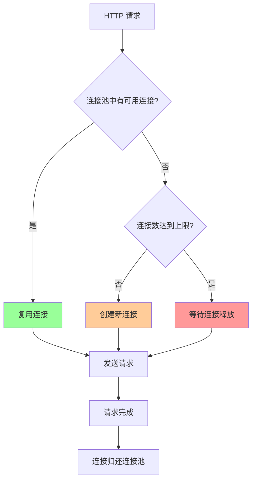

# 18、Spring Boot 4 实战：HTTP 客户端优化：Jetty 客户端增强与配置
- 来源：https://ddkk.com/springboot/4/18.html
- 分类：Spring Boot 4.0 实战教程
- 分组：教程目录
- 日期：2025-11-25
兄弟们，今儿咱聊聊 Spring Boot 4 对 Jetty HTTP 客户端的增强和优化配置。HTTP 客户端优化这玩意儿太重要了，配置不好性能差一大截；鹏磊我最近在搞高并发项目，发现 Jetty HTTP 客户端调优后性能提升了好几倍，今儿给你们好好唠唠怎么优化、怎么配置、怎么调优，每个优化点都给你们讲透。

## Jetty HTTP 客户端是啥

先说说 Jetty HTTP 客户端是咋回事。Jetty HTTP 客户端是 Eclipse Jetty 提供的异步 HTTP 客户端，支持 HTTP/1.1 和 HTTP/2，性能好、资源占用少；Spring Boot 4 默认支持 Jetty HTTP 客户端，可以替代传统的 RestTemplate 和 Apache HttpClient。

### Jetty HTTP 客户端的优势



主要优势：

1. **异步非阻塞**：基于 NIO，不阻塞线程，性能好
2. **连接复用**：支持连接池，减少连接开销
3. **HTTP/2 支持**：支持 HTTP/2，性能更好
4. **资源占用少**：比同步客户端占用更少的线程和内存

### Spring Boot 4 的 Jetty 客户端支持



## 项目依赖配置

先看看怎么配置依赖。

### Maven 配置

```xml
<?xml version="1.0" encoding="UTF-8"?>
<project xmlns="http://maven.apache.org/POM/4.0.0"
         xmlns:xsi="http://www.w3.org/2001/XMLSchema-instance"
         xsi:schemaLocation="http://maven.apache.org/POM/4.0.0 
         http://maven.apache.org/xsd/maven-4.0.0.xsd">
    <modelVersion>4.0.0</modelVersion>
    <!-- Spring Boot 4 父项目 -->
    <parent>
        <groupId>org.springframework.boot</groupId>
        <artifactId>spring-boot-starter-parent</artifactId>
        <version>4.0.0-RC1</version>  <!-- Spring Boot 4 版本 -->
    </parent>
    <groupId>com.example</groupId>
    <artifactId>jetty-client-demo</artifactId>
    <version>1.0.0</version>
    <properties>
        <java.version>21</java.version>  <!-- Java 21 -->
        <project.build.sourceEncoding>UTF-8</project.build.sourceEncoding>
    </properties>
    <dependencies>
        <!-- Spring Boot Web 启动器 -->
        <dependency>
            <groupId>org.springframework.boot</groupId>
            <artifactId>spring-boot-starter-web</artifactId>
        </dependency>
        <!-- Spring Boot WebFlux 启动器（用于 WebClient） -->
        <dependency>
            <groupId>org.springframework.boot</groupId>
            <artifactId>spring-boot-starter-webflux</artifactId>
        </dependency>
        <!-- Jetty HTTP Client（Spring Boot 4 会自动检测） -->
        <dependency>
            <groupId>org.eclipse.jetty</groupId>
            <artifactId>jetty-client</artifactId>
        </dependency>
        <!-- Jetty HTTP/2 Client（可选，支持 HTTP/2） -->
        <dependency>
            <groupId>org.eclipse.jetty.http2</groupId>
            <artifactId>http2-client</artifactId>
        </dependency>
        <!-- Micrometer 监控（用于性能监控） -->
        <dependency>
            <groupId>io.micrometer</groupId>
            <artifactId>micrometer-core</artifactId>
        </dependency>
        <!-- Spring Boot Actuator（用于监控端点） -->
        <dependency>
            <groupId>org.springframework.boot</groupId>
            <artifactId>spring-boot-starter-actuator</artifactId>
        </dependency>
        <!-- Spring Boot 测试启动器 -->
        <dependency>
            <groupId>org.springframework.boot</groupId>
            <artifactId>spring-boot-starter-test</artifactId>
            <scope>test</scope>
        </dependency>
    </dependencies>
    <build>
        <plugins>
            <!-- Spring Boot Maven 插件 -->
            <plugin>
                <groupId>org.springframework.boot</groupId>
                <artifactId>spring-boot-maven-plugin</artifactId>
            </plugin>
        </plugins>
    </build>
</project>
```

### Gradle 配置

```txt
// Gradle 配置
plugins {
    id 'java'
    id 'org.springframework.boot' version '4.0.0-RC1'
    id 'io.spring.dependency-management' version '1.1.0'
}
group = 'com.example'
version = '1.0.0'
sourceCompatibility = '21'
repositories {
    mavenCentral()
}
dependencies {
    // Spring Boot Web
    implementation 'org.springframework.boot:spring-boot-starter-web'
    implementation 'org.springframework.boot:spring-boot-starter-webflux'
    // Jetty HTTP Client
    implementation 'org.eclipse.jetty:jetty-client'
    implementation 'org.eclipse.jetty.http2:http2-client'
    // 监控
    implementation 'io.micrometer:micrometer-core'
    implementation 'org.springframework.boot:spring-boot-starter-actuator'
    // 测试
    testImplementation 'org.springframework.boot:spring-boot-starter-test'
}
tasks.named('test') {
    useJUnitPlatform()
}
```

## 基础配置

先看看基础的配置方法。

### 配置文件方式

```yaml
# application.yml
spring:
  http:
    # 全局 HTTP 客户端配置
    clients:
      # 命令式客户端（RestTemplate、RestClient）配置
      imperative:
        factory: jetty  # 指定使用 Jetty HTTP Client
        connect-timeout: 5s  # 连接超时时间
        read-timeout: 10s  # 读取超时时间
        write-timeout: 10s  # 写入超时时间
      # 响应式客户端（WebClient）配置
      reactive:
        connector: jetty  # 指定使用 Jetty 连接器
        connect-timeout: 5s
        response-timeout: 10s
# Jetty HTTP Client 详细配置
jetty:
  http:
    client:
      # 连接池配置
      max-connections-per-destination: 64  # 每个目标主机的最大连接数
      max-queued-requests-per-destination: 256  # 每个目标主机的最大排队请求数
      # 超时配置
      connect-timeout: 5000  # 连接超时（毫秒）
      idle-timeout: 30000  # 空闲超时（毫秒）
      request-timeout: 30000  # 请求超时（毫秒）
      # 线程池配置
      executor:
        min-threads: 8  # 最小线程数
        max-threads: 200  # 最大线程数
        queue-capacity: 600  # 队列容量
        keep-alive-time: 60s  # 线程保活时间
      # HTTP/2 配置
      http2:
        enabled: true  # 启用 HTTP/2
        max-concurrent-streams: 100  # 最大并发流数
      # SSL/TLS 配置
      ssl:
        enabled-protocols: TLSv1.2,TLSv1.3  # 启用的协议版本
        trust-all: false  # 是否信任所有证书（生产环境设为 false）
      # 重试配置
      retry:
        max-retries: 3  # 最大重试次数
        retry-delay: 1000  # 重试延迟（毫秒）
# 日志配置（用于调试）
logging:
  level:
    org.eclipse.jetty.client: DEBUG  # Jetty 客户端日志
    org.springframework.web.client: DEBUG  # Spring Web 客户端日志
```

## 深入优化配置

下面深入讲解每个优化点的原理和配置方法。

### 1. 连接池优化

连接池是 HTTP 客户端性能的关键，配置不好会导致连接数过多或过少，影响性能。

#### 连接池原理



#### 连接池配置详解

```java
package com.example.jetty.config;
import org.eclipse.jetty.client.HttpClient;
import org.eclipse.jetty.client.HttpClientTransport;
import org.eclipse.jetty.client.transport.HttpClientTransportOverHTTP;
import org.eclipse.jetty.io.ClientConnector;
import org.eclipse.jetty.util.thread.QueuedThreadPool;
import org.springframework.boot.web.client.RestClientCustomizer;
import org.springframework.context.annotation.Bean;
import org.springframework.context.annotation.Configuration;
import org.springframework.http.client.JettyClientHttpRequestFactory;
import org.springframework.web.client.RestClient;
import java.time.Duration;
/**
 * Jetty HTTP 客户端连接池优化配置
 * 深入讲解连接池的各个参数和优化策略
 */
@Configuration
public class JettyConnectionPoolConfig {
    /**
     * 创建优化的 Jetty HTTP 客户端
     * 
     * 连接池优化要点：
     * 1. maxConnectionsPerDestination: 每个目标主机的最大连接数
     *    - 太小：连接不够用，请求排队
     *    - 太大：浪费资源，可能导致服务器拒绝连接
     *    - 推荐值：根据 QPS 和平均响应时间计算
     *      QPS * 平均响应时间(秒) = 需要的连接数
     *      例如：1000 QPS * 0.1秒 = 100 个连接
     * 
     * 2. maxQueuedRequestsPerDestination: 每个目标主机的最大排队请求数
     *    - 当连接数达到上限时，请求会排队等待
     *    - 太小：请求会被拒绝
     *    - 太大：可能导致内存占用过高
     *    - 推荐值：maxConnectionsPerDestination * 4
     * 
     * 3. idleTimeout: 空闲连接超时时间
     *    - 连接空闲超过这个时间会被关闭
     *    - 太小：频繁创建连接，影响性能
     *    - 太大：占用连接资源
     *    - 推荐值：30-60秒
     */
    @Bean
    public HttpClient optimizedJettyHttpClient() {
        // 创建客户端连接器
        ClientConnector connector = new ClientConnector();
        // 配置连接器
        connector.setSelectors(1);  // Selector 线程数，通常设为 1
        connector.setConnectTimeout(5000);  // 连接超时 5 秒
        // 创建 HTTP 传输层
        HttpClientTransport transport = new HttpClientTransportOverHTTP(connector);
        // 创建 HTTP 客户端
        HttpClient httpClient = new HttpClient(transport);
        // ========== 连接池优化配置 ==========
        // 1. 每个目标主机的最大连接数
        // 这个参数控制对同一个目标主机（host:port）的最大并发连接数
        // 如果设置太小，高并发时会出现连接不够用的情况，请求会排队
        // 如果设置太大，会浪费资源，而且服务器可能拒绝过多的连接
        // 计算公式：QPS * 平均响应时间(秒) = 需要的连接数
        // 例如：1000 QPS，平均响应时间 0.1 秒，需要 100 个连接
        // 但考虑到连接复用和突发流量，建议设置为计算值的 1.5-2 倍
        httpClient.setMaxConnectionsPerDestination(64);
        // 2. 每个目标主机的最大排队请求数
        // 当连接数达到上限时，新的请求会进入队列等待
        // 如果队列满了，请求会被拒绝（返回 503）
        // 建议设置为 maxConnectionsPerDestination 的 2-4 倍
        // 这样可以应对突发流量，但不会占用太多内存
        httpClient.setMaxQueuedRequestsPerDestination(256);
        // 3. 空闲连接超时时间
        // 连接空闲超过这个时间会被关闭，释放资源
        // 设置太小会导致频繁创建连接，影响性能
        // 设置太大会占用连接资源，影响其他请求
        // 推荐值：30-60 秒
        httpClient.setIdleTimeout(30000);  // 30 秒
        // 4. 连接超时时间
        // 建立连接的最大等待时间
        // 如果在这个时间内无法建立连接，会抛出超时异常
        // 推荐值：3-5 秒
        httpClient.setConnectTimeout(5000);  // 5 秒
        // 5. 请求超时时间
        // 从发送请求到接收完整响应的最大等待时间
        // 如果超过这个时间，请求会被取消
        // 推荐值：根据业务需求设置，通常 10-30 秒
        httpClient.setRequestTimeout(30000);  // 30 秒
        // ========== 线程池优化配置 ==========
        // 创建自定义线程池
        // Jetty HTTP 客户端使用线程池来处理异步请求
        // 线程池大小直接影响并发处理能力
        QueuedThreadPool threadPool = new QueuedThreadPool();
        // 最小线程数
        // 线程池会保持至少这么多线程，即使没有请求
        // 设置太小会导致启动时创建线程，影响性能
        // 设置太大会占用资源
        // 推荐值：CPU 核心数
        threadPool.setMinThreads(8);
        // 最大线程数
        // 线程池的最大线程数，超过这个数会拒绝新任务
        // 设置太小会导致高并发时任务排队
        // 设置太大会导致上下文切换开销增加
        // 推荐值：CPU 核心数 * 2 到 CPU 核心数 * 4
        // 对于 I/O 密集型应用，可以设置更大
        threadPool.setMaxThreads(200);
        // 队列容量
        // 当线程数达到最大值时，新任务会进入队列
        // 如果队列满了，任务会被拒绝
        // 推荐值：maxThreads * 2 到 maxThreads * 4
        threadPool.setMaxQueueCapacity(600);
        // 线程保活时间
        // 空闲线程的最大存活时间，超过这个时间会被回收
        // 推荐值：60 秒
        threadPool.setIdleTimeout(60000);
        // 设置线程池
        httpClient.setExecutor(threadPool);
        // ========== 其他优化配置 ==========
        // 启用连接复用
        // 同一个连接可以处理多个请求，减少连接开销
        httpClient.setFollowRedirects(true);  // 自动跟随重定向
        // 启用 Cookie 管理
        // 自动管理 Cookie，避免重复发送
        httpClient.setCookieStore(new org.eclipse.jetty.client.util.HttpCookieStore());
        try {
            // 启动客户端
            httpClient.start();
        } catch (Exception e) {
            throw new RuntimeException("启动 Jetty HTTP 客户端失败", e);
        }
        return httpClient;
    }
    /**
     * 创建使用优化客户端的 RestClient
     * 
     * @param httpClient Jetty HTTP 客户端
     * @return RestClient 实例
     */
    @Bean
    public RestClient restClient(HttpClient httpClient) {
        // 创建 Jetty 请求工厂
        JettyClientHttpRequestFactory requestFactory = 
            new JettyClientHttpRequestFactory(httpClient);
        // 创建 RestClient
        return RestClient.builder()
                .requestFactory(requestFactory)
                .build();
    }
}
```

### 2. 超时配置优化

超时配置直接影响用户体验和系统稳定性，配置不当会导致请求失败或资源浪费。

#### 超时配置详解

```java
package com.example.jetty.config;
import org.eclipse.jetty.client.HttpClient;
import org.eclipse.jetty.client.HttpClientTransport;
import org.eclipse.jetty.client.transport.HttpClientTransportOverHTTP;
import org.eclipse.jetty.io.ClientConnector;
import org.springframework.context.annotation.Bean;
import org.springframework.context.annotation.Configuration;
import java.time.Duration;
/**
 * Jetty HTTP 客户端超时配置优化
 * 深入讲解各种超时参数的含义和优化策略
 */
@Configuration
public class JettyTimeoutConfig {
    /**
     * 创建超时优化的 HTTP 客户端
     * 
     * 超时配置要点：
     * 1. connectTimeout: 连接超时
     *    - 从发起连接到建立连接的最大等待时间
     *    - 如果网络延迟高，需要设置更大
     *    - 推荐值：3-5 秒
     * 
     * 2. idleTimeout: 空闲超时
     *    - 连接空闲的最大时间，超过会被关闭
     *    - 影响连接复用，需要根据请求频率设置
     *    - 推荐值：30-60 秒
     * 
     * 3. requestTimeout: 请求超时
     *    - 从发送请求到接收完整响应的最大时间
     *    - 需要根据业务响应时间设置
     *    - 推荐值：10-30 秒
     */
    @Bean
    public HttpClient timeoutOptimizedHttpClient() {
        ClientConnector connector = new ClientConnector();
        HttpClientTransport transport = new HttpClientTransportOverHTTP(connector);
        HttpClient httpClient = new HttpClient(transport);
        // ========== 连接超时配置 ==========
        // connectTimeout: 连接超时时间
        // 这个参数控制建立 TCP 连接的最大等待时间
        // 如果在这个时间内无法建立连接，会抛出 ConnectTimeoutException
        // 
        // 优化策略：
        // 1. 内网服务：可以设置较小（1-3 秒），因为网络延迟低
        // 2. 外网服务：需要设置较大（3-5 秒），因为网络延迟高
        // 3. 移动网络：需要设置更大（5-10 秒），因为网络不稳定
        // 
        // 注意：设置太大会导致连接失败时等待时间过长，影响用户体验
        //       设置太小会导致正常连接被误判为超时
        connector.setConnectTimeout(5000);  // 5 秒
        // ========== 空闲超时配置 ==========
        // idleTimeout: 空闲连接超时时间
        // 连接空闲超过这个时间会被关闭，释放资源
        // 
        // 优化策略：
        // 1. 高频请求：可以设置较大（60-120 秒），减少连接创建开销
        // 2. 低频请求：可以设置较小（30-60 秒），及时释放资源
        // 3. 长连接场景：可以设置很大（300 秒以上），保持连接
        // 
        // 注意：设置太大会占用连接资源，影响其他请求
        //       设置太小会导致频繁创建连接，影响性能
        httpClient.setIdleTimeout(30000);  // 30 秒
        // ========== 请求超时配置 ==========
        // requestTimeout: 请求超时时间
        // 从发送请求到接收完整响应的最大等待时间
        // 包括：连接时间 + 发送时间 + 服务器处理时间 + 接收时间
        // 
        // 优化策略：
        // 1. 快速接口（< 1 秒）：设置 5-10 秒
        // 2. 普通接口（1-5 秒）：设置 10-30 秒
        // 3. 慢速接口（> 5 秒）：设置 30-60 秒或更长
        // 
        // 注意：需要根据实际业务响应时间设置，留出足够的缓冲时间
        //       设置太大会导致异常请求占用资源时间过长
        //       设置太小会导致正常请求被误判为超时
        httpClient.setRequestTimeout(30000);  // 30 秒
        // ========== 读取超时配置（通过 Transport）==========
        // 注意：Jetty HTTP 客户端没有单独的读取超时配置
        // 读取超时包含在 requestTimeout 中
        // 如果需要单独控制读取超时，可以通过自定义 Transport 实现
        try {
            httpClient.start();
        } catch (Exception e) {
            throw new RuntimeException("启动 HTTP 客户端失败", e);
        }
        return httpClient;
    }
}
```

### 3. 线程池优化

线程池配置直接影响并发处理能力，需要根据应用特点进行优化。

#### 线程池优化详解

```java
package com.example.jetty.config;
import org.eclipse.jetty.client.HttpClient;
import org.eclipse.jetty.client.HttpClientTransport;
import org.eclipse.jetty.client.transport.HttpClientTransportOverHTTP;
import org.eclipse.jetty.io.ClientConnector;
import org.eclipse.jetty.util.thread.QueuedThreadPool;
import org.springframework.context.annotation.Bean;
import org.springframework.context.annotation.Configuration;
/**
 * Jetty HTTP 客户端线程池优化配置
 * 深入讲解线程池参数和优化策略
 */
@Configuration
public class JettyThreadPoolConfig {
    /**
     * 创建线程池优化的 HTTP 客户端
     * 
     * 线程池优化要点：
     * 1. minThreads: 最小线程数
     *    - 线程池保持的最小线程数
     *    - 推荐值：CPU 核心数
     * 
     * 2. maxThreads: 最大线程数
     *    - 线程池的最大线程数
     *    - 推荐值：CPU 核心数 * 2 到 CPU 核心数 * 4
     * 
     * 3. maxQueueCapacity: 队列容量
     *    - 任务队列的最大容量
     *    - 推荐值：maxThreads * 2 到 maxThreads * 4
     * 
     * 4. idleTimeout: 线程保活时间
     *    - 空闲线程的最大存活时间
     *    - 推荐值：60 秒
     */
    @Bean
    public HttpClient threadPoolOptimizedHttpClient() {
        ClientConnector connector = new ClientConnector();
        HttpClientTransport transport = new HttpClientTransportOverHTTP(connector);
        HttpClient httpClient = new HttpClient(transport);
        // ========== 线程池配置 ==========
        // 获取 CPU 核心数
        int cpuCores = Runtime.getRuntime().availableProcessors();
        // 创建自定义线程池
        QueuedThreadPool threadPool = new QueuedThreadPool();
        // minThreads: 最小线程数
        // 线程池会保持至少这么多线程，即使没有请求
        // 
        // 优化策略：
        // 1. CPU 密集型应用：设置为 CPU 核心数
        // 2. I/O 密集型应用：可以设置更大（CPU 核心数 * 2）
        // 3. 混合型应用：设置为 CPU 核心数
        // 
        // 注意：设置太小会导致启动时创建线程，影响性能
        //       设置太大会占用资源
        threadPool.setMinThreads(cpuCores);
        // maxThreads: 最大线程数
        // 线程池的最大线程数，超过这个数会拒绝新任务
        // 
        // 优化策略：
        // 1. CPU 密集型应用：设置为 CPU 核心数 + 1
        // 2. I/O 密集型应用：可以设置很大（CPU 核心数 * 4 或更大）
        // 3. 混合型应用：设置为 CPU 核心数 * 2
        // 
        // 注意：设置太小会导致高并发时任务排队
        //       设置太大会导致上下文切换开销增加
        //       对于 HTTP 客户端这种 I/O 密集型应用，可以设置较大
        threadPool.setMaxThreads(cpuCores * 4);
        // maxQueueCapacity: 队列容量
        // 当线程数达到最大值时，新任务会进入队列
        // 如果队列满了，任务会被拒绝
        // 
        // 优化策略：
        // 1. 快速失败场景：设置较小（maxThreads * 2）
        // 2. 缓冲场景：设置较大（maxThreads * 4）
        // 3. 无界队列：设置为 -1（不推荐，可能导致内存溢出）
        // 
        // 注意：设置太小会导致任务被频繁拒绝
        //       设置太大会占用内存
        threadPool.setMaxQueueCapacity(threadPool.getMaxThreads() * 3);
        // idleTimeout: 线程保活时间
        // 空闲线程的最大存活时间，超过这个时间会被回收
        // 
        // 优化策略：
        // 1. 高频请求：设置较大（120 秒），减少线程创建开销
        // 2. 低频请求：设置较小（60 秒），及时释放资源
        // 3. 突发流量：设置较大（180 秒），应对流量峰值
        // 
        // 注意：设置太大会占用线程资源
        //       设置太小会导致频繁创建线程，影响性能
        threadPool.setIdleTimeout(60000);  // 60 秒
        // 设置线程名称前缀（方便调试和监控）
        threadPool.setName("jetty-http-client");
        // 设置线程池
        httpClient.setExecutor(threadPool);
        // ========== Selector 线程配置 ==========
        // Selector 线程用于处理 I/O 事件
        // 对于 HTTP 客户端，通常只需要 1 个 Selector 线程
        // 如果连接数非常大（> 10000），可以增加 Selector 线程数
        connector.setSelectors(1);
        try {
            httpClient.start();
        } catch (Exception e) {
            throw new RuntimeException("启动 HTTP 客户端失败", e);
        }
        return httpClient;
    }
}
```

### 4. HTTP/2 支持优化

HTTP/2 可以显著提升性能，特别是多路复用和头部压缩。

#### HTTP/2 配置详解

```java
package com.example.jetty.config;
import org.eclipse.jetty.client.HttpClient;
import org.eclipse.jetty.client.transport.HttpClientTransportOverHTTP2;
import org.eclipse.jetty.http2.client.HTTP2Client;
import org.eclipse.jetty.http2.client.transport.HttpClientTransportOverHTTP2;
import org.eclipse.jetty.io.ClientConnector;
import org.springframework.context.annotation.Bean;
import org.springframework.context.annotation.Configuration;
/**
 * Jetty HTTP/2 客户端优化配置
 * 深入讲解 HTTP/2 的优势和配置方法
 */
@Configuration
public class JettyHttp2Config {
    /**
     * 创建 HTTP/2 优化的 HTTP 客户端
     * 
     * HTTP/2 优势：
     * 1. 多路复用：一个连接可以同时处理多个请求
     * 2. 头部压缩：减少头部大小，提升性能
     * 3. 服务器推送：服务器可以主动推送资源
     * 4. 二进制分帧：更高效的传输方式
     * 
     * HTTP/2 配置要点：
     * 1. maxConcurrentStreams: 最大并发流数
     *    - 控制一个连接可以同时处理的请求数
     *    - 推荐值：100-200
     * 
     * 2. initialStreamSendWindow: 初始流发送窗口
     *    - 控制流控窗口大小
     *    - 推荐值：65535（默认值）
     */
    @Bean
    public HttpClient http2OptimizedHttpClient() {
        // 创建客户端连接器
        ClientConnector connector = new ClientConnector();
        connector.setSelectors(1);
        connector.setConnectTimeout(5000);
        // 创建 HTTP/2 客户端传输层
        // HTTP/2 客户端会自动协商使用 HTTP/2 或降级到 HTTP/1.1
        HttpClientTransportOverHTTP2 transport = 
            new HttpClientTransportOverHTTP2(new HTTP2Client(connector));
        // 创建 HTTP 客户端
        HttpClient httpClient = new HttpClient(transport);
        // ========== HTTP/2 特定配置 ==========
        // maxConcurrentStreams: 最大并发流数
        // HTTP/2 的一个连接可以同时处理多个请求（流）
        // 这个参数控制一个连接的最大并发流数
        // 
        // 优化策略：
        // 1. 高并发场景：设置较大（200-300），充分利用多路复用
        // 2. 普通场景：设置默认值（100），平衡性能和资源
        // 3. 低并发场景：可以设置较小（50），节省资源
        // 
        // 注意：设置太大会占用服务器资源
        //       设置太小无法充分利用 HTTP/2 的优势
        // 注意：这个配置需要通过 HTTP2Client 设置
        HTTP2Client http2Client = transport.getHTTP2Client();
        // HTTP2Client 的配置需要通过 ClientConnector 的配置来影响
        // ========== 通用配置 ==========
        // 连接池配置（HTTP/2 也支持连接复用）
        httpClient.setMaxConnectionsPerDestination(64);
        httpClient.setMaxQueuedRequestsPerDestination(256);
        httpClient.setIdleTimeout(30000);
        httpClient.setConnectTimeout(5000);
        httpClient.setRequestTimeout(30000);
        // 启用 HTTP/2 优先升级
        // 客户端会先尝试使用 HTTP/2，如果失败则降级到 HTTP/1.1
        httpClient.setFollowRedirects(true);
        try {
            httpClient.start();
        } catch (Exception e) {
            throw new RuntimeException("启动 HTTP/2 客户端失败", e);
        }
        return httpClient;
    }
}
```

### 5. SSL/TLS 优化

SSL/TLS 配置影响安全性和性能，需要仔细优化。

#### SSL/TLS 配置详解

```java
package com.example.jetty.config;
import org.eclipse.jetty.client.HttpClient;
import org.eclipse.jetty.client.HttpClientTransport;
import org.eclipse.jetty.client.transport.HttpClientTransportOverHTTP;
import org.eclipse.jetty.io.ClientConnector;
import org.eclipse.jetty.util.ssl.SslContextFactory;
import org.springframework.context.annotation.Bean;
import org.springframework.context.annotation.Configuration;
import javax.net.ssl.SSLContext;
import java.security.KeyStore;
/**
 * Jetty HTTP 客户端 SSL/TLS 优化配置
 * 深入讲解 SSL/TLS 配置和优化策略
 */
@Configuration
public class JettySslConfig {
    /**
     * 创建 SSL/TLS 优化的 HTTP 客户端
     * 
     * SSL/TLS 优化要点：
     * 1. 协议版本：使用 TLSv1.2 或 TLSv1.3
     * 2.  cipher suites: 选择高性能的加密套件
     * 3. 证书验证：生产环境必须验证证书
     * 4. 会话复用：启用会话复用提升性能
     */
    @Bean
    public HttpClient sslOptimizedHttpClient() {
        // 创建 SSL 上下文工厂
        SslContextFactory.Client sslContextFactory = new SslContextFactory.Client();
        // ========== 协议版本配置 ==========
        // 启用的协议版本
        // TLSv1.3 是最新的协议版本，性能最好，安全性最高
        // TLSv1.2 是广泛支持的版本，兼容性好
        // 不推荐使用 TLSv1.0 和 TLSv1.1（已废弃）
        // 
        // 优化策略：
        // 1. 现代应用：只启用 TLSv1.3（性能最好）
        // 2. 兼容性要求高：启用 TLSv1.2 和 TLSv1.3
        // 3. 旧系统：可能需要 TLSv1.2
        sslContextFactory.setIncludeProtocols("TLSv1.2", "TLSv1.3");
        // ========== 加密套件配置 ==========
        // 加密套件选择
        // 不同的加密套件有不同的性能和安全性
        // 
        // 优化策略：
        // 1. 性能优先：选择 AES-GCM（硬件加速）
        // 2. 安全性优先：选择 ChaCha20-Poly1305
        // 3. 兼容性优先：不设置，使用默认值
        // 
        // 注意：通常不需要手动设置，使用默认值即可
        // sslContextFactory.setIncludeCipherSuites("TLS_AES_256_GCM_SHA384", ...);
        // ========== 证书验证配置 ==========
        // 是否验证服务器证书
        // 生产环境必须设为 true，确保安全性
        // 开发/测试环境可以设为 false，方便调试
        sslContextFactory.setEndpointIdentificationAlgorithm("HTTPS");  // 启用主机名验证
        // 是否信任所有证书（仅用于开发/测试）
        // 生产环境必须设为 false
        sslContextFactory.setTrustAll(false);
        // ========== 会话复用配置 ==========
        // 启用 SSL 会话复用
        // 可以显著提升性能，减少握手开销
        sslContextFactory.setSessionCachingEnabled(true);
        sslContextFactory.setSessionCacheSize(1000);  // 会话缓存大小
        sslContextFactory.setSessionTimeout(86400);  // 会话超时时间（秒）
        // ========== 客户端证书配置（可选）==========
        // 如果需要客户端证书认证，可以配置密钥库
        // 通常不需要，除非服务器要求客户端证书
        // try {
        //     KeyStore keyStore = KeyStore.getInstance("JKS");
        //     keyStore.load(getClass().getResourceAsStream("/client-keystore.jks"), 
        //                   "password".toCharArray());
        //     sslContextFactory.setKeyStore(keyStore);
        //     sslContextFactory.setKeyStorePassword("password");
        // } catch (Exception e) {
        //     throw new RuntimeException("加载客户端证书失败", e);
        // }
        // ========== 创建客户端 ==========
        ClientConnector connector = new ClientConnector();
        connector.setSslContextFactory(sslContextFactory);
        connector.setSelectors(1);
        connector.setConnectTimeout(5000);
        HttpClientTransport transport = new HttpClientTransportOverHTTP(connector);
        HttpClient httpClient = new HttpClient(transport);
        // 通用配置
        httpClient.setMaxConnectionsPerDestination(64);
        httpClient.setMaxQueuedRequestsPerDestination(256);
        httpClient.setIdleTimeout(30000);
        httpClient.setConnectTimeout(5000);
        httpClient.setRequestTimeout(30000);
        try {
            httpClient.start();
        } catch (Exception e) {
            throw new RuntimeException("启动 SSL HTTP 客户端失败", e);
        }
        return httpClient;
    }
}
```

### 6. 重试和容错优化

重试机制可以提升系统的可靠性，但需要合理配置。

#### 重试配置详解

```java
package com.example.jetty.config;
import org.eclipse.jetty.client.HttpClient;
import org.eclipse.jetty.client.HttpClientTransport;
import org.eclipse.jetty.client.transport.HttpClientTransportOverHTTP;
import org.eclipse.jetty.client.api.Request;
import org.eclipse.jetty.io.ClientConnector;
import org.springframework.context.annotation.Bean;
import org.springframework.context.annotation.Configuration;
/**
 * Jetty HTTP 客户端重试和容错优化配置
 * 深入讲解重试策略和容错机制
 */
@Configuration
public class JettyRetryConfig {
    /**
     * 创建重试优化的 HTTP 客户端
     * 
     * 重试优化要点：
     * 1. 重试条件：哪些错误需要重试
     * 2. 重试次数：最多重试多少次
     * 3. 重试延迟：重试之间的延迟时间
     * 4. 指数退避：延迟时间逐渐增加
     */
    @Bean
    public HttpClient retryOptimizedHttpClient() {
        ClientConnector connector = new ClientConnector();
        HttpClientTransport transport = new HttpClientTransportOverHTTP(connector);
        HttpClient httpClient = new HttpClient(transport);
        // ========== 通用配置 ==========
        httpClient.setMaxConnectionsPerDestination(64);
        httpClient.setMaxQueuedRequestsPerDestination(256);
        httpClient.setIdleTimeout(30000);
        httpClient.setConnectTimeout(5000);
        httpClient.setRequestTimeout(30000);
        // ========== 重试配置 ==========
        // Jetty HTTP 客户端本身不提供内置的重试机制
        // 需要在应用层实现重试逻辑
        // 可以使用 Spring Retry 或 Resilience4j 等库
        // 但是可以通过请求拦截器实现重试
        httpClient.getRequestListeners().add(new org.eclipse.jetty.client.api.Request.Listener.Adapter() {
            @Override
            public void onFailure(Request request, Throwable failure) {
                // 这里可以实现重试逻辑
                // 注意：需要小心避免无限重试
            }
        });
        try {
            httpClient.start();
        } catch (Exception e) {
            throw new RuntimeException("启动 HTTP 客户端失败", e);
        }
        return httpClient;
    }
}
```

### 7. 使用 Spring Retry 实现重试

```java
package com.example.jetty.service;
import org.springframework.retry.annotation.Backoff;
import org.springframework.retry.annotation.Retryable;
import org.springframework.stereotype.Service;
import org.springframework.web.client.RestClientException;
import org.springframework.web.client.RestClient;
import java.net.SocketTimeoutException;
import java.net.ConnectException;
/**
 * 带重试的 HTTP 服务
 * 演示如何使用 Spring Retry 实现重试机制
 */
@Service
public class RetryableHttpService {
    private final RestClient restClient;
    public RetryableHttpService(RestClient restClient) {
        this.restClient = restClient;
    }
    /**
     * 带重试的 HTTP 请求
     * 
     * @Retryable 注解配置：
     * - value: 需要重试的异常类型
     * - maxAttempts: 最大重试次数（包括首次请求）
     * - backoff: 退避策略
     *   - delay: 初始延迟时间（毫秒）
     *   - multiplier: 延迟倍数（指数退避）
     *   - maxDelay: 最大延迟时间（毫秒）
     */
    @Retryable(
        value = {RestClientException.class, SocketTimeoutException.class, ConnectException.class},
        maxAttempts = 3,  // 最多重试 3 次（包括首次请求）
        backoff = @Backoff(
            delay = 1000,  // 初始延迟 1 秒
            multiplier = 2,  // 延迟倍数（1秒 -> 2秒 -> 4秒）
            maxDelay = 10000  // 最大延迟 10 秒
        )
    )
    public String getWithRetry(String url) {
        return restClient.get()
                .uri(url)
                .retrieve()
                .body(String.class);
    }
}
```

## 性能监控和调优

性能监控是优化的基础，需要监控关键指标。

### 监控配置

```java
package com.example.jetty.monitor;
import io.micrometer.core.instrument.MeterRegistry;
import io.micrometer.core.instrument.Timer;
import org.eclipse.jetty.client.HttpClient;
import org.eclipse.jetty.client.api.Request;
import org.eclipse.jetty.client.api.Response;
import org.springframework.stereotype.Component;
import java.util.concurrent.ConcurrentHashMap;
import java.util.concurrent.ConcurrentMap;
/**
 * Jetty HTTP 客户端性能监控
 * 监控关键性能指标，用于调优
 */
@Component
public class JettyClientMonitor {
    private final MeterRegistry meterRegistry;
    private final ConcurrentMap<String, Timer.Sample> activeRequests = new ConcurrentHashMap<>();
    public JettyClientMonitor(MeterRegistry meterRegistry) {
        this.meterRegistry = meterRegistry;
    }
    /**
     * 为 HTTP 客户端添加监控
     * 
     * @param httpClient HTTP 客户端
     */
    public void monitor(HttpClient httpClient) {
        // 添加请求监听器
        httpClient.getRequestListeners().add(new Request.Listener.Adapter() {
            @Override
            public void onBegin(Request request) {
                // 记录请求开始时间
                String requestId = generateRequestId(request);
                Timer.Sample sample = Timer.start(meterRegistry);
                activeRequests.put(requestId, sample);
                // 记录请求计数
                meterRegistry.counter("jetty.client.requests.total",
                    "method", request.getMethod(),
                    "host", request.getURI().getHost())
                    .increment();
            }
            @Override
            public void onComplete(Response.ResponseListener.ResponseFailureListener failureListener) {
                // 请求完成，记录指标
                // 注意：这里需要从请求中获取 requestId
                // 实际实现中可能需要使用 ThreadLocal 或其他方式传递 requestId
            }
        });
        // 添加响应监听器
        httpClient.getResponseListeners().add(new Response.Listener.Adapter() {
            @Override
            public void onComplete(Result result) {
                // 记录响应时间
                // 记录响应状态码
                // 记录响应大小
            }
        });
    }
    private String generateRequestId(Request request) {
        return request.getURI().toString() + "-" + System.currentTimeMillis();
    }
}
```

## 完整的实战案例

看看一个完整的实战案例，包含所有优化点。

### 完整的配置类

```java
package com.example.jetty.config;
import org.eclipse.jetty.client.HttpClient;
import org.eclipse.jetty.client.HttpClientTransport;
import org.eclipse.jetty.client.transport.HttpClientTransportOverHTTP;
import org.eclipse.jetty.io.ClientConnector;
import org.eclipse.jetty.util.ssl.SslContextFactory;
import org.eclipse.jetty.util.thread.QueuedThreadPool;
import org.springframework.boot.web.client.RestClientCustomizer;
import org.springframework.context.annotation.Bean;
import org.springframework.context.annotation.Configuration;
import org.springframework.http.client.JettyClientHttpRequestFactory;
import org.springframework.web.client.RestClient;
/**
 * Jetty HTTP 客户端完整优化配置
 * 整合所有优化点，提供生产环境可用的配置
 */
@Configuration
public class CompleteJettyClientConfig {
    /**
     * 创建完全优化的 Jetty HTTP 客户端
     * 整合所有优化点：
     * 1. 连接池优化
     * 2. 超时配置优化
     * 3. 线程池优化
     * 4. SSL/TLS 优化
     * 5. HTTP/2 支持（可选）
     */
    @Bean
    public HttpClient optimizedJettyHttpClient() {
        // ========== 1. SSL/TLS 配置 ==========
        SslContextFactory.Client sslContextFactory = new SslContextFactory.Client();
        sslContextFactory.setIncludeProtocols("TLSv1.2", "TLSv1.3");
        sslContextFactory.setEndpointIdentificationAlgorithm("HTTPS");
        sslContextFactory.setTrustAll(false);
        sslContextFactory.setSessionCachingEnabled(true);
        sslContextFactory.setSessionCacheSize(1000);
        sslContextFactory.setSessionTimeout(86400);
        // ========== 2. 客户端连接器配置 ==========
        ClientConnector connector = new ClientConnector();
        connector.setSslContextFactory(sslContextFactory);
        connector.setSelectors(1);  // Selector 线程数
        connector.setConnectTimeout(5000);  // 连接超时 5 秒
        // ========== 3. 传输层配置 ==========
        HttpClientTransport transport = new HttpClientTransportOverHTTP(connector);
        // ========== 4. HTTP 客户端配置 ==========
        HttpClient httpClient = new HttpClient(transport);
        // 连接池配置
        httpClient.setMaxConnectionsPerDestination(64);  // 每个目标主机的最大连接数
        httpClient.setMaxQueuedRequestsPerDestination(256);  // 每个目标主机的最大排队请求数
        httpClient.setIdleTimeout(30000);  // 空闲超时 30 秒
        // 超时配置
        httpClient.setConnectTimeout(5000);  // 连接超时 5 秒
        httpClient.setRequestTimeout(30000);  // 请求超时 30 秒
        // 其他配置
        httpClient.setFollowRedirects(true);  // 自动跟随重定向
        httpClient.setCookieStore(new org.eclipse.jetty.client.util.HttpCookieStore());  // Cookie 管理
        // ========== 5. 线程池配置 ==========
        int cpuCores = Runtime.getRuntime().availableProcessors();
        QueuedThreadPool threadPool = new QueuedThreadPool();
        threadPool.setMinThreads(cpuCores);  // 最小线程数
        threadPool.setMaxThreads(cpuCores * 4);  // 最大线程数
        threadPool.setMaxQueueCapacity(threadPool.getMaxThreads() * 3);  // 队列容量
        threadPool.setIdleTimeout(60000);  // 线程保活时间 60 秒
        threadPool.setName("jetty-http-client");
        httpClient.setExecutor(threadPool);
        try {
            httpClient.start();
        } catch (Exception e) {
            throw new RuntimeException("启动 Jetty HTTP 客户端失败", e);
        }
        return httpClient;
    }
    /**
     * 创建使用优化客户端的 RestClient
     */
    @Bean
    public RestClient restClient(HttpClient httpClient) {
        JettyClientHttpRequestFactory requestFactory = 
            new JettyClientHttpRequestFactory(httpClient);
        return RestClient.builder()
                .requestFactory(requestFactory)
                .build();
    }
}
```

### 性能测试类

```java
package com.example.jetty;
import org.junit.jupiter.api.Test;
import org.springframework.beans.factory.annotation.Autowired;
import org.springframework.boot.test.context.SpringBootTest;
import org.springframework.web.client.RestClient;
import java.util.ArrayList;
import java.util.List;
import java.util.concurrent.CompletableFuture;
import java.util.concurrent.ExecutorService;
import java.util.concurrent.Executors;
/**
 * Jetty HTTP 客户端性能测试
 * 对比优化前后的性能差异
 */
@SpringBootTest
class JettyClientPerformanceTest {
    @Autowired
    private RestClient restClient;
    /**
     * 测试并发性能
     */
    @Test
    void testConcurrentPerformance() throws Exception {
        int concurrentRequests = 100;  // 并发请求数
        String testUrl = "https://httpbin.org/get";  // 测试 URL
        ExecutorService executor = Executors.newFixedThreadPool(concurrentRequests);
        List<CompletableFuture<Long>> futures = new ArrayList<>();
        long startTime = System.currentTimeMillis();
        // 发送并发请求
        for (int i = 0; i < concurrentRequests; i++) {
            CompletableFuture<Long> future = CompletableFuture.supplyAsync(() -> {
                long requestStart = System.currentTimeMillis();
                try {
                    restClient.get()
                            .uri(testUrl)
                            .retrieve()
                            .body(String.class);
                    return System.currentTimeMillis() - requestStart;
                } catch (Exception e) {
                    return -1L;  // 失败
                }
            }, executor);
            futures.add(future);
        }
        // 等待所有请求完成
        CompletableFuture.allOf(futures.toArray(new CompletableFuture[0])).join();
        long totalTime = System.currentTimeMillis() - startTime;
        // 统计结果
        long successCount = futures.stream()
                .mapToLong(f -> {
                    try {
                        return f.get() > 0 ? 1 : 0;
                    } catch (Exception e) {
                        return 0;
                    }
                })
                .sum();
        double avgResponseTime = futures.stream()
                .mapToLong(f -> {
                    try {
                        long time = f.get();
                        return time > 0 ? time : 0;
                    } catch (Exception e) {
                        return 0;
                    }
                })
                .average()
                .orElse(0);
        System.out.println("========== 性能测试结果 ==========");
        System.out.println("并发请求数: " + concurrentRequests);
        System.out.println("成功请求数: " + successCount);
        System.out.println("总耗时: " + totalTime + " ms");
        System.out.println("平均响应时间: " + String.format("%.2f", avgResponseTime) + " ms");
        System.out.println("QPS: " + String.format("%.2f", (successCount * 1000.0 / totalTime)));
        executor.shutdown();
    }
}
```

## 总结

兄弟们，今儿咱聊了 Spring Boot 4 对 Jetty HTTP 客户端的增强和优化配置。HTTP 客户端优化这玩意儿太重要了，每个优化点都直接影响性能；鹏磊我最近在搞高并发项目，发现优化后性能提升了好几倍。

主要优化点：

1. **连接池优化**：maxConnectionsPerDestination、maxQueuedRequestsPerDestination、idleTimeout
2. **超时配置优化**：connectTimeout、idleTimeout、requestTimeout
3. **线程池优化**：minThreads、maxThreads、maxQueueCapacity、idleTimeout
4. **HTTP/2 支持**：多路复用、头部压缩、性能提升
5. **SSL/TLS 优化**：协议版本、加密套件、会话复用
6. **重试机制**：使用 Spring Retry 实现重试
7. **性能监控**：监控关键指标，用于调优

每个优化点都需要根据实际业务场景调整，不能一概而论；建议先监控现有性能，然后逐步优化，对比优化效果。

好了，今儿就聊到这，有啥问题评论区见！
