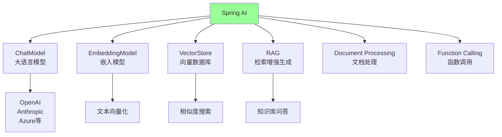
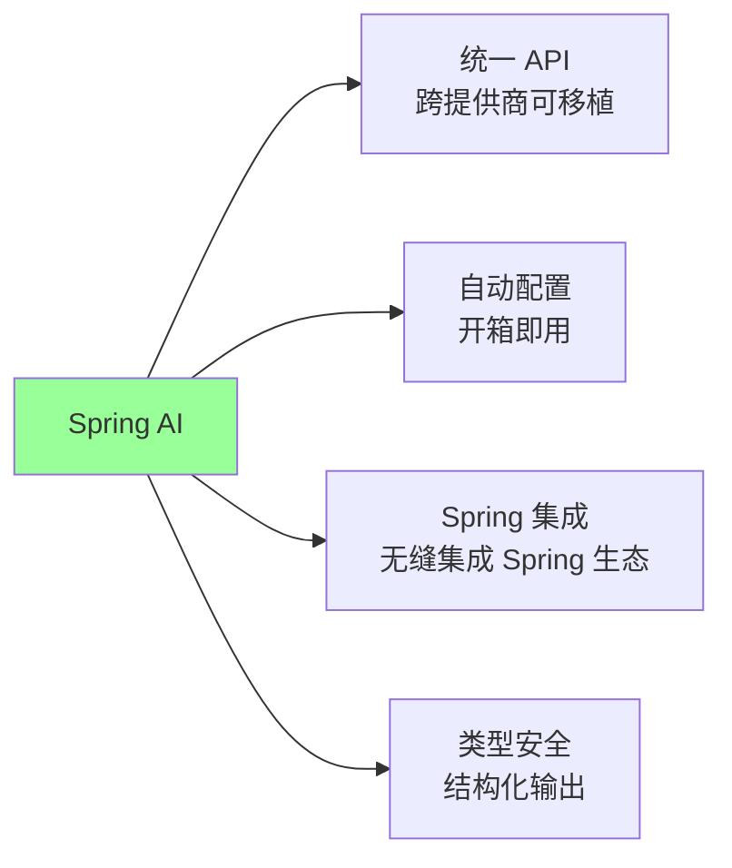

# 19、Spring Boot 4 实战：Spring AI 模块集成：官方 AI 能力接入
- 来源：https://ddkk.com/springboot/4/19.html
- 分类：Spring Boot 4.0 实战教程
- 分组：教程目录
- 日期：2025-11-25
兄弟们，今儿咱聊聊 Spring Boot 4 对 Spring AI 的官方支持。Spring AI 是 Spring 官方推出的 AI 框架，能让你轻松集成各种 AI 能力，比如大语言模型（LLM）、向量数据库、RAG（检索增强生成）啥的；鹏磊我最近在搞 AI 项目，发现 Spring AI 用起来确实爽，不用自己封装各种 API，直接就能用，今儿给你们好好唠唠怎么用、怎么集成、怎么实战。

## Spring AI 是啥

先说说 Spring AI 是咋回事。Spring AI 是 Spring 官方推出的 AI 应用开发框架，提供了统一的 API 来集成各种 AI 服务；它支持 OpenAI、Anthropic、Azure OpenAI、Google、Amazon 等主流 AI 提供商，还支持向量数据库、RAG、文档处理等功能。

### Spring AI 的核心能力



主要能力：

1. **ChatModel（大语言模型）**：支持 OpenAI、Anthropic、Azure OpenAI 等
2. **EmbeddingModel（嵌入模型）**：将文本转换为向量
3. **VectorStore（向量数据库）**：存储和检索向量数据
4. **RAG（检索增强生成）**：结合向量检索和 LLM 生成
5. **Document Processing（文档处理）**：PDF、Word 等文档的解析和处理
6. **Function Calling（函数调用）**：让 LLM 调用外部函数

### Spring AI 的优势



主要优势：

1. **统一 API**：一套 API 支持多个 AI 提供商，切换方便
2. **自动配置**：Spring Boot 自动配置，开箱即用
3. **Spring 集成**：无缝集成 Spring 生态，支持依赖注入、AOP 等
4. **类型安全**：支持结构化输出，将 AI 响应映射到 POJO

## 项目依赖配置

先看看怎么配置依赖。

### Maven 配置

```xml
<?xml version="1.0" encoding="UTF-8"?>
<project xmlns="http://maven.apache.org/POM/4.0.0"
         xmlns:xsi="http://www.w3.org/2001/XMLSchema-instance"
         xsi:schemaLocation="http://maven.apache.org/POM/4.0.0 
         http://maven.apache.org/xsd/maven-4.0.0.xsd">
    <modelVersion>4.0.0</modelVersion>
    <!-- Spring Boot 4 父项目 -->
    <parent>
        <groupId>org.springframework.boot</groupId>
        <artifactId>spring-boot-starter-parent</artifactId>
        <version>4.0.0-RC1</version>  <!-- Spring Boot 4 版本 -->
    </parent>
    <groupId>com.example</groupId>
    <artifactId>spring-ai-demo</artifactId>
    <version>1.0.0</version>
    <properties>
        <java.version>21</java.version>  <!-- Java 21 -->
        <project.build.sourceEncoding>UTF-8</project.build.sourceEncoding>
        <!-- Spring AI 版本 -->
        <spring-ai.version>1.0.0</spring-ai.version>
    </properties>
    <dependencies>
        <!-- Spring Boot Web 启动器 -->
        <dependency>
            <groupId>org.springframework.boot</groupId>
            <artifactId>spring-boot-starter-web</artifactId>
        </dependency>
        <!-- Spring AI OpenAI Starter（包含 ChatModel 和 EmbeddingModel） -->
        <dependency>
            <groupId>org.springframework.ai</groupId>
            <artifactId>spring-ai-openai-spring-boot-starter</artifactId>
        </dependency>
        <!-- Spring AI Anthropic Starter（可选，支持 Claude） -->
        <dependency>
            <groupId>org.springframework.ai</groupId>
            <artifactId>spring-ai-anthropic-spring-boot-starter</artifactId>
        </dependency>
        <!-- Spring AI PostgreSQL Vector Store（向量数据库） -->
        <dependency>
            <groupId>org.springframework.ai</groupId>
            <artifactId>spring-ai-pgvector-store-spring-boot-starter</artifactId>
        </dependency>
        <!-- PostgreSQL 驱动 -->
        <dependency>
            <groupId>org.postgresql</groupId>
            <artifactId>postgresql</artifactId>
            <scope>runtime</scope>
        </dependency>
        <!-- Spring Boot 数据 JPA（可选，用于数据库操作） -->
        <dependency>
            <groupId>org.springframework.boot</groupId>
            <artifactId>spring-boot-starter-data-jpa</artifactId>
        </dependency>
        <!-- Spring Boot 测试启动器 -->
        <dependency>
            <groupId>org.springframework.boot</groupId>
            <artifactId>spring-boot-starter-test</artifactId>
            <scope>test</scope>
        </dependency>
    </dependencies>
    <!-- Spring AI BOM（管理版本） -->
    <dependencyManagement>
        <dependencies>
            <dependency>
                <groupId>org.springframework.ai</groupId>
                <artifactId>spring-ai-bom</artifactId>
                <version>${spring-ai.version}</version>
                <type>pom</type>
                <scope>import</scope>
            </dependency>
        </dependencies>
    </dependencyManagement>
    <build>
        <plugins>
            <!-- Spring Boot Maven 插件 -->
            <plugin>
                <groupId>org.springframework.boot</groupId>
                <artifactId>spring-boot-maven-plugin</artifactId>
            </plugin>
        </plugins>
    </build>
</project>
```

### Gradle 配置

```txt
// Gradle 配置
plugins {
    id 'java'
    id 'org.springframework.boot' version '4.0.0-RC1'
    id 'io.spring.dependency-management' version '1.1.0'
}
group = 'com.example'
version = '1.0.0'
sourceCompatibility = '21'
repositories {
    mavenCentral()
}
ext {
    springAiVersion = '1.0.0'
}
dependencyManagement {
    imports {
        mavenBom "org.springframework.ai:spring-ai-bom:${springAiVersion}"
    }
}
dependencies {
    // Spring Boot Web
    implementation 'org.springframework.boot:spring-boot-starter-web'
    // Spring AI
    implementation 'org.springframework.ai:spring-ai-openai-spring-boot-starter'
    implementation 'org.springframework.ai:spring-ai-anthropic-spring-boot-starter'
    implementation 'org.springframework.ai:spring-ai-pgvector-store-spring-boot-starter'
    // PostgreSQL
    runtimeOnly 'org.postgresql:postgresql'
    implementation 'org.springframework.boot:spring-boot-starter-data-jpa'
    // 测试
    testImplementation 'org.springframework.boot:spring-boot-starter-test'
}
tasks.named('test') {
    useJUnitPlatform()
}
```

## 基础配置

先看看基础的配置方法。

### 配置文件

```yaml
# application.yml
spring:
  application:
    name: spring-ai-demo
  # 数据源配置（用于向量数据库）
  datasource:
    url: jdbc:postgresql://localhost:5432/vectordb
    username: postgres
    password: postgres
    driver-class-name: org.postgresql.Driver
  # JPA 配置
  jpa:
    hibernate:
      ddl-auto: update
    show-sql: true
    properties:
      hibernate:
        dialect: org.hibernate.dialect.PostgreSQLDialect
  # Spring AI 配置
  ai:
    # OpenAI 配置
    openai:
      api-key: ${OPENAI_API_KEY}  # 从环境变量读取 API Key
      chat:
        options:
          model: gpt-4o  # 使用的模型
          temperature: 0.7  # 温度参数（0-2，越高越随机）
          max-tokens: 2000  # 最大 token 数
      embedding:
        options:
          model: text-embedding-3-small  # 嵌入模型
    # Anthropic 配置（可选）
    anthropic:
      api-key: ${ANTHROPIC_API_KEY}
      chat:
        options:
          model: claude-3-5-sonnet-latest
          temperature: 0.7
          max-tokens: 2000
    # PostgreSQL Vector Store 配置
    vectorstore:
      pgvector:
        index-type: HNSW  # 索引类型：HNSW 或 IVFFlat
        distance-type: COSINE_DISTANCE  # 距离类型：COSINE_DISTANCE 或 L2_DISTANCE
        dimensions: 1536  # 向量维度（OpenAI text-embedding-3-small 是 1536）
# 日志配置
logging:
  level:
    org.springframework.ai: DEBUG
    com.example: DEBUG
```

## ChatModel（大语言模型）使用

看看怎么用 ChatModel 和 AI 对话。

### 基础使用

```java
package com.example.springai.service;
import org.springframework.ai.chat.client.ChatClient;
import org.springframework.ai.chat.model.ChatModel;
import org.springframework.ai.chat.model.ChatResponse;
import org.springframework.ai.chat.prompt.Prompt;
import org.springframework.ai.chat.messages.UserMessage;
import org.springframework.stereotype.Service;
/**
 * ChatModel 服务类
 * 演示如何使用 ChatModel 与 AI 对话
 */
@Service
public class ChatService {
    private final ChatModel chatModel;  // ChatModel 会自动注入（根据配置选择 OpenAI 或 Anthropic）
    private final ChatClient chatClient;  // ChatClient 是更高级的 API
    /**
     * 构造函数
     * 注入 ChatModel 并创建 ChatClient
     * 
     * @param chatModel ChatModel 实例（Spring AI 自动配置）
     */
    public ChatService(ChatModel chatModel) {
        this.chatModel = chatModel;
        // 创建 ChatClient，提供更流畅的 API
        this.chatClient = ChatClient.builder(chatModel).build();
    }
    /**
     * 基础对话方法
     * 使用 ChatClient 的流畅 API
     * 
     * @param message 用户消息
     * @return AI 回复
     */
    public String chat(String message) {
        // 使用 ChatClient 发送消息
        // prompt().user() 设置用户消息
        // call() 调用 AI 模型
        // content() 获取文本内容
        return chatClient.prompt()
                .user(message)
                .call()
                .content();
    }
    /**
     * 带系统提示的对话
     * 系统提示可以设置 AI 的角色和行为
     * 
     * @param systemPrompt 系统提示
     * @param userMessage 用户消息
     * @return AI 回复
     */
    public String chatWithSystemPrompt(String systemPrompt, String userMessage) {
        // system() 设置系统提示
        // user() 设置用户消息
        return chatClient.prompt()
                .system(systemPrompt)
                .user(userMessage)
                .call()
                .content();
    }
    /**
     * 使用底层 ChatModel API
     * 更灵活，但 API 更复杂
     * 
     * @param message 用户消息
     * @return AI 回复
     */
    public String chatWithChatModel(String message) {
        // 创建用户消息
        UserMessage userMessage = new UserMessage(message);
        // 创建 Prompt（包含消息）
        Prompt prompt = new Prompt(userMessage);
        // 调用 ChatModel
        ChatResponse response = chatModel.call(prompt);
        // 获取回复内容
        return response.getResult().getOutput().getContent();
    }
    /**
     * 流式响应
     * 实时获取 AI 回复，不需要等待完整响应
     * 
     * @param message 用户消息
     * @return 流式响应（Flux<String>）
     */
    public reactor.core.publisher.Flux<String> chatStream(String message) {
        // stream() 方法返回流式响应
        return chatClient.prompt()
                .user(message)
                .stream()
                .content();
    }
    /**
     * 结构化输出
     * 将 AI 回复映射到 POJO
     * 
     * @param message 用户消息
     * @param responseClass 响应类型
     * @return 结构化响应
     */
    public <T> T chatStructured(String message, Class<T> responseClass) {
        // entity() 方法将响应映射到指定类型
        return chatClient.prompt()
                .user(message)
                .call()
                .entity(responseClass);
    }
}
```

### 结构化输出示例

```java
package com.example.springai.model;
import com.fasterxml.jackson.annotation.JsonProperty;
/**
 * 天气信息响应类
 * 演示结构化输出
 */
public class WeatherResponse {
    @JsonProperty("city")
    private String city;  // 城市名称
    @JsonProperty("temperature")
    private Double temperature;  // 温度
    @JsonProperty("condition")
    private String condition;  // 天气状况
    @JsonProperty("humidity")
    private Integer humidity;  // 湿度
    // Getter 和 Setter 方法
    public String getCity() {
        return city;
    }
    public void setCity(String city) {
        this.city = city;
    }
    public Double getTemperature() {
        return temperature;
    }
    public void setTemperature(Double temperature) {
        this.temperature = temperature;
    }
    public String getCondition() {
        return condition;
    }
    public void setCondition(String condition) {
        this.condition = condition;
    }
    public Integer getHumidity() {
        return humidity;
    }
    public void setHumidity(Integer humidity) {
        this.humidity = humidity;
    }
}
```

### ChatController

```java
package com.example.springai.controller;
import com.example.springai.model.WeatherResponse;
import com.example.springai.service.ChatService;
import org.springframework.http.MediaType;
import org.springframework.http.ResponseEntity;
import org.springframework.web.bind.annotation.*;
import reactor.core.publisher.Flux;
import java.util.Map;
/**
 * Chat 控制器
 * 提供 REST API 接口
 */
@RestController
@RequestMapping("/api/chat")
public class ChatController {
    private final ChatService chatService;
    /**
     * 构造函数
     * 
     * @param chatService Chat 服务
     */
    public ChatController(ChatService chatService) {
        this.chatService = chatService;
    }
    /**
     * 基础对话接口
     * POST /api/chat
     * 
     * @param request 请求体（包含 message 字段）
     * @return AI 回复
     */
    @PostMapping
    public ResponseEntity<Map<String, String>> chat(@RequestBody Map<String, String> request) {
        String message = request.get("message");
        String response = chatService.chat(message);
        return ResponseEntity.ok(Map.of("response", response));
    }
    /**
     * 带系统提示的对话接口
     * POST /api/chat/with-system
     * 
     * @param request 请求体（包含 systemPrompt 和 message 字段）
     * @return AI 回复
     */
    @PostMapping("/with-system")
    public ResponseEntity<Map<String, String>> chatWithSystemPrompt(
            @RequestBody Map<String, String> request) {
        String systemPrompt = request.get("systemPrompt");
        String message = request.get("message");
        String response = chatService.chatWithSystemPrompt(systemPrompt, message);
        return ResponseEntity.ok(Map.of("response", response));
    }
    /**
     * 流式响应接口
     * POST /api/chat/stream
     * 
     * @param request 请求体（包含 message 字段）
     * @return 流式响应（Server-Sent Events）
     */
    @PostMapping(value = "/stream", produces = MediaType.TEXT_EVENT_STREAM_VALUE)
    public Flux<String> chatStream(@RequestBody Map<String, String> request) {
        String message = request.get("message");
        return chatService.chatStream(message);
    }
    /**
     * 结构化输出接口
     * POST /api/chat/structured
     * 
     * @param request 请求体（包含 message 字段）
     * @return 结构化响应
     */
    @PostMapping("/structured")
    public ResponseEntity<WeatherResponse> chatStructured(@RequestBody Map<String, String> request) {
        String message = request.get("message");
        WeatherResponse response = chatService.chatStructured(message, WeatherResponse.class);
        return ResponseEntity.ok(response);
    }
}
```

## EmbeddingModel（嵌入模型）使用

看看怎么用 EmbeddingModel 将文本转换为向量。

### EmbeddingService

```java
package com.example.springai.service;
import org.springframework.ai.embedding.EmbeddingModel;
import org.springframework.ai.embedding.EmbeddingRequest;
import org.springframework.ai.embedding.EmbeddingResponse;
import org.springframework.stereotype.Service;
import java.util.List;
/**
 * Embedding 服务类
 * 演示如何使用 EmbeddingModel 将文本转换为向量
 */
@Service
public class EmbeddingService {
    private final EmbeddingModel embeddingModel;  // EmbeddingModel 会自动注入
    /**
     * 构造函数
     * 
     * @param embeddingModel EmbeddingModel 实例（Spring AI 自动配置）
     */
    public EmbeddingService(EmbeddingModel embeddingModel) {
        this.embeddingModel = embeddingModel;
    }
    /**
     * 将单个文本转换为向量
     * 
     * @param text 文本内容
     * @return 向量（浮点数列表）
     */
    public List<Double> embed(String text) {
        // 调用 EmbeddingModel 的 embed() 方法
        // 返回一个 EmbeddingResponse，包含向量列表
        EmbeddingResponse response = embeddingModel.embedForResponse(List.of(text));
        // 获取第一个向量（因为我们只输入了一个文本）
        return response.getResult().getOutput();
    }
    /**
     * 将多个文本转换为向量
     * 
     * @param texts 文本列表
     * @return 向量列表（每个文本对应一个向量）
     */
    public List<List<Double>> embedBatch(List<String> texts) {
        // 批量嵌入，效率更高
        EmbeddingResponse response = embeddingModel.embedForResponse(texts);
        // 获取所有向量
        return response.getResults().stream()
                .map(result -> result.getOutput())
                .toList();
    }
    /**
     * 计算两个文本的相似度
     * 使用余弦相似度
     * 
     * @param text1 文本1
     * @param text2 文本2
     * @return 相似度（0-1，1 表示完全相同）
     */
    public double similarity(String text1, String text2) {
        // 获取两个文本的向量
        List<Double> vector1 = embed(text1);
        List<Double> vector2 = embed(text2);
        // 计算余弦相似度
        return cosineSimilarity(vector1, vector2);
    }
    /**
     * 计算余弦相似度
     * 
     * @param vector1 向量1
     * @param vector2 向量2
     * @return 相似度（0-1）
     */
    private double cosineSimilarity(List<Double> vector1, List<Double> vector2) {
        // 计算点积
        double dotProduct = 0.0;
        for (int i = 0; i < vector1.size(); i++) {
            dotProduct += vector1.get(i) * vector2.get(i);
        }
        // 计算向量长度
        double norm1 = Math.sqrt(vector1.stream()
                .mapToDouble(v -> v * v)
                .sum());
        double norm2 = Math.sqrt(vector2.stream()
                .mapToDouble(v -> v * v)
                .sum());
        // 计算余弦相似度
        return dotProduct / (norm1 * norm2);
    }
}
```

## VectorStore（向量数据库）使用

看看怎么用 VectorStore 存储和检索向量数据。

### VectorStoreService

```java
package com.example.springai.service;
import org.springframework.ai.document.Document;
import org.springframework.ai.vectorstore.SearchRequest;
import org.springframework.ai.vectorstore.VectorStore;
import org.springframework.stereotype.Service;
import java.util.List;
import java.util.Map;
/**
 * VectorStore 服务类
 * 演示如何使用 VectorStore 存储和检索向量数据
 */
@Service
public class VectorStoreService {
    private final VectorStore vectorStore;  // VectorStore 会自动注入（根据配置选择）
    /**
     * 构造函数
     * 
     * @param vectorStore VectorStore 实例（Spring AI 自动配置）
     */
    public VectorStoreService(VectorStore vectorStore) {
        this.vectorStore = vectorStore;
    }
    /**
     * 添加文档到向量数据库
     * 文档会自动转换为向量并存储
     * 
     * @param text 文档文本
     * @param metadata 元数据（可选）
     */
    public void addDocument(String text, Map<String, Object> metadata) {
        // 创建 Document 对象
        Document document = new Document(text, metadata);
        // 添加到向量数据库
        // VectorStore 会自动调用 EmbeddingModel 将文本转换为向量
        vectorStore.add(List.of(document));
    }
    /**
     * 批量添加文档
     * 
     * @param documents 文档列表
     */
    public void addDocuments(List<Document> documents) {
        vectorStore.add(documents);
    }
    /**
     * 相似度搜索
     * 根据查询文本找到最相似的文档
     * 
     * @param query 查询文本
     * @param topK 返回前 K 个结果
     * @return 相似文档列表
     */
    public List<Document> similaritySearch(String query, int topK) {
        // 创建搜索请求
        SearchRequest request = SearchRequest.builder()
                .query(query)  // 查询文本
                .topK(topK)  // 返回前 K 个结果
                .build();
        // 执行搜索
        // VectorStore 会自动将查询文本转换为向量，然后搜索最相似的文档
        return vectorStore.similaritySearch(request);
    }
    /**
     * 带相似度阈值的搜索
     * 只返回相似度超过阈值的文档
     * 
     * @param query 查询文本
     * @param topK 返回前 K 个结果
     * @param threshold 相似度阈值（0-1）
     * @return 相似文档列表
     */
    public List<Document> similaritySearchWithThreshold(String query, int topK, double threshold) {
        SearchRequest request = SearchRequest.builder()
                .query(query)
                .topK(topK)
                .similarityThreshold(threshold)  // 相似度阈值
                .build();
        return vectorStore.similaritySearch(request);
    }
    /**
     * 带元数据过滤的搜索
     * 根据元数据过滤文档
     * 
     * @param query 查询文本
     * @param topK 返回前 K 个结果
     * @param filterExpression 过滤表达式（类似 SQL WHERE 子句）
     * @return 相似文档列表
     */
    public List<Document> similaritySearchWithFilter(String query, int topK, String filterExpression) {
        SearchRequest request = SearchRequest.builder()
                .query(query)
                .topK(topK)
                .filterExpression(filterExpression)  // 过滤表达式，例如："author == 'John' && year > 2020"
                .build();
        return vectorStore.similaritySearch(request);
    }
    /**
     * 删除文档
     * 
     * @param documentIds 文档 ID 列表
     */
    public void deleteDocuments(List<String> documentIds) {
        vectorStore.delete(documentIds);
    }
    /**
     * 根据过滤表达式删除文档
     * 
     * @param filterExpression 过滤表达式
     */
    public void deleteDocumentsByFilter(String filterExpression) {
        vectorStore.delete(filterExpression);
    }
}
```

## RAG（检索增强生成）实战

RAG 是 Spring AI 的核心功能，结合向量检索和 LLM 生成，实现知识库问答。

### RAGService

```java
package com.example.springai.service;
import org.springframework.ai.chat.client.ChatClient;
import org.springframework.ai.chat.client.advisor.QuestionAnswerAdvisor;
import org.springframework.ai.chat.model.ChatModel;
import org.springframework.ai.document.Document;
import org.springframework.ai.vectorstore.SearchRequest;
import org.springframework.ai.vectorstore.VectorStore;
import org.springframework.stereotype.Service;
import java.util.List;
import java.util.Map;
import java.util.stream.Collectors;
/**
 * RAG 服务类
 * 演示如何使用 RAG 实现知识库问答
 */
@Service
public class RAGService {
    private final ChatClient chatClient;  // 带 RAG Advisor 的 ChatClient
    private final VectorStore vectorStore;  // 向量数据库
    /**
     * 构造函数
     * 创建带 RAG Advisor 的 ChatClient
     * 
     * @param chatModel ChatModel 实例
     * @param vectorStore VectorStore 实例
     */
    public RAGService(ChatModel chatModel, VectorStore vectorStore) {
        this.vectorStore = vectorStore;
        // 创建 QuestionAnswerAdvisor
        // 这个 Advisor 会自动从向量数据库检索相关文档，然后传递给 LLM
        QuestionAnswerAdvisor qaAdvisor = QuestionAnswerAdvisor.builder(vectorStore)
                .searchRequest(SearchRequest.builder()
                        .topK(5)  // 检索前 5 个最相似的文档
                        .similarityThreshold(0.7)  // 相似度阈值
                        .build())
                .build();
        // 创建 ChatClient，添加 RAG Advisor
        this.chatClient = ChatClient.builder(chatModel)
                .defaultAdvisors(qaAdvisor)  // 设置默认 Advisor
                .build();
    }
    /**
     * RAG 问答
     * 自动从向量数据库检索相关文档，然后生成回答
     * 
     * @param question 用户问题
     * @return AI 回答
     */
    public String answer(String question) {
        // 直接提问，RAG Advisor 会自动处理
        // 1. 将问题转换为向量
        // 2. 从向量数据库检索相关文档
        // 3. 将文档作为上下文传递给 LLM
        // 4. LLM 基于上下文生成回答
        return chatClient.prompt()
                .user(question)
                .call()
                .content();
    }
    /**
     * 带系统提示的 RAG 问答
     * 
     * @param systemPrompt 系统提示
     * @param question 用户问题
     * @return AI 回答
     */
    public String answerWithSystemPrompt(String systemPrompt, String question) {
        return chatClient.prompt()
                .system(systemPrompt)
                .user(question)
                .call()
                .content();
    }
    /**
     * 手动实现 RAG（不使用 Advisor）
     * 更灵活，可以自定义检索和生成逻辑
     * 
     * @param question 用户问题
     * @return AI 回答
     */
    public String answerManual(String question) {
        // 1. 从向量数据库检索相关文档
        List<Document> documents = vectorStore.similaritySearch(
                SearchRequest.builder()
                        .query(question)
                        .topK(5)
                        .similarityThreshold(0.7)
                        .build()
        );
        // 2. 将文档内容合并为上下文
        String context = documents.stream()
                .map(Document::getContent)
                .collect(Collectors.joining("\n\n"));
        // 3. 构建提示，包含上下文和问题
        String prompt = String.format(
                "基于以下上下文回答问题。如果上下文中没有相关信息，请说不知道。\n\n" +
                "上下文：\n%s\n\n" +
                "问题：%s",
                context,
                question
        );
        // 4. 调用 LLM 生成回答
        return chatClient.prompt()
                .user(prompt)
                .call()
                .content();
    }
}
```

### 文档处理服务

```java
package com.example.springai.service;
import org.springframework.ai.document.Document;
import org.springframework.ai.reader.pdf.PagePdfDocumentReader;
import org.springframework.ai.transformer.splitter.TokenTextSplitter;
import org.springframework.ai.vectorstore.VectorStore;
import org.springframework.core.io.Resource;
import org.springframework.stereotype.Service;
import java.util.List;
import java.util.function.Function;
import java.util.function.Supplier;
/**
 * 文档处理服务
 * 演示如何处理 PDF 等文档并存储到向量数据库
 */
@Service
public class DocumentProcessingService {
    private final VectorStore vectorStore;
    /**
     * 构造函数
     * 
     * @param vectorStore VectorStore 实例
     */
    public DocumentProcessingService(VectorStore vectorStore) {
        this.vectorStore = vectorStore;
    }
    /**
     * 处理 PDF 文档
     * 1. 读取 PDF
     * 2. 分割文本
     * 3. 存储到向量数据库
     * 
     * @param pdfResource PDF 资源
     * @return 处理的文档数量
     */
    public int processPdf(Resource pdfResource) {
        // 1. 创建 PDF 阅读器
        // PagePdfDocumentReader 按页读取 PDF
        Supplier<List<Document>> reader = new PagePdfDocumentReader(pdfResource);
        // 2. 创建文本分割器
        // TokenTextSplitter 按 token 数量分割文本
        // 这样可以确保每个文档不会太长，适合向量化
        Function<List<Document>, List<Document>> splitter = new TokenTextSplitter();
        // 3. 读取并分割文档
        List<Document> documents = splitter.apply(reader.get());
        // 4. 存储到向量数据库
        // VectorStore 会自动调用 EmbeddingModel 将文档转换为向量
        vectorStore.add(documents);
        return documents.size();
    }
    /**
     * 处理文本内容
     * 
     * @param text 文本内容
     * @param metadata 元数据
     * @return 处理的文档数量
     */
    public int processText(String text, Map<String, Object> metadata) {
        // 创建文档
        Document document = new Document(text, metadata);
        // 如果需要，可以分割长文本
        TokenTextSplitter splitter = new TokenTextSplitter();
        List<Document> documents = splitter.apply(List.of(document));
        // 存储到向量数据库
        vectorStore.add(documents);
        return documents.size();
    }
}
```

### RAGController

```java
package com.example.springai.controller;
import com.example.springai.service.DocumentProcessingService;
import com.example.springai.service.RAGService;
import org.springframework.core.io.Resource;
import org.springframework.http.ResponseEntity;
import org.springframework.web.bind.annotation.*;
import org.springframework.web.multipart.MultipartFile;
import java.util.Map;
/**
 * RAG 控制器
 * 提供知识库问答和文档上传接口
 */
@RestController
@RequestMapping("/api/rag")
public class RAGController {
    private final RAGService ragService;
    private final DocumentProcessingService documentProcessingService;
    /**
     * 构造函数
     * 
     * @param ragService RAG 服务
     * @param documentProcessingService 文档处理服务
     */
    public RAGController(RAGService ragService, 
                        DocumentProcessingService documentProcessingService) {
        this.ragService = ragService;
        this.documentProcessingService = documentProcessingService;
    }
    /**
     * 知识库问答接口
     * POST /api/rag/ask
     * 
     * @param request 请求体（包含 question 字段）
     * @return AI 回答
     */
    @PostMapping("/ask")
    public ResponseEntity<Map<String, String>> ask(@RequestBody Map<String, String> request) {
        String question = request.get("question");
        String answer = ragService.answer(question);
        return ResponseEntity.ok(Map.of("answer", answer));
    }
    /**
     * 上传 PDF 文档接口
     * POST /api/rag/upload
     * 
     * @param file PDF 文件
     * @return 处理结果
     */
    @PostMapping("/upload")
    public ResponseEntity<Map<String, Object>> uploadPdf(@RequestParam("file") MultipartFile file) {
        try {
            // 将 MultipartFile 转换为 Resource
            Resource pdfResource = file.getResource();
            // 处理 PDF
            int documentCount = documentProcessingService.processPdf(pdfResource);
            return ResponseEntity.ok(Map.of(
                    "success", true,
                    "message", "PDF 处理成功",
                    "documentCount", documentCount
            ));
        } catch (Exception e) {
            return ResponseEntity.ok(Map.of(
                    "success", false,
                    "message", "PDF 处理失败: " + e.getMessage()
            ));
        }
    }
}
```

## Function Calling（函数调用）实战

Function Calling 让 LLM 可以调用外部函数，实现更强大的功能。

### FunctionCallingService

```java
package com.example.springai.service;
import org.springframework.ai.chat.client.ChatClient;
import org.springframework.ai.chat.model.ChatModel;
import org.springframework.ai.model.function.FunctionCallback;
import org.springframework.ai.model.function.FunctionCallbackWrapper;
import org.springframework.context.annotation.Bean;
import org.springframework.context.annotation.Configuration;
import org.springframework.stereotype.Service;
import java.util.function.Function;
/**
 * Function Calling 服务类
 * 演示如何让 LLM 调用外部函数
 */
@Service
public class FunctionCallingService {
    private final ChatClient chatClient;
    /**
     * 构造函数
     * 创建带 Function Callback 的 ChatClient
     * 
     * @param chatModel ChatModel 实例
     * @param weatherFunction 天气查询函数
     */
    public FunctionCallingService(ChatModel chatModel, 
                                  Function<WeatherRequest, WeatherResponse> weatherFunction) {
        // 将 Java 函数包装为 FunctionCallback
        FunctionCallback weatherCallback = FunctionCallbackWrapper.builder(weatherFunction)
                .withName("getWeather")  // 函数名称
                .withDescription("获取指定城市的天气信息")  // 函数描述
                .withResponseConverter((response) -> response.toString())  // 响应转换器
                .build();
        // 创建 ChatClient，注册 Function Callback
        this.chatClient = ChatClient.builder(chatModel)
                .defaultFunctions("getWeather")  // 注册函数
                .build();
    }
    /**
     * 使用 Function Calling 的对话
     * LLM 会自动判断是否需要调用函数
     * 
     * @param message 用户消息
     * @return AI 回复
     */
    public String chatWithFunction(String message) {
        return chatClient.prompt()
                .user(message)
                .call()
                .content();
    }
}
/**
 * 天气请求类
 */
class WeatherRequest {
    private String city;
    public String getCity() {
        return city;
    }
    public void setCity(String city) {
        this.city = city;
    }
}
/**
 * 天气响应类
 */
class WeatherResponse {
    private String city;
    private Double temperature;
    private String condition;
    public String getCity() {
        return city;
    }
    public void setCity(String city) {
        this.city = city;
    }
    public Double getTemperature() {
        return temperature;
    }
    public void setTemperature(Double temperature) {
        this.temperature = temperature;
    }
    public String getCondition() {
        return condition;
    }
    public void setCondition(String condition) {
        this.condition = condition;
    }
    @Override
    public String toString() {
        return String.format("%s 的天气：温度 %.1f°C，%s", city, temperature, condition);
    }
}
/**
 * Function Callback 配置
 */
@Configuration
class FunctionCallingConfig {
    /**
     * 天气查询函数
     * 这是一个模拟函数，实际应用中应该调用真实的天气 API
     * 
     * @return 天气查询函数
     */
    @Bean
    public Function<WeatherRequest, WeatherResponse> weatherFunction() {
        return request -> {
            // 模拟天气查询
            WeatherResponse response = new WeatherResponse();
            response.setCity(request.getCity());
            response.setTemperature(25.0 + Math.random() * 10);  // 随机温度
            response.setCondition("晴天");
            return response;
        };
    }
}
```

## 完整的实战案例

看看一个完整的知识库问答系统。

### 应用主类

```java
package com.example.springai;
import org.springframework.boot.SpringApplication;
import org.springframework.boot.autoconfigure.SpringBootApplication;
/**
 * Spring Boot 应用主类
 */
@SpringBootApplication
public class SpringAiApplication {
    public static void main(String[] args) {
        SpringApplication.run(SpringAiApplication.class, args);
    }
}
```

### 完整的测试类

```java
package com.example.springai;
import com.example.springai.service.*;
import org.junit.jupiter.api.Test;
import org.springframework.beans.factory.annotation.Autowired;
import org.springframework.boot.test.context.SpringBootTest;
import org.springframework.core.io.ClassPathResource;
import java.util.List;
import java.util.Map;
import static org.assertj.core.api.Assertions.assertThat;
/**
 * Spring AI 完整功能测试
 * 演示所有功能的用法
 */
@SpringBootTest
class SpringAiIntegrationTest {
    @Autowired
    private ChatService chatService;  // Chat 服务
    @Autowired
    private EmbeddingService embeddingService;  // Embedding 服务
    @Autowired
    private VectorStoreService vectorStoreService;  // VectorStore 服务
    @Autowired
    private RAGService ragService;  // RAG 服务
    @Autowired
    private DocumentProcessingService documentProcessingService;  // 文档处理服务
    /**
     * 测试基础对话
     */
    @Test
    void testBasicChat() {
        String response = chatService.chat("你好，介绍一下 Spring AI");
        assertThat(response).isNotNull();
        assertThat(response).isNotEmpty();
        System.out.println("AI 回复: " + response);
    }
    /**
     * 测试带系统提示的对话
     */
    @Test
    void testChatWithSystemPrompt() {
        String systemPrompt = "你是一个专业的 Java 开发工程师，擅长 Spring 框架。";
        String userMessage = "Spring Boot 4 有什么新特性？";
        String response = chatService.chatWithSystemPrompt(systemPrompt, userMessage);
        assertThat(response).isNotNull();
        System.out.println("AI 回复: " + response);
    }
    /**
     * 测试 Embedding
     */
    @Test
    void testEmbedding() {
        String text = "Spring AI 是 Spring 官方推出的 AI 框架";
        List<Double> vector = embeddingService.embed(text);
        assertThat(vector).isNotNull();
        assertThat(vector.size()).isGreaterThan(0);
        System.out.println("向量维度: " + vector.size());
        System.out.println("前5个值: " + vector.subList(0, Math.min(5, vector.size())));
    }
    /**
     * 测试相似度计算
     */
    @Test
    void testSimilarity() {
        String text1 = "Spring AI 是 Spring 官方推出的 AI 框架";
        String text2 = "Spring AI 框架用于集成 AI 能力";
        double similarity = embeddingService.similarity(text1, text2);
        assertThat(similarity).isBetween(0.0, 1.0);
        System.out.println("相似度: " + similarity);
    }
    /**
     * 测试向量数据库
     */
    @Test
    void testVectorStore() {
        // 添加文档
        vectorStoreService.addDocument(
                "Spring AI 支持 OpenAI、Anthropic 等多种 AI 提供商",
                Map.of("source", "documentation", "category", "introduction")
        );
        vectorStoreService.addDocument(
                "Spring AI 提供了统一的 API 来集成各种 AI 服务",
                Map.of("source", "documentation", "category", "api")
        );
        // 搜索相似文档
        List<org.springframework.ai.document.Document> results = 
            vectorStoreService.similaritySearch("Spring AI 支持哪些 AI 提供商？", 2);
        assertThat(results).isNotEmpty();
        System.out.println("找到 " + results.size() + " 个相似文档");
        results.forEach(doc -> {
            System.out.println("文档: " + doc.getContent());
            System.out.println("元数据: " + doc.getMetadata());
        });
    }
    /**
     * 测试 RAG
     */
    @Test
    void testRAG() {
        // 先添加一些文档到向量数据库
        vectorStoreService.addDocument(
                "Spring AI 是 Spring 官方推出的 AI 框架，提供了统一的 API 来集成各种 AI 服务。",
                Map.of("source", "documentation")
        );
        vectorStoreService.addDocument(
                "Spring AI 支持 OpenAI、Anthropic、Azure OpenAI 等主流 AI 提供商。",
                Map.of("source", "documentation")
        );
        // 使用 RAG 回答问题
        String question = "Spring AI 支持哪些 AI 提供商？";
        String answer = ragService.answer(question);
        assertThat(answer).isNotNull();
        assertThat(answer).isNotEmpty();
        System.out.println("问题: " + question);
        System.out.println("回答: " + answer);
    }
    /**
     * 测试文档处理
     */
    @Test
    void testDocumentProcessing() {
        try {
            // 读取测试 PDF（如果有的话）
            // 这里只是演示，实际使用时需要提供真实的 PDF 文件
            // Resource pdfResource = new ClassPathResource("test.pdf");
            // int count = documentProcessingService.processPdf(pdfResource);
            // assertThat(count).isGreaterThan(0);
            // 测试文本处理
            int count = documentProcessingService.processText(
                    "Spring AI 提供了丰富的功能，包括 ChatModel、EmbeddingModel、VectorStore 等。",
                    Map.of("source", "test")
            );
            assertThat(count).isGreaterThan(0);
            System.out.println("处理了 " + count + " 个文档");
        } catch (Exception e) {
            System.err.println("文档处理失败: " + e.getMessage());
        }
    }
}
```

## 高级功能

### 多模型支持

```java
package com.example.springai.config;
import org.springframework.ai.chat.model.ChatModel;
import org.springframework.ai.openai.OpenAiChatModel;
import org.springframework.ai.openai.OpenAiChatOptions;
import org.springframework.ai.openai.api.OpenAiApi;
import org.springframework.ai.anthropic.AnthropicChatModel;
import org.springframework.ai.anthropic.AnthropicChatOptions;
import org.springframework.ai.anthropic.api.AnthropicApi;
import org.springframework.context.annotation.Bean;
import org.springframework.context.annotation.Configuration;
import org.springframework.context.annotation.Primary;
/**
 * 多模型配置
 * 演示如何配置多个 AI 模型
 */
@Configuration
public class MultiModelConfig {
    /**
     * OpenAI 模型（主模型）
     */
    @Bean
    @Primary
    public ChatModel openAiChatModel() {
        OpenAiApi api = new OpenAiApi(System.getenv("OPENAI_API_KEY"));
        return new OpenAiChatModel(api, OpenAiChatOptions.builder()
                .withModel("gpt-4o")
                .withTemperature(0.7)
                .build());
    }
    /**
     * Anthropic 模型（备用模型）
     */
    @Bean
    public ChatModel anthropicChatModel() {
        AnthropicApi api = new AnthropicApi(System.getenv("ANTHROPIC_API_KEY"));
        return new AnthropicChatModel(api, AnthropicChatOptions.builder()
                .withModel("claude-3-5-sonnet-latest")
                .withTemperature(0.7)
                .build());
    }
}
```

### 流式响应处理

```java
package com.example.springai.service;
import org.springframework.ai.chat.client.ChatClient;
import org.springframework.ai.chat.model.ChatModel;
import org.springframework.stereotype.Service;
import reactor.core.publisher.Flux;
/**
 * 流式响应服务
 * 演示如何处理流式响应
 */
@Service
public class StreamingService {
    private final ChatClient chatClient;
    public StreamingService(ChatModel chatModel) {
        this.chatClient = ChatClient.builder(chatModel).build();
    }
    /**
     * 流式对话
     * 实时返回 AI 回复的每个 token
     * 
     * @param message 用户消息
     * @return 流式响应
     */
    public Flux<String> streamChat(String message) {
        return chatClient.prompt()
                .user(message)
                .stream()
                .content();
    }
    /**
     * 流式对话（带回调）
     * 可以实时处理每个 token
     * 
     * @param message 用户消息
     * @param onNext 每个 token 的回调
     */
    public void streamChatWithCallback(String message, 
                                      java.util.function.Consumer<String> onNext) {
        streamChat(message)
                .doOnNext(onNext)
                .doOnComplete(() -> System.out.println("流式响应完成"))
                .doOnError(error -> System.err.println("流式响应错误: " + error.getMessage()))
                .subscribe();
    }
}
```

## 错误处理和重试

AI 服务调用可能失败，需要合理的错误处理和重试机制。

### 错误处理服务

```java
package com.example.springai.service;
import org.springframework.ai.chat.client.ChatClient;
import org.springframework.ai.chat.model.ChatModel;
import org.springframework.retry.annotation.Backoff;
import org.springframework.retry.annotation.Retryable;
import org.springframework.stereotype.Service;
import java.util.concurrent.TimeoutException;
/**
 * 带错误处理和重试的 Chat 服务
 * 演示如何处理 AI 服务调用的错误
 */
@Service
public class RobustChatService {
    private final ChatClient chatClient;
    public RobustChatService(ChatModel chatModel) {
        this.chatClient = ChatClient.builder(chatModel).build();
    }
    /**
     * 带重试的对话方法
     * 使用 @Retryable 注解实现自动重试
     * 
     * @param message 用户消息
     * @return AI 回复
     */
    @Retryable(
        value = {TimeoutException.class, RuntimeException.class},  // 需要重试的异常
        maxAttempts = 3,  // 最多重试 3 次
        backoff = @Backoff(
            delay = 1000,  // 初始延迟 1 秒
            multiplier = 2,  // 延迟倍数（1秒 -> 2秒 -> 4秒）
            maxDelay = 10000  // 最大延迟 10 秒
        )
    )
    public String chatWithRetry(String message) {
        try {
            return chatClient.prompt()
                    .user(message)
                    .call()
                    .content();
        } catch (Exception e) {
            // 记录错误日志
            System.err.println("AI 服务调用失败: " + e.getMessage());
            throw new RuntimeException("AI 服务调用失败", e);
        }
    }
    /**
     * 带超时控制的对话方法
     * 
     * @param message 用户消息
     * @param timeoutSeconds 超时时间（秒）
     * @return AI 回复
     */
    public String chatWithTimeout(String message, int timeoutSeconds) {
        try {
            // 使用 CompletableFuture 实现超时控制
            java.util.concurrent.CompletableFuture<String> future = 
                java.util.concurrent.CompletableFuture.supplyAsync(() -> {
                    return chatClient.prompt()
                            .user(message)
                            .call()
                            .content();
                });
            // 等待结果，如果超时则抛出异常
            return future.get(timeoutSeconds, java.util.concurrent.TimeUnit.SECONDS);
        } catch (java.util.concurrent.TimeoutException e) {
            throw new RuntimeException("AI 服务调用超时", e);
        } catch (Exception e) {
            throw new RuntimeException("AI 服务调用失败", e);
        }
    }
}
```

## 性能优化建议

AI 服务调用可能比较慢，需要优化性能。

### 性能优化策略

```java
package com.example.springai.service;
import org.springframework.ai.chat.client.ChatClient;
import org.springframework.ai.chat.model.ChatModel;
import org.springframework.ai.embedding.EmbeddingModel;
import org.springframework.cache.annotation.Cacheable;
import org.springframework.scheduling.annotation.Async;
import org.springframework.stereotype.Service;
import java.util.List;
import java.util.concurrent.CompletableFuture;
/**
 * 性能优化服务
 * 演示如何优化 AI 服务调用的性能
 */
@Service
public class OptimizedAIService {
    private final ChatClient chatClient;
    private final EmbeddingModel embeddingModel;
    public OptimizedAIService(ChatModel chatModel, EmbeddingModel embeddingModel) {
        this.chatClient = ChatClient.builder(chatModel).build();
        this.embeddingModel = embeddingModel;
    }
    /**
     * 缓存 Embedding 结果
     * 相同的文本不需要重复计算向量
     * 
     * @param text 文本内容
     * @return 向量
     */
    @Cacheable(value = "embeddings", key = "#text")
    public List<Double> getCachedEmbedding(String text) {
        return embeddingModel.embedForResponse(List.of(text))
                .getResult()
                .getOutput();
    }
    /**
     * 异步调用 AI 服务
     * 不阻塞主线程
     * 
     * @param message 用户消息
     * @return Future 对象
     */
    @Async
    public CompletableFuture<String> chatAsync(String message) {
        String response = chatClient.prompt()
                .user(message)
                .call()
                .content();
        return CompletableFuture.completedFuture(response);
    }
    /**
     * 批量处理 Embedding
     * 一次调用处理多个文本，比逐个处理效率高
     * 
     * @param texts 文本列表
     * @return 向量列表
     */
    public List<List<Double>> batchEmbed(List<String> texts) {
        // 批量嵌入，比逐个嵌入效率高
        return embeddingModel.embedForResponse(texts)
                .getResults()
                .stream()
                .map(result -> result.getOutput())
                .toList();
    }
}
```

### 缓存配置

```java
package com.example.springai.config;
import org.springframework.cache.CacheManager;
import org.springframework.cache.annotation.EnableCaching;
import org.springframework.cache.concurrent.ConcurrentMapCacheManager;
import org.springframework.context.annotation.Bean;
import org.springframework.context.annotation.Configuration;
/**
 * 缓存配置
 * 用于缓存 Embedding 结果等
 */
@Configuration
@EnableCaching
public class CacheConfig {
    /**
     * 创建缓存管理器
     * 
     * @return CacheManager 实例
     */
    @Bean
    public CacheManager cacheManager() {
        // 使用内存缓存
        // 生产环境建议使用 Redis 等分布式缓存
        return new ConcurrentMapCacheManager("embeddings", "chat-responses");
    }
}
```

## 最佳实践

### 1. API Key 管理

```yaml
# application.yml
spring:
  ai:
    openai:
      # 从环境变量读取，不要硬编码
      api-key: ${OPENAI_API_KEY}
```

### 2. 模型选择

- **开发/测试**：使用便宜的模型（如 gpt-3.5-turbo）
- **生产环境**：根据需求选择模型（gpt-4o 性能好但贵）
- **成本控制**：设置 max-tokens 限制，避免生成过长内容

### 3. 向量数据库选择

- **小规模**：使用内存向量数据库（SimpleVectorStore）
- **中等规模**：使用 PostgreSQL + pgvector
- **大规模**：使用专业的向量数据库（Pinecone、Weaviate 等）

### 4. RAG 优化

- **文档分割**：合理设置 chunk size，太小会丢失上下文，太大会影响检索精度
- **相似度阈值**：设置合适的阈值，过滤不相关的文档
- **TopK 选择**：根据文档质量调整 TopK，质量高可以设置较小

### 5. 错误处理

- **重试机制**：对网络错误、超时等实现重试
- **降级策略**：AI 服务不可用时提供降级方案
- **监控告警**：监控 AI 服务调用成功率、延迟等指标

## 总结

兄弟们，今儿咱聊了 Spring Boot 4 对 Spring AI 的官方支持，还有各种 AI 能力的集成。Spring AI 这玩意儿确实好用，不用自己封装各种 API，直接就能用，还支持多个 AI 提供商，切换方便。

主要功能：

1. **ChatModel（大语言模型）**：支持 OpenAI、Anthropic 等，提供统一的 API
2. **EmbeddingModel（嵌入模型）**：将文本转换为向量，支持相似度计算
3. **VectorStore（向量数据库）**：存储和检索向量数据，支持多种数据库
4. **RAG（检索增强生成）**：结合向量检索和 LLM 生成，实现知识库问答
5. **Document Processing（文档处理）**：处理 PDF、Word 等文档
6. **Function Calling（函数调用）**：让 LLM 调用外部函数

Spring AI 用起来确实爽，特别是 RAG 功能，能轻松实现知识库问答；建议新项目直接用 Spring AI，老项目可以逐步迁移。

性能优化和错误处理也很重要，AI 服务调用可能比较慢，需要合理配置超时、重试、缓存等；错误处理要做好，避免服务不可用时影响用户体验。

好了，今儿就聊到这，有啥问题评论区见！
