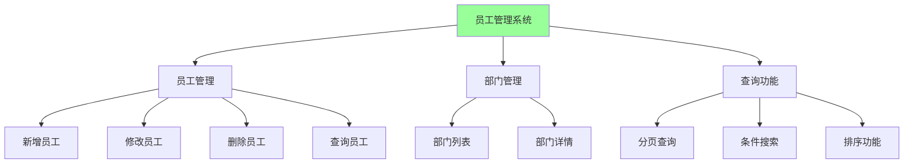

# 20、Spring Boot 4 实战：Spring Boot 4 企业级应用实战案例
- 来源：https://ddkk.com/springboot/4/20.html
- 分类：Spring Boot 4.0 实战教程
- 分组：教程目录
- 日期：2025-11-25
兄弟们，今儿咱聊聊 Spring Boot 4 的企业级应用实战案例。光说不练假把式，今儿给你们整一个真实的员工管理系统，包含完整的 CRUD、分页查询、条件搜索啥的；鹏磊我最近在搞企业项目，发现这种管理系统太常见了，今儿给你们好好唠唠怎么用 Spring Boot 4 的新特性来搞一个实用的系统。

## 项目概述

这个案例是一个员工管理系统，包含员工信息管理、部门管理、分页查询、条件搜索等功能；用的是 Spring Boot 4 的新特性，比如虚拟线程、Jackson 3、RestTestClient 啥的，都是实际项目中常用的。

### 功能需求



主要功能：

1. **员工管理**：增删改查，包含工号、姓名、部门、职位、入职日期、薪资等
2. **部门管理**：部门列表、部门详情
3. **查询功能**：分页查询、条件搜索、排序
4. **数据验证**：输入验证、业务规则验证
5. **异常处理**：统一的异常处理机制

## 项目依赖配置

先看看怎么配置依赖。

### Maven 配置

```xml
<?xml version="1.0" encoding="UTF-8"?>
<project xmlns="http://maven.apache.org/POM/4.0.0"
         xmlns:xsi="http://www.w3.org/2001/XMLSchema-instance"
         xsi:schemaLocation="http://maven.apache.org/POM/4.0.0 
         http://maven.apache.org/xsd/maven-4.0.0.xsd">
    <modelVersion>4.0.0</modelVersion>
    <!-- Spring Boot 4 父项目 -->
    <parent>
        <groupId>org.springframework.boot</groupId>
        <artifactId>spring-boot-starter-parent</artifactId>
        <version>4.0.0-RC1</version>
    </parent>
    <groupId>com.example</groupId>
    <artifactId>employee-management</artifactId>
    <version>1.0.0</version>
    <properties>
        <java.version>21</java.version>
        <project.build.sourceEncoding>UTF-8</project.build.sourceEncoding>
    </properties>
    <dependencies>
        <!-- Spring Boot Web 启动器 -->
        <dependency>
            <groupId>org.springframework.boot</groupId>
            <artifactId>spring-boot-starter-web</artifactId>
        </dependency>
        <!-- Spring Boot 数据 JPA -->
        <dependency>
            <groupId>org.springframework.boot</groupId>
            <artifactId>spring-boot-starter-data-jpa</artifactId>
        </dependency>
        <!-- Spring Boot 验证 -->
        <dependency>
            <groupId>org.springframework.boot</groupId>
            <artifactId>spring-boot-starter-validation</artifactId>
        </dependency>
        <!-- MySQL 驱动 -->
        <dependency>
            <groupId>com.mysql</groupId>
            <artifactId>mysql-connector-j</artifactId>
            <scope>runtime</scope>
        </dependency>
        <!-- H2 数据库（测试用） -->
        <dependency>
            <groupId>com.h2database</groupId>
            <artifactId>h2</artifactId>
            <scope>runtime</scope>
        </dependency>
        <!-- Lombok（简化代码） -->
        <dependency>
            <groupId>org.projectlombok</groupId>
            <artifactId>lombok</artifactId>
            <optional>true</optional>
        </dependency>
        <!-- Spring Boot 测试启动器 -->
        <dependency>
            <groupId>org.springframework.boot</groupId>
            <artifactId>spring-boot-starter-test</artifactId>
            <scope>test</scope>
        </dependency>
        <!-- RestTestClient（Spring Boot 4 新特性） -->
        <dependency>
            <groupId>org.springframework.boot</groupId>
            <artifactId>spring-boot-resttestclient</artifactId>
            <scope>test</scope>
        </dependency>
    </dependencies>
    <build>
        <plugins>
            <plugin>
                <groupId>org.springframework.boot</groupId>
                <artifactId>spring-boot-maven-plugin</artifactId>
                <configuration>
                    <excludes>
                        <exclude>
                            <groupId>org.projectlombok</groupId>
                            <artifactId>lombok</artifactId>
                        </exclude>
                    </excludes>
                </configuration>
            </plugin>
        </plugins>
    </build>
</project>
```

### 配置文件

```yaml
# application.yml
spring:
  application:
    name: employee-management
  # 数据源配置
  datasource:
    url: jdbc:mysql://localhost:3306/employee_db?useUnicode=true&characterEncoding=utf8&useSSL=false&serverTimezone=Asia/Shanghai
    username: root
    password: root
    driver-class-name: com.mysql.cj.jdbc.Driver
  # JPA 配置
  jpa:
    hibernate:
      ddl-auto: update  # 生产环境用 validate
    show-sql: true
    properties:
      hibernate:
        dialect: org.hibernate.dialect.MySQLDialect
        format_sql: true
        use_sql_comments: true
  # 虚拟线程配置（Spring Boot 4 新特性）
  threads:
    virtual:
      enabled: true  # 启用虚拟线程
  # Jackson 3 配置
  jackson:
    date-format: yyyy-MM-dd HH:mm:ss
    time-zone: Asia/Shanghai
    serialization:
      write-dates-as-timestamps: false
    default-property-inclusion: non_null
# 服务器配置
server:
  port: 8080
  servlet:
    context-path: /api
# 日志配置
logging:
  level:
    com.example: DEBUG
    org.springframework.web: INFO
    org.hibernate.SQL: DEBUG
```

## 实体类设计

先看看实体类的设计，符合中国企业实际业务场景。

### 部门实体

```java
package com.example.employee.entity;
import jakarta.persistence.*;
import lombok.Data;
import lombok.NoArgsConstructor;
import lombok.AllArgsConstructor;
import java.time.LocalDateTime;
import java.util.List;
/**
 * 部门实体类
 * 符合中国企业实际业务场景
 */
@Entity
@Table(name = "departments")
@Data
@NoArgsConstructor
@AllArgsConstructor
public class Department {
    @Id
    @GeneratedValue(strategy = GenerationType.IDENTITY)
    private Long id;  // 部门 ID，主键，自增
    @Column(nullable = false, unique = true, length = 50)
    private String code;  // 部门编码，唯一，不能为空，比如 "IT001"
    @Column(nullable = false, length = 100)
    private String name;  // 部门名称，不能为空，比如 "技术部"
    @Column(length = 200)
    private String description;  // 部门描述，可以为空
    @Column(name = "manager_id")
    private Long managerId;  // 部门经理 ID，可以为空
    @Column(name = "parent_id")
    private Long parentId;  // 上级部门 ID，支持部门层级结构
    @Column(name = "status", nullable = false)
    @Enumerated(EnumType.STRING)
    private DepartmentStatus status = DepartmentStatus.ACTIVE;  // 部门状态，默认启用
    @Column(name = "sort_order")
    private Integer sortOrder;  // 排序顺序，用于部门列表排序
    @Column(name = "created_at", nullable = false, updatable = false)
    private LocalDateTime createdAt;  // 创建时间，不能更新
    @Column(name = "updated_at")
    private LocalDateTime updatedAt;  // 更新时间
    @OneToMany(mappedBy = "department", cascade = CascadeType.ALL, fetch = FetchType.LAZY)
    private List<Employee> employees;  // 部门下的员工列表（一对多关系）
    /**
     * 创建前自动设置创建时间
     */
    @PrePersist
    protected void onCreate() {
        createdAt = LocalDateTime.now();
        updatedAt = LocalDateTime.now();
    }
    /**
     * 更新前自动设置更新时间
     */
    @PreUpdate
    protected void onUpdate() {
        updatedAt = LocalDateTime.now();
    }
    /**
     * 部门状态枚举
     */
    public enum DepartmentStatus {
        ACTIVE("启用"),
        INACTIVE("停用");
        private final String description;
        DepartmentStatus(String description) {
            this.description = description;
        }
        public String getDescription() {
            return description;
        }
    }
}
```

### 员工实体

```java
package com.example.employee.entity;
import jakarta.persistence.*;
import jakarta.validation.constraints.*;
import lombok.Data;
import lombok.NoArgsConstructor;
import lombok.AllArgsConstructor;
import java.math.BigDecimal;
import java.time.LocalDate;
import java.time.LocalDateTime;
/**
 * 员工实体类
 * 符合中国企业实际业务场景，包含完整的员工信息
 */
@Entity
@Table(name = "employees", indexes = {
    @Index(name = "idx_employee_code", columnList = "employee_code"),
    @Index(name = "idx_department_id", columnList = "department_id"),
    @Index(name = "idx_name", columnList = "name")
})
@Data
@NoArgsConstructor
@AllArgsConstructor
public class Employee {
    @Id
    @GeneratedValue(strategy = GenerationType.IDENTITY)
    private Long id;  // 员工 ID，主键，自增
    @Column(name = "employee_code", nullable = false, unique = true, length = 50)
    @NotBlank(message = "工号不能为空")
    @Size(max = 50, message = "工号长度不能超过 50")
    private String employeeCode;  // 工号，唯一，不能为空，比如 "EMP001"
    @Column(nullable = false, length = 50)
    @NotBlank(message = "姓名不能为空")
    @Size(max = 50, message = "姓名长度不能超过 50")
    private String name;  // 姓名，不能为空
    @Column(length = 20)
    @Pattern(regexp = "^1[3-9]\\d{9}$", message = "手机号格式不正确")
    private String phone;  // 手机号，格式验证
    @Column(length = 100)
    @Email(message = "邮箱格式不正确")
    private String email;  // 邮箱，格式验证
    @Column(name = "id_card", length = 18)
    @Pattern(regexp = "^[1-9]\\d{5}(18|19|20)\\d{2}(0[1-9]|1[0-2])(0[1-9]|[12]\\d|3[01])\\d{3}[0-9Xx]$", 
             message = "身份证号格式不正确")
    private String idCard;  // 身份证号，格式验证
    @Enumerated(EnumType.STRING)
    @Column(nullable = false, length = 10)
    private Gender gender;  // 性别，枚举类型
    @Column(name = "birth_date")
    private LocalDate birthDate;  // 出生日期
    @ManyToOne(fetch = FetchType.LAZY)
    @JoinColumn(name = "department_id")
    private Department department;  // 所属部门（多对一关系）
    @Column(name = "department_id")
    private Long departmentId;  // 部门 ID（冗余字段，方便查询）
    @Column(length = 50)
    private String position;  // 职位，比如 "高级工程师"、"部门经理"
    @Enumerated(EnumType.STRING)
    @Column(nullable = false, length = 20)
    private EmployeeStatus status = EmployeeStatus.ACTIVE;  // 员工状态，默认在职
    @Column(name = "hire_date", nullable = false)
    @NotNull(message = "入职日期不能为空")
    private LocalDate hireDate;  // 入职日期，不能为空
    @Column(name = "leave_date")
    private LocalDate leaveDate;  // 离职日期，可以为空
    @Column(name = "salary", precision = 10, scale = 2)
    @DecimalMin(value = "0.0", message = "薪资不能为负数")
    private BigDecimal salary;  // 薪资，精确到分
    @Column(name = "address", length = 200)
    private String address;  // 地址
    @Column(name = "education", length = 20)
    private String education;  // 学历，比如 "本科"、"硕士"、"博士"
    @Column(name = "major", length = 100)
    private String major;  // 专业
    @Column(name = "graduation_school", length = 100)
    private String graduationSchool;  // 毕业院校
    @Column(name = "emergency_contact", length = 50)
    private String emergencyContact;  // 紧急联系人
    @Column(name = "emergency_phone", length = 20)
    private String emergencyPhone;  // 紧急联系人电话
    @Column(name = "remark", length = 500)
    private String remark;  // 备注
    @Column(name = "created_at", nullable = false, updatable = false)
    private LocalDateTime createdAt;  // 创建时间
    @Column(name = "updated_at")
    private LocalDateTime updatedAt;  // 更新时间
    /**
     * 创建前自动设置创建时间
     */
    @PrePersist
    protected void onCreate() {
        createdAt = LocalDateTime.now();
        updatedAt = LocalDateTime.now();
    }
    /**
     * 更新前自动设置更新时间
     */
    @PreUpdate
    protected void onUpdate() {
        updatedAt = LocalDateTime.now();
    }
    /**
     * 性别枚举
     */
    public enum Gender {
        MALE("男"),
        FEMALE("女"),
        OTHER("其他");
        private final String description;
        Gender(String description) {
            this.description = description;
        }
        public String getDescription() {
            return description;
        }
    }
    /**
     * 员工状态枚举
     */
    public enum EmployeeStatus {
        ACTIVE("在职"),
        LEAVE("离职"),
        SUSPENDED("停薪留职");
        private final String description;
        EmployeeStatus(String description) {
            this.description = description;
        }
        public String getDescription() {
            return description;
        }
    }
}
```

## Repository 层

看看 Repository 层的实现，包含自定义查询方法。

### 部门 Repository

```java
package com.example.employee.repository;
import com.example.employee.entity.Department;
import org.springframework.data.jpa.repository.JpaRepository;
import org.springframework.data.jpa.repository.Query;
import org.springframework.stereotype.Repository;
import java.util.List;
import java.util.Optional;
/**
 * 部门 Repository 接口
 * 继承 JpaRepository，提供基本的 CRUD 操作
 */
@Repository
public interface DepartmentRepository extends JpaRepository<Department, Long> {
    /**
     * 根据部门编码查找部门
     * Spring Data JPA 会自动实现这个方法
     * 
     * @param code 部门编码
     * @return 部门对象（如果存在）
     */
    Optional<Department> findByCode(String code);
    /**
     * 根据部门名称查找部门
     * 
     * @param name 部门名称
     * @return 部门对象（如果存在）
     */
    Optional<Department> findByName(String name);
    /**
     * 检查部门编码是否存在
     * 
     * @param code 部门编码
     * @return 是否存在
     */
    boolean existsByCode(String code);
    /**
     * 根据状态查找部门列表
     * 
     * @param status 部门状态
     * @return 部门列表
     */
    List<Department> findByStatus(Department.DepartmentStatus status);
    /**
     * 根据上级部门 ID 查找子部门列表
     * 
     * @param parentId 上级部门 ID
     * @return 子部门列表
     */
    List<Department> findByParentId(Long parentId);
    /**
     * 查找根部门列表（没有上级部门的部门）
     * 
     * @return 根部门列表
     */
    @Query("SELECT d FROM Department d WHERE d.parentId IS NULL")
    List<Department> findRootDepartments();
    /**
     * 根据排序顺序查找部门列表
     * 
     * @return 部门列表（按排序顺序）
     */
    List<Department> findAllByOrderBySortOrderAsc();
}
```

### 员工 Repository

```java
package com.example.employee.repository;
import com.example.employee.entity.Employee;
import org.springframework.data.domain.Page;
import org.springframework.data.domain.Pageable;
import org.springframework.data.jpa.repository.JpaRepository;
import org.springframework.data.jpa.repository.JpaSpecificationExecutor;
import org.springframework.data.jpa.repository.Query;
import org.springframework.data.repository.query.Param;
import org.springframework.stereotype.Repository;
import java.time.LocalDate;
import java.util.List;
import java.util.Optional;
/**
 * 员工 Repository 接口
 * 继承 JpaRepository 和 JpaSpecificationExecutor，支持复杂查询
 */
@Repository
public interface EmployeeRepository extends JpaRepository<Employee, Long>, 
                                           JpaSpecificationExecutor<Employee> {
    /**
     * 根据工号查找员工
     * 
     * @param employeeCode 工号
     * @return 员工对象（如果存在）
     */
    Optional<Employee> findByEmployeeCode(String employeeCode);
    /**
     * 检查工号是否存在
     * 
     * @param employeeCode 工号
     * @return 是否存在
     */
    boolean existsByEmployeeCode(String employeeCode);
    /**
     * 根据部门 ID 查找员工列表
     * 
     * @param departmentId 部门 ID
     * @return 员工列表
     */
    List<Employee> findByDepartmentId(Long departmentId);
    /**
     * 根据部门 ID 分页查询员工
     * 
     * @param departmentId 部门 ID
     * @param pageable 分页参数
     * @return 员工分页结果
     */
    Page<Employee> findByDepartmentId(Long departmentId, Pageable pageable);
    /**
     * 根据状态查找员工列表
     * 
     * @param status 员工状态
     * @return 员工列表
     */
    List<Employee> findByStatus(Employee.EmployeeStatus status);
    /**
     * 根据姓名模糊查询员工列表
     * 
     * @param name 姓名（支持模糊查询）
     * @return 员工列表
     */
    List<Employee> findByNameContaining(String name);
    /**
     * 根据姓名模糊查询并分页
     * 
     * @param name 姓名（支持模糊查询）
     * @param pageable 分页参数
     * @return 员工分页结果
     */
    Page<Employee> findByNameContaining(String name, Pageable pageable);
    /**
     * 根据手机号查找员工
     * 
     * @param phone 手机号
     * @return 员工对象（如果存在）
     */
    Optional<Employee> findByPhone(String phone);
    /**
     * 根据入职日期范围查找员工列表
     * 
     * @param startDate 开始日期
     * @param endDate 结束日期
     * @return 员工列表
     */
    List<Employee> findByHireDateBetween(LocalDate startDate, LocalDate endDate);
    /**
     * 统计部门员工数量
     * 
     * @param departmentId 部门 ID
     * @return 员工数量
     */
    @Query("SELECT COUNT(e) FROM Employee e WHERE e.departmentId = :departmentId")
    long countByDepartmentId(@Param("departmentId") Long departmentId);
    /**
     * 统计在职员工数量
     * 
     * @return 在职员工数量
     */
    @Query("SELECT COUNT(e) FROM Employee e WHERE e.status = 'ACTIVE'")
    long countActiveEmployees();
    /**
     * 根据多个条件查询员工（使用 Specification）
     * 这个方法通过 JpaSpecificationExecutor 提供，支持动态查询
     */
    // 使用 Specification 进行复杂查询，在 Service 层实现
}
```

## Service 层

看看 Service 层的实现，包含业务逻辑和异常处理。

### 部门 Service

```java
package com.example.employee.service;
import com.example.employee.entity.Department;
import com.example.employee.repository.DepartmentRepository;
import org.springframework.stereotype.Service;
import org.springframework.transaction.annotation.Transactional;
import java.util.List;
import java.util.Optional;
/**
 * 部门服务类
 * 处理部门相关的业务逻辑
 */
@Service
@Transactional
public class DepartmentService {
    private final DepartmentRepository departmentRepository;
    /**
     * 构造函数注入
     * 
     * @param departmentRepository 部门 Repository
     */
    public DepartmentService(DepartmentRepository departmentRepository) {
        this.departmentRepository = departmentRepository;
    }
    /**
     * 获取所有部门
     * 
     * @return 部门列表
     */
    @Transactional(readOnly = true)
    public List<Department> findAll() {
        // 按排序顺序返回部门列表
        return departmentRepository.findAllByOrderBySortOrderAsc();
    }
    /**
     * 根据 ID 查找部门
     * 
     * @param id 部门 ID
     * @return 部门对象（如果存在）
     */
    @Transactional(readOnly = true)
    public Optional<Department> findById(Long id) {
        return departmentRepository.findById(id);
    }
    /**
     * 根据部门编码查找部门
     * 
     * @param code 部门编码
     * @return 部门对象（如果存在）
     */
    @Transactional(readOnly = true)
    public Optional<Department> findByCode(String code) {
        return departmentRepository.findByCode(code);
    }
    /**
     * 创建部门
     * 
     * @param department 部门对象
     * @return 创建的部门
     * @throws IllegalArgumentException 如果部门编码已存在
     */
    public Department create(Department department) {
        // 检查部门编码是否已存在
        if (departmentRepository.existsByCode(department.getCode())) {
            throw new IllegalArgumentException("部门编码已存在: " + department.getCode());
        }
        // 保存部门
        return departmentRepository.save(department);
    }
    /**
     * 更新部门
     * 
     * @param id 部门 ID
     * @param department 更新的部门信息
     * @return 更新后的部门
     * @throws IllegalArgumentException 如果部门不存在或部门编码冲突
     */
    public Department update(Long id, Department department) {
        // 查找部门
        Department existingDepartment = departmentRepository.findById(id)
                .orElseThrow(() -> new IllegalArgumentException("部门不存在: " + id));
        // 如果修改了部门编码，检查新编码是否已存在
        if (!existingDepartment.getCode().equals(department.getCode()) &&
            departmentRepository.existsByCode(department.getCode())) {
            throw new IllegalArgumentException("部门编码已存在: " + department.getCode());
        }
        // 更新部门信息
        existingDepartment.setCode(department.getCode());
        existingDepartment.setName(department.getName());
        existingDepartment.setDescription(department.getDescription());
        existingDepartment.setManagerId(department.getManagerId());
        existingDepartment.setParentId(department.getParentId());
        existingDepartment.setStatus(department.getStatus());
        existingDepartment.setSortOrder(department.getSortOrder());
        // 保存更新
        return departmentRepository.save(existingDepartment);
    }
    /**
     * 删除部门
     * 
     * @param id 部门 ID
     * @throws IllegalArgumentException 如果部门不存在或部门下有员工
     */
    public void delete(Long id) {
        // 检查部门是否存在
        Department department = departmentRepository.findById(id)
                .orElseThrow(() -> new IllegalArgumentException("部门不存在: " + id));
        // 检查部门下是否有员工（这里需要注入 EmployeeRepository，简化处理）
        // 实际项目中应该检查员工数量
        // if (employeeRepository.countByDepartmentId(id) > 0) {
        //     throw new IllegalArgumentException("部门下有员工，不能删除");
        // }
        // 删除部门
        departmentRepository.deleteById(id);
    }
    /**
     * 根据状态查找部门列表
     * 
     * @param status 部门状态
     * @return 部门列表
     */
    @Transactional(readOnly = true)
    public List<Department> findByStatus(Department.DepartmentStatus status) {
        return departmentRepository.findByStatus(status);
    }
    /**
     * 查找根部门列表
     * 
     * @return 根部门列表
     */
    @Transactional(readOnly = true)
    public List<Department> findRootDepartments() {
        return departmentRepository.findRootDepartments();
    }
}
```

### 员工 Service

```java
package com.example.employee.service;
import com.example.employee.entity.Department;
import com.example.employee.entity.Employee;
import com.example.employee.repository.DepartmentRepository;
import com.example.employee.repository.EmployeeRepository;
import jakarta.persistence.criteria.Predicate;
import org.springframework.data.domain.Page;
import org.springframework.data.domain.Pageable;
import org.springframework.data.jpa.domain.Specification;
import org.springframework.stereotype.Service;
import org.springframework.transaction.annotation.Transactional;
import org.springframework.util.StringUtils;
import java.time.LocalDate;
import java.util.ArrayList;
import java.util.List;
import java.util.Optional;
/**
 * 员工服务类
 * 处理员工相关的业务逻辑，包含复杂的查询功能
 */
@Service
@Transactional
public class EmployeeService {
    private final EmployeeRepository employeeRepository;
    private final DepartmentRepository departmentRepository;
    /**
     * 构造函数注入
     * 
     * @param employeeRepository 员工 Repository
     * @param departmentRepository 部门 Repository
     */
    public EmployeeService(EmployeeRepository employeeRepository,
                           DepartmentRepository departmentRepository) {
        this.employeeRepository = employeeRepository;
        this.departmentRepository = departmentRepository;
    }
    /**
     * 获取所有员工（分页）
     * 
     * @param pageable 分页参数
     * @return 员工分页结果
     */
    @Transactional(readOnly = true)
    public Page<Employee> findAll(Pageable pageable) {
        return employeeRepository.findAll(pageable);
    }
    /**
     * 根据 ID 查找员工
     * 
     * @param id 员工 ID
     * @return 员工对象（如果存在）
     */
    @Transactional(readOnly = true)
    public Optional<Employee> findById(Long id) {
        return employeeRepository.findById(id);
    }
    /**
     * 根据工号查找员工
     * 
     * @param employeeCode 工号
     * @return 员工对象（如果存在）
     */
    @Transactional(readOnly = true)
    public Optional<Employee> findByEmployeeCode(String employeeCode) {
        return employeeRepository.findByEmployeeCode(employeeCode);
    }
    /**
     * 创建员工
     * 
     * @param employee 员工对象
     * @return 创建的员工
     * @throws IllegalArgumentException 如果工号已存在或部门不存在
     */
    public Employee create(Employee employee) {
        // 检查工号是否已存在
        if (employeeRepository.existsByEmployeeCode(employee.getEmployeeCode())) {
            throw new IllegalArgumentException("工号已存在: " + employee.getEmployeeCode());
        }
        // 如果指定了部门 ID，验证部门是否存在
        if (employee.getDepartmentId() != null) {
            Department department = departmentRepository.findById(employee.getDepartmentId())
                    .orElseThrow(() -> new IllegalArgumentException("部门不存在: " + employee.getDepartmentId()));
            employee.setDepartment(department);
        }
        // 保存员工
        return employeeRepository.save(employee);
    }
    /**
     * 更新员工
     * 
     * @param id 员工 ID
     * @param employee 更新的员工信息
     * @return 更新后的员工
     * @throws IllegalArgumentException 如果员工不存在或工号冲突
     */
    public Employee update(Long id, Employee employee) {
        // 查找员工
        Employee existingEmployee = employeeRepository.findById(id)
                .orElseThrow(() -> new IllegalArgumentException("员工不存在: " + id));
        // 如果修改了工号，检查新工号是否已存在
        if (!existingEmployee.getEmployeeCode().equals(employee.getEmployeeCode()) &&
            employeeRepository.existsByEmployeeCode(employee.getEmployeeCode())) {
            throw new IllegalArgumentException("工号已存在: " + employee.getEmployeeCode());
        }
        // 如果修改了部门 ID，验证部门是否存在
        if (employee.getDepartmentId() != null && 
            !employee.getDepartmentId().equals(existingEmployee.getDepartmentId())) {
            Department department = departmentRepository.findById(employee.getDepartmentId())
                    .orElseThrow(() -> new IllegalArgumentException("部门不存在: " + employee.getDepartmentId()));
            existingEmployee.setDepartment(department);
            existingEmployee.setDepartmentId(employee.getDepartmentId());
        }
        // 更新员工信息
        existingEmployee.setEmployeeCode(employee.getEmployeeCode());
        existingEmployee.setName(employee.getName());
        existingEmployee.setPhone(employee.getPhone());
        existingEmployee.setEmail(employee.getEmail());
        existingEmployee.setIdCard(employee.getIdCard());
        existingEmployee.setGender(employee.getGender());
        existingEmployee.setBirthDate(employee.getBirthDate());
        existingEmployee.setPosition(employee.getPosition());
        existingEmployee.setStatus(employee.getStatus());
        existingEmployee.setHireDate(employee.getHireDate());
        existingEmployee.setLeaveDate(employee.getLeaveDate());
        existingEmployee.setSalary(employee.getSalary());
        existingEmployee.setAddress(employee.getAddress());
        existingEmployee.setEducation(employee.getEducation());
        existingEmployee.setMajor(employee.getMajor());
        existingEmployee.setGraduationSchool(employee.getGraduationSchool());
        existingEmployee.setEmergencyContact(employee.getEmergencyContact());
        existingEmployee.setEmergencyPhone(employee.getEmergencyPhone());
        existingEmployee.setRemark(employee.getRemark());
        // 保存更新
        return employeeRepository.save(existingEmployee);
    }
    /**
     * 删除员工
     * 
     * @param id 员工 ID
     * @throws IllegalArgumentException 如果员工不存在
     */
    public void delete(Long id) {
        // 检查员工是否存在
        if (!employeeRepository.existsById(id)) {
            throw new IllegalArgumentException("员工不存在: " + id);
        }
        // 删除员工
        employeeRepository.deleteById(id);
    }
    /**
     * 条件查询员工（支持多条件组合）
     * 使用 Specification 实现动态查询
     * 
     * @param name 姓名（模糊查询）
     * @param departmentId 部门 ID
     * @param status 员工状态
     * @param position 职位
     * @param pageable 分页参数
     * @return 员工分页结果
     */
    @Transactional(readOnly = true)
    public Page<Employee> search(String name, Long departmentId, 
                                 Employee.EmployeeStatus status, 
                                 String position, 
                                 Pageable pageable) {
        // 使用 Specification 构建动态查询条件
        Specification<Employee> spec = (root, query, cb) -> {
            List<Predicate> predicates = new ArrayList<>();
            // 姓名模糊查询
            if (StringUtils.hasText(name)) {
                predicates.add(cb.like(cb.lower(root.get("name")), 
                    "%" + name.toLowerCase() + "%"));
            }
            // 部门 ID 精确匹配
            if (departmentId != null) {
                predicates.add(cb.equal(root.get("departmentId"), departmentId));
            }
            // 员工状态精确匹配
            if (status != null) {
                predicates.add(cb.equal(root.get("status"), status));
            }
            // 职位模糊查询
            if (StringUtils.hasText(position)) {
                predicates.add(cb.like(cb.lower(root.get("position")), 
                    "%" + position.toLowerCase() + "%"));
            }
            // 组合所有条件（AND 关系）
            return cb.and(predicates.toArray(new Predicate[0]));
        };
        // 执行查询
        return employeeRepository.findAll(spec, pageable);
    }
    /**
     * 根据部门 ID 查询员工列表
     * 
     * @param departmentId 部门 ID
     * @param pageable 分页参数
     * @return 员工分页结果
     */
    @Transactional(readOnly = true)
    public Page<Employee> findByDepartmentId(Long departmentId, Pageable pageable) {
        return employeeRepository.findByDepartmentId(departmentId, pageable);
    }
    /**
     * 统计部门员工数量
     * 
     * @param departmentId 部门 ID
     * @return 员工数量
     */
    @Transactional(readOnly = true)
    public long countByDepartmentId(Long departmentId) {
        return employeeRepository.countByDepartmentId(departmentId);
    }
    /**
     * 统计在职员工数量
     * 
     * @return 在职员工数量
     */
    @Transactional(readOnly = true)
    public long countActiveEmployees() {
        return employeeRepository.countActiveEmployees();
    }
}
```

## Controller 层

看看 Controller 层的实现，包含完整的 REST API。

### 部门 Controller

```java
package com.example.employee.controller;
import com.example.employee.entity.Department;
import com.example.employee.service.DepartmentService;
import jakarta.validation.Valid;
import org.springframework.http.HttpStatus;
import org.springframework.http.ResponseEntity;
import org.springframework.web.bind.annotation.*;
import java.util.List;
/**
 * 部门控制器
 * 提供部门管理的 REST API
 */
@RestController
@RequestMapping("/departments")
public class DepartmentController {
    private final DepartmentService departmentService;
    /**
     * 构造函数注入
     * 
     * @param departmentService 部门服务
     */
    public DepartmentController(DepartmentService departmentService) {
        this.departmentService = departmentService;
    }
    /**
     * 获取所有部门
     * GET /departments
     * 
     * @return 部门列表
     */
    @GetMapping
    public ResponseEntity<List<Department>> getAllDepartments() {
        List<Department> departments = departmentService.findAll();
        return ResponseEntity.ok(departments);
    }
    /**
     * 根据 ID 获取部门
     * GET /departments/{id}
     * 
     * @param id 部门 ID
     * @return 部门对象
     */
    @GetMapping("/{id}")
    public ResponseEntity<Department> getDepartmentById(@PathVariable Long id) {
        return departmentService.findById(id)
                .map(department -> ResponseEntity.ok(department))
                .orElse(ResponseEntity.notFound().build());
    }
    /**
     * 创建部门
     * POST /departments
     * 
     * @param department 部门对象（从请求体反序列化）
     * @return 创建的部门
     */
    @PostMapping
    public ResponseEntity<Department> createDepartment(@RequestBody @Valid Department department) {
        try {
            Department created = departmentService.create(department);
            return ResponseEntity.status(HttpStatus.CREATED).body(created);
        } catch (IllegalArgumentException e) {
            // 业务异常，返回 400 Bad Request
            return ResponseEntity.badRequest().build();
        }
    }
    /**
     * 更新部门
     * PUT /departments/{id}
     * 
     * @param id 部门 ID
     * @param department 更新的部门信息
     * @return 更新后的部门
     */
    @PutMapping("/{id}")
    public ResponseEntity<Department> updateDepartment(@PathVariable Long id,
                                                       @RequestBody @Valid Department department) {
        try {
            Department updated = departmentService.update(id, department);
            return ResponseEntity.ok(updated);
        } catch (IllegalArgumentException e) {
            // 业务异常，返回 404 Not Found 或 400 Bad Request
            return ResponseEntity.notFound().build();
        }
    }
    /**
     * 删除部门
     * DELETE /departments/{id}
     * 
     * @param id 部门 ID
     * @return 204 No Content
     */
    @DeleteMapping("/{id}")
    public ResponseEntity<Void> deleteDepartment(@PathVariable Long id) {
        try {
            departmentService.delete(id);
            return ResponseEntity.noContent().build();
        } catch (IllegalArgumentException e) {
            // 业务异常，返回 404 Not Found
            return ResponseEntity.notFound().build();
        }
    }
    /**
     * 根据状态获取部门列表
     * GET /departments/status/{status}
     * 
     * @param status 部门状态
     * @return 部门列表
     */
    @GetMapping("/status/{status}")
    public ResponseEntity<List<Department>> getDepartmentsByStatus(
            @PathVariable Department.DepartmentStatus status) {
        List<Department> departments = departmentService.findByStatus(status);
        return ResponseEntity.ok(departments);
    }
}
```

### 员工 Controller

```java
package com.example.employee.controller;
import com.example.employee.entity.Employee;
import com.example.employee.service.EmployeeService;
import jakarta.validation.Valid;
import org.springframework.data.domain.Page;
import org.springframework.data.domain.PageRequest;
import org.springframework.data.domain.Pageable;
import org.springframework.data.domain.Sort;
import org.springframework.http.HttpStatus;
import org.springframework.http.ResponseEntity;
import org.springframework.web.bind.annotation.*;
import java.util.HashMap;
import java.util.Map;
import java.util.Optional;
/**
 * 员工控制器
 * 提供员工管理的 REST API，包含完整的 CRUD 和查询功能
 */
@RestController
@RequestMapping("/employees")
public class EmployeeController {
    private final EmployeeService employeeService;
    /**
     * 构造函数注入
     * 
     * @param employeeService 员工服务
     */
    public EmployeeController(EmployeeService employeeService) {
        this.employeeService = employeeService;
    }
    /**
     * 获取所有员工（分页）
     * GET /employees?page=0&size=10&sort=id,desc
     * 
     * @param page 页码（从 0 开始）
     * @param size 每页大小
     * @param sort 排序字段和方向（如 "id,desc"）
     * @return 员工分页结果
     */
    @GetMapping
    public ResponseEntity<Page<Employee>> getAllEmployees(
            @RequestParam(defaultValue = "0") int page,
            @RequestParam(defaultValue = "10") int size,
            @RequestParam(defaultValue = "id,desc") String sort) {
        // 解析排序参数
        String[] sortParams = sort.split(",");
        String sortField = sortParams[0];
        Sort.Direction direction = sortParams.length > 1 && "desc".equalsIgnoreCase(sortParams[1])
                ? Sort.Direction.DESC
                : Sort.Direction.ASC;
        // 创建分页参数
        Pageable pageable = PageRequest.of(page, size, Sort.by(direction, sortField));
        // 查询员工
        Page<Employee> employees = employeeService.findAll(pageable);
        return ResponseEntity.ok(employees);
    }
    /**
     * 根据 ID 获取员工
     * GET /employees/{id}
     * 
     * @param id 员工 ID
     * @return 员工对象
     */
    @GetMapping("/{id}")
    public ResponseEntity<Employee> getEmployeeById(@PathVariable Long id) {
        return employeeService.findById(id)
                .map(employee -> ResponseEntity.ok(employee))
                .orElse(ResponseEntity.notFound().build());
    }
    /**
     * 创建员工
     * POST /employees
     * 
     * @param employee 员工对象（从请求体反序列化）
     * @return 创建的员工
     */
    @PostMapping
    public ResponseEntity<Map<String, Object>> createEmployee(@RequestBody @Valid Employee employee) {
        try {
            Employee created = employeeService.create(employee);
            Map<String, Object> response = new HashMap<>();
            response.put("success", true);
            response.put("data", created);
            response.put("message", "员工创建成功");
            return ResponseEntity.status(HttpStatus.CREATED).body(response);
        } catch (IllegalArgumentException e) {
            Map<String, Object> response = new HashMap<>();
            response.put("success", false);
            response.put("message", e.getMessage());
            return ResponseEntity.badRequest().body(response);
        }
    }
    /**
     * 更新员工
     * PUT /employees/{id}
     * 
     * @param id 员工 ID
     * @param employee 更新的员工信息
     * @return 更新后的员工
     */
    @PutMapping("/{id}")
    public ResponseEntity<Map<String, Object>> updateEmployee(@PathVariable Long id,
                                                               @RequestBody @Valid Employee employee) {
        try {
            Employee updated = employeeService.update(id, employee);
            Map<String, Object> response = new HashMap<>();
            response.put("success", true);
            response.put("data", updated);
            response.put("message", "员工更新成功");
            return ResponseEntity.ok(response);
        } catch (IllegalArgumentException e) {
            Map<String, Object> response = new HashMap<>();
            response.put("success", false);
            response.put("message", e.getMessage());
            return ResponseEntity.badRequest().body(response);
        }
    }
    /**
     * 删除员工
     * DELETE /employees/{id}
     * 
     * @param id 员工 ID
     * @return 204 No Content
     */
    @DeleteMapping("/{id}")
    public ResponseEntity<Map<String, Object>> deleteEmployee(@PathVariable Long id) {
        try {
            employeeService.delete(id);
            Map<String, Object> response = new HashMap<>();
            response.put("success", true);
            response.put("message", "员工删除成功");
            return ResponseEntity.ok(response);
        } catch (IllegalArgumentException e) {
            Map<String, Object> response = new HashMap<>();
            response.put("success", false);
            response.put("message", e.getMessage());
            return ResponseEntity.badRequest().body(response);
        }
    }
    /**
     * 条件搜索员工
     * GET /employees/search?name=张三&departmentId=1&status=ACTIVE&position=工程师&page=0&size=10
     * 
     * @param name 姓名（模糊查询）
     * @param departmentId 部门 ID
     * @param status 员工状态
     * @param position 职位（模糊查询）
     * @param page 页码
     * @param size 每页大小
     * @param sort 排序
     * @return 员工分页结果
     */
    @GetMapping("/search")
    public ResponseEntity<Page<Employee>> searchEmployees(
            @RequestParam(required = false) String name,
            @RequestParam(required = false) Long departmentId,
            @RequestParam(required = false) Employee.EmployeeStatus status,
            @RequestParam(required = false) String position,
            @RequestParam(defaultValue = "0") int page,
            @RequestParam(defaultValue = "10") int size,
            @RequestParam(defaultValue = "id,desc") String sort) {
        // 解析排序参数
        String[] sortParams = sort.split(",");
        String sortField = sortParams[0];
        Sort.Direction direction = sortParams.length > 1 && "desc".equalsIgnoreCase(sortParams[1])
                ? Sort.Direction.DESC
                : Sort.Direction.ASC;
        // 创建分页参数
        Pageable pageable = PageRequest.of(page, size, Sort.by(direction, sortField));
        // 执行搜索
        Page<Employee> employees = employeeService.search(name, departmentId, status, position, pageable);
        return ResponseEntity.ok(employees);
    }
    /**
     * 根据部门 ID 查询员工
     * GET /employees/department/{departmentId}?page=0&size=10
     * 
     * @param departmentId 部门 ID
     * @param page 页码
     * @param size 每页大小
     * @return 员工分页结果
     */
    @GetMapping("/department/{departmentId}")
    public ResponseEntity<Page<Employee>> getEmployeesByDepartment(
            @PathVariable Long departmentId,
            @RequestParam(defaultValue = "0") int page,
            @RequestParam(defaultValue = "10") int size) {
        Pageable pageable = PageRequest.of(page, size, Sort.by(Sort.Direction.DESC, "id"));
        Page<Employee> employees = employeeService.findByDepartmentId(departmentId, pageable);
        return ResponseEntity.ok(employees);
    }
    /**
     * 统计部门员工数量
     * GET /employees/count/department/{departmentId}
     * 
     * @param departmentId 部门 ID
     * @return 员工数量
     */
    @GetMapping("/count/department/{departmentId}")
    public ResponseEntity<Map<String, Object>> countEmployeesByDepartment(@PathVariable Long departmentId) {
        long count = employeeService.countByDepartmentId(departmentId);
        Map<String, Object> response = new HashMap<>();
        response.put("departmentId", departmentId);
        response.put("count", count);
        return ResponseEntity.ok(response);
    }
    /**
     * 统计在职员工数量
     * GET /employees/count/active
     * 
     * @return 在职员工数量
     */
    @GetMapping("/count/active")
    public ResponseEntity<Map<String, Object>> countActiveEmployees() {
        long count = employeeService.countActiveEmployees();
        Map<String, Object> response = new HashMap<>();
        response.put("count", count);
        return ResponseEntity.ok(response);
    }
}
```

## 异常处理

看看统一的异常处理机制。

### 全局异常处理器

```java
package com.example.employee.exception;
import org.springframework.http.HttpStatus;
import org.springframework.http.ResponseEntity;
import org.springframework.validation.FieldError;
import org.springframework.web.bind.MethodArgumentNotValidException;
import org.springframework.web.bind.annotation.ExceptionHandler;
import org.springframework.web.bind.annotation.RestControllerAdvice;
import java.util.HashMap;
import java.util.Map;
/**
 * 全局异常处理器
 * 统一处理应用中的异常，返回友好的错误信息
 */
@RestControllerAdvice
public class GlobalExceptionHandler {
    /**
     * 处理参数验证异常
     * 当使用 @Valid 注解验证失败时触发
     * 
     * @param ex 验证异常
     * @return 错误响应
     */
    @ExceptionHandler(MethodArgumentNotValidException.class)
    public ResponseEntity<Map<String, Object>> handleValidationException(
            MethodArgumentNotValidException ex) {
        Map<String, Object> errors = new HashMap<>();
        Map<String, String> fieldErrors = new HashMap<>();
        // 收集所有字段错误
        ex.getBindingResult().getAllErrors().forEach(error -> {
            String fieldName = ((FieldError) error).getField();
            String errorMessage = error.getDefaultMessage();
            fieldErrors.put(fieldName, errorMessage);
        });
        errors.put("success", false);
        errors.put("message", "参数验证失败");
        errors.put("errors", fieldErrors);
        return ResponseEntity.badRequest().body(errors);
    }
    /**
     * 处理业务异常（IllegalArgumentException）
     * 
     * @param ex 业务异常
     * @return 错误响应
     */
    @ExceptionHandler(IllegalArgumentException.class)
    public ResponseEntity<Map<String, Object>> handleBusinessException(IllegalArgumentException ex) {
        Map<String, Object> response = new HashMap<>();
        response.put("success", false);
        response.put("message", ex.getMessage());
        return ResponseEntity.badRequest().body(response);
    }
    /**
     * 处理其他未捕获的异常
     * 
     * @param ex 异常
     * @return 错误响应
     */
    @ExceptionHandler(Exception.class)
    public ResponseEntity<Map<String, Object>> handleGenericException(Exception ex) {
        Map<String, Object> response = new HashMap<>();
        response.put("success", false);
        response.put("message", "服务器内部错误: " + ex.getMessage());
        // 生产环境不应该暴露详细错误信息
        return ResponseEntity.status(HttpStatus.INTERNAL_SERVER_ERROR).body(response);
    }
}
```

## 完整的测试案例

看看完整的测试类，使用 RestTestClient 进行测试。

### 集成测试

```java
package com.example.employee;
import com.example.employee.entity.Department;
import com.example.employee.entity.Employee;
import com.example.employee.repository.DepartmentRepository;
import com.example.employee.repository.EmployeeRepository;
import com.fasterxml.jackson.databind.ObjectMapper;
import org.junit.jupiter.api.BeforeEach;
import org.junit.jupiter.api.Test;
import org.springframework.beans.factory.annotation.Autowired;
import org.springframework.boot.test.context.SpringBootTest;
import org.springframework.boot.resttestclient.autoconfigure.AutoConfigureRestTestClient;
import org.springframework.boot.test.context.SpringBootTest.WebEnvironment;
import org.springframework.http.MediaType;
import org.springframework.test.context.ActiveProfiles;
import org.springframework.test.web.servlet.client.RestTestClient;
import org.springframework.transaction.annotation.Transactional;
import java.math.BigDecimal;
import java.time.LocalDate;
import java.util.HashMap;
import java.util.List;
import java.util.Map;
import static org.assertj.core.api.Assertions.assertThat;
import static org.springframework.test.web.servlet.client.RestTestClient.ResponseSpec;
/**
 * 员工管理系统集成测试
 * 使用 RestTestClient 测试完整的 CRUD 流程
 */
@SpringBootTest(webEnvironment = WebEnvironment.RANDOM_PORT)
@AutoConfigureRestTestClient
@ActiveProfiles("test")
@Transactional
class EmployeeManagementIntegrationTest {
    @Autowired
    private RestTestClient restTestClient;
    @Autowired
    private EmployeeRepository employeeRepository;
    @Autowired
    private DepartmentRepository departmentRepository;
    @Autowired
    private ObjectMapper objectMapper;
    private Department testDepartment;
    private String baseUrl;
    /**
     * 测试前的准备工作
     */
    @BeforeEach
    void setUp() {
        // 清空数据库
        employeeRepository.deleteAll();
        departmentRepository.deleteAll();
        // 创建测试部门
        testDepartment = new Department();
        testDepartment.setCode("IT001");
        testDepartment.setName("技术部");
        testDepartment.setDescription("负责技术开发");
        testDepartment.setStatus(Department.DepartmentStatus.ACTIVE);
        testDepartment.setSortOrder(1);
        testDepartment = departmentRepository.save(testDepartment);
        baseUrl = "";  // RestTestClient 会自动处理基础 URL
    }
    /**
     * 测试创建员工
     */
    @Test
    void testCreateEmployee() throws Exception {
        // 准备员工数据
        Employee employee = new Employee();
        employee.setEmployeeCode("EMP001");
        employee.setName("张三");
        employee.setPhone("13800138000");
        employee.setEmail("zhangsan@example.com");
        employee.setGender(Employee.Gender.MALE);
        employee.setDepartmentId(testDepartment.getId());
        employee.setPosition("高级工程师");
        employee.setStatus(Employee.EmployeeStatus.ACTIVE);
        employee.setHireDate(LocalDate.now());
        employee.setSalary(new BigDecimal("15000.00"));
        // 发送 POST 请求
        ResponseSpec response = restTestClient
                .post()
                .uri("/employees")
                .contentType(MediaType.APPLICATION_JSON)
                .body(objectMapper.writeValueAsString(employee))
                .exchange();
        // 验证响应
        Map<String, Object> result = response
                .expectStatus().isCreated()
                .expectBody(Map.class)
                .returnResult()
                .getResponseBody();
        assertThat(result).isNotNull();
        assertThat(result.get("success")).isInstanceOf(Boolean.class).isEqualTo(true);
        assertThat(result.get("message")).isEqualTo("员工创建成功");
        // 验证数据库中的数据
        Employee savedEmployee = employeeRepository.findByEmployeeCode("EMP001").orElseThrow();
        assertThat(savedEmployee.getName()).isEqualTo("张三");
        assertThat(savedEmployee.getDepartmentId()).isEqualTo(testDepartment.getId());
    }
    /**
     * 测试查询员工列表（分页）
     */
    @Test
    void testGetEmployeesWithPagination() {
        // 创建测试数据
        createTestEmployees(15);
        // 发送 GET 请求（第一页，每页 10 条）
        ResponseSpec response = restTestClient
                .get()
                .uri("/employees?page=0&size=10&sort=id,desc")
                .exchange();
        // 验证响应
        Map<String, Object> result = response
                .expectStatus().isOk()
                .expectBody(Map.class)
                .returnResult()
                .getResponseBody();
        assertThat(result).isNotNull();
        // 验证分页信息
        assertThat(result.get("page")).isNotNull();
        @SuppressWarnings("unchecked")
        Map<String, Object> pageInfo = (Map<String, Object>) result.get("page");
        assertThat(pageInfo.get("totalElements")).isInstanceOf(Number.class);
        assertThat(((Number) pageInfo.get("totalElements")).longValue()).isEqualTo(15L);
        assertThat(pageInfo.get("size")).isInstanceOf(Number.class);
        assertThat(((Number) pageInfo.get("size")).intValue()).isEqualTo(10);
    }
    /**
     * 测试条件搜索员工
     */
    @Test
    void testSearchEmployees() {
        // 创建测试数据
        Employee employee1 = createEmployee("EMP001", "张三", "高级工程师");
        Employee employee2 = createEmployee("EMP002", "李四", "工程师");
        Employee employee3 = createEmployee("EMP003", "王五", "高级工程师");
        // 搜索职位包含"高级"的员工
        ResponseSpec response = restTestClient
                .get()
                .uri("/employees/search?position=高级&page=0&size=10")
                .exchange();
        // 验证响应
        Map<String, Object> result = response
                .expectStatus().isOk()
                .expectBody(Map.class)
                .returnResult()
                .getResponseBody();
        assertThat(result).isNotNull();
        // 应该找到 2 个员工（张三和王五）
        assertThat(result.get("page")).isNotNull();
        @SuppressWarnings("unchecked")
        Map<String, Object> pageInfo = (Map<String, Object>) result.get("page");
        assertThat(pageInfo.get("content")).isNotNull().isInstanceOf(List.class);
        @SuppressWarnings("unchecked")
        List<Map<String, Object>> content = (List<Map<String, Object>>) pageInfo.get("content");
        assertThat(content).hasSize(2);
    }
    /**
     * 测试更新员工
     */
    @Test
    void testUpdateEmployee() throws Exception {
        // 创建员工
        Employee employee = createEmployee("EMP001", "张三", "工程师");
        // 准备更新数据
        Employee updateData = new Employee();
        updateData.setEmployeeCode("EMP001");
        updateData.setName("张三（已更新）");
        updateData.setPosition("高级工程师");
        updateData.setSalary(new BigDecimal("20000.00"));
        updateData.setDepartmentId(testDepartment.getId());
        updateData.setStatus(Employee.EmployeeStatus.ACTIVE);
        updateData.setHireDate(employee.getHireDate());
        // 发送 PUT 请求
        ResponseSpec response = restTestClient
                .put()
                .uri("/employees/" + employee.getId())
                .contentType(MediaType.APPLICATION_JSON)
                .body(objectMapper.writeValueAsString(updateData))
                .exchange();
        // 验证响应
        Map<String, Object> result = response
                .expectStatus().isOk()
                .expectBody(Map.class)
                .returnResult()
                .getResponseBody();
        assertThat(result).isNotNull();
        assertThat(result.get("success")).isInstanceOf(Boolean.class).isEqualTo(true);
        // 验证数据库中的数据已更新
        Employee updatedEmployee = employeeRepository.findById(employee.getId()).orElseThrow();
        assertThat(updatedEmployee.getName()).isEqualTo("张三（已更新）");
        assertThat(updatedEmployee.getPosition()).isEqualTo("高级工程师");
    }
    /**
     * 测试删除员工
     */
    @Test
    void testDeleteEmployee() {
        // 创建员工
        Employee employee = createEmployee("EMP001", "张三", "工程师");
        // 发送 DELETE 请求
        ResponseSpec response = restTestClient
                .delete()
                .uri("/employees/" + employee.getId())
                .exchange();
        // 验证响应
        Map<String, Object> result = response
                .expectStatus().isOk()
                .expectBody(Map.class)
                .returnResult()
                .getResponseBody();
        assertThat(result).isNotNull();
        assertThat(result.get("success")).isInstanceOf(Boolean.class).isEqualTo(true);
        // 验证数据库中的数据已删除
        assertThat(employeeRepository.existsById(employee.getId())).isFalse();
    }
    /**
     * 测试创建部门
     */
    @Test
    void testCreateDepartment() throws Exception {
        // 准备部门数据
        Department department = new Department();
        department.setCode("HR001");
        department.setName("人力资源部");
        department.setDescription("负责人力资源管理");
        department.setStatus(Department.DepartmentStatus.ACTIVE);
        department.setSortOrder(2);
        // 发送 POST 请求
        ResponseSpec response = restTestClient
                .post()
                .uri("/departments")
                .contentType(MediaType.APPLICATION_JSON)
                .body(objectMapper.writeValueAsString(department))
                .exchange();
        // 验证响应
        Department result = response
                .expectStatus().isCreated()
                .expectBody(Department.class)
                .returnResult()
                .getResponseBody();
        assertThat(result).isNotNull();
        assertThat(result.getCode()).isEqualTo("HR001");
        assertThat(result.getName()).isEqualTo("人力资源部");
    }
    /**
     * 辅助方法：创建测试员工
     */
    private Employee createEmployee(String employeeCode, String name, String position) {
        Employee employee = new Employee();
        employee.setEmployeeCode(employeeCode);
        employee.setName(name);
        employee.setPhone("13800138000");
        employee.setEmail(name.toLowerCase() + "@example.com");
        employee.setGender(Employee.Gender.MALE);
        employee.setDepartmentId(testDepartment.getId());
        employee.setPosition(position);
        employee.setStatus(Employee.EmployeeStatus.ACTIVE);
        employee.setHireDate(LocalDate.now());
        employee.setSalary(new BigDecimal("10000.00"));
        return employeeRepository.save(employee);
    }
    /**
     * 辅助方法：批量创建测试员工
     */
    private void createTestEmployees(int count) {
        for (int i = 1; i <= count; i++) {
            createEmployee("EMP" + String.format("%03d", i), 
                          "员工" + i, 
                          "工程师");
        }
    }
}
```

## 应用主类

```java
package com.example.employee;
import org.springframework.boot.SpringApplication;
import org.springframework.boot.autoconfigure.SpringBootApplication;
/**
 * Spring Boot 应用主类
 */
@SpringBootApplication
public class EmployeeManagementApplication {
    public static void main(String[] args) {
        SpringApplication.run(EmployeeManagementApplication.class, args);
    }
}
```

## 总结

兄弟们，今儿咱聊了 Spring Boot 4 的企业级应用实战案例，整了一个真实的员工管理系统。这个系统包含了完整的 CRUD、分页查询、条件搜索啥的，都是实际项目中常用的功能。

主要特点：

1. **真实的业务场景**：员工管理、部门管理，符合中国企业实际需求
2. **完整的 CRUD**：增删改查都有，还包含数据验证和异常处理
3. **分页查询**：支持分页、排序，适合大数据量场景
4. **条件搜索**：支持多条件组合查询，使用 Specification 实现
5. **数据验证**：使用 Bean Validation 进行输入验证
6. **异常处理**：统一的异常处理机制，返回友好的错误信息
7. **Spring Boot 4 特性**：使用虚拟线程、Jackson 3、RestTestClient 等新特性

这个案例可以直接拿来用，改改字段就能适配不同的业务场景；建议新项目参考这个结构，老项目可以逐步迁移。

好了，今儿就聊到这，有啥问题评论区见！
