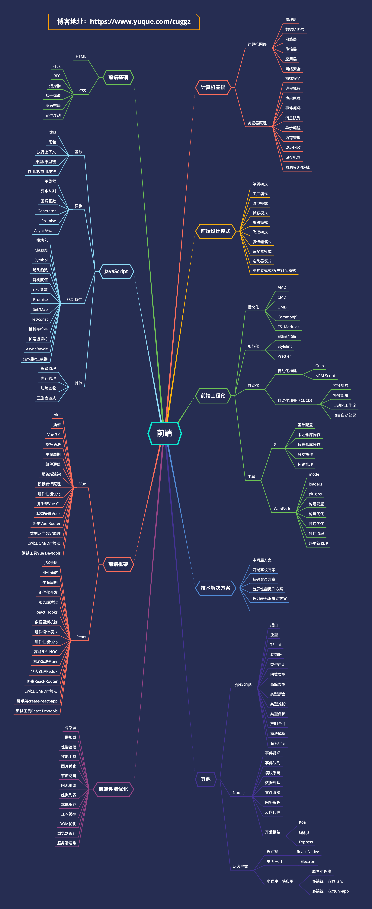

# 前端学习路线

## 一、前端基础
### 1. HTML
### 2. CSS
+ 样式
+ BFC
+ 选择器
+ 盒子模型
+ 页面布局
+ 定位浮动

## 二、JavaScript
### 1. 函数
+ this
+ 闭包
+ 执行上下文
+ 原型/原型链
+ 作用域/作用域链

### 2. 异步
+ 单线程
+ 异步队列
+ 回调函数
+ Generator
+ Promise
+ Async/Await

### 3. ES新特性
+ 模块化
+ Class类
+ Symbol
+ 箭头函数
+ 解构赋值
+ rest参数
+ Promise
+ Set/Map
+ let/const
+ 模板字符串
+ 扩展运算符
+ Async/Await
+ 迭代器/生成器

### 4. 其他
+ 编译原理
+ 内存管理
+ 垃圾回收
+ 正则表达式

## 三、前端框架
### 1. Vue
+ Vite
+ 插槽
+ Vue 3.0
+ 模板语法
+ 生命周期
+ 组件通信
+ 服务端渲染
+ 模板编译原理
+ 组件性能优化
+ 脚手架Vue-Cli
+ 状态管理Vuex
+ 路由Vue-Router
+ 数据双向绑定原理
+ 虚拟DOM/Diff算法
+ 调试工具Vue Devtools

### 2. React
+ JSX语法
+ 组件通信
+ 生命周期
+ 组件化开发
+ 服务端渲染
+ React Hooks
+ 数据更新机制
+ 组件设计模式
+ 组件性能优化
+ 高阶组件HOC
+ 核心算法Fiber
+ 状态管理Redux
+ 路由React-Router
+ 虚拟DOM/Diff算法
+ 脚手架create-react-app
+ 调试工具React Devtools

## 四、前端工程化
### 1. 模块化
+ AMD
+ CMD
+ UMD
+ CommonJS
+ ES Modules

### 2. 规范化
+ ESlint/TSlint
+ Stylelint
+ Prettier

### 3. 自动化
+ 自动化构建
    - Gulp
    - NPM Script
+ 自动化部署（CI/CD）
    - 持续集成
    - 持续部署
    - 自动化工作流
    - 项目自动部署

### 4. 工具
+ Git
    - 基础配置
    - 本地仓库操作
    - 远程仓库操作
    - 分支操作
    - 标签管理
+ WebPack
    - mode
    - loaders
    - plugins
    - 构建配置
    - 构建优化
    - 打包优化
    - 打包原理
    - 热更新原理

## 五、前端性能优化
### 1. 骨架屏
### 2. 懒加载
### 3. 性能监控
### 4. 性能工具
### 5. 图片优化
### 6. 节流防抖
### 7. 回流重绘
### 8. 虚拟列表
### 9. 本地缓存
### 10. CDN缓存
### 11. DOM优化
### 12. 浏览器缓存
### 13. 服务端渲染
## 六、前端设计模式
### 1. 单例模式
### 2. 工厂模式
### 3. 原型模式
### 4. 状态模式
### 5. 策略模式
### 6. 代理模式
### 7. 装饰器模式
### 8. 适配器模式
### 9. 迭代器模式
### 10. 观察者模式/发布订阅模式
## 七、计算机基础
### 1. 计算机网络
+ 物理层
+ 数据链路层
+ 网络层
+ 传输层
+ 应用层
+ 网络安全

### 2. 浏览器原理
+ 前端安全
+ 进程线程
+ 渲染原理
+ 事件循环
+ 消息队列
+ 异步编程
+ 内存管理
+ 垃圾回收
+ 缓存机制
+ 同源策略/跨域

## 八、技术解决方案
### 1. 中间层方案
### 2. 前端鉴权方案
### 3. 扫码登录方案
### 4. 首屏性能提升方案
### 5. 长列表无限滚动方案
## 九、其他
### 1. TypeScript
+ 接口
+ 泛型
+ TSLint
+ 装饰器
+ 类型声明
+ 函数类型
+ 高级类型
+ 类型断言
+ 类型推论
+ 类型保护
+ 声明合并
+ 模块解析
+ 命名空间

### 2. Node.js
+ 事件循环
+ 事件队列
+ 模块系统
+ 数据处理
+ 文件系统
+ 网络编程
+ 反向代理
+ 开发框架
    - Koa
    - Egg.js
    - Express

### 3. 泛客户端
+ 移动端
    - React Native
+ 桌面应用
    - Electron
+ 小程序与快应用
    - 原生小程序
    - 多端统一方案Taro
    - 多端统一方案uni-app

> 更新: 2023-08-03 17:20:31  
> 原文: <https://www.yuque.com/cuggz/interview/rfevid>